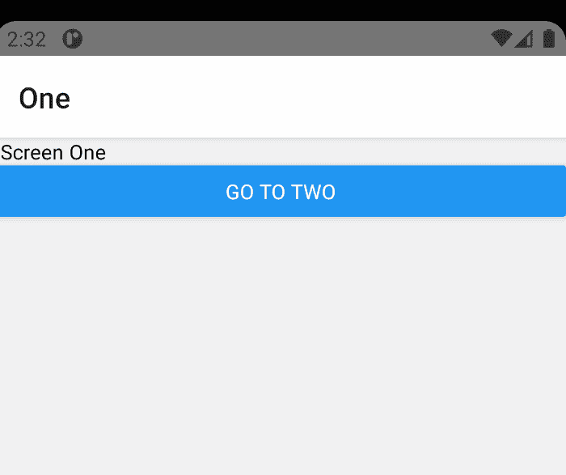
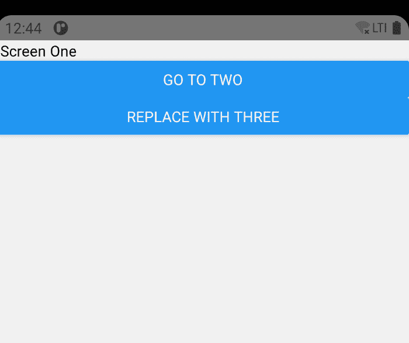
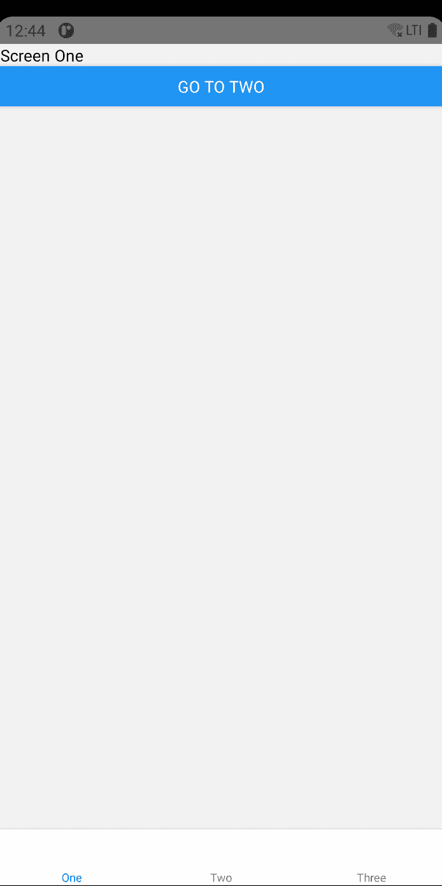
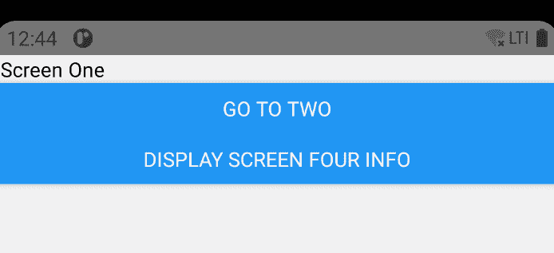

# 反应本地导航的完整指南

> 原文：<https://javascript.plainenglish.io/react-native-navigation-8ccea9e14523?source=collection_archive---------3----------------------->

每个好的 app 都需要一个好的导航仪。就像越野旅行一样，一个好的导航员会在我们的应用程序中带我们从一个地方到另一个地方，确保我们到达我们想去的地方。一个坏的导航员带我们…嗯，导航员想去的地方。我们感到沮丧，就把应用程序放下了，降低了用户参与度。

我相信我们都记得 Android 的早期，使用后退按钮可能会把你带到…上一个屏幕，一个导航菜单，上一个应用程序，或者任何地方！这很有趣——你可以点击它，然后看到你结束的地方，就像你的朋友为你安排的随机约会。

React Native 提供了构建在 React 导航之上的导航。他们在这里有很好的文件来源:[https://reactnavigation.org/docs/getting-started](https://reactnavigation.org/docs/getting-started)

大多数应用都有非常标准的用例:

1.  将用户带到应用程序的不同屏幕。
2.  允许后退按钮将用户带回到上一个屏幕。
3.  在屏幕之间传递信息，可能是为了在导航后过滤或更新屏幕。
4.  显示子导航器或其他导航堆栈，以便在子屏幕上有更多选择。

默认情况下，React 导航很容易满足所有这些用例。

有了 React 原生项目，就很容易开始了。按照这里的指示去做——https://reactnavigation.org/docs/getting-started。我们需要确保我们有所有合适的包装。和往常一样，最好是在 packager \ Metro 不运行，模拟器不运行的情况下进行。让它们运行会导致奇怪的错误。

除了基本的 react-native 导航设置之外，您还需要为您的设置安装特定的包，这取决于您想要使用的导航器。

要测试所有导航器，请运行以下命令:

```
npm install [@react](http://twitter.com/react)-navigation/native  react-native-reanimated react-native-gesture-handler react-native-screens react-native-safe-area-context [@react](http://twitter.com/react)-native-community/masked-view  [@react](http://twitter.com/react)-navigation/stack  [@react](http://twitter.com/react)-navigation/drawer  [@react](http://twitter.com/react)-navigation/bottom-tabs 
```

一旦我们这样做了，我们需要将我们的顶级 App.js 包装在一个导航容器中。

这里没什么特别的。

1.  在第 1 行——我们添加了手势处理程序。这是一个新的库，取代了底层的 React 本机手势处理程序。它修复了底层 React 原生响应系统的一些问题——这里可以看到一段对话:【https://www.youtube.com/watch?v=V8maYc4R2G0。请注意，这个新的库不能在 Windows 或 Web 上运行，所以您可能需要旧的库，这取决于您的长期目标。
2.  第 4 行—我们导入新的导航容器。
3.  第 11 行——我们将当前的应用程序包装在一个导航容器中。需要一个导航容器——它设置屏幕保持所需的状态，跟踪你在哪个屏幕上，对于 Android，提供后退按钮 API。由于这里没有指定导航器，我们不会在我们的应用程序中看到任何不同，但它会运行。


现在，我们来谈谈导航仪的类型。

首先，我们将构建 3 个屏幕来显示差异。

并且，在更改第 17 行以显示<screenone>之后，我们得到了:</screenone>


让我们快速看一下不同的基本导航器类型。我们今天将讨论 3 种类型:

*   堆栈导航器
*   抽屉导航器
*   底部选项卡导航器

我们将不会看到:

*   本机堆栈导航器——老实说，这是一个很好的导航器，完全模拟了本机导航 API 的工作方式。然而，它在这一点上并不适用于 Web，所以它只能在您想要部署到 Android 和 iOS 时使用。
*   两个材料导航器，底部选项卡和顶部选项卡-这些是 react-native-paper 组件的扩展，而这些组件又是 react 导航的底部选项卡导航器的扩展。这些与上面的选项卡导航器非常相似。

在这一点上，您可能认为导航器非常相似，并且是可扩展的。没错，您可以通过轻松定制每个导航器中的行为来制作更多的导航器。每个导航器都有相同的基本组件:

*   路线—这些是用户将看到的已配置屏幕。当用户在应用程序中导航时，导航器会保存每个屏幕的不同状态，以及用户去过的地方。这样就可以使用后退按钮。
*   组件-导航到路径时将显示的配置屏幕或其他 React 组件。路由可以传递属性，但是组件只是组件。如果组件不知道如何处理路由的属性…它会忽略它们。
*   属性——沿着组件链传递给将处理它们的各种组件的属性。在真正的 React Native 方式中，高阶组件将这些传递给较低的组件进行渲染。

我们要讨论的第一个导航器是堆栈导航器。

这个导航器就像它听起来的那样——一个堆栈。它提供了听起来一模一样的东西——一堆导航。第一个项目显示在顶部，之后的每个项目都被添加到堆栈顶部。

我们可以通过如下代码轻松做到这一点:

该代码将显示以下内容:


当您运行该代码时，您可能会发现该代码实际上并没有提供您在导航场景中所期望的东西——没有在路线之间移动的控件。

而是显示初始屏幕，如此而已。

为此，对于 Stack Navigator，我们需要创建自己的导航元素，在屏幕之间移动。

让我们更改屏幕定义，以包含一个从一条路线导航到另一条路线的按钮:

为此，我们将在第 7，19，31 行使用调用“navigation.navigate”。这个 API 将接受一个文本字符串(一个路由名),这是我们之前使用 Stack 配置的。屏幕名称=XXX '。XXX 是名字。

您最初会注意到没有导航元素，只有屏幕顶部的标题。(屏幕一，为我们的初始屏幕。)



当我们从一个元素移动到另一个元素时，标题栏会发生变化，并在适当的位置放置一个

我们现在将为每个屏幕添加一个新功能:

```
console.log(navigation.dangerouslyGetState());
```

当我们在不同的屏幕中移动时，这个函数将打印出导航器的状态。

屏幕一:

```
01–05 14:42:16.776 4884 19212 I ReactNativeJS: index: 0,
01–05 14:42:16.776 4884 19212 I ReactNativeJS: routeNames: [ ‘One’, ‘Two’, ‘Three’ ],
01–05 14:42:16.776 4884 19212 I ReactNativeJS: routes:
01–05 14:42:16.776 4884 19212 I ReactNativeJS: [ { key: ‘One-W6–8fHZHIQHKWTVDe5pHj’,
01–05 14:42:16.776 4884 19212 I ReactNativeJS: name: ‘One’,
01–05 14:42:16.776 4884 19212 I ReactNativeJS: params: undefined } ] }
```

请注意，此时仅定义了一条路线。按下按钮移至屏幕二会显示:

```
01–05 14:46:17.233 4884 19212 I ReactNativeJS: routes:
01–05 14:46:17.233 4884 19212 I ReactNativeJS: [ { key: ‘One-W6–8fHZHIQHKWTVDe5pHj’,
01–05 14:46:17.233 4884 19212 I ReactNativeJS: name: ‘One’,
01–05 14:46:17.233 4884 19212 I ReactNativeJS: params: undefined },
01–05 14:46:17.233 4884 19212 I ReactNativeJS: { key: ‘Two-Ij1hKIRjwMgqqekKtjt4B’,
01–05 14:46:17.233 4884 19212 I ReactNativeJS: name: ‘Two’,
01–05 14:46:17.233 4884 19212 I ReactNativeJS: params: undefined } ] }
```

移动到屏幕二会将另一个屏幕添加到堆栈中。

然而，回到屏幕一…不会打印任何东西。

我想知道为什么？

为了解决这个问题，我们需要讨论 React 的渲染模型。

React 使用延迟渲染方法，具有两个特征:

1.  仅渲染已更改的组件。这允许屏幕快速显示。
2.  仅渲染显示的屏幕。

React 生命周期有显示这些的方法—我们感兴趣的 2 个是 componentDidMount()和 componentWillUnmount()。

然而，由于我们使用功能组件，新的热点，我们必须为此使用一个 useEffect 钩子。

为此，我们将在每个函数中添加与此类似的代码:

这将打印出我们在堆栈导航器中移动时的路线。

查看这里的调试输出，您可以很容易地看到，每当我们弹出导航堆栈的顶部时，我们都会看到一个屏幕卸载。例如，当我们使用后退箭头从屏幕三移动到屏幕二时，会显示:

```
[Info] 01-05 16:29:47.151  4884  4212 I ReactNativeJS: Screen 3 Unmount:
[Info] 01-05 16:29:47.155  4884  4212 I ReactNativeJS: { stale: false,
01-05 16:29:47.155  4884  4212 I ReactNativeJS:   type: 'stack',
01-05 16:29:47.155  4884  4212 I ReactNativeJS:   key: 'stack-vo35QL6onuHzaoVKRkcLn',
01-05 16:29:47.155  4884  4212 I ReactNativeJS:   routeNames: [ 'One', 'Two', 'Three' ],
01-05 16:29:47.155  4884  4212 I ReactNativeJS:   index: 1,
01-05 16:29:47.155  4884  4212 I ReactNativeJS:   routes:
01-05 16:29:47.155  4884  4212 I ReactNativeJS:    [ { key: 'One-YQJCh-OSey7sY3F8g8LjH',
01-05 16:29:47.155  4884  4212 I ReactNativeJS:        name: 'One',
01-05 16:29:47.155  4884  4212 I ReactNativeJS:        params: undefined },
01-05 16:29:47.155  4884  4212 I ReactNativeJS:      { key: 'Two-KTzPjo4zblaJ2NnwFuwlR',
01-05 16:29:47.155  4884  4212 I ReactNativeJS:        name: 'Two',
01-05 16:29:47.155  4884  4212 I ReactNativeJS:        params: undefined } ] }
```

类似地，当我们点击屏幕 3 上的按钮移至屏幕 1 时，屏幕 2 和屏幕 3 都被卸载，因为它们不再位于路由堆栈上。

只有屏幕一不卸载，因为它总是在堆栈的底部。

或者是？我们能强迫它卸载吗？

stackAction 引用 API 显示了一个“替换”调用——替换当前路线。

让我们添加一个新按钮…

```
<Button
         title="Replace with Three"
         onPress={() => navigation.replace('Three')}
/>
```

然后嘣！现在，当我们单击该按钮时，我们看到当前屏幕 1 已卸载，堆栈上的唯一路径是屏幕 3:

```
[Info] 01–05 16:53:01.220 4884 12243 I ReactNativeJS: Screen 1 Unmount:
[Info] 01–05 16:53:01.221 4884 12243 I ReactNativeJS: { stale: false,
01–05 16:53:01.221 4884 12243 I ReactNativeJS: type: ‘stack’,
01–05 16:53:01.221 4884 12243 I ReactNativeJS: key: ‘stack-4NIFPEcHeiA1UQFsqkUwF’,
01–05 16:53:01.221 4884 12243 I ReactNativeJS: index: 0,
01–05 16:53:01.221 4884 12243 I ReactNativeJS: routeNames: [ ‘One’, ‘Two’, ‘Three’ ],
01–05 16:53:01.221 4884 12243 I ReactNativeJS: routes:
01–05 16:53:01.221 4884 12243 I ReactNativeJS: [ { key: ‘Three-XvOAF4N-eo8FbBDz981TA’,
01–05 16:53:01.221 4884 12243 I ReactNativeJS: name: ‘Three’,
01–05 16:53:01.221 4884 12243 I ReactNativeJS: params: undefined } ] }
```

堆栈函数还有其他组件，包括 push 和 pop 例程。我会让你探索这些。

为什么我们在堆栈的生命周期上花了这么多时间？

因为每个航海家都有自己的生命周期。这将是理解导航器的重要部分——知道组件何时被安装和卸载。

让我们转到抽屉导航器！

首先要做的是导入库:

```
import { createDrawerNavigator } from '@react-navigation/drawer';
```

简单，容易完成。

完成后，我们将使用现有的屏幕，并将它们包装在我们刚刚创建的导航器中。但是我们仍然需要保持导航容器可用——所以我们要做的就是将导航定义更改为 drawer。



I’m really bad at pulling the drawer out on the emulator. I’m also bad at Halo and Call of Duty.

那么——当处理抽屉导航器时，我们的路线看起来像什么？请记住，使用堆栈导航器，只有当您导航到路线时，路线才会被添加到路线中——它是一个*堆栈。我知道…很疯狂。*

有了抽屉，所有的导航路线都已经定义好了…但是为了与惰性挂载 React 范例保持一致…

```
[Info] 01–06 15:33:57.861 4884 8036 I ReactNativeJS: { stale: false,
01–06 15:33:57.861 4884 8036 I ReactNativeJS: index: 0,
01–06 15:33:57.861 4884 8036 I ReactNativeJS: routeNames: [ ‘One’, ‘Two’, ‘Three’ ],
01–06 15:33:57.861 4884 8036 I ReactNativeJS: history: [ { type: ‘route’, key: ‘One-TTViLKdH1xlcJHU4EW07q’ } ],
01–06 15:33:57.861 4884 8036 I ReactNativeJS: routes:
01–06 15:33:57.861 4884 8036 I ReactNativeJS: [ { name: ‘One’,
01–06 15:33:57.861 4884 8036 I ReactNativeJS: key: ‘One-TTViLKdH1xlcJHU4EW07q’,
01–06 15:33:57.861 4884 8036 I ReactNativeJS: params: undefined },
01–06 15:33:57.861 4884 8036 I ReactNativeJS: { name: ‘Two’,
01–06 15:33:57.861 4884 8036 I ReactNativeJS: key: ‘Two-ibrPGdV3D4cz3XsTNczLq’,
01–06 15:33:57.861 4884 8036 I ReactNativeJS: params: undefined },
01–06 15:33:57.861 4884 8036 I ReactNativeJS: { name: ‘Three’,
01–06 15:33:57.861 4884 8036 I ReactNativeJS: key: ‘Three-k8FbMgqZ8b6Ks17GF7q_S’,
01–06 15:33:57.861 4884 8036 I ReactNativeJS: params: undefined } ],
01–06 15:33:57.861 4884 8036 I ReactNativeJS: type: ‘drawer’,
01–06 15:33:57.861 4884 8036 I ReactNativeJS: key: ‘drawer-eljOWlZef — CmBSQuUt1p’ }
```

请注意，所有路由都是完全定义的。这里没有“back ”,这将弹出一个离开堆栈的路由。

您可以随时导航到路线列表中的任何项目。

点击我们预先存在的按钮在屏幕之间移动仍然有效…但是如果你点击“用三个替换”按钮…你会得到…一个红色的死亡屏幕！

```
[Info] 01-06 15:46:16.879  4884  8036 E ReactNativeJS: TypeError: navigation.replace is not a function. (In 'navigation.replace('Three')', 'navigation.replace' is undefined)
```

这不是堆栈导航器，因此您不能用其他路线替换任何路线。

另一方面，我们可以清楚地看到安装工作正常:

```
[Info] 01-06 15:46:14.429  4884  8036 I ReactNativeJS: Screen 2 Mount:
[Info] 01-06 15:46:15.233  4884  8036 I ReactNativeJS: Screen 3 Mount:
```

这里一个重要的区别是我们有历史而不是路线。这样我们可以看到用户是如何在屏幕之间移动的:

```
01-06 15:46:15.234  4884  8036 I ReactNativeJS:   history:
01-06 15:46:15.234  4884  8036 I ReactNativeJS:    [ { type: 'route', key: 'One-TTViLKdH1xlcJHU4EW07q' },
01-06 15:46:15.234  4884  8036 I ReactNativeJS:      { type: 'route', key: 'Two-ibrPGdV3D4cz3XsTNczLq' },
01-06 15:46:15.234  4884  8036 I ReactNativeJS:      { type: 'route', key: 'Three-k8FbMgqZ8b6Ks17GF7q_S' } ] }
```

我们在这里的时候把那个什么都不用的按钮藏起来。

首先，从@react-navigation/native 导入 useNavigationState:

```
import {
   NavigationContainer,
   useNavigationState,
} from ‘@react-navigation/native’;
```

接下来，将屏幕一变成:

我们使用“替换”的按钮不见了——发生在第 12 行——我们使用导航类型来显示或隐藏该按钮。

值得注意的一件有趣的事情是——抽屉导航器不会卸载屏幕。如果您按下按钮在所有屏幕间循环，它们将保持安装状态。

抽屉屏幕对于整体上下文导航非常有用，可以设置为不同的宽度。例如，在平板电脑上，它可以有一个永久的导航标签，而在手机上，需要拉开抽屉才能导航。

我们的最后一种屏幕是选项卡式屏幕。

继续将以下内容添加到我们的应用程序中:

这在我们的应用程序中创建了一个简单的选项卡屏幕。

我们使用底部选项卡导航器，但同样的事情也适用于材料顶部或底部选项卡，或任何自定义选项卡导航器。



就像抽屉导航器一样，不会调用任何卸载操作——但是只有当选项卡被实际呈现时，屏幕才会被装载。因此，在点击所有选项卡之后，所有选项卡屏幕都被安装，但是只有最上面的一个在呈现更改。事实上，就像抽屉导航器一样，因为我们的选项卡没有任何变化的数据，所以它们只被渲染一次——它们的渲染在那一点上是静态的。

也像抽屉导航器一样，所有的路线都被定义，并且随着用户在选项卡中导航，历史记录也在增长。

该历史被用于“返回”导航。

我们需要讨论的下一件事是在屏幕之间传递数据。

为此，我们将使用一些简单的数据，将其从屏幕一传递到屏幕二。

接下来我们需要做的是在屏幕上传递数据。总的来说，在这样做的时候，我们需要谈一谈我们在传递什么，为什么传递。

不同类型的应用对传递数据有不同的需求。

在分层的导航显示中，可能存在以下情况:

项目列表->项目详细信息->要完成的项目活动

在这种情况下，沿着导航路径传递信息(就像在堆栈导航器中一样)可能是正确的做法。

请考虑更像这样的事情:

屏幕一->新闻提要

屏幕二->登录的用户配置文件

在这个例子中，将信息从屏幕一传递到屏幕二是不值得的。为登录用户创建全局上下文或全局数据库是值得的。

一旦屏幕二被安装，它将保持安装。当信息重新成为焦点时，将由单独的屏幕来刷新信息。我们可以使用 *useIsFocused* 钩子来重新触发这样场景的信息收集和显示。

也就是说，让我们将一些数据从屏幕一传递到屏幕四！这将模拟第一个场景——数据通过一系列组件传递。

为此，我们需要首先设置导航来传递参数。

这很容易做到—让我们添加第四个屏幕:

我们在这里维护了基本的 useEffect 钩子——这将让我们看到什么时候装载和卸载了东西。

我们还将{navigation，route}传递给 ScreenFour 函数，添加 route 将让我们获得路线的参数。我们稍后将在屏幕中使用它。

屏幕将在第 14 行使用{route.params.number}打印出这个简单的信息。实际上，您可以将任何想要的东西传递给它，并显示任何东西。也许它是一个 itemID 来显示关于项目本身的更多信息，或者是一个 URL 来查询信息。

在屏幕一中，我们将添加这个调用:

```
<Button
    title="Display Screen Four Info"
    onPress={() => {
      var rand = Math.random();
      navigation.navigate('Four', {number: rand});
     }}
/>
```

这允许我们将一个随机数传递给新标签。只有当数字改变时，它才会改变数值——只有在使用这个按钮时才会发生。使用选项卡导航器(或另一个导航器)不会改变这里的任何值——它只会显示屏幕呈现的最后一个值。



该值成为路由的一部分:

```
01-07 15:34:41.024  4884  4110 I ReactNativeJS:      { name: 'Four',
01-07 15:34:41.024  4884  4110 I ReactNativeJS:        key: 'Four-0leyCbrbFyqXwhsLaSfKr',
01-07 15:34:41.024  4884  4110 I ReactNativeJS:        params: { number: 0.6732985766145677 } } ],
```

但是，使用按钮，我们传递一个新的参数，React navigation 触发一个新的屏幕卸载和装载。React 导航保存旧状态，并理解参数已经改变，因此屏幕需要重新呈现。

您会发现一个函数 set params——这对于在您所在的屏幕上更改参数非常有用。

例如，您可能会传递一个标题或用户 ID —这个屏幕允许用户更改它。使用 setParams 将更新您的导航路线参数，以立即显示新信息，并更新您的路线，以便在返回屏幕时，会有更新的信息。否则，React 不会再次渲染屏幕，因为参数不会改变。

作为本文的结束语，显示子导航器很容易，但是有几个问题。因为这篇文章已经很长了，所以我将指向文档来帮我解决这个问题。

 [## 嵌套导航器|反应导航

### 嵌套导航器意味着在另一个导航器的屏幕内呈现一个导航器，例如:在上面的例子中…

reactnavigation.org](https://reactnavigation.org/docs/nesting-navigators) 

**链接**

密码

*   [https://dev . azure . com/Allan graves/Public % 20 react % 20 native % 20 code/_ git/reactnationaviation](https://dev.azure.com/allangraves/Public%20React%20Native%20Code/_git/ReactNativeNavigation)

反应本地文档

*   【https://reactnavigation.org/docs/getting-started 
*   [https://reactnavigation.org/docs/bottom-tab-navigator/](https://reactnavigation.org/docs/bottom-tab-navigator/)
*   [https://reactnavigation.org/docs/drawer-navigator/](https://reactnavigation.org/docs/drawer-navigator/)
*   [https://reactnavigation.org/docs/stack-navigator/](https://reactnavigation.org/docs/stack-navigator/)
*   [https://react navigation . org/docs/material-bottom-tab-navigator/](https://reactnavigation.org/docs/material-bottom-tab-navigator/)
*   [https://react navigation . org/docs/material-top-tab-navigator/](https://reactnavigation.org/docs/material-top-tab-navigator/)
*   [https://github . com/software-mansion/react-native-gesture-handler](https://github.com/software-mansion/react-native-gesture-handler)
*   [https://reactnavigation.org/docs/use-is-focused](https://reactnavigation.org/docs/use-is-focused)
*   [https://reactnavigation.org/docs/navigation-lifecycle](https://reactnavigation.org/docs/navigation-lifecycle)
*   [https://it next . io/the-intrinciencies-of-nesting-navigators-in-react-native-using-react-navigation-fef 52 ca 72964](https://itnext.io/the-intricacies-of-nesting-navigators-in-react-native-using-react-navigation-fef52ca72964)

常规工艺路线文档

*   [https://medium . com/building-with-react-native/routing-in-react-native-apps-and-how-to-configure-your-project-with-react-navigation-library-d8d 58005 bfe 9](https://medium.com/building-with-react-native/routing-in-react-native-apps-and-how-to-configure-your-project-with-react-navigation-library-d8d58005bfe9)
*   [https://reactnavigation.org/docs/use-navigation-state/](https://reactnavigation.org/docs/use-navigation-state/)
*   [https://Ross bulat . medium . com/introduction-to-react-navigation-and-navigators-in-react-native-3 efcf 7239 a 43](https://rossbulat.medium.com/introduction-to-react-navigation-and-navigators-in-react-native-3efcf7239a43)

功能组件

*   [https://react js . org/docs/hooks-FAQ . html # how-do-life cycle-methods-comment-to-hooks](https://reactjs.org/docs/hooks-faq.html#how-do-lifecycle-methods-correspond-to-hooks)
*   【https://reactjs.org/docs/react-component.html 

性能

*   [https://reactnavigation.org/docs/navigation-prop/](https://reactnavigation.org/docs/navigation-prop/)
*   [https://react navigation . org/docs/hello-react-navigation # passing-additional-props](https://reactnavigation.org/docs/hello-react-navigation#passing-additional-props)