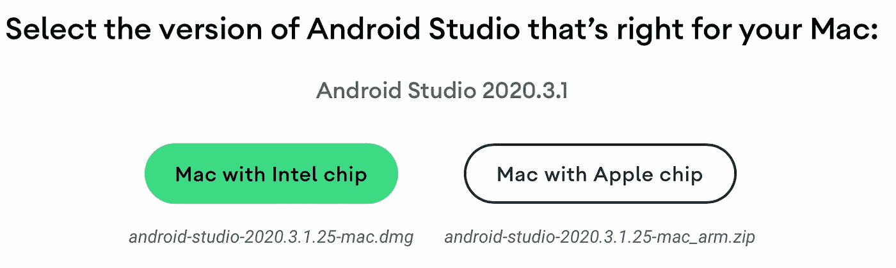
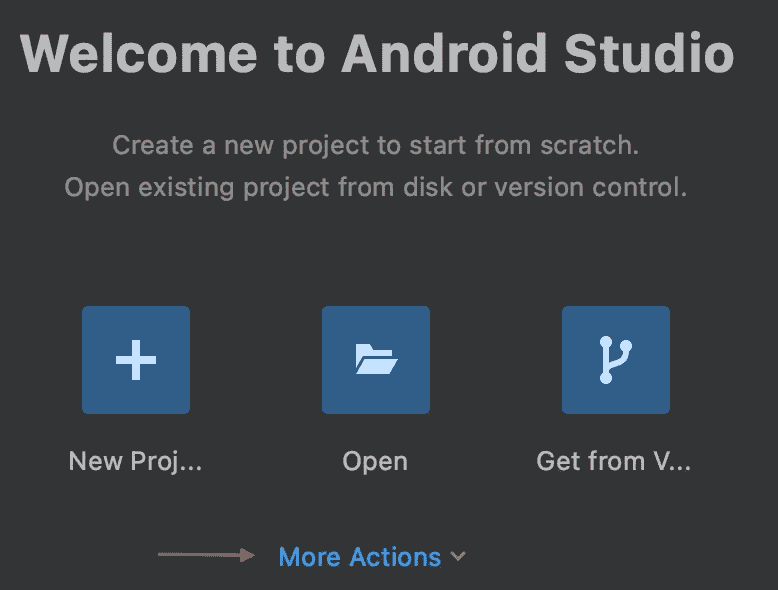
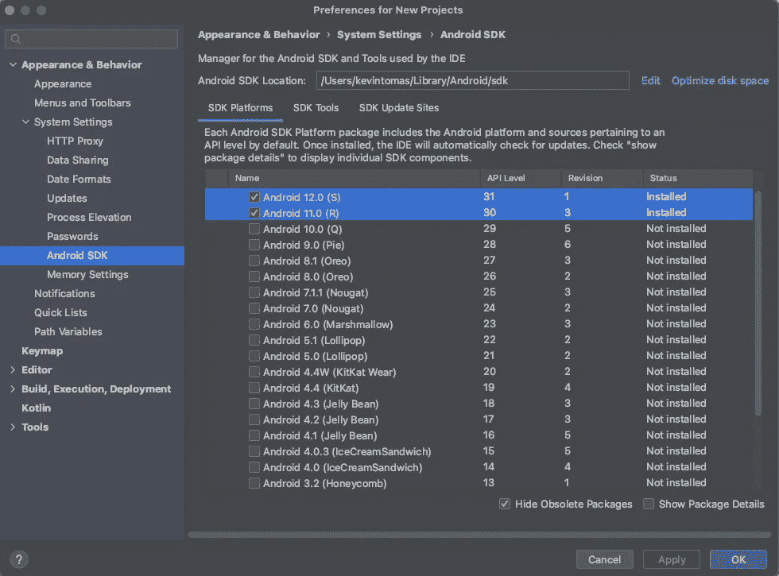
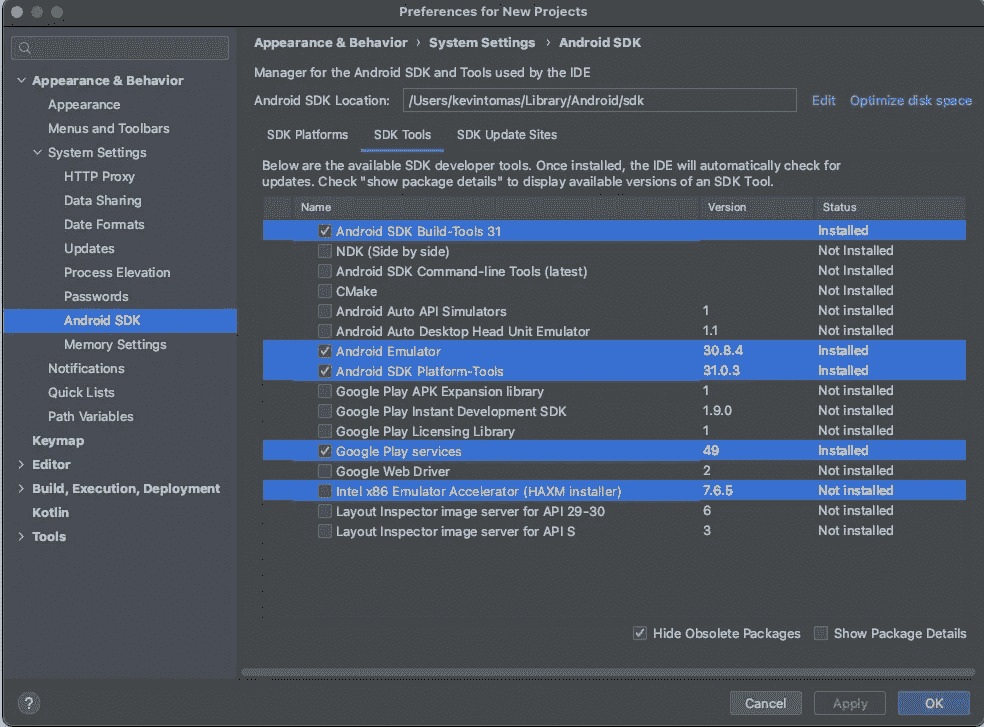
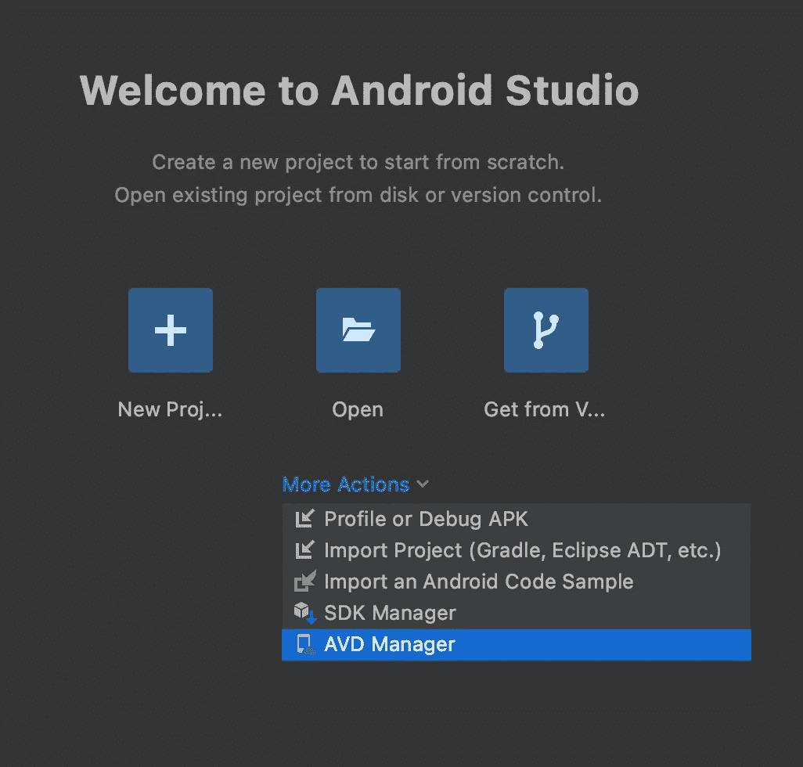
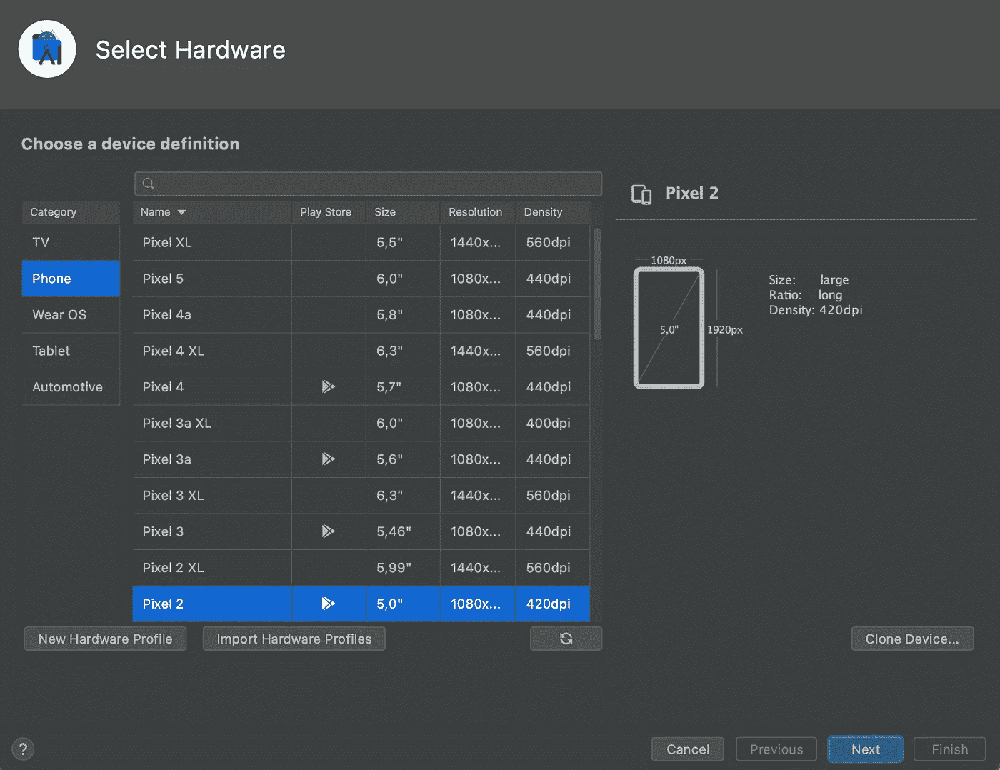
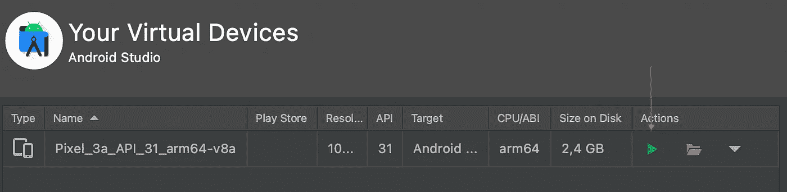
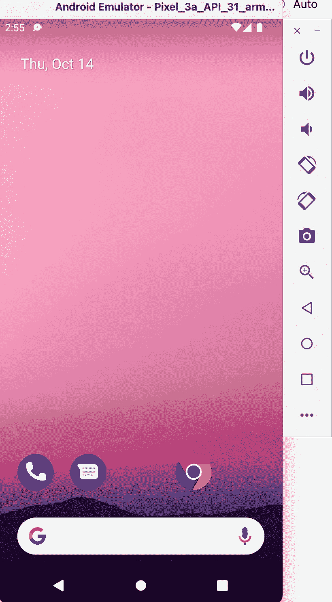
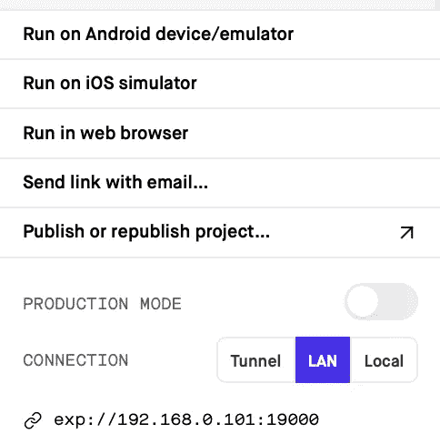

# React Native:在 Android 模拟器上运行 Expo 应用程序

> 原文：<https://javascript.plainenglish.io/react-native-running-expo-apps-on-an-android-emulator-33baebb89050?source=collection_archive---------4----------------------->

## 了解如何轻松快速地设置 Android Studio，以便为 Android 开发 Expo 应用程序！

Photo by [Clément Hélardot](https://unsplash.com/@clemhlrdt?utm_source=medium&utm_medium=referral) on [Unsplash](https://unsplash.com?utm_source=medium&utm_medium=referral)

# 介绍

作为一名 Mac 用户，我在相当长的一段时间内避免设置 Android Studio，因为在 macOS 上运行 iOS 模拟器相当容易。所以我决定写这个简短的教程，以帮助你开始用 Expo 最简单的方法模拟 Android 应用程序！

# 下载 Android Studio

因此，前往[下载网站](https://developer.android.com/studio)，下载合适版本的 Android Studio。截至今天，甚至有一个相对较新的苹果芯片 Mac 用户的稳定版本！

# 安装和设置

成功下载安装文件后，运行安装文件，选择**标准**作为**安装类型**。安装完成后，打开 Android Studio，点击**更多操作**按钮，点击 **SDK 管理器。**

在 **SDK 管理器**中，确保至少勾选两个最新版本的 Android，如下图所示:

之后，转到同一个窗口中的 **SDK 工具**,确保从下面检查:

如果您使用 Linux 或 Mac，您将需要在终端中运行更多命令，以便添加指向您的 Android SDK 位置的环境变量:

`[ -d "$HOME/Library/Android/sdk" ] && ANDROID_SDK=$HOME/Library/Android/sdk || ANDROID_SDK=$HOME/Android/Sdk
echo "export ANDROID_SDK=$ANDROID_SDK" >> ~/`[[ $SHELL == *"zsh" ]] && echo '.zshenv' || echo '.bash_profile'``

其次，运行:

`echo "export PATH=$HOME/Library/Android/sdk/platform-tools:\$PATH" >> ~/`[[ $SHELL == *"zsh" ]] && echo '.zshenv' || echo '.bash_profile'``

就这样了！现在你已经准备好设置你的虚拟 Android 设备了！

# 设置虚拟设备

为此，回到 Android Studio 的开始屏幕，选择 **AVD 管理器:**

然后点击加号**创建虚拟设备**并选择一个您想要使用的设备:

选择您的设备后，点击下一个的**并下载一个系统镜像，如果您还没有在您的机器上安装的话。成功设置您的设备后，返回到虚拟设备的概述，并单击右侧的绿色按钮以启动模拟器！**

如果您已经正确设置了所有内容，应该会弹出如下内容:

# 在模拟器上运行 Expo 应用程序

最后，转到你的 expo 项目，像往常一样使用`expo start`启动 Expo 服务器，然后只需在控制台中按下 **a** ，你的 Android 模拟器将打开 Expo 应用程序！或者，您也可以点击 Expo 开发者工具中的**运行在 Android 设备/仿真器上**！

就是这样！

# 结论

我希望这个小教程对你有所帮助。如果你在你的机器上设置 Android Studio 有任何问题，欢迎留下评论！

谢谢大家！

*更多内容请看*[***plain English . io***](http://plainenglish.io/)