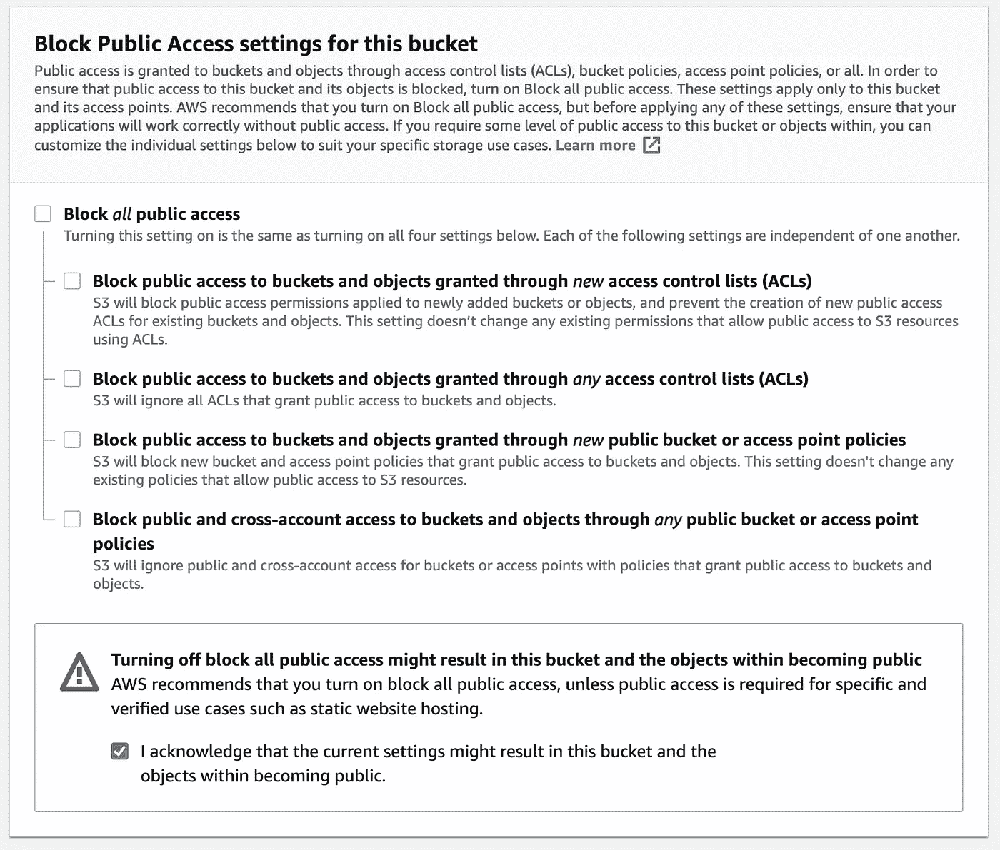

# 反应本地:流 Agora 云记录视频从 S3 桶

> 原文：<https://javascript.plainenglish.io/react-native-streaming-agora-cloud-recording-videos-from-an-s3-bucket-1bff83e3ee49?source=collection_archive---------8----------------------->


在[之前的博客](https://medium.com/geekculture/cloud-recording-for-react-native-video-chat-using-agora-d7669201e50f)中，我们看到了如何将 Agora 云记录添加到视频聊天应用程序中，以便将记录存储在亚马逊 S3 桶中。在这里，我们将介绍如何在 React 本地应用程序中获取和回放录制的视频。

我们更新了上一篇博文中的[应用](https://github.com/EkaanshArora/Agora-RN-Record-Playback)和[后端](https://github.com/EkaanshArora/Agora-Cloud-Recording-Example)，将所有内容整合在一起。如果您只是想要演示，您可以部署后端，并从提供的链接构建应用程序。

# 先决条件

*   一个集市开发者[账户](https://sso.agora.io/en/signup?utm_source=medium&utm_medium=blog&utm_campaign=react-native-streaming-agora-cloud-recording-videos-from-an-s3-bucket/)
*   亚马逊 AWS 账户
*   Heroku 帐户或其他服务来部署后端
*   对 React Native 的理解

# 集市设置

1.  **创建项目:**拥有 Agora 账户后，点击控制台中的[项目管理标签](https://console.agora.io/projects)。单击创建按钮。输入项目的名称。创建项目时选择安全模式。
2.  **启用云录制:**点击查看使用情况按钮，选择启用云录制的选项。
3.  **获取应用凭证:**将应用 ID 和应用证书从同一个页面复制到一个文本文件中。我们以后会用到这些。
4.  **获取客户凭证:**访问 [RESTful API 页面](https://console.agora.io/restfulApi)并点击 Add Secret 按钮。将客户 ID 和客户机密复制到文本文件中。

# AWS 设置

一旦你创建了一个 AWS 帐户，我们需要创建一个亚马逊 S3 桶来存储我们的视频记录和一个 IAM 用户来访问我们的桶。如果您已经完成了此设置，可以跳过这一部分。

1.  去你的 [AWS IAM 控制台](https://console.aws.amazon.com/iam/home#/users)创建一个用户。添加带有编程访问的 AmazonS3FullAccess 策略。将 AWS 访问密钥和秘密密钥复制到文本文件中。
2.  创建一个亚马逊 [S3 桶](https://s3.console.aws.amazon.com/s3/home):



为您的存储桶选择一个名称，并将其复制到文本文件中。我们稍后将使用这个文本文件。通过取消选中阻止所有公共访问复选框，允许公共访问您存储桶中的流媒体。单击创建存储桶按钮。

**注意:**有了你录音的网址，互联网上的任何人都可以观看。我们将在文章的最后讨论如何保证录音的安全。

我们还需要所选 AWS 地区的地区号。转到这个[表格](https://docs.agora.io/en/cloud-recording/cloud_recording_api_rest?platform=RESTful#a-namestorageconfigacloud-storage-configuration)，点击亚马逊 S3 选项卡，并记下您的地区号。例如，如果您正在使用`US_EAST_1`区域，那么您的存储桶编号是 0。

3.添加存储桶策略。

为了让所有用户都可以访问文件，我们将添加一个存储桶策略。转到新创建的存储桶中的 Permissions 选项卡，并添加此策略:

```
{
    "Version": "2012-10-17",
    "Id": "Policy1620917655085",
    "Statement": [
        {
            "Sid": "Stmt1620917653925",
            "Effect": "Allow",
            "Principal": "*",
            "Action": "s3:GetObject",
            "Resource": "arn:aws:s3:::agora-rec123/*"
        }
    ]
}
```

# 部署我们的后端

在部署我们的后端之前，我们需要以下变量。(是时候使用我们的文本文件了。)我们将使用 Heroku 一键式部署，让我们的后端启动和运行变得超级简单。您也可以使用任何其他服务。

> **注意:**我们已经更新了后端，所以如果你使用的是上一篇文章的后端，你应该现在就更新。

```
APP_ID=
APP_CERTIFICATE=
RECORDING_VENDOR=
RECORDING_REGION=
BUCKET_NAME=
BUCKET_ACCESS_KEY=
BUCKET_ACCESS_SECRET=
CUSTOMER_ID=
CUSTOMER_CERTIFICATE=
```

> **注意:**对于 AWS，RECORDING_VENDOR=1。点击此[链接](https://docs.agora.io/en/cloud-recording/cloud_recording_api_rest?platform=RESTful#a-namestorageconfigacloud-storage-configuration)了解更多信息。

1.  如果您还没有在 Heroku 上创建帐户，请创建一个。
2.  点击[此链接](https://heroku.com/deploy?template=https://github.com/EkaanshArora/Agora-Cloud-Recording-Example/tree/master)使用 Heroku 一键式部署。
3.  输入您的变量，然后单击页面底部的部署应用程序按钮。
4.  等几分钟。部署完成后，将您的后端 URL 保存在文本文件中，我们将在应用程序中使用该文件。

# 构建我们的应用

我们将从我们在上一篇文章中开发的应用程序开始，该应用程序允许您参加群组视频通话并进行录音。我已经重构了应用程序，将所有视频通话和录音组件都移到了`[./components/Call.tsx](https://github.com/EkaanshArora/Agora-RN-Record-Playback/blob/main/components/Call.tsx)`。我们将从一个新文件开始:`[./components/PlayRecording.tsx](https://github.com/EkaanshArora/Agora-RN-Record-Playback/blob/main/components/PlayRecording.tsx)`

我们将使用来自`[react-native-video](https://github.com/react-native-video/react-native-video)`的视频组件进行 HLS 回放。我们接受后端 URL、应用程序 ID 和频道名称作为我们的`PlayRecording`组件的道具。我们为状态定义了一个接口。曲目将包含每个 m3u8 文件的 URL 数组。`currentTrack`是我们正在玩的 URL 的索引。`statusMsg`保存显示视频播放器当前状态的字符串。

我们定义组件和初始状态。在`componentDidMount`中，我们对后端服务器的`/api/get/recordingUrls/<ChannelName>`路由执行一个 GET 请求。我们得到响应 JSON 并更新`tracks`状态数组。

在我们的渲染方法中，我们使用一个`ScrollView`返回一个包含在`TouchableOpacity`中的曲目列表。当选择一个轨道时，我们用轨道索引更新`currentTrack`状态。

我们使用将 source 设置为我们想要播放的 URL 的`Video`组件(`tracks`数组的`currentTrack`索引)。我们有事件处理程序来更新我们的`statusMsg`。我们还在文本组件中显示了`statusMsg`。

# 把它放回原处

我们使用`App.tsx`中的`PlayRecording`组件和`Call`组件将所有东西放回一起。

> **安全考虑:**正如我们所讨论的，在我们当前的配置下，存储在 S3 存储桶上的所有记录都是公开的，因此 React 本地客户端可以访问它们。在我们将应用程序用于生产之前，为我们的视频设置访问控制非常重要。一旦我们对用户进行了身份验证，我们就可以授予他们访问文件的权限，同时保持文件对其他所有人都是私有的。你可以找到更多信息[在这里](https://docs.aws.amazon.com/AmazonS3/latest/userguide/s3-access-control.html)和[在这里](https://docs.aws.amazon.com/AmazonS3/latest/userguide/access-control-overview.html)。

# 结论

你可以在这里找到更多关于云录制[的信息。如果你刚开始使用 Agora SDKs，看看](https://docs.agora.io/en/cloud-recording/landing-page?platform=RESTful) [Agora 视频通话快速入门指南](https://docs.agora.io/en/Video/landing-page?platform=React%20Native)和[这篇博客](https://www.agora.io/en/blog/how-to-build-a-react-native-video-calling-app-using-agora/)的帖子。

我邀请你加入 Agora 开发者松弛社区。欢迎在`#react-native-help-me`频道提出任何 React 原生问题，在`#cloud-recording-help-me`频道提出云录制问题。

*更多内容请看*[***plain English . io***](http://plainenglish.io/)