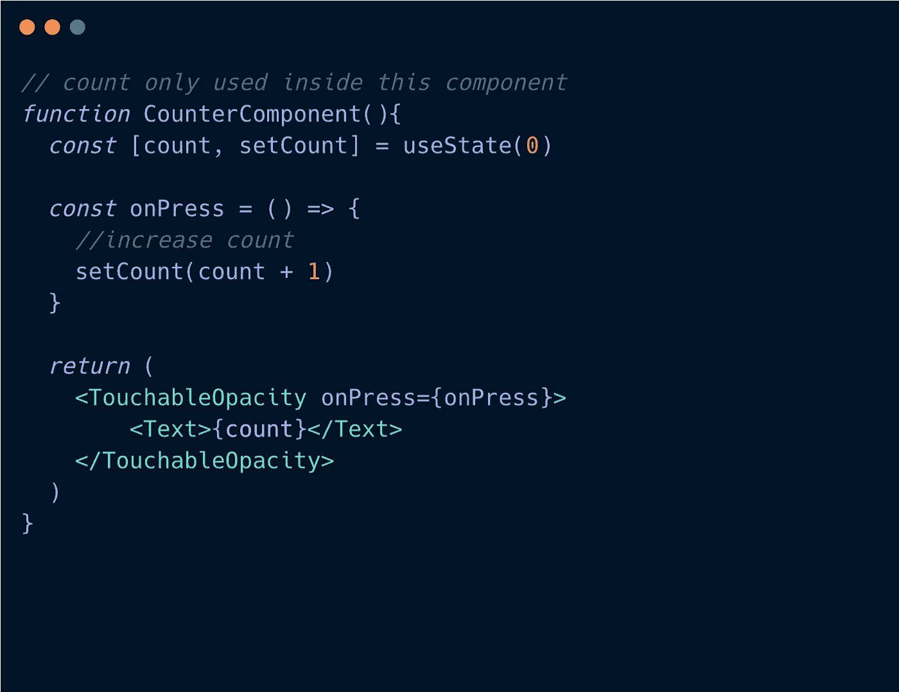

# 你读过的最完整的反应状态指南

> 原文：<https://javascript.plainenglish.io/react-native-the-state-world-59721cbf0521?source=collection_archive---------8----------------------->

## React + React 自然状态的世界🌍


当我第一次了解到**状态**的时候，它是如此的友好和简单,“将要改变的数据+使它突变触发一个组件渲染”。人们是这么告诉我的。

在与它共事多年后，我开始意识到自己知识上的差距。我过去所知道的状态，伴随着更多的概念和相关的关注，这是我在经历了艰难困苦和大量的研究工作后才意识到的。我几乎没有找到一个涵盖所有这些内容的帖子。所以在这篇博文里，我们来分解一下！

## 目录:

*   **问题:**状态解决什么问题？
*   **你大概不需要国家吧？:**决定何时明智地使用状态。
*   **渲染大图:**状态如何与渲染过程相关，如何成为渲染图的一部分。
*   **为什么异步？API 设计背后的原因:**批处理、内部一致、并发更新？
*   **副作用:**妥善处理副作用。
*   **有效安排你的状态:**安排状态如何提升你的表现。

# 问题是

道具是定制组件的绝佳素材。但是每个人都知道它是**不可变的，不能被改变**，这阻止了灵活性，因为在真实世界的例子中，组件有时需要随着时间而改变。

状态是组件的一部分，用来存储将要改变的数据，组件对这些改变做出反应。

例如，水在摄氏 100 度沸腾，在摄氏 00 度结冰。温度的变化决定了水的状态。这里的温度就像一个状态，水就像一个成分，这个成分对状态的变化做出反应。

# 你大概不需要状态吧？


在**突变数据**的情况下，很多人都在纠结决定什么时候使用状态，什么时候不使用。如果您还不知道，状态与触发重新渲染密切相关，将数据存储到状态中会不必要地触发“浪费的渲染”。

我把**突变数据**的用法分为两类:

*   与渲染相关的数据:用于生成 UI 输出的工作或与之相关。
*   与渲染无关的数据:只是简单地用来存储一些数据，用于以后的计算，…与生成 UI 输出完全无关。

## 规则总是:**只使用状态来存储与渲染相关的突变数据。**

因为对于与渲染无关的数据，我们不需要将其显示到 UI 树中，所以不需要排队重新渲染过程，计算 UI 树。

否则，当它涉及到渲染时，改变状态数据队列的重新渲染过程，输出新的树 UI，并且 React 将区分该树以收集变化，然后更新到真正的树。

我们来分解一个简单的例子。


在上面的例子中，假设我有三个按钮，其中两个显示计数，如果**是 Double** 为真，其中一个将显示 double。

第三个按钮显示**是双**开还是关。

每当我按下两个按钮中的任何一个时，**计数**值就会增加 1，并且**b 按下的**会记录下刚刚按下的按钮的位置。按下第三个按钮将使**在开或关之间切换。**

**计数**用于显示，所以与渲染→存储到状态有关。

**isDouble** 不用于显示，但决定显示值:开或关，决定计数是否要加倍，所以与渲染→存储到状态有关。

**btnPressed** 只是一个正常的数据存储位置，既不显示也不决定任何显示，所以与渲染→不存储到状态无关。

使用类似 **btnPressed:** 的数据

对于类组件，可以使用**实例变量**来存储它

对于函数组件，可以使用函数变量外部的**或者 useRef** 来存储。两者的区别可以激励我单独写一篇博文，这里就不赘述了，大家可以去网上搜一下。

好吧，再来一次，和我一起

> **仅使用状态来存储与渲染相关的突变数据。**


# **效果图大图(奖金信息，不感兴趣可以跳过)**


This is the current life cycles at the time this post written

React 有许多不同的核心概念。合在一起，就形成了渲染的大图。那些概念彼此密切相关。

今天的帖子是关于状态的，所以让我们通过三个主要阶段来看看状态是如何成为大画面的一部分的:(不是渲染过程的实际阶段，只是我的命名 lol)

*   **初始阶段:**首次创建组件的状态。
*   **更新阶段:**当通过**设置状态**或**设置器使用状态**改变状态时
*   **销毁阶段:**卸载组件时

# — — —类组件————

# 初始阶段:


状态是组件的资产，在初始化我们的状态时，我们可以在**构造函数**中声明它，也可以使用 **getInitialState。**

```
// ES6class Counter extends React.Component {
  constructor(props) {
    super(props);
    this.state = {count: 0};
  }
  // ...
}// ES5const Counter = createReactClass({
  getInitialState: function() {
    return {count: 0};
  },
  // ...
});
```

它们之间唯一的区别是，**getInitialState+createractclass**是旧的遗产，而**构造函数**是初始状态的新方法。React 允许我们这样做:

```
class Counter extends React.Component {
  this.state = {
       count: 0
  };
  // ...
}
```

它最终被放入构造函数中，所以是一样的。

在州名缩写后。该过程继续到 **getDerivedStateFromProps** 。

getDerivedStateFromProps 的存在只有一个目的。它使一个组件能够根据属性的**变化来更新其内部状态。(我将在下一篇关于反模式派生状态的博客中详细描述这个案例)。**

然后 **render()** 开始运行 **JSX** 来创建 **ReactNode/ReactElement** ，形成了我们 UI 树的第一个形状。

而**componentidmount**紧随其后，此时，React 已经更新了 **refs 和 UI 树。**这很重要，因为我们可能在这个生命周期之前错误地使用**引用**→导致**未定义/空引用。**

关于 **componentDidMount** 更有趣的一点是，它是我们处理副作用的地方，比如调用 API。这是为什么呢？

```
async componentWillMount(){
 const response = await API.fetchList()
 if(response.status == 200){
  this.setState({listData: response.data})
 } else {
 this.setState({error: response.error})
 }
}
```

原因是为了避免**未定义的默认状态**。说我们在那之前获取数据，在旧的**组件中。大部分时间都在获取数据，异步运行，所以不能保证它会在 **render()** 之前完成**

并且我们在 **render()** 内部使用 **this.state.listData** 。有些时候，我们会忘记状态的初始默认值→崩溃。所以取入 **componentDidMount** ，就像提醒我们初始默认状态值。

# 更新阶段:


setState 对组件的更新/渲染进行排队，这是通知组件开始更新过程的一种方式。**设置状态**将触发更新，无论新的状态值是否改变。而使用状态的**设置器检查这一点——使用对象的浅相等。**

**shouldComponentUpdate** 是一个内置的生命周期，如果 return **false** 则作为优化渲染(跳过渲染)的一种方式提供，对于我们并不总是需要优化的，其默认行为是 return **true** 。

**getsnapshotbefore update**在最近渲染的输出提交到真实树之前被调用。它为任何特殊计算提供了对 prevProps 和 prevState 的访问，以在提交到真实树之前捕获渲染节点，返回值被传递给`componentDidUpdate`。无论如何，仍然不是一个普遍使用的生命周期

**componentDidUpdate** 在更新后立即被调用，而不是在第一次安装组件时发生。利用这个机会来处理与改变新道具&状态相关的副作用。如果您的组件实现了`getSnapshotBeforeUpdate()`生命周期(这种情况很少见)，它返回的值将作为第三个“快照”参数传递给`componentDidUpdate()`。否则该参数将是未定义的。

# 破坏阶段:

这个名字已经是显而易见的家伙^^

## **— — —功能部件————**

自[释放**钩子**](https://reactjs.org/docs/hooks-intro.html) 在 React 16.8。用钩子 [**使用状态**](https://reactjs.org/docs/hooks-state.html) 为功能组件提供状态能力。万岁！

```
function Counter () {
  const [count, setCount] = useState(0);
...}
```

> 有了 Hook 的力量，我个人不再关心生命周期，因为减少定义/概念的数量是 Hook 的原因之一。

# **初始阶段**

与类不同，函数的本质是**捕获值**。因此，当渲染发生时，它会重新运行该函数，并使用当前版本的数据重新绘制 UI。钩子很可能充当普通对象，对于每个渲染都有自己的版本。

```
const hook: Hook = {   
 memoizedState: null,   
 baseState: null,   
 baseQueue: null,   
 queue: null,   
 next: null, 
};
```

**useState** 只是内置的挂钩之一。基本上它们共享和上面一样的对象结构。

React 将启动**安装状态**。基本的想法是通过**mountWorkInProgressHook()**安装一个钩子，开始时是这样的

```
{   
 memoizedState: null,   
 baseState: null,  
 baseQueue: null,   
 queue: null,    
 next: null, 
}
```

在末尾，钩子变成:(初始状态= 0 的例子)

```
{
  memoizedState: 0, // our initial state
  baseState: 0, // our initial state
  queue: {
    last: null,
    dispatch: dispatchAction.bind(null, currentlyRenderingFiber, queue),
    lastRenderedReducer: basicStateReducer(state, action),
    lastRenderedState: 0, // our initial state
  },
  baseUpdate: null,
  next: null,
}
```

**【hook . memoizedstate，dispatch】**准备返回

**【计数，设置计数】** =使用状态(0)

React 向我们展示了作为函数的钩子，但是在幕后，它们被建模为对象。

下面是**挂载状态的详细信息:**

```
function mountState<S>(  initialState: (() => S) | S,): [S, Dispatch<BasicStateAction<S>>] { 
 const hook = mountWorkInProgressHook();   if (typeof initialState === 'function') {   
  initialState = initialState();  
 } 
 hook.memoizedState = hook.baseState = initialState;  const queue = (hook.queue = {
   pending: null, 
   dispatch: null,  
   lastRenderedReducer: basicStateReducer,  
   lastRenderedState: (initialState: any), 
 }); const dispatch: Dispatch<BasicStateAction<S>,  > = (
queue.dispatch = (dispatchAction.bind(null,currentlyRenderingFiber,queue): any)
); return [hook.memoizedState, dispatch];
} 
```

# 更新阶段

每次 **setCount** (上面的例子)触发我们的组件重新渲染时，钩子都会记忆新的状态，这就是用新钩子值更新新渲染的方式。

首先，再看一下我们当前的挂钩价值:

```
{
  memoizedState: 0, // our initial state
  baseState: 0, // our initial state
  queue: {
    last: null,
    dispatch: dispatchAction.bind(null, currentlyRenderingFiber, queue),
    lastRenderedReducer: basicStateReducer(state, action),
    lastRenderedState: 0, // our initial state
  },
  baseUpdate: null,
  next: null,
}
```

**dispatchAction.bind(null，currentlyRenderingFiber，queue) → currentlyRenderingFiber。**

纤程是一个可变的对象，保存组件状态并表示树。React 生成这些对象的树，这就是它如何建模整个组件树。我称之为一个组件的代表。**每种成分都有自己的纤维。纤维用于识别成分。**

纤程有一个属性叫做 [**memoizedState**](https://github.com/facebook/react/blob/b53ea6ca05d2ccb9950b40b33f74dfee0421d872/packages/react-reconciler/src/ReactFiber.js#L125) 。它存储我们的**计数器**组件的状态。它的值是我们在上面的 **mountState** 创建的钩子对象，其中 **next** 和 **baseUpdate** 属性为空。

例如，如果我们的组件有更多的钩子:

```
function Counter () {
  const [count, setCount] = useState(0);
  const [check, setIsCheck] = useState(true);...
}
```

我们对**纤程**的**记忆状态**将是:

```
{
  memoizedState: 0, // the setCount hook
  baseState: 0,
  queue: { /* ... */},
  baseUpdate: null,
  next: { // the setIsCheck hook
    memoizedState: true, 
    baseState: true,
    queue: { /* ... */},
    baseUpdate: null,
    next: null
  }
}
```

组件的钩子是 LinkedList 的实现。

在安装时，创建了一个**钩型开发**阵列。用来标识钩子的顺序。顺序很重要，所以有 [**规则的钩子**](https://reactjs.org/docs/hooks-rules.html) 防止你破坏它的实现。

```
['useState', 'useState',...] // array of order hook types
```

例如:

```
function Counter () {
  const [count, setCount] = useState(0);
  const [anotherCount, setAnotherCount] = useState(0);
  const [check, setIsCheck] = useState(true);
  useEffect(()=>{
   console.log("hello world")
  },[])
...}hooktypes will be
==> ['useState', 'useState', 'useState', 'useEffect']
```

这个想法 **mountHookTypesDev():**

```
const hookName = ((currentHookNameInDev: any): HookType);    
if (hookTypesDev === null) {   
  hookTypesDev = [hookName];
} else { 
 hookTypesDev.push(hookName);  
}
```

HookTypes 存储在**纤程内的 **_debugHookTypes** 属性中。**

```
// Used to verify that the order of hooks does not change between renders.  
_debugHookTypes?: Array<HookType> | null,
```

当运行 **setCount** 触发更新时， **updateHookTypesDev()** 被调用，它使用 index 检查 **HookTypesDev** 的值 **"hookName"** 是否等于 **currentHookNameInDev** 。保证 LinkedList 钩子的顺序，所以**这种方法有助于更新正确的钩子。**

```
const hookName = ((currentHookNameInDev: any): HookType); 
if (hookTypesDev !== null) {      
 hookTypesUpdateIndexDev++;      
 if (hookTypesDev[hookTypesUpdateIndexDev] !== hookName) {  
   warnOnHookMismatchInDev(hookName);      
 }
}
```

在**将 Count** 设置为 1 后，最终结果将是

```
{
  memoizedState: 1, // our new state
  baseState: 1, // our new state
  queue: {
    last: {
      expirationTime: 1073741823,
      suspenseConfig: null,
      action: 1,
      eagerReducer: basicStateReducer(state, action),
      eagerState: 1, // our new state
      next: { /* ... */},
      priority: 98
    },
    dispatch: dispatchAction.bind(null, currentlyRenderingFiber, queue),
    lastRenderedReducer: basicStateReducer(state, action),
    lastRenderedState: 1, // our new state
  },
  baseUpdate: {
    expirationTime: 1073741823,
    suspenseConfig: null,
    action: 1,
    eagerReducer: basicStateReducer(state, action),
    eagerState: 1, // our new state
    next: { /* ... */},
    priority: 98
  },
  next: null,
}
```

很多都变了。最重要的是`queue.last`和`baseUpdate`。它们包含关于刚刚更新的动作的信息。

我就不深究了，就此打住。我的任务是向你介绍 hook 是如何实现的。更多信息，你可以在这里找到[。现在我们继续。](https://github.com/facebook/react/blob/27659559ebfd6b7119bfc0ff02ecb851c135020c/packages/react-reconciler/src/ReactFiberHooks.new.js)

# **为什么异步？**

您可能知道更新状态是异步进行的，这意味着更新后的值不会立即显示出来。


例如，在 setCount 调用之后记录计数值，返回旧值 0，这不是我们所期望的。有时我发现新手在群组上发布问题，问为什么他们的价值还是一样。

因为**异步。**

让我们看看他们为什么这样设计。

## **1。配料更新**

当他们设计 API 时，React 团队知道，在现实工作中，有些情况需要我们一次触发多个更新。想象一下连续运行多个更新过程会导致多么糟糕的性能问题。渲染批处理是指对`setState()/useState setter`的多次调用导致单个渲染过程被排队并执行。

假设我按下按钮，它增加**计数**三次，我们期望最终计数值= 3。不幸的是，因为更新状态是异步工作的，所以计数值等于 0，并且在整个函数中保持不变，所以不管 setCount 执行多少次，执行总是 0 + 1。这就是为什么 count = 1。这是当你根据以前的状态计算时发生的情况，要小心！

对于 ***setIsCheck*** *，它不是基于 prevState 计算的，所以它像我们预期的那样工作，最终值为* ***true。***

尽管如此，它只对**一个渲染过程进行排队=== >** 批处理更新。您可以通过在 **useEffect** 中记录来测试它

```
const[*count*, *setCount*]= *useState*(0)
const[*isCheck*, *setIsCheck*]= *useState*(false)const *onPress* =()=>{
 *setCount*(count+1) // 0+1
 *setCount*(count+1) // 0+1
 *setCount*(count+1) // 0+1*setIsCheck(true)
setIsCheck(false)
setIsCheck(true)*//evaluate to 
this.setState({count: this.state.count +1})
this.setState({count: this.state.count +1})
this.setState({count: this.state.count +1})// *the final result: count = 1, isCheck = true* }
```

API 允许我们访问状态的先前值，因此我们可以基于旧值计算新值。这种方法在渲染过程之前暴露状态的值，并且使用该值进行计算是非常好的。

```
const[*count*, *setCount*]= *useState*(0)
const[*isCheck*, *setIsCheck*]= *useState*(false)const *onPress* =()=>{
 *setCount*(prevCount => prevCount+1) // 0+1
 *setCount*(prevCount => prevCount+1) // 1+1
 *setCount*(prevCount => prevCount+1) // 2+1*setIsCheck(true)
setIsCheck(false)
setIsCheck(true)*//evaluate to 
this.setState(prevState => {count: prevState.count +1})
this.setState(prevState => {count: prevState.count +1})
this.setState(prevState => {count: prevState.count +1})// *the final result: count = 3, isCheck = true* }
```

## 不中断批量更新

需要注意的是，React 只会对事件处理程序中发生的更新进行批处理。这意味着**任何在实际立即调用堆栈外排队*的状态更新将*而不是*被一起***批处理。

```
const [counter, setCounter] = useState(0)

const onPress = async () => {
  setCount(0) 
  setCount(1) // 1st render pass

  const data = await fetchSomeData()

  setCount(2) // 2nd render pass
  setCount(3) // 3rd render pass
}
```

这将是 3 个渲染过程。

第一个渲染过程是对 **setCount(0)** 和 **setCount(1)** 的批处理，因为它们在同一个事件处理程序中被调用

第二遍渲染发生在 **setCount(2)** ，因为原始事件的同步已经完成，在**等待 fetchData** 之后，React 开始新的调用。

然后，第三个渲染过程对 **setCount(3)** 发生同样的事情，因为它也在原始事件之外运行，所以输出批处理

这种情况经常发生，而且不完全是坏事。此外，我见过很多人做类似于**的事情，等待 this.setState()** 来等待状态更新并获取当前值，这也破坏了批处理特性。换句话说，它们由于等待状态值而无意中中断了批量更新，并将其用于下一次计算。这可以考虑**处理副作用**(我们在下一节学习)。

## 2.保证内部一致性

即使`state`同步更新，`props`也不是。在你重新渲染父组件之前，你无法知道`props`，如果你同步做这件事，批处理没有任何用处。

==> `state`、`props`、`refs`在 React 内部是内部一致的，通过 React 核心概念中的用法很容易看出这一点。

假设我们允许同步更新`state`。这个管用！

```
console.log(count) // 0
setCount(count + 1)
console.log(count) // 1
setCount(count + 1)
console.log(count) // 2
```

然而，假设有一天其他子组件需要使用`count`，那么你必须重构**并将**提升到你的父组件，以共享你的`state`。这很常见。

```
props.onIncrement() // does the same thing - increase count + 1
```

这打破了

```
console.log(props.count) // 0
props.onIncrement();
console.log(props.count) // 0
props.onIncrement();
console.log(props.count) // 0
```

因为如果`state`同步工作的话，`state`会立即刷新，而`props.count`不会。我们不能在不重新渲染父组件的情况下立即刷新`props`，如果我们这样做，就会破坏批处理。

# **副作用**

**副作用**是在我们改变了某样东西或者它不是纯粹的功能之后发生的影响/作用。


与`state`一起工作很可能总会想到**的副作用。**

问自己这个问题:

> 这种状态改变后，接下来会发生什么？

你的文字从黑色变成红色了吗？

你的名字会从库什变成艾尔莎吗？

您是否必须根据新状态获取另一个数据？

兄弟，接下来会发生什么？

> 一种状态的变化会导致其他一些变化

如果您的状态发生了变化，而没有任何事情发生，您可能不需要使用状态。相反，您可以使用其他类型的变量来存储数据，因为它不需要触发渲染过程。

假设我有一个`state`存储城市名称，一个`Text`显示它。有了这个城市名，我就可以获取该城市街道的数据。所以我的城市`state`是用来显示和取数据的。我不想把它分解成普通变量来获取街道数据，因为我想要**单值的**。在这种情况下，获取数据是一个副作用，每次我换城市时都会发生。

React 提供了一些方法来处理根据`state`变化发生的副作用，允许您访问新的状态值。

## 类别组件

1.  `setState`的回调:

`setState`带有回调作为第二个参数。这是一个我们知道我们的`state`已经完成更新的地方。所以我们可以访问新的`state`值，而不会犯任何不好的错误，比如`await`中断批量更新(如上所述)。

```
this.setState(
 { city: newCity },
 ()=> this.fetchStreets(this.state.city)
)
```

2.`[componentDidUpdate()](https://reactjs.org/docs/react-component.html#componentdidupdate)`T18:

这个生命周期也可以处理副作用。但是要小心无限更新。一般都要用比较级。

## 功能组件

1.  `useEffect`:

第二个参数用于数组依赖的 useEffect 非常适合处理各种副作用。

```
const [city, setCity] = useState("")useEffect(()=>(
fetchStreets(city)
), [city])
```

每次`city`改变时都会产生效果，包括空的第一个初始值。比起类的方法，我更喜欢这个钩子，因为我可以不用担心每次改变城市时忘记运行`fetchStreets()`而类的方法必须在`componentDidMount()`的第一次渲染中调用它，并在以后改变`city`时管理它。而且它把我的逻辑分成孤立的块，便于阅读，每一个效果都与`city`有关，集中在一个地方。

挂钩和功能组件，实现更好的^^

2.`useLayoutEffect:`

这与`useEffect`相同，但它在所有 DOM/ShadowNodes 突变后同步触发。使用它从 DOM/ShadowNodes 中读取布局并同步重新渲染。

`useEffect`是推荐的方式。

# 放置您的状态

有时候决定把`state`放在哪里对提升我们的表现至关重要。在一个屏幕布局中，充满了父组件和子组件。决定你的`state`的位置并不容易

所以问题是:

> 什么因素决定国家地位？


唯一的答案是国家的目的。

我的意思是，国家将被用来做什么？

它仅用于此组件吗？是，**共存状态**

它是否用于许多组件(兄弟/父母)？是，**解除状态**

*   共存状态:将状态转移到特定组件，不再需要传递状态。`count`仅由`CounterComponent`使用时的示例



*   提升状态:移动状态到**最近的父**。然后状态可以用于父组件和/或通过 props 传递给子组件。例:我添加了`SlowComponent`，`SlowComponent`和`CounterComponent`都使用相同的`time`状态，所以我们把状态提升到**它们最近的父**，这里是`App`


# 共存状态如何提升性能


让我们举个例子，我在`SlowComponent`中通过`sleep()`使用`props.time`作为毫秒级延迟(不要介意我的风格 lol！只是为了快速)

当我将默认的`time`延迟设置为 1000 毫秒时。改变受延迟影响的`count`状态。渲染因`time`而延迟。

## 为什么会这样？

在我之前的[帖子](https://medium.com/javascript-in-plain-english/react-native-why-props-references-break-optimizations-79c463ca0723)中，我描述了渲染过程。简而言之，如果您没有阅读组件内部的更改状态，这将组件标记为需要更新，将渲染过程排队，并从该组件开始，向下循环到其子组件以计算更改。


当我们改变`count`时，它发生在`App`组件层，然后它触发子组件的渲染(`CounterComponent`、`SlowComponent`)。因为`sleep()`函数延迟了**渲染阶段**的工作，减慢了 React →的计算，导致**提交阶段**也变慢了，它减慢了向真实 UI 树提交更改的速度，即使`CounterComponent`已经完成了对其树的 diffing，它仍然要等待`SlowComponent`，因为它们是同时提交的。

## 让州政府来拯救我们

您可以使用 **React.useMemo** ，跳过`SlowComponent`的渲染，这样当增加`count`时，就不必等待`SlowComponent`

但是我们不希望我们的代码到处都变成丑陋的怪物。更优雅的方法是将`count`状态移到`CounterComponent`内部，因为`SlowComponent`不使用它。而且在`CounterComponent`里面换`count`的时候，React 也不会在意`SlowComponent`，更不会去管它有没有差别。


结果是我们现在可以非常快地数数。


在实际工作中，这样的情况时有发生。明智地放置状态将有助于避免多余的繁重计算。这就是为什么这很重要！

应用程序屏幕通常带有不同 UI 部分/容器。我们不希望渲染一个小容器触发整个屏幕的渲染，注意你的状态的目的，并正确放置它以获得更好的性能。

# 摘要

在这篇文章中，总结一下，我们学会了如何利用好状态:

*   我们需要它的原因
*   状态在大渲染图中有什么作用？
*   批处理更新、异步，
*   写状态时的心理模型:对副作用的思考
*   把我们的状态调整好。

祝你们愉快！