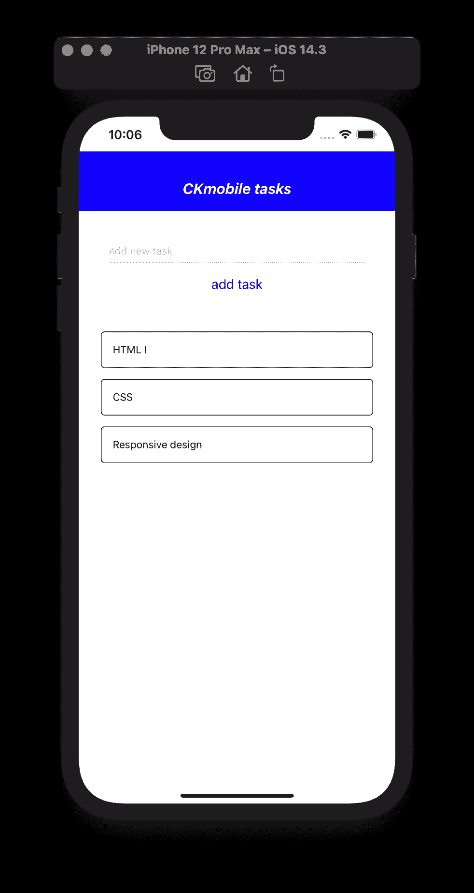
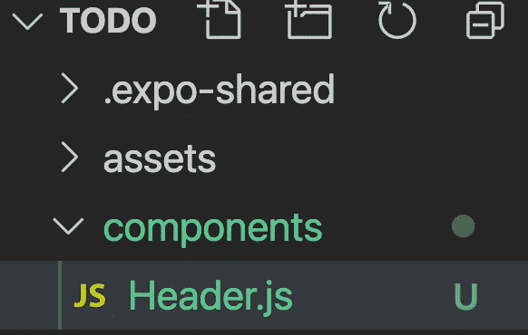

# Expo React 原生 Todo 应用程序—创建布局和组件

> 原文：<https://javascript.plainenglish.io/react-native-todo-part-i-9f0a028bea4a?source=collection_archive---------6----------------------->

## 第一部分。创建基本布局和标题组件

在这篇文章中，我们将创建一个待办事项应用程序，我们将有一个基本的布局与标题，内容和内容内，我们有一个任务列表。

相关课程:

[](https://www.udemy.com/course/react-native-expo-for-multiplatform-ios-android-mobile-app-development/?couponCode=830C04545808D5CC2FFE) [## React native Expo 支持多平台移动应用开发

### 他是一名注册教师，在 javascript、物理、数学和统计方面有超过 10 年的教学经验…

www.udemy.com](https://www.udemy.com/course/react-native-expo-for-multiplatform-ios-android-mobile-app-development/?couponCode=830C04545808D5CC2FFE) 

完整内容:

[第 1 部分—创建基本布局和标题组件](https://medium.com/javascript-in-plain-english/react-native-todo-part-i-9f0a028bea4a)

[第 2 部分—创建项目组件](https://ckmobile.medium.com/expo-react-native-todo-part-2-a14e60ad003c)

第 3 部分— [创建 AddTask 组件来插入一个新任务](https://ckmobile.medium.com/expo-react-native-todo-part-3-6e6ab60661db?source=your_stories_page-------------------------------------)

第 4 部分— [出现错误时发出警报](https://medium.com/javascript-in-plain-english/expo-react-native-part-4-alert-message-370306581e28?source=your_stories_page-------------------------------------)

第 5 部分— [当您单击键盘以外的位置时，关闭键盘](https://ckmobile.medium.com/expo-react-native-part-5-dismiss-keyboard-78fba7b5cfff?source=your_stories_page-------------------------------------)

第 6 部分— [Expo React 本地第 6 部分—删除项目](https://ckmobile.medium.com/expo-react-native-part-6-delete-item-adee12a04942?source=your_stories_page-------------------------------------)

第 7 部分— [使用 flexBox 解决屏幕外问题。](https://ckmobile.medium.com/expo-react-native-part-7-fix-the-last-item-get-pushed-off-the-screen-64ffdd3e6eb0?source=your_stories_page-------------------------------------)



```
return (<View style={styles.container}>...header...<View style={styles.content}>
... input form ......list...</View></View>);
```

## 添加州

然后，我们从以下 url 复制任务:

[https://gist.github.com/delapuente/900160](https://gist.github.com/delapuente/9001607)

```
const [tasks, setTasks] = useState([{ task: "HTML I", id: "1" },{ task: "CSS", id: "2" },{ task: "Responsive design", id: "3" },])
```

## 添加平面列表

接下来，我们将添加 FlatList 来呈现数据“任务”,并列出文本组件中的任务。

```
<View style={styles.list}><FlatListdata={tasks}renderItem={({ item }) => (<Text>{item.task}</Text>)}/></View>
```

在底部，我们将添加一些样式，我们给内容一个 30 的填充，并给列表添加一个 30 的页边距，这样后面就有一个 30 的页边距。

```
content: {padding: 30},list: {marginTop: 30,}
```

## 标题组件

我们将在一个不同的文件中为
头创建一个全新的组件，这样更容易更新。

我们将创建一个名为“组件”的新文件夹。



Header.js 内部

```
import React from 'react'import { StyleSheet, Text, View } from 'react-native';const Header = () => {return (<View style={styles.header}><Text style={styles.title}>CKmobile tasks</Text></View>)}export default Headerconst styles = StyleSheet.create({header: {height: 80,paddingTop: 30,backgroundColor: 'blue'},title: {textAlign: 'center',color: '#fff',fontSize: 20,fontWeight: 'bold',fontStyle: 'italic'}});
```

创建 Header.js 之后，我们需要导入到 App.js

```
import { StatusBar } from 'expo-status-bar';import React, { useState } from 'react';import { StyleSheet, Text, View, FlatList, SafeAreaView } from 'react-native';**import Header from './components/Header';**
```

YouTube 上的免费教程:

[](https://www.youtube.com/channel/UCu4-4FnutvSHVo9WHvq80Ww) [## ckmobile

### 无论你是在后台还是前台工作，JavaScript 现在都非常重要。NodeJS、Angular、VueJS 或 React all…

www.youtube.com](https://www.youtube.com/channel/UCu4-4FnutvSHVo9WHvq80Ww) 

关注我们:

[](https://www.linkedin.com/company/ckmobi/) [## Ckmobile |领英

### Ckmobile 在领英有| 34 个关注者。主要关注初学者的 JavaScript 教程和不同的 JavaScript…

www.linkedin.com](https://www.linkedin.com/company/ckmobi/)