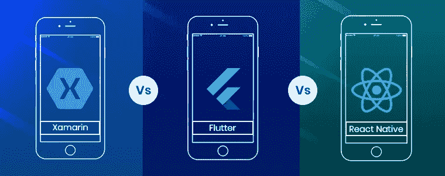

# react Native vs . Flutter vs . Xamarin——寻找 2021 年的最佳框架

> 原文：<https://javascript.plainenglish.io/react-native-vs-flutter-vs-xamarin-the-search-for-the-best-framework-in-2021-718d06910e68?source=collection_archive---------3----------------------->

2021 年的应用程序开发与几年前有很大不同，这在很大程度上是因为有能力的框架的出现。每个应用程序开发人员都反复面临这样的问题:哪个框架最好，或者哪个框架最适合开发跨平台的应用程序。

当你考虑像 Flutter vs . React Native vs . xa marin 这样的框架时，这个问题就变得更加模糊了。寻找最好的多平台 app 开发已经成为业界普遍的疑问，这是可以理解的。

随着移动应用市场的过度增长，创造最好的移动应用的动力也越来越大。因此，每个公司都在寻找最高效的应用程序，如果他们必须在两个不同的平台之间分割他们的设备，这是不可能的。

这就是跨平台开发的用武之地。该技术成为解决以下问题的综合解决方案:

*   iOS 和 Android 哪个平台比较好？
*   创建一个 app 最好的技术是什么？
*   在多个平台上创建一个 app 需要多少成本？
*   如何在混合应用和原生应用以及跨平台应用开发之间做出决定？

如果你也在纠结这些问题，请继续读下去。这里我们将找出 Xamarin 和 React Native 之间哪个框架最好，以及 Flutter。

# 寻找构建应用的最佳平台

如果你的业务需要一个 iOS 和 Android 的 app，最好选择跨平台的 app 开发。它允许开发者在不同的平台上使用相应的语言，节省时间和资源。

使用混合应用程序开发，应用程序开发成本减少了一半，同时缩短了开发流程，近 97%的代码共享各种好处。

即使你确定了自己的需求，在 Xamarin、Flutter 和 React、Native 之间找到最佳框架也很难。这就是为什么我们使用基准测试来找出最适合您的移动应用程序开发框架。

# 比较 React Native、Flutter 和 Xamarin

选择最好的跨平台应用很难，所以我们收集了一些参数供您决定。

*   表演
*   相关性/受欢迎程度
*   框架/架构
*   社区

Xamarin 与 React Native 和 Flutter 的性能比较

为应用程序开发选择正确的框架总是涉及到性能分析:

# |反应自然

React Native 提供了类似于一些本机应用程序的性能，因为它可以为函数渲染代码，尤其是本机 API。它还允许开发人员使用本地语言的本地模型来编写复杂的代码。

根据应用程序的复杂程度，您可以共享几乎 80%的代码。由于 React 使用 JavaScript，呈现大型数据集是一个挑战。再加上与 Android 或 iOS 不统一，所以落后于一些原生系统。

# Xamarin

使用 Xamarin，您可以快速构建和发布应用程序。它现在还提供热重装、可视化、热重启和 Shell 来简化和减少开发时间。它提供了，

*   描述应用程序视觉层次的理想空间，
*   完美的 UX
*   内置的搜索评估工具

Xamarin 的集成应用程序可以与原生应用程序开发标准竞争，但该平台的效率不如要求苛刻的图形。

# 颤动

在编制一份应用程序开发最佳框架的清单时，不加入 Flutter 是不公平的。该平台帮助开发人员使用本机代码，并提供一个熟悉的本机环境和出色的 UX。

Dart 的代码使其在竞争中脱颖而出，因为用 C 库编译消除了 JavaScript 的复杂性。通过热重装，您还可以在几秒钟内跟踪每一次更改。

# Xamarin 与 React Native 和 Flutter 的受欢迎程度/重要性的比较。

应用程序开发的最佳框架列表会因新加入者而定期变化。以下是这些平台受欢迎程度的总结:

# |反应自然

称 React 为跨平台 app 开发最流行的框架并不为过。Google Trends 已经将 Flutter 和 Xamarin 放在了 React Native 之后最受欢迎的应用程序开发框架上。

# Xamarin

2015 年至 2016 年是 Xamarin 的黄金时期，因为该平台在最受欢迎的多平台应用开发中名列榜首。

2017 年年中，竞争白热化，最终在 2018 年被 React 超越。

# 颤动

尽管 React 是最受欢迎的应用开发框架，但 Flutter 仍然是一个势均力敌的竞争对手。

然而，Flutter 社区正在过度发展，这表明这个平台是多么有前途。

# 架构/框架比较 React vs. Xamarin vs. Flutter。

架构在选择应用程序开发的理想平台时扮演着重要的角色，

# |反应

该平台使用一种称为 Flux 的架构在客户端构建 web 应用程序。这些框架通常遵循模型视图控制(MVC)框架。React 以直观的方式帮助开发人员修改现有项目。

# react Native vs . Flutter vs . Xamarin——寻找 2021 年的最佳框架

# Xamarin

Xamarin 框架为构建本机应用程序提供了一个基于可视化设计的平台。它还利用 MVVM 和 MVC 架构来加速直径较短的应用程序的封装过程。

MVVM 模型允许您用相同的代码构建单独的流程。

MVC 模型有助于定义应用程序和表示逻辑之间的区别，从而加快应用程序开发过程。

# 颤动

说到 Flutter，你可以看到一个反应式的用户界面。它还包括基于 Flux 和 RefluxJS 的单向数据流的 Dart 应用程序框架。

react Native vs . Flutter vs . Xamarin——寻找 2021 年的最佳框架

然而，由于 Flutter 的大小，开发人员使用它会感到沮丧。即使你把它最小化，应用程序仍然比普通平台要大。

适当的社区支持对于任何平台来说都是一个好兆头，这三个平台也是如此。

# |反应

React 是在开发人员寻找原生 React 和更好的移动应用程序开发相结合的替代方案时创建的。

它拥有最好的社区之一，GitHub 上有超过 83，000 名明星，还有超过 2，000 名贡献者致力于改进该平台。

# Xamarin

在这三个平台中，Xamarin 的社区支持较少。因此，GitHub 认为 Xamarin 的存储库、贡献者和用户远不如 React 流行也就不足为奇了。

# 颤动

与 Xamarin 不同，Flutter 在 GitHub 上有很好的社区支持，有超过 82，000 颗星，几乎与 React 一样多。还有 500 多名贡献者致力于改进该平台。也能在各种问答页面上看到 flutter 开发者积极的身影。

# 结论

React、Flutter 和 Xamarin 无疑可以描述 2021 年移动 app 开发的一些最佳框架。然而，一家公司不可能同时投资这三个领域。

因此，我们试图在这篇博客中强调他们每一个人。如果你正在寻找 react developer、flutter developer 或软件开发人员，有许多[软件外包公司](https://www.standardfirms.com/top-software-outsourcing-companies/)和 [react 开发公司](https://www.standardfirms.com/react-development-companies-india/)可以帮助你找到项目的最佳框架。

*更多内容尽在*[*plain English . io*](http://plainenglish.io/)