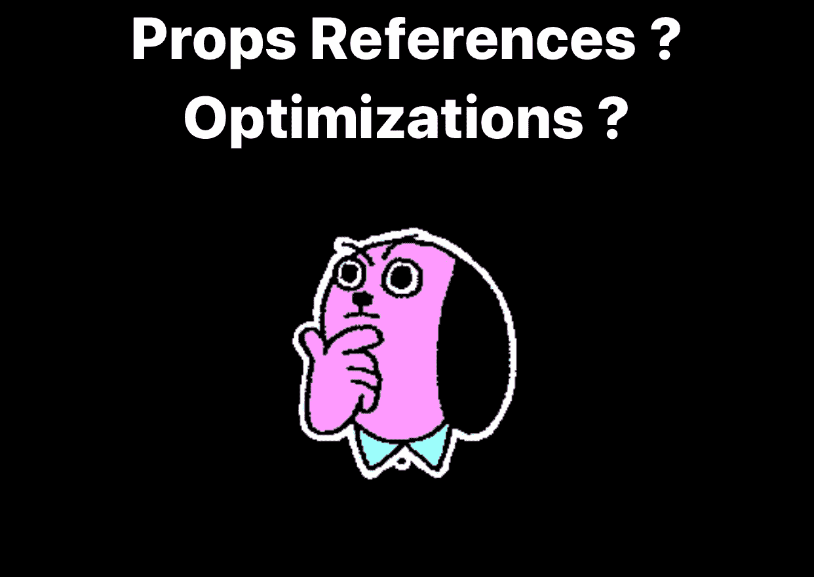
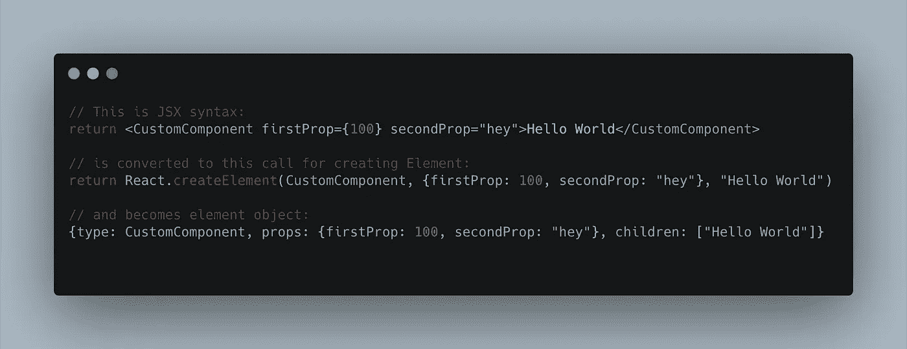
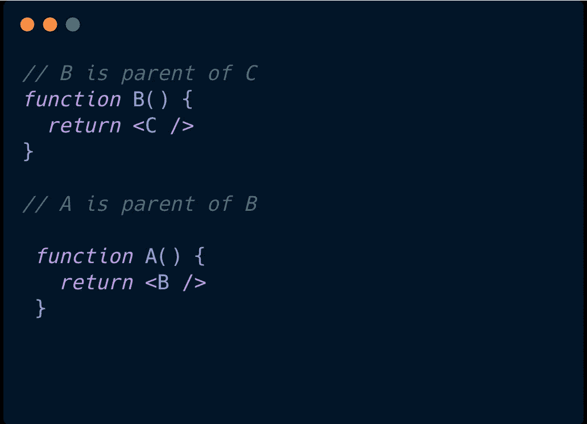
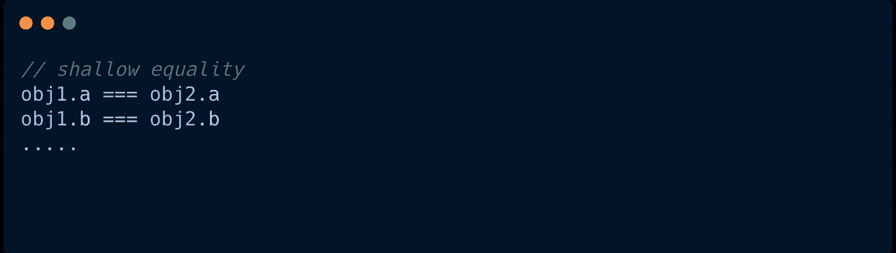
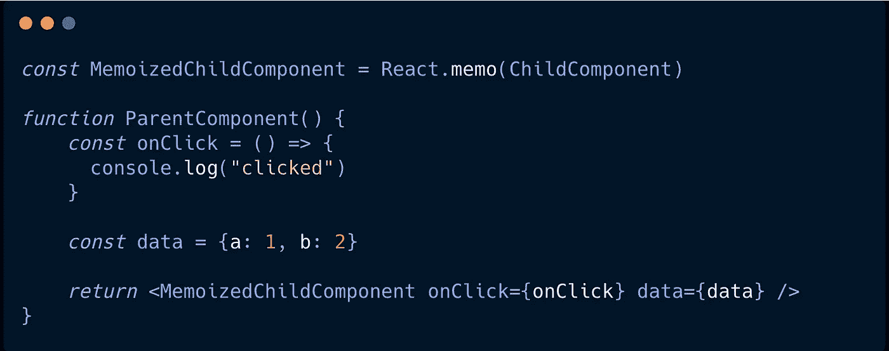

# 为什么 Props 引用会破坏 React + React Native 中的优化

> 原文：<https://javascript.plainenglish.io/react-native-why-props-references-break-optimizations-79c463ca0723?source=collection_archive---------8----------------------->

## 编写优化时要小心 props 引用

大部分时间反应都很快。但有时，由于繁重的计算，它会变慢，这时我们需要测量和优化我们的组件，以避免“浪费渲染”。

优化是有代价的，如果做得不好，情况可能会变得更糟。在今天的博文中，我们开始了解渲染过程，了解浪费渲染的原因，解决方案&它是如何被破坏的。

## 目录

*   **什么是“渲染”？:**流程概述，呈现&提交阶段
*   **标准渲染行为:**渲染阶段浪费渲染的原因
*   **提升渲染性能:**一些技巧
*   **新道具引用如何破坏优化:**问题的细节
*   **优化道具参考:**使用备忘录&使用回调
*   **记忆一切？**

# 什么是“渲染”？

**渲染**是 React 要求你的组件在当前的道具和状态组合下，描述部分 UI 是什么样子的过程。

## 流程概述

在这个过程中，React 将从组件树的根开始，向下循环查找标记为需要更新的组件。对于每个被标记的组件，它将调用 **render()** (对于类组件)或 **FunctionComponent()** (对于函数组件)，并保存渲染输出。

组件渲染器的输出被写入 **JSX** 。无论是来自 **render()** 还是 **FunctionComponent()** ，输出最终变成 **ReactElement** 。这些元素一起用于形成虚拟树(tempt tree)。

在收集新的树之后，React 将对其进行比较，收集需要应用的所有更改的列表，以使真正的树看起来像当前期望的输出。这个过程叫做 [**对账**](https://reactjs.org/docs/reconciliation.html) 。

以上是创建**主机树**(树输出)的非常基本的过程。基于不同平台(web、移动设备等)，主机树可以是各种类型。丹·阿布拉莫夫在这里 **为它写了很棒的解释 [**。**](https://overreacted.io/react-as-a-ui-runtime/)**

React 团队将上述工作分为两个阶段:

*   “**渲染阶段**”包含渲染组件和计算变化的所有工作。
*   “**提交阶段**”是将这些更改应用到主机树的过程。

# React Native 的更多层(如果您不感兴趣，可以跳过这一步继续)

React Native 创建一个树层次结构来定义初始布局，并在每次布局更改时创建该树的 diff，如上所示。除了 React Native 通过几个架构层来管理 UI 更新，这些层最终会转换视图应该如何呈现。

## 1.Yoga 布局引擎

[Yoga](https://github.com/facebook/yoga) 是一个用 C 编写的跨平台布局引擎，通过绑定到原生视图*(Java Android Views/Objective-C iOS ui kit)*来实现 Flexbox。

React-Native 中各种视图、文本和图像的所有布局计算都是通过 yoga 完成的，这基本上是我们的视图显示在屏幕上之前的最后一步

## 2.阴影树/阴影节点

当 react-native 发送命令来呈现布局时，一组影子节点被组装来构建影子树，该影子树表示布局的可变本地侧(即:用相应的本地语言编写，Android 用 Java，iOS 用 Objective-C)，然后被翻译成屏幕上的实际视图(使用 Yoga)。

## 3.视图管理器

ViewManger 是一个接口，它知道如何将来自 JavaScript 的视图类型转换成它们的本地 UI 组件。视图管理器知道如何创建一个影子节点、一个本地视图节点和更新视图。在 React-Native 框架中，有许多 ViewManager 支持使用本地组件。例如，如果有一天您想创建一个新的定制视图并将其添加到 react-native 中，那么该视图必须实现 ViewManager 接口

## 4.UIManager

UIManager 是拼图的最后一块，或者实际上是第一块。JavaScript JSX 声明性命令作为命令性命令发送给本机，告诉 React-Native 如何一步一步迭代地布局视图。因此，作为第一次呈现，UIManager 将发送命令来创建必要的视图，并将随着应用程序的 UI 随时间的变化继续发送更新差异。

所以 React-Native 基本上仍然使用 React 的能力来计算以前和当前呈现表示之间的差异，并相应地将事件分派给 UIManager。

# **标准渲染行为**

重要的是:

**React 的默认行为是，当一个父组件渲染时，React 会递归渲染*其内部的所有*子组件！**

例如，假设我们有一棵**A>B>c**的组件树

*   我们在 **B** ( **设置状态**或**设置使用状态**)中触发重新渲染。
*   React 从树的顶部开始渲染过程
*   React 发现 **A** 没有被标记为需要更新，并跳过它
*   React 看到 **B** 被标记为需要更新，并呈现它。 **B** 像上次一样返回 **< C / >** 。
*   **C** 不是*而是*最初被标记为需要更新。但是，因为其父级 **B** 被渲染，React 现在向下移动，并且也渲染 **C** 。

现在，很可能大多数组件会像上次一样返回精确的渲染结果，因此，React 不需要对真实的树进行更改。然而，React 仍然需要组件自己重新渲染，并区分渲染输出。这两者都需要时间和精力，尤其是当组件很大并且计算量很大的时候。

这就是浪费渲染是如何发生的。

# **提高渲染性能**

渲染是 React 的正常预期部分。同样，如果组件的渲染输出没有改变，那么有时工作是浪费的，树的这一部分不需要更新。

渲染应该总是基于组件的当前**属性和状态**。如果我们提前知道道具和状态不会改变。渲染输出不会改变，那么我们可以安全地跳过该组件的渲染过程。

说到优化，你可以让它运行得更快或者做更少的工作。大多数 React 优化都是为了做更少的工作。

> 请记住在任何优化之前进行测量，这样您就不会过早地进行优化。

React 提供了三个主要的 API 来跳过组件的渲染。

*   [**做出反应。component . should component update**](https://reactjs.org/docs/react-component.html#shouldcomponentupdate)**:**组件生命周期发生在渲染过程的早期。(发生在更新生命周期)。如果返回**假**，React 将跳过渲染组件。默认情况下，它总是返回 **true** ，所以当你需要跳过渲染组件时，你可以添加你自己的逻辑。通常，当我们定制这个生命周期时，我们比较旧的道具，用新的道具陈述，如果没有变化，返回 **false** 。
*   [**做出反应。pure component:**](https://reactjs.org/docs/react-api.html#reactpurecomponent)**由于道具和状态的比较是实现 ***shouldComponentUpdate 最常见的方式。默认情况下，PureComponent*** 是实现该行为的基类。可以用**代替 React。component+shouldcomponentdupdate。****
*   **[**react . memo**](https://reactjs.org/docs/react-api.html#reactmemo)**:**内置 [**高阶组件**](https://reactjs.org/docs/higher-order-components.html) **。**它接受您的组件并返回一个新的包装组件。包装组件的默认行为是检查是否有任何属性已经改变，如果没有，它阻止渲染。它也接受你为比较工作定制的逻辑，通常这是用来比较特定的道具，而不是所有的道具。**

**所有这些方法都使用一种叫做*浅相等*的比较技术。这意味着检查两个不同对象中的单个字段，并查看对象内容中是否有任何差异。该技术与 **===** 相比，是 JS 引擎可以做到的一种简单快速的方式。**

****

# ****新道具引用如何破坏优化****

**正如我们在上面的**浅相等**中所学的技术，很明显传递新对象会使比较失败，因为“===”比较**引用**，即使内容没有改变。这打破了我们的优化，组件仍然呈现，但是**浪费了更多的 diffing 努力，**通过道具比较进行 diffing&diffing tree。小心点！**

****

**在示例中，我们将 **onClick** 和**数据**作为道具传递给 **MemoizedChildComponent** 。尽管我们优化了 ChildComponent，但它仍然会重新呈现每个更新的 ParentComponent。因为 **MemoizedChildComponent 的道具每次都会获得新的对象。****

**我们期望 **MemoizedChildComponent** 跳过渲染，因为它的道具内容是相同的。让我们继续，想办法解决这个问题。**

# **优化道具引用**

**类组件不必担心意外创建新的回调对象引用，因为它们可以拥有总是相同引用的实例方法。但是，他们可能需要为单独的子列表项生成唯一的回调，或者在匿名函数中捕获一个值并将其传递给子列表项。这导致了新的对象，React 没有内置任何优化这些情况的功能。**

**函数组件，React 提供了两个钩子 [**useCallback**](https://reactjs.org/docs/hooks-reference.html#usecallback) (用于回调函数)和 [**useMemo**](https://reactjs.org/docs/hooks-reference.html#usememo) (用于创建对象或复杂计算等任何类型的数据)。**

> **这篇文章的目的是引出问题，而不是讲授钩子，我相信有很多资料可以很好地解释这些钩子。所以这里就不赘述了。也许在下一个帖子里，谁知道^^对不对**

# **回忆一切？**

**显然**不**，每一次优化都是有代价的。粗心的优化最终会使性能更差，总是先测量，通过 React devtool 或任何你喜欢的，找到瓶颈，然后优化。**

**它并不总是有益的，如果是的话，React 会将它作为默认实现，对吗？:D**

**Kent C. Dodds 提到了一个案例，在这里**使用回调**比[更糟](https://kentcdodds.com/blog/usememo-and-usecallback)。还有我最喜欢的丹的推特:**

> **为什么 React 默认不把 memo()放在每个组件周围？不是更快吗？要不要做个标杆来检验？问问你自己:为什么不把 Lodash memoize()放在每个函数周围？那不是让所有功能都更快了吗？我们需要一个基准吗？为什么不呢？**

# ****总结****

**好了，这篇帖子到此结束。**

**总的来说，React 的渲染过程渲染子组件是因为更新了父组件，这并不坏，这就是 React 了解变化的方式。并且有时渲染工作是浪费的。**

**跳过渲染是一种常见的优化方式，这项工作与**道具引用**有很大关系。小心优化，不要过早优化。**

**道具参考的问题不止这些。最近，我喜欢 Ben 的 [**文章**](https://t.co/ysL6qYw1KW) 关于它如何影响 useEffect hook 中的依赖关系。**

**对于任何进一步的问题或意见，让我知道。谢谢！**