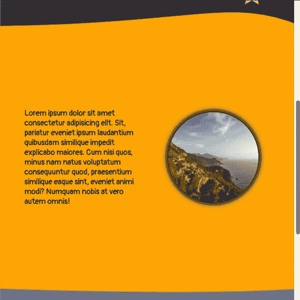

# React 网站通过视差网设计变得更酷

> 原文：<https://javascript.plainenglish.io/react-parallax-website-design-29cdb6c09c09?source=collection_archive---------15----------------------->

## React Parallax 网站设计


# **我们将分三个部分来构建这个网页:**

1.**置顶**——对客户的问候

2.**中间**——介绍我们业务使命的地方

3.**底部** —注册选项和页脚，用于了解我们的业务信息

# **顶端。**

## **我们在这里要做的就是将一堆图片放在适当的位置，然后写一个问候。**

```
<div className=”section1" ><div className=”greeting”>[Welcome]</div></div>
```

在所有这些图像的 CSS 样式中，重要的是我们要确保它们的*位置为“固定的”*，并且使用*“顶部”*属性进行定位。

稍后当我们使用我们的**视差特设包装器**让这些元素以不同的速度滚动时，这一点很重要。

这是我们的结果:


# **中间。**

## **对于这个部分，我们将创建弯曲的边界，并将这个部分分成左右两边。**

```
<div className=”section2" > <svg className=”svg_curve_top” xmlns=”http://www.w3.org/2000/svg" fill=”orange” viewBox=”0 0 100 100" preserveAspectRatio=”none” > <path d=”M0,100 C65,93 76,10 100,100" /> </svg> <div className=”section2_container”> <div className=”left_side”> // text here </div> <div className=”right_side”> // image here </div> </div> <svg className=”svg_curve_bottom” xmlns=”http://www.w3.org/2000/svg" fill=”orange” viewBox=”0 0 100 100" preserveAspectRatio=”none” > <path d=”M0,0 C65,20 90,5 100,0" /> </svg></div>
```

这里的 **svg** 元素在这个部分的顶部和底部创建了一个漂亮的曲线效果。

我们使用站点[三次贝塞尔曲线生成器](https://sean.brunnock.com/SVG/SVGPathGenerator/)来帮助我们生成代码。



# **底部。**

## 一个简单的文本输入和无序列表完成了我们的底部。

```
<div className=”section3" > Sign up to receive our newsletter! <input className=”input_email” type=”text” name=”email” id=”email” /> <MyButton text=”Sign Up” /> <div className=”contacts” > <section className=”contact_section” > <ul> // your items here </ul> </section> <section className=”contact_section” > <ul> // your items here </ul> </section> <section className=”contact_section” > <ul> // your items here </ul> </section> </div></div>
```

“**按钮**是一个自定义组件，单击后会显示动画。


# 让我们来处理并行。

## 我们在另一个教程中创建了这个特设包装器。

这里可以找到[。](https://medium.com/swlh/react-parallax-scrolling-web-design-solution-c9e486d98be8)

我们将简单地在这个包装器中包装我们想要以不同速度移动的任何东西，并将新组件放入我们的代码中。

举个例子，

**这个**:

```

```

**变成了这个**:

```
const RocketShip = JSX_withParallax(, 0.04);
```

**并且在我们的代码中是这样放置的**:

```
<RocketShip />
```

包装所有我们想要的东西给了我们最后的效果:


# 这个项目有更多的细微差别。

## **包括我们的自定义“按钮”组件的代码。**

你可以在下面观看我们的视频教程。

你可以在这里得到源文件[。](https://github.com/an-object-is-a/react-webpage-01)

所有的太空图像都是从[平面图标](https://www.flaticon.com/)上采集的。

我们从[字体牛逼](https://fontawesome.com/)收集的所有联系人图像图标。

如果你想要更深入的指导，请查看我在 YouTube 上的完整视频教程， [**一个物体是一个**](https://www.youtube.com/c/anobjectisa) 。

请务必关注我们的 [**Instagram**](https://www.instagram.com/an_object_is_a/) 和 [**Twitter**](https://twitter.com/anobjectisa1) 以跟上我们最新的 **Web 开发教程**。

## React Parallax 网站设计