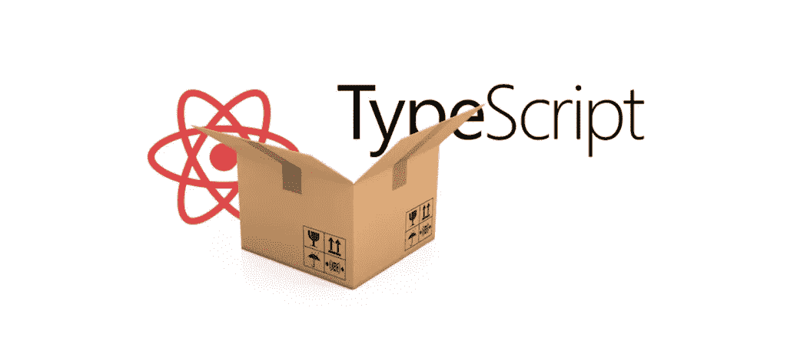
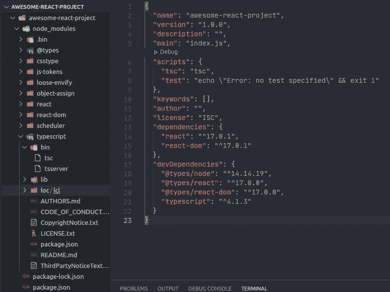
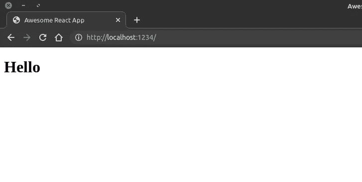
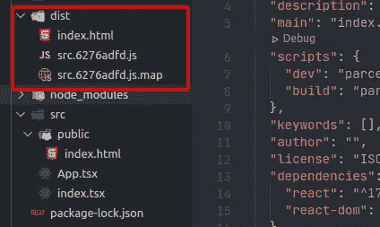

# 使用 TypeScript & Parcel 从头开始创建 React 项目

> 原文：<https://javascript.plainenglish.io/react-project-from-scratch-with-typescript-parceljs-952667a24706?source=collection_archive---------15----------------------->



在本教程中，我将解释如何从零开始设置一个 react 项目，而不使用流行的`create-react-app`方法。

首先，我们需要为我们的项目文件创建一个目录。根据您的操作系统，打开您的终端或命令提示符，运行以下命令创建一个目录并导航到该目录。

```
mkdir awesome-react-project && cd awesome-react-project
```

现在，我们需要创建一个新的 Node.js 项目。我打算用 npm 来做这个，但是如果你喜欢的话，也可以随意用 yarn。以下命令将在先前创建的目录中创建一个 package.json 文件。

```
npm init -y
```

由于这是一个 React web 应用程序项目，我们需要两个主要的依赖项。第一个是 React 的核心`react`，因为我们在浏览器中处理 ***DOM*** ，我们需要另一个名为`react-dom`的包。以下命令将安装这两个包。

```
npm install react react-dom
```

我们需要的下一个主要依赖项是 Typescript。但是这里要注意的一点是，这是一个开发依赖。这意味着我们只需要它来进行开发。当我们部署我们的 web 应用程序时，它将包含普通的 JavaScript，因为 web 浏览器不能直接运行 Typescript。

我们可以使用以下命令将 Typescript 作为开发依赖项安装到我们的项目中。`-D` flag 这里是告诉***NPM****这是一个开发依赖。*

```
*npm install -D typescript*
```

*现在我们几乎拥有了开始工作所需的一切。但是，在此之前，因为我们使用的是 Typescript，所以我们需要上述包和节点的类型。这些包将提供类型定义，同样，这些只在我们的开发环境中需要。您可以使用以下命令安装它们。如果你对这些类型定义的来源感到好奇，看看 GitHub 上的 [DefinitelyTyped](https://github.com/DefinitelyTyped/DefinitelyTyped) 项目。*

```
*npm install -D @types/node @types/react @types/react-dom* 
```

*接下来我们需要做的是创建一个名为`tsconfig.json`的配置文件。这将指导 Typescript 编译器如何编译我们的代码。我们可以手动创建这个文件，或者使用 Typescript 编译器为我们生成一个。*

*如果您想手动创建这个文件，只需在我们上面创建的目录中创建一个名为`tsconfig.josn`的文件。创建之后，目录结构应该如下所示。*

```
*└── awesome-react-project
    ├── node_modules
    ├── package.json
    ├── package-lock.json
    └── tsconfig.json*
```

*现在，如果您想使用 Typescript 编译器生成这个文件，请参考下面的部分。*

*如果我们回想一下我们做了什么，我们在开始项目时安装了 Typescript 作为开发依赖项。Typescript 包自带`tsc` (Typescript 编译器)。到目前为止，我们安装的每个包都被安装到了`node_modules`目录中。这意味着如果我们想使用`tsc`，我们需要从`node_modules`目录运行它。*

**

*typescript directory can be found inside the node_modules directory*

*现在，如果我们仔细观察，我们可以看到`tsc`位于`node_modules/typescript/bin`目录中。我们可以运行这个命令并生成一个`tsconfig.json.`，以便在我们创建的`awesome-react-project`目录中打开您的终端并运行下面的命令。*

```
*./node_modules/typescript/bin/tsc --init*
```

*这里的`--init`标志指示`tsc`初始化一个 Typescript 项目并创建一个 tsconfig.json 文件。这和我们之前用`npm --init`做的很像。*

*创建 tsconfig.json 文件后，用文本编辑器打开它，并按如下方式更改其内容。*

```
*{ "compilerOptions": {
      "target": "es5",
      "module": "commonjs",
      "jsx": "react",
      "outDir": "./out",
      "rootDir": "./src",
      "strict": true,
      "esModuleInterop": true,
      "skipLibCheck": true,
      "forceConsistentCasingInFileNames": true,
      "lib": [
           "es2018",
           "dom"
       ]   
    }
}*
```

*现在让我们来看一下上面的配置选项。如你所见，我们正在设置编译器要使用的选项。*

*   *目标:指定我们的源代码应该被编译成哪个版本的 ECMA 脚本。这对于浏览器的可比性非常重要。*
*   *module:为我们的程序设置模块系统。对于节点项目，CommonJs 是最常用的选择。*
*   *jsx:控制我们的源`jsx`文件将如何在编译后的代码中表示。`react`选项将把我们的源`jsx`编译成`React.createElement`调用。*
*   *outDir:为编译后的代码或者 Javascript 设置输出目录。*
*   *rootDir:设置包含源代码的目录。在这个项目中，我们将很快创建一个`src`目录。*
*   *strict:这启用了强类型检查，允许我们提前发现代码中的许多问题。*
*   *esModuleInterop:这修复了一个模块导入的问题。更多信息请参考[文档](https://www.typescriptlang.org/tsconfig/#esModuleInterop)。*
*   *forceConsistentCasingInFileNames:当我们试图导入与磁盘上不同大小写的文件时，会抛出一个错误。*
*   *lib:这些是供 Typescript 使用的库。您可以在[文档](https://www.typescriptlang.org/tsconfig#lib)中看到完整的解释列表。*

*这里需要注意的一点是，Typescript 有数百个配置选项。您可以参考[类型脚本文档](https://www.typescriptlang.org/tsconfig)根据您的需要进行更改，其中包含所有可用选项并附有解释。*

*现在让我们为源代码创建一个目录。在`awesome-react-app`目录中，创建一个名为`src`的新目录。然后，我们需要在那个`src` 目录下创建两个文件，分别命名为`App.tsx`和`index.tsx`。之后，我们需要在`src`目录中创建另一个名为`public`的目录。*

*`index.tsx`将是我们应用程序的入口点(起点),而`App.tsx`将包含一个包含所有其他组件的组件。简单来说，它会是我们的 app。*

*现在这个`public`目录是我们用来存储`html`文件的目录。接下来，我们需要在`public`目录中创建一个名为`index.html`的文件。这将在后面进一步解释。*

*最终的目录结构应该是这样的，*

```
*└── awesome-react-project
    ├── node_modules
    ├── package.json
    ├── package-lock.json
    ├── src
    │   ├── App.tsx
    │   ├── index.tsx
    │   └── public
    │       └── index.html
    └── tsconfig.json*
```

*我们需要做的下一件事是在这些文件中编写一些代码。让我们从`App.tsx`文件开始。*

```
*import React from "react"export function App() {
    return (
       <div>
          <h1>Hello!</h1>
       </div>
    );
}*
```

*现在这个文件包含一个非常简单的组件，名为`App`。如果您查看代码，可以看到它只返回一个包装在`div`中的标题。我们将使用它作为我们的应用程序。此外，除了`React`之外，这里没有其他依赖项。*

*接下来，我们将处理我们的`index.tsx`文件。*

```
*import React from "react";
import ReactDOM from "react-dom";
import { App } from "./App";ReactDOM.render(
 <React.StrictMode>
  <App />
 </React.StrictMode>,
 document.getElementById("root")
);*
```

*在上面的代码中，您可以看到我们导入了之前创建的`App`组件。除此之外，我们还进口`React`和`ReactDOM`。我们需要这个`ReactDOM`模块在 web 浏览器中呈现(显示)我们的应用程序。我在这里使用的是一个检测 React 代码中问题的工具。我们可以将主要组件包装在其中，并识别潜在的问题。可以在这里了解更多:[严格模式](https://reactjs.org/docs/strict-mode.html)。*

*可以看到，我们在这里使用的`ReactDOM.render`方法有两个参数。第一个是我们的主要组成部分。这种情况下，就是我们的`App`。接下来，引用了一个 id 为`root`的元素。现在这不一定是一个`getElementById`。你也可以使用像`querySelector`这样的词。这里的要点是**这应该是对我们的 html 文件**中的一个元素的引用。我们的应用程序组件将在这个引用的元素中呈现。所以，如果你弄错了，浏览器中什么也不会显示。*

*最后，我们可以处理我们的`index.html`文件，并把这些放在一起。如下所示编写您的`index.html`文件。*

```
*<!DOCTYPE html>
<html lang="en"><head>
  <meta charset="UTF-8">
  <meta name="viewport" content="width=device-width, initial-scale=1.0">
  <title>Awesome React App</title>
</head><body>
  <div id="root"></div> <script src="./../index.tsx"></script>
</body></html>*
```

*如果查看上面的代码，可以看到一个 id 为`root`的 div 元素。这是我们在`index.jsx`中提到的。React 将在这个 div 中呈现我们的`App`。*

*我想接下来的部分会让你们很多人感到困惑。因为我们使用常规脚本标签直接链接我们的`index.tsx`文件。(我们在路径中使用`./../`，因为它位于公共目录之外)。据我们所知，我们不能在我们的浏览器中目录运行这些`tsx`文件。那么，这是如何工作的呢？。*

*这就是模块捆绑器发挥作用的地方。其中最受欢迎的一个是 WebPack，你们很多人应该已经很熟悉了。是 `create-react-app`中包含的捆绑器。*

*简单地说，捆绑器的任务是查看我们的源代码，找出我们使用的所有东西，包括样式表、模块、图像..等等。把它们压缩成一堆和我们的目标兼容的文件。在我们的例子中，它将是网络浏览器。通常，这些捆绑器依赖于一个配置文件来找出如何做到这一点。请看下图。*

**

*Source: [http://webpack.github.io/](http://webpack.github.io/)*

*对于我们的项目，我们将使用一个名为 ParcelJs 的网络捆绑器。选择它的原因是因为它几乎不需要任何配置，而且与大多数其他捆扎机相比速度非常快。此外，我相信如果您想开始了解捆扎机，这是一个很好的起点。*

*所以，让我们开始把它安装到我们的项目中。这也将是一个开发依赖。在`awesome-react-app`目录中打开您的终端并运行以下命令。*

```
*npm install -D parceljs*
```

*我们需要做的下一件事是向我们的`package.json`文件添加两个脚本。打开 package.json 文件，修改脚本，如下所示。*

```
*{
  "name": "awesome-react-project",
  "version": "1.0.0",
  "description": "",
  "main": "index.js",
  "scripts": {
    "dev": "parcel src/public/index.html",
    "build": "parcel build src/public/index.html"
  },
  "keywords": [],
  "author": "",
  "license": "ISC",
  "dependencies": {
    "react": "^17.0.1",
    "react-dom": "^17.0.1"
  },
  "devDependencies": {
    "[@types/node](http://twitter.com/types/node)": "^14.14.19",
    "[@types/react](http://twitter.com/types/react)": "^17.0.0",
    "[@types/react-dom](http://twitter.com/types/react-dom)": "^17.0.0",
    "parcel-bundler": "^1.12.4",
    "typescript": "^4.1.3"
  }
}*
```

**注意:您可以在这里删除* `“main”: “index.js”` *行，因为在使用 ParcelJs 时我们不需要它。**

*让我们看看我们在这里做了什么。我们添加的第一个脚本叫做`dev`。ParcelJs 的好处在于它内置了一个开发服务器。这意味着在进行更改时，它将重建您的文件并更新您的网络浏览器，而无需您手动刷新。`dev`告知包裹观看我们的`index.html` 文件。您可以通过打开您的终端并运行如下脚本来测试这一点。*

```
*npm run dev*
```

*它会输出类似这样的东西，*

```
*Server running at [http://localhost:1234](http://localhost:1234) 
✨  Built in 3.21s.*
```

*现在，如果我们在浏览器中转到这个网址，我们可以看到渲染前创建的`App`。*

**

*ParcelJS development server*

*尝试对代码进行更改，您将看到上面的输出自动更新。`dev`命令负责启动开发服务器。您可以通过在您的终端中按`Ctrl+C`来结束这个开发服务器。*

*我们添加的下一个命令是`build`。这告诉 package 构建我们应用程序的生产就绪版本。您可以通过在您的终端中运行下面的命令来测试这一点，*

```
*npm run build*
```

*运行该命令后，package 将在我们的`awesome-react-app` 目录中建立一个名为`dist`的目录。这将包含您的生产就绪代码。*

**

*Outputs of Parcel build command*

*如您所见，package 从我们的源创建了一个`index.html` 文件和一个 js 文件。这些包含了运行我们的 web 应用程序所需的一切。*

*还记得我们之前在`index.html`里面链接的`index.tsx`文件吗？。package 看到了它，并把它和所有相关的东西打包到一个普通的老 JavaScript 文件中，网络浏览器可以理解这个文件。*