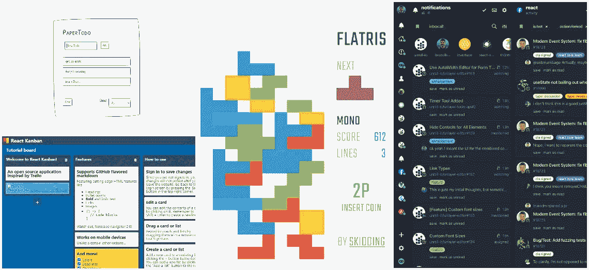
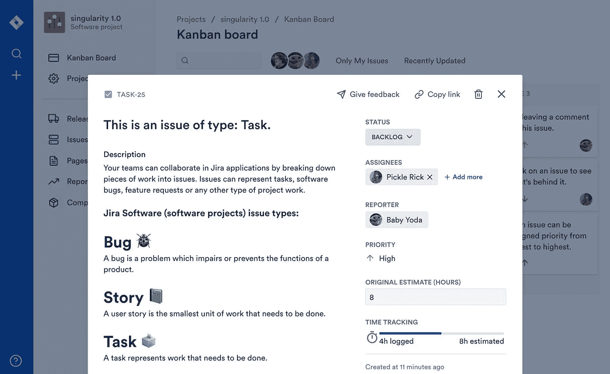
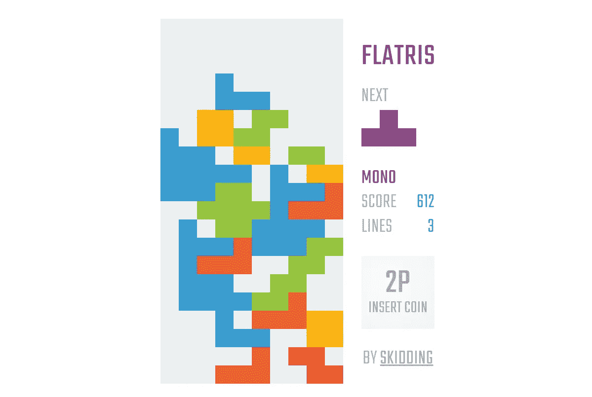
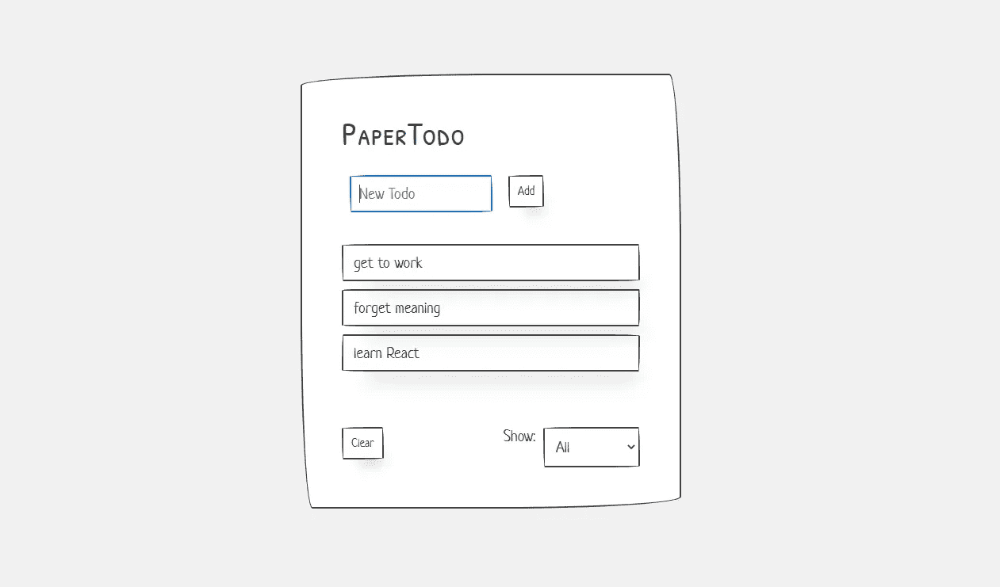
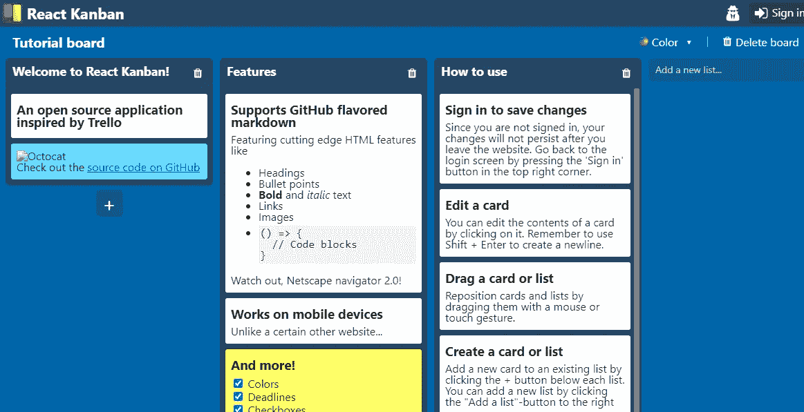
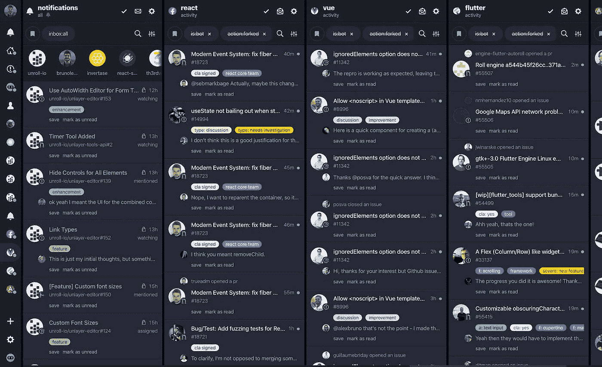

# 让 Github 上的项目发挥作用，激发你作为一名 Web 开发人员的灵感

> 原文：<https://javascript.plainenglish.io/react-projects-on-github-to-inspire-you-as-a-web-developer-e075bee625e2?source=collection_archive---------13----------------------->

React 是 web 开发中最流行的技术之一。由脸书开发的 JavaScript 库 React 近年来广受欢迎。越来越多的项目正在使用 React 开发。它有几个好处。它是灵活的，易于学习和理解，并提供一流的性能。

在 Github 上搜索，你可以找到各种展示开源世界独创性的创意项目。看看下面的项目来激发你的下一个创作，或者分叉其中一个分支，开始做一个你自己的项目。在本文中，我们将列出 Github 上可用的六个令人敬畏的 React 项目。

## **吉拉克隆**

吉拉是一个由 Atlassian 开发的流行软件，被专业开发人员和团队用来管理他们的工作。Github 的这个项目是使用 React 开发的吉拉的简化克隆。像吉拉一样，这个项目也提供了一个交互式用户界面，但是代码要简单得多。该项目是使用 React 以及 webpack、ode、ESLint、styled-components 和 cypress 构建的。虽然是简化版本，但代码是现代的。

该应用程序使用了最新的 React 特性，比如带有钩子的功能组件。此外，这个项目中还使用了几个定制的轻量级 UI 组件，包括模态和日期选择器。这个项目的开发者试图用 React only 来简化它。所以像 Redux 这样的库出现在代码中。

回购:

 [## oldboyxx/jira_clone

### 自动格式化更漂亮，测试与柏树🎗我做反应咨询，这是一个展示产品，我已经建立了…

github.com](https://github.com/oldboyxx/jira_clone) 

## **弗拉特里斯**

Flatris 是 Github 上另一个很棒的项目。这个项目的灵感来自于一个叫做俄罗斯方块的流行游戏。这是一个相当大的项目，有不同的选择。玩家可以通过分享 UI 中提供的链接来玩单人游戏或与朋友对战。游戏的用户界面设计开发的非常巧妙。此外，游戏还记录了与游戏相关的数据，这些数据在主页上是可见的。

该项目是使用 React 开发的，对于状态管理，使用 Redux。对于那些想了解 React 如何与 Redux 一起使用的人来说，这是一个理想的项目。

直播—【https://flatris.space/ 

 [## 打滑/漏气

### 工作进展中:Flatris 最近被重新设计，变成了一个多人游戏，有…

github.com](https://github.com/skidding/flatris) 

## **与 PWA 一起处理**

这是 Github 上的一个简单的 Todo react 项目，但是有一个有趣的特性。该应用程序是使用 React 开发的，但它也是一个渐进式 web 应用程序。对于那些不知道的人来说，渐进式 web 应用程序是一种较新的技术，它模糊了 web 和移动应用程序之间的界限。一个网站本质上就像是一个应用程序。这是 web 和移动应用程序开发中的一个热门话题。这个项目可以让你接触到渐进式的 web 应用，React 和 Redux。此外，这是一个简单的项目，具有引人注目的用户界面。

直播—[https://paper-todo.firebaseapp.com/](https://paper-todo.firebaseapp.com/)

回购:

 [## ajayns/react-项目

### 作为一个进步的网络应用程序的经典托多斯跟踪器。使用 React、Redux 构建，利用样式化组件、PaperCSS…

github.com](https://github.com/ajayns/react-projects/tree/master/todo-pwa) 

## **光谱**

Spectrum 是 GitHub 上非常受欢迎的开源项目。这是一个基于聊天的管理社区的应用程序。该项目提供了与许多流行聊天应用类似的聊天体验。它建立在 React 之上。你可以搜索社区，找到顶级社区，加入社区，做任何在社交媒体类应用上可能做的事情。这个庞大的项目使用多种技术开发，如 React、rethinkDB、Redis、graphQL、Flowtype 和 passportJS。项目结构和代码非常现代，可能需要一些时间来理解。但它肯定会给你足够的曝光率，同时也是了解这些技术的一个很好的来源。

直播—【https://spectrum.chat/explore 

回购:

 [## 有光谱/光谱

### 这是 Spectrum 的主要 monorepo 代码库。没有打包到可重用库中的每一行代码…

github.com](https://github.com/withspectrum/spectrum) 

## **反应看板**

React kanban 是 GitHub 上的一个开源项目，灵感来自 Trello。在这个应用程序中，您可以创建卡片，在其中插入细节，编辑它们，拖动它们，等等。该项目也有用户认证选项，如登录 Twitter 和 Google，也可以作为客人。凭借令人印象深刻的用户界面，该项目可以让您接触到全栈应用的工作。该项目非常简单，但在开发过程中使用了各种技术。其中包括 React、Redux、MongoDB、Express 和 Passport。

直播—[https://www.reactkanban.com/](https://www.reactkanban.com/)

回购:

 [## markusenglund/react-看板

### 一个服务器渲染的 React 应用程序，灵感来自 Trello。查看实时网站，它拥有大多数可用的功能…

github.com](https://github.com/markusenglund/react-kanban) 

## **DevHub**

DevHub 是一个基于 web 和桌面的项目，用于管理 Github 通知和活动。这是一个有用的应用程序，具有令人印象深刻的用户界面。它也适用于手机。该应用程序提供了各种功能，如多栏布局，过滤器，通知管理器，用户跟踪，仪表板，保存以后，键盘快捷键，等等。该项目非常庞大，使用 React、React Native、Redux、TypeScript、Redux-saga、electronic 和 reselect 开发。

直播—[https://devhubapp.com](https://devhubapp.com)

回购:

 [## devhubapp/devhub

### DevHub: GitHub 通知和活动在您的桌面上 Android、iOS、Web 和桌面之间有 95%以上的代码共享…

github.com](https://github.com/devhubapp/devhub) 

总结一下，Github 充满了 React 项目。您可以在那里找到许多令人敬畏的 React 项目。许多是复杂的，许多是简单的。这些项目是由世界各地的专业人士开发的。这些项目会让你接触到他们的代码，并作为学习的来源。查看一些项目！

*最初发表于*[T5【https://www.ordinarycoders.com】](https://www.ordinarycoders.com/blog/article/react-projects-github)*。*

*更多内容请看*[*plain English . io*](http://plainenglish.io/)