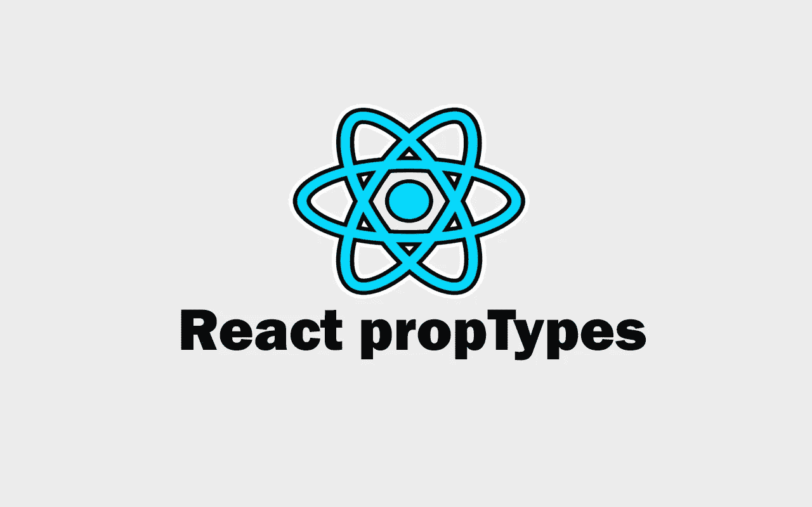
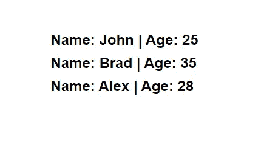

# 用示例解释 React 属性类型

> 原文：<https://javascript.plainenglish.io/react-proptypes-explained-with-examples-a6aec4f8cb52?source=collection_archive---------5----------------------->

## 通过实例了解 React 属性类型。



Image created with ❤️️ By author.

PropTypes 用于定义我们可以传递给特定 React 组件的属性类型。这是一个类型检查包，我们可以安装在我们的 React 项目中，轻松地定义和检查道具的类型(数字、字符串、数组等)。

例如，如果我们的道具应该是一个数字，而我们给了它一个字符串，那么这可能会在我们的项目中引起一个 bug。这就是为什么使用 propTypes 对你的道具进行类型检查是非常有用的，尤其是当你和一个团队在同一个项目中工作的时候。这将确保你总是得到一个警告，每当你给你的道具错误的类型。

在本文中，我们将通过简单的例子了解 React 中的 propTypes。让我们开始吧。

# 安装属性类型

在使用 propTypes 之前，您必须首先在项目目录中安装 propTypes 包。

如果你在 Windows 上使用`ctrl + shift + Y`打开你的 VSCode 终端，如果你在 Mac 上使用`command + shift + Y`。然后使用下面的 NPM 命令安装软件包。

```
**npm install prop-types**
```

之后，你只需要将这个包导入到你将要使用道具的文件中。您可以使用下面的模块代码导入它:

```
**import PropTypes from 'prop-types'**
```

现在您已经准备好在项目中使用 propTypes 了。

# 使用 propTypes 的示例

我们将看一个简单的 React 示例，显示 3 个用户的姓名和年龄。我们将在两个不同的文件中有两个组件:在`App.js`中的应用组件和在`User.js`中的用户组件。

在我们的应用程序文件中，我们将呈现用户组件的三个组件。我们将把名称和年龄作为这些用户组件的道具传递下去。

看看下面的例子:

```
//App.js**import** React from 'react'
**import User** from './User'const App = () => {
    return (
        <div>
            **<User name**={"John"} **age**={25} **/>
**            **<User name**={"Brad"} **age**={35} **/>**
            **<User name**={"Alex"} **age**={28} **/>**
        </div>
    )
}export default App
```

在我们的文件`User.js`中，我们将首先导入道具类型，因为我们将在那里使用道具。

用户组件将道具作为参数，并返回一个显示每个用户的姓名和年龄的标题。

下面是一个例子:

```
//User.jsimport React from 'react'
**import PropTypes from 'prop-types'**const User = (**props**) => {
    return (
        <div>
            <h2>Name: {**props.name**} | Age: {**props.age**}</h2>
        </div>
    )
}export default User
```

如你所见，我们只是用了`App.js`里传下来的道具。现在，如果您在浏览器中打开项目的本地主机，您应该会看到下面的输出:



Project Output.

现在我们可以在导入 propTypes 包的`User.js`文件的底部定义我们的 propTypes。

因此，让我们使用 propTypes 来定义，我们希望我们的名称属性始终具有字符串类型，年龄属性始终具有数字类型。

下面是代码示例:

```
**User.propTypes = {
    name: PropTypes.string,** //string type **age: PropTypes.number** //number type **}**
```

正如你在上面看到的，我们在组件`User`中应用了 propTypes 作为一个对象，包含了我们的带有类型值的 props。

如果您感兴趣，下面是如何传递除字符串和数字之外的其他类型:

```
**Component.propTypes = {
  propName: PropTypes.bool,** //boolean type **propName: PropTypes.func** //function type
  **propName: PropTypes.arrayOf(PropTypes.string)** //Array of strings.**}**
```

现在让我们回到`App.js`把年龄道具改成字符串例如:

```
const App = () => {
    return (
        <div>
            <User name={"John"} **age={"25"}** />
            <User name={"Brad"} **age**=**{"35"}** />
            <User name={"Alex"} **age**=**{"28"}** />
        </div>
    )
}
```

如果我们转到浏览器，我们将在控制台中看到下面的警告错误:


Capture from the console.

正如您在错误中看到的，age prop 应该是一个数字，而不是一个字符串，因为这是我们在上面的 propTypes 对象中传递的。我们定义了年龄属性应该总是有一个数字类型。这就是为什么我们会得到这个警告错误，告诉我们把年龄道具类型改回一个数字。

同样的事情也适用于名称道具。如果我们在`App.js`中将它的类型改为 number，我们会得到一个警告错误，告诉我们将其改回 string 类型。

# 结论

PropTypes 是对 React 应用程序进行类型检查的好方法。当与在同一个项目中使用你的组件的团队一起工作时，它们非常有用，这样无论何时他们传递 props，他们都会使用正确的类型。

这只是一个学习如何在 React 中使用 propTypes 的简单示例。您可以从其他资源中了解更多信息。感谢您的阅读。

**更多阅读**

[](/7-awesome-design-inspiration-resources-for-web-developers-9c42c4db7cac) [## 网站开发人员的 7 个绝佳设计灵感资源

### 作为一名网页开发者，你可以在这里获得设计灵感。

javascript.plainenglish.io](/7-awesome-design-inspiration-resources-for-web-developers-9c42c4db7cac) 

*更多内容尽在*[***plain English . io***](https://plainenglish.io/)