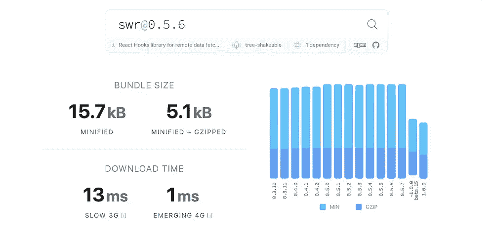
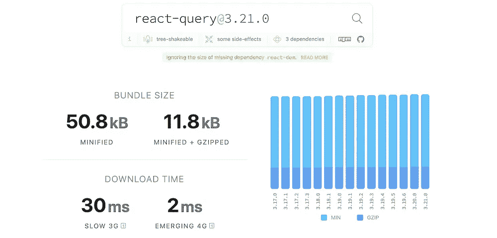

# 反应查询 vs SWR

> 原文：<https://javascript.plainenglish.io/react-query-vs-swr-36743c14ba7e?source=collection_archive---------2----------------------->

## 你的下一个项目应该选择哪一个？


Photo by [Vera Arsic](https://www.pexels.com/@vera-arsic-304265?utm_content=attributionCopyText&utm_medium=referral&utm_source=pexels) from [Pexels](https://www.pexels.com/photo/man-and-woman-wearing-brown-leather-jackets-984950/?utm_content=attributionCopyText&utm_medium=referral&utm_source=pexels)

大多数现代 web 应用程序都依赖于一些外部数据源。在 React 中，我们通常使用`fetch`或`axios`从远程端点获取数据。

然而，这两个库只能做这么多。我们仍然需要自己实现加载状态、错误处理、缓存、分页、重新验证所有这些东西。

但是有两个流行的库可以解决这些问题。它们是:

## 反应查询

根据[文档](https://react-query.tanstack.com/)该图书馆提供的是

> 获取、缓存和更新 React 和 React 本地应用程序中的数据，而无需触及任何“全局状态”。

另一个图书馆是

## SWR

这个库将自己识别为

> 用于数据获取的 React 挂钩

今天，我们将比较这两种解决方案，看看哪种方案更好。

# 常见的事情

先说共同特点。这两个库都可以执行常见的任务，如

*   询问
*   贮藏
*   投票
*   并行查询
*   原始数据
*   窗口焦点重新获取
*   网络状态重新获取

现在我们来谈谈它们之间的区别

# 开发工具

这是一个大的。React query 提供了非常棒的 Devtools。我们必须在根里面传递它。

不幸的是，SWR 没有任何开发工具。有一些第三方软件包可以做到这一点。

所以这是 react-query 的一大胜利。

# 全局错误处理程序

在`SWRConfig`的帮助下，我们可以在 SWR 启用全局错误处理。

为了启用它，我们像下面这样包装我们的根

但是由于一些奇怪的原因，React query 没有这个特性。我们可以通过自己创造一个特殊的挂钩来实现这一点，但如果有官方的支持，那就太棒了。

## 更新

显然，react-query 对全局错误处理有官方支持。您必须在全局配置中使用查询缓存的`onError`。像下面这样。

GlobalErrorHandler.jsx

所以这一轮是平局:P

感谢[张秀坤·多夫迈斯特](https://medium.com/u/a2fa50dd5795?source=post_page-----36743c14ba7e--------------------------------)的更正。你可以在这里查看他关于这个话题的文章

# 变异钩

在 React 查询中，默认情况下我们有变异挂钩。它们大概是这样的

```
const mutation = useMutation(newTodo => axios.post('/todos', newTodo))
```

但在 SWR，我们没有任何变异挂钩，而是可以选择手动操作数据，这不像变异挂钩那样方便。

mutation.tsx

因此，这显然是 React Query 的巨大胜利

# 捆绑大小

根据 [BundlePhobia](https://bundlephobia.com/) 的说法，SWR 的包大小为 15kb，而 React Query 的包大小为 50kb。哪是**的 3 倍以上！**



SWR vs React Query

所以如果你考虑规模，那么很明显 SWR 在这里以很大优势获胜！

# 碎片帐集

根据 react-query 文档，如果任何查询在 5 分钟内保持非活动状态，所有缓存的数据都将被垃圾收集。

此外，我们还可以通过更改配置选项中的`cacheTime`来根据我们的需求进行配置。

但是在 SWR 没有垃圾收集。所以如果你想的话，你必须手动操作缓存。

因此，这是 React 查询的一个胜利

# 定论

在我看来，这两个库都非常好，并且可以通过提高应用程序的性能来简化开发人员的工作。

然而，很明显，react-query 有一些 SWR 没有的非常强大的功能。但是随之而来的是增加束尺寸的成本。

因此，如果您正在构建一个简单的应用程序，并且想要一个现成的简单解决方案，那么 SWR 应该是您的选择。

但是如果你需要更多的控制和定制，并且想从开发者工具中获得最大的收益，那么一定要选择 react-query。

今天到此为止。希望现在您对这两个库的相互比较有了更好的理解。

祝你有美好的一天！

**通过**[**LinkedIn**](https://www.linkedin.com/in/56faisal/)**或我的** [**个人网站**](https://www.mohammadfaisal.dev/) **与我取得联系。**

[https://JavaScript . plain English . io/45-NPM-packages-to-solve-16-react-problems-a9ab 18946224](/45-npm-packages-to-solve-16-react-problems-a9ab18946224)