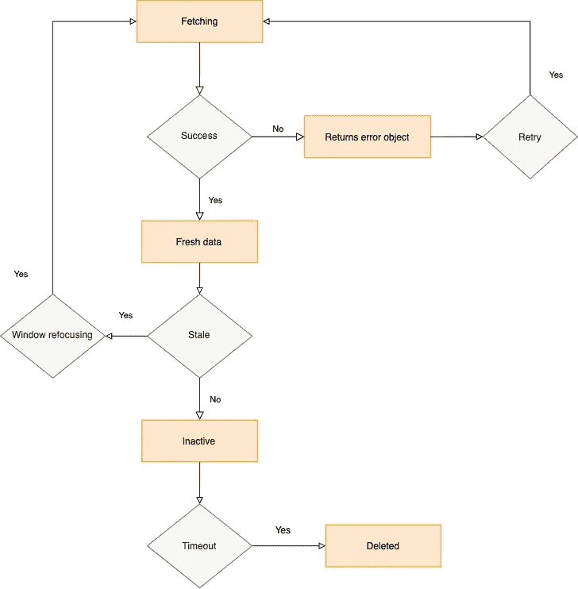

# React-Query:您可能不需要状态管理🤷🏽‍♂️

> 原文：<https://javascript.plainenglish.io/react-query-you-may-not-need-state-management-%EF%B8%8F-15de0837a569?source=collection_archive---------5----------------------->

## TL；速度三角形定位法(dead reckoning)

> **react-query** 通常被称为“缺失数据取数库”。它是服务器状态的，能够管理缓存数据，在后台异步更新过时数据。它可能是全局状态管理库(如 Redux 或 MobX)处理数据的良好替代品。这个故事的核心在[**基本用法**](#fe93)一节。下面显示的代码示例可从[这里](https://codesandbox.io/s/react-query-basics-c2yom)获得。

## 目录

> *) [简介](#332f)
> *) [概念](#b35d)
> *) [基本用法](#fe93) *)[a . use Query](#4a2e)
> *)[b . use mutation](#16a9)
> *)[c .查询失效](#841c)
> *) [预取](#8a1d)
> *) [结论](#740f)
> *) 【T34

# 介绍

将全局状态模式与像 Redux、MobX 或 Context API 这样的库一起使用有很多优点，但缺点在于数据类型的不同。有存储应用程序信息的数据，例如，黑暗模式，也有经常被操作的数据，例如产品列表和产品详细信息。这两种类型的数据可以被称为**客户端状态**和**服务器状态**。

我经常发现自己需要 30 分钟来连接 redux 样板代码，直到它可以使用。我使用带有 TypeScript 模板的 create-react-app，它还需要一个额外的库，如 redux-thunk 或 redux-saga，用于处理异步流程。

客户端状态和服务器状态之间最显著的区别是，服务器状态来自两个来源，即后端和前端，这意味着应用程序必须始终同步，以便状态或数据保持更新。总是提出请求不是最好的做法。我们需要一个工具，可以显示旧的状态，但也可以在后台更新。

# 概念

`react-query`通常被称为缺失的 react 取数据库。是的，这个库是前面描述的问题的解决方案。使用 react-query 允许我们非常容易地异步获取、更新和缓存数据。

`react-query`有三个核心概念:

*   **查询**:查询是对异步数据源的声明性依赖，与**唯一键相关联。**
*   **突变**:就像查询一样，区别在于对服务器的处理。对于修改数据创建/更新/删除，通常建议使用突变。
*   **查询失效**:查询失效后，我们可以对某个查询进行后台更新。当用户对某个产品做了一些更改，而您可能想在更新后立即重新获取该产品时，这是非常有用的。

react-query data behavior

`react-query`有其状态的术语:

*   **获取**:从服务器获取数据的开始过程，要么解析数据，要么返回错误。
*   **新鲜数据**:刚刚成功取数返回的数据。
*   **陈旧数据**:新数据在某个时间会变成陈旧数据(过期)，表示需要在后台更新数据。自动重取陈旧数据的许多方法之一是窗口重聚焦，或者我们可以在查询中配置重取间隔。
*   **不活动数据**:数据表示不再使用，在一定时间内会被删除。
*   **已删除数据**:该流程会在一定量的非活动数据后运行。可以为每个查询配置时间，也可以是全局时间。

# 基本用法

在使用这个库时，有几个钩子是最常用的。但是在我们开始之前，我们需要通过`QueryClient`实例将我们的组件连接到 react-query，并用`QueryClient`提供者包装我们的组件。

connect react-query to our component

`react-query`提供了一个有用的调试工具来检测错误，你可以直接从`react-query/devtool`导入`ReactQueryDevTools`。可以传递给 ReactDevTools 的一些属性:

*   `**initialIsOpen: boolean**` :默认为`false`，设置为 true，启动 app 时自动打开开发工具。
*   `**position?: “top-left" | “top-right" | “bottom-left" | “bottom-right"**` **:** 默认为“左下”。

注意:不要担心将`ReactQueryDevTools`排除在生产构建之外，默认情况下，当`process.env.NODE_ENV === ”production”`出现时，它不会包含在生产捆绑包中。

wire up react-query dev-tool

## a.使用查询

a

这个钩子有一些非常有用的返回值，其中一些是:

*   `**data: TData**`:如果 **queryFn** 成功，则返回结果数据。
*   `**error: null | TError**`:否则返回错误，是一个值依赖于 **queryFn** throw 的对象。
*   `**isLoading: boolean**`:如果查询正在进行或者没有相关的缓存数据，则设置为 true。

这个挂钩还需要传递两个参数:

*   `**queryKey**` :用来唯一标识和缓存你的查询，可以是任何一种数据类型。最简单的是 String，或者如果涉及特定的信息，例如联系人的详细信息，您可能希望使用 Array 作为键。
*   `**queryFn**`:基于承诺解析数据，功能类似 fetch 或 Axios。

一般来说，该 API 用于获取信息的过程，对于数据操作，建议使用 **useMutation** 。

## b.使用突变

与`useQuery`钩子不同，这个查询通常用于数据操作创建/更新/删除。这个钩子返回几个函数和值，但是我们只关注`mutate: (variables: TVariables, { onSuccess, onSettled, onError})`,因为它用得最多，为了简单起见。这个钩子也接受几个函数和回调:

*   `**mutationFn: (variables: TVariables) => Promise<TData> Required**`:与查询函数相同，不同的是该函数通过调用 mutate 来接收变量:TVariables。
*   `**onSuccess: (data: TData, variables: TVariables, context?: TContext) => Promise<unknown> | void**`:变异成功且包含变异结果时的回调函数。
*   `**onError: (err: TError, variables: TVariables, context?: TContext) => Promise<unknown> | void**`:变异抛出错误且包含变异结果时的回调函数。

## c.查询无效

执行查询失效以指示查询或相关数据是旧数据并且需要更新，首先它将相关查询标记为陈旧，然后自动重新获取。有几种方法可以使对它们的查询失效，分别是**失效时间**和**失效请求**方法。

为了使查询失效，可以将它传递给`useQuery`钩子作为一个选项:

或者我们可以从 **QueryClient** 实例中使用**invalidate equeries**方法:

我们也可以在进行变异后使用**invalidate equeries**方法:

# 预取

想象一下，如果你有一个电子商务应用程序，并且你有一个预览功能，当你悬停在它上面时，直接显示关于产品的最少信息。如果是这种情况，您可能需要对数据进行预取，以获得更好的 UX。

# 结论

react-query 可以提供更多有影响力的功能，包括**并行查询**、**依赖查询**、**分页查询**和**无限查询**、**等**。前面提到的所有`react-query`都是最常用的。`react-query`管理缓存数据并执行异步流程，如运行后台更新。它还取代了 Redux 等用来管理数据的所有样板代码。

所以，我们碰到一个问题:`react-query`会取代像 Redux、MobX 或 Context API 这样的全局状态管理模式工具吗？好吧，如果上下文是关于管理需要在一定时间内更新以保持数据新鲜的数据，我更倾向于回答是的，你可以组合它。但是对于仅在客户端状态上的全局状态管理，使用它作为协议，以便组件可以通信，例如主题化。但是如果你的应用程序更像“页面生成器”，客户端状态经常同步变化，那么你应该坚持全局状态管理模式。

# 参考

*   林斯利·坦纳。"官方文件"*反应过来查询 react-query.tanstack.com/overview.*
*   尼古拉斯·桑托斯。"对服务器状态的查询和管理做出反应."*开发社区*，开发社区，2020 年 9 月 29 日，DEV . to/root strap/react-query-and-management-of-server-state-8ol。
*   多米尼克·多尔夫梅斯特。"反应查询和打字稿."*特克多多的博客*，2021 年 5 月 16 日，tkdodo.eu/blog/react-query-and-type-script.
*   [开发者 Dawid Piela Frontend 等人《下一件大事！对服务器状态数据管理的查询作出反应。*软件屋*，2021 年 5 月 14 日，tsh.io/blog/react-query-tutorial/.](https://tsh.io/blog/react-query-tutorial/)