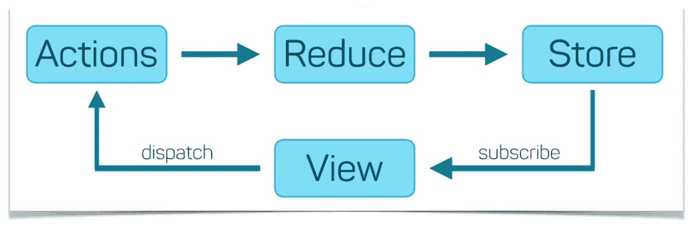

# 在 2021 年启动并运行 React Redux

> 原文：<https://javascript.plainenglish.io/react-redux-e16978557b46?source=collection_archive---------14----------------------->

## 2021 年 Redux 入门指南

Redux 是 JavaScript 应用程序的一个可预测的**状态容器**。



**react-redux**

**Redux** 是一个管理&更新**应用状态**的模式和库，使用名为**动作**的事件。

它充当需要在整个应用程序中使用的状态的集中存储。

状态只能以**可预测的**方式更新。

## 必需的冗余包

*   redux — npm 安装 redux
*   react-redux — npm 安装 react-redux

# 冗余术语

## 1.行动

动作是一个普通的 JavaScript 对象，有一个`type`字段。

*你可以把一个动作想象成一个描述应用程序中发生的事情的事件。*

一个动作对象可以有其他字段，这些字段包含关于发生了什么的附加信息。按照惯例，我们将这些信息放在一个名为`payload`的字段中

```
return {
    **type**: "INCREMENT",
    payload: intNumber
   }
```

## 2.还原剂

reducer 是一个函数，它接收当前的`state`和一个`action`对象，决定如何在必要时更新状态，并返回新的状态:`(state, action) => newState`。

*您可以将 reducer 看作一个事件监听器，它根据接收到的动作(事件)类型来处理事件。*

```
const initialStage = 0;const plusMinusReducer = ( **state** = initialStage, **action** ) => {
 switch( action.type ) {
  case "INCREMENT": return state + 1;
  case "DECREMENT": return state - 1;
  default: return state;
 }
}export default plusMinusReducer;
```

Reducers 可以使用内部的任何逻辑来决定新的状态应该是什么:`if/else`、`switch`、循环等等。

## 3.商店

Redux store 汇集了构成你的 app 的**状态**、**动作**和**还原器**。

每个 Redux 商店都有一个**单根**减速器功能。

```
import { **createStore** } from "redux";
import **rootReducer** from "./reducers/index";const store = **createStore**( rootReducer );export default store;
```

**注意:**在 Redux 应用程序中，您将只有一个**单店**

# 重复示例

动作创建
**src/actions/index . js**

```
export const incrementNumber = () => {
 return {
 type: “INCREMENT”,
 payload: intNumber
 }
}export const decrementNumber = () => {
 return {
 type: “DECREMENT”
 }
}
```

减速器创建
**src/reducers/plus MINUS . js**

```
const initialStage = 0;const plusMinusReducer = ( state = initialStage, action ) => {
 switch( action.type ) {
 case "INCREMENT": return state + 1;
 case "DECREMENT": return state - 1;
 default: return state;
 }
}export default plusMinusReducer;
```

**src/reducers/index.js**

```
import plusMinusReducer from "./plusminus";
import { combineReducers } from "redux";const rootReducer = combineReducers({
 plusMinusReducer
});export default rootReducer;
```

## 商店创建

**store.js**

```
import { createStore } from "redux";
import rootReducer from "./reducers/index";const store = createStore( rootReducer );export default store;
```

## 应用商店提供商

**index.js**

```
import React from 'react';
import ReactDOM from 'react-dom';
import './index.css';
import App from './App';
import reportWebVitals from './reportWebVitals';
**import store from "./store";**
**import { Provider } from "react-redux";**store.subscribe(() => console.log( store.getState() ) );ReactDOM.render(
 <React.StrictMode>
 **<Provider store={store}>**
 <App />
 **</Provider>**
 </React.StrictMode>,
 document.getElementById('root')
);reportWebVitals();
```

## 从视图调用操作

**App.js**

```
import './App.css';
**import { useSelector, useDispatch } from "react-redux";**
**import { incrementNumber, decrementNumber } from "./actions/index";**function App() {**const myState = useSelector( (state) => state.plusMinusReducer );
 const dispatch = useDispatch();**return (
 <>
 <div className="container">
 <h1>Increment/Decrement Counter</h1>
 <h4>Using React and Redux</h4><div className="quantity">
 <a className="quantity__minus" title="Decrement" o**nClick={(event) => dispatch(decrementNumber()) }**><span>-</span></a>
 <input type="text" name="quantity" className="quantity__input" value={**myState**}/>
 <a className="quantity__plus" title="Increment" **onClick={(event) => dispatch(incrementNumber()) }**><span>+</span></a>
 </div>
 </div>
 </>
 );
}export default App;
```

## 结论

这是 2021 年 React Redux 应用的基本样板。当然，随着时间的推移，还会有更多的复杂性，但这应该会让您对 React 和 Redux 的设置有所了解。

更多详情请参考[冗余文档](https://redux.js.org/introduction/getting-started)。

*更多内容看*[***plain English . io***](http://plainenglish.io)