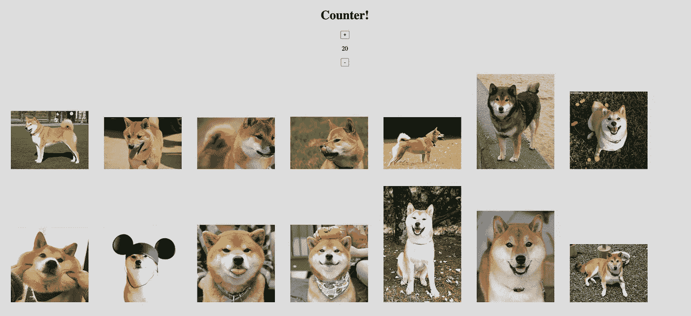

# 如何在用户使用 React/Redux 进行更改时重新加载页面

> 原文：<https://javascript.plainenglish.io/react-redux-reload-a-page-when-a-user-makes-a-change-7661a3e1b8ed?source=collection_archive---------2----------------------->



你有你的反应组件。你知道如何用 Redux 给他们提供数据。您创建了一个组件，该组件在您的 API 中创建/更新/删除一个项目，并将它放在显示来自您的 API 的项目的页面中。如何让整个页面在用户每次修改时重新加载以显示更新的数据？Redux 状态和`useEffect()`依赖数组。

在我的例子中，可以只使用 React 将数据从我们的计数器传递到父元素，以获得几乎相同的计数器效果，但是使用 Redux state 和 React `useEffect()`依赖数组在某些方面更容易，并且适用于更多的情况。

本文假设您对 API、React、Redux 和 Node 有基本的了解。我用`create-react-app`启动了这个应用程序，并且正在使用功能组件和钩子。你可以在[这个资源库](https://github.com/abbeyperini/ReactReload)里找到所有的代码。我在用 React (v17.0.1)，Redux (v4.0.5)， [react-redux](https://www.npmjs.com/package/react-redux) (v7.2.2)，和 [redux-thunk](https://www.npmjs.com/package/redux-thunk) (v2.3.0)。对于这个例子，我使用了 [Dog API](https://dog.ceo/dog-api/documentation/breed) 来获取随机的柴犬图片进行显示。

在测试了 API 端点之后(在这个例子中是在带有 [JSONView](https://chrome.google.com/webstore/detail/jsonview/chklaanhfefbnpoihckbnefhakgolnmc?hl=en) 的浏览器中)，我开始为 Dog API GET 请求设置我的动作类型和动作创建者。多亏了 redux-thunk，我能够创建异步操作。对于这个小例子，我将获取请求留在了动作创建器中。

以下是动作创建器的结果，带加载动作，后面会很重要。

```
> shibaActions.js**function** shibesRequested() { return { type: shibaConstants.SHIBES_REQUESTED } }**function** success(result) { return { type: shibaConstants.SHIBES_FETCHED, payload: result } }**function** failure(error) { return { type: shibaConstants.SHIBE_FETCH_FAIL, payload: error } }
```

接下来是减速器:

```
> shibaReducer.jsconst reducer = (state = initialState, action) => {
    switch(action.type) {
        case shibaConstants.SHIBES_REQUESTED:
            return {
                ...state,
                shibasLoading: true,
                shibasFetched: false
            }
        case shibaConstants.SHIBES_FETCHED:
            return {
                ...state,
                shibasLoading: false,
                shibasFetched: true,
                shibas: action.payload
            }
        case shibaConstants.SHIBE_FETCH_FAIL:
            return {
                ...state,
                shibasLoading: false,
                shibasFetched: false
            }
        default:
            return state
    }
}
```

最后，我初始化存储。composeEnhancers 中的第一项启用了 [Redux 开发工具](https://chrome.google.com/webstore/detail/redux-devtools/lmhkpmbekcpmknklioeibfkpmmfibljd?hl=en)，这个设置允许使用开发工具和中间件(在本例中，redux-thunk)。

```
> index.jsimport { compose, createStore, applyMiddleware } from 'redux';
import { Provider } from 'react-redux';
import thunk from 'redux-thunk';
import reducer from './store/shibaReducer';const rootReducer = reducer;
const composeEnhancers = window.__REDUX_DEVTOOLS_EXTENSION_COMPOSE__ || compose;
const store = createStore(rootReducer, composeEnhancers(applyMiddleware(thunk)));ReactDOM.render(
  <React.StrictMode>
    <Provider store={store}>
      <App />
    </Provider>
  </React.StrictMode>,
  document.getElementById('root')
);
```

到我们的组件上！我设置 App.js 来显示基于本地州的数字的柴犬图片。如果这是一个真正的应用程序，我会花时间为每张图片创建一个唯一的键和 alt 文本。

```
> App.jsimport { connect } from 'react-redux';
import { shibaActions } from './store/shibaActions';
import Counter from './components/Counter';function App(props) {
  const [number, setNumber] = useState(1);useEffect(() => {
    props.fetchShibes(number)
  }, []);if (!props.shibes || !props.shibes[0]) {
    return (<h1 className="heading">Loading!</h1>)
  } else {

    let shibaImages = props.shibes.map(shiba => {
      return (
        
        </img>
      );
    })

    return (
      <div className="App">
        {shibaImages}
        <Counter />
      </div>
    );
  }
}const mapStateToProps = (state) => {
  return {
    shibes: state.shibas
  }
}const mapDispatchToProps = (dispatch) => {
  return {
    fetchShibes: (num) => dispatch(shibaActions.fetchShibes(num))
  }
}
export default connect(mapStateToProps, mapDispatchToProps)(App);
```

空的`useEffect()`依赖数组(函数后的括号)意味着页面不会无限期地重新呈现，也不会由组件依赖项的更新触发重新呈现。**注意:** [Denny Scott](https://medium.com/better-programming/understanding-the-useeffect-dependency-array-2913da504c44) 和 React 团队建议不要使用空的依赖数组，因为它们会隐藏 bug。

现在我的 shibes 已经显示出来了，我将启动计数器组件。因为这个 API 没有 POST、UPDATE 或 DELETE 端点，所以计数器将更改传递给动作创建者中的 GET 请求 url 的值`num`。

```
**let** url = `https://dog.ceo/api/breed/shiba/images/random/${num}`;
```

首先，我更新了我的动作类型、动作创建者和缩减者。在这个小例子中，我对每一个都使用了一个文件，但是我通常会有多个 reducers 并使用`combineReducers()`钩子。

```
> shibaActions.jsfunction addOne(num) {
      return dispatch => {
        let number = num + 1;
        dispatch(add(number))
      } function add(number)  { return { type: shibaConstants.ADD_ONE,  
  payload: number } }
}function subOne(num) {
      return dispatch => {
          let number = num - 1;
          dispatch(sub(number))
      } function sub(number) { return { type: shibaConstants.SUB_ONE, 
  payload: number } }     
}> shibaReducer.jscase shibaConstants.ADD_ONE:
   return {
       ...state,
       counter: action.payload
   }
case shibaConstants.SUB_ONE:
   return {
       ...state,
       counter: action.payload
   }
```

我也把计数器加到初始状态，这样总有 1 shibe。

```
> shibaReducer.js**const** initialState = {shibasLoading: false, shibasFetched: false, counter: 1};
```

现在是计数器组件本身——非常简单。

```
> Counter.jsimport React from 'react';
import { connect } from 'react-redux';
import { shibaActions } from '../store/shibaActions';function Counter(props) {
    const handleOnAdd = () => {
        props.addOne(props.counter)
    }const handleOnSub = () => {
        props.subOne(props.counter)
    }return (
        <div className="container-counter">
            <h1 className="heading">Counter!</h1>
            <button onClick={handleOnAdd}>+</button>
            <p>{props.counter}</p>
            <button onClick={handleOnSub}>-</button>
        </div>
    )
}const mapStateToProps = (state) => {
    return {
        counter: state.counter
    }
}const mapDispatchToProps = (dispatch) => {
    return {
        addOne: (num) => dispatch(shibaActions.addOne(num)),
        subOne: (num) => dispatch(shibaActions.subOne(num))
    }
}export default connect(mapStateToProps, mapDispatchToProps)(Counter);
```

接下来，为了让我们的页面在每次按钮点击更改计数器时重新加载，我们必须返回到 App.js。我们将使用`mapStateToProps()`来访问页面组件中的计数器，并在我们调度`fetchShibes()`时传递它而不是本地状态`number`。

```
> App.js// const [number, setNumber] = useState(1);useEffect(() => {
    props.fetchShibes(props.counter)
  }, [props.counter]);
```

正如您在上面看到的，我们要让页面重新加载按钮更改，唯一要做的事情是将计数器状态放在`useEffect()`依赖括号中(React 团队建议将状态分配给变量，而不是在依赖数组中使用 props.state)。再加上一点点造型，我们就有了一个基本的小柴犬柜台。


让页面基于异步动作重新加载只是稍微困难一些——您可以使用类似上面的`shibasLoading`的加载状态。如果您只使用最终结果状态，比如`shibasFetched`，那么页面将只基于第一个成功的请求重新加载。所以如果你有一个用户在你的 API 中添加了很多东西，它只会显示第一个。

这个概念也有助于在应用程序中创建错误消息。在将`shibasFetched`和`shibasLoading`状态对象添加到`mapStateToProps()`之后，我更新了我的 App.js 文件。

```
> App.jsif (!props.shibes || !props.shibes[0]) {
    return (
      <div>
        {(props.shibasLoading || !props.shibasFetched) && <h1  
        className="heading">Loading!</h1>}
        {!props.shibasLoading && !props.shibasFetched && 
        <h1>Something went wrong - shibas not loaded.</h1>}
      </div>
    )
  } else {

    let shibaImages = props.shibes.map(shiba => {
      return (
        
        </img>
      );
    })

    return (
      <div className="App">
        {!props.shibasLoading && !props.shibasFetched && 
        <h2>Something went wrong - shibas not loaded.</h2>}
        <Counter />
        {shibaImages}
      </div>
    );
  }
```

使用 JSX 条件逻辑和 Redux 状态，我们可以根据异步请求的状态显示不同的错误消息。

# 结论

在我自己努力弄明白之后，我努力创建了一个简单的例子，展示了如何使用`useEffect()`钩子根据其他组件所做的改变来重新加载组件。

在一个应用程序中有很多方法可以使用它，基本概念本身允许你做一些有趣的事情，比如使用 JSX 条件逻辑定制错误消息。

如果这对你有所帮助，或者给你留下了一个问题，请给我留言！