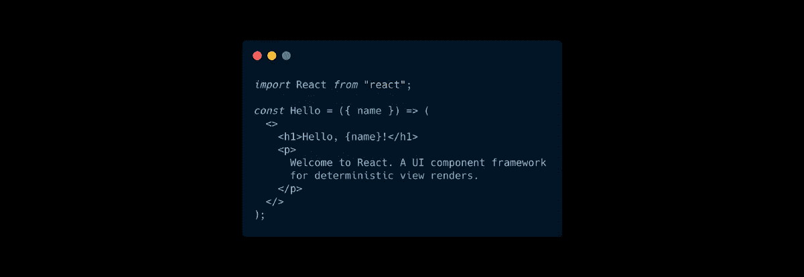

# 简化反应渲染

> 原文：<https://javascript.plainenglish.io/react-rendering-put-simply-c1d090df28ed?source=collection_archive---------13----------------------->

这将是对 React 渲染的一个生硬粗暴的浓缩，只剩下它的几个重要属性。

## 一切都不变。

我暂时忽略裁判。它们是一个有用的窍门，但会妨碍基本的理解。从主函数开始到结束，没有任何变化。从上到下，属性和状态应该被视为不变的。如果您在当前运行中需要不同的值，请创建新的常量来导出您需要的值。

设置状态不会改变这个事实。调用`useState`的 setter 不会改变 main 函数当前运行的值。该函数会一直使用旧值。

设置器*告诉*用新值从头到尾重新运行整个组件。这些值将再次保持不变…但会有更新的值。

## 组件不创建输出。

他们创建关于输出应该是什么的指令。很容易将 JSX 误认为最终产品，因为它看起来像 HTML。但是组件真正做的是输出指令来做出反应。它告诉 React 调用其他组件并最终创建 HTML，但实际上并不是在组件内部创建 HTML。您正在创建反应元素。

为什么这很重要？至于为什么不能在主组件函数中访问 DOM，这更有意义。主要的组件功能不是构建 DOM，而是告诉 React *如何*构建 DOM。还没有 DOM。这让我想到了下一个问题。

## 如果你需要用浏览器做一些事情，在一个效果或者一个事件处理器中做。

React 从应用程序的顶部开始，一路向下，收集组件的所有输出。然后，它找出需要更改的内容，最后更新 HTML 以反映您的应用程序应该如何更新。

当 React 运行 effects 时，它基本上是在说，“好了，网页已经准备好让你操作了。”通过在效果中进行 DOM 访问和操作，您可以确保在浏览器中对最新的代码进行操作。如果你需要改变事件监听器中的一些东西，那也是完全合法的。事件侦听器直接绑定到 DOM，当它们触发时，它们会针对网页触发。React 在那些火的时候已经渲染好了。

这是最基本的。还有更多，与管理状态和效果依赖的方法有关，但希望这有助于思考 React 如何渲染和使用状态和道具。

*更多内容请看*[***plain English . io***](http://plainenglish.io/)