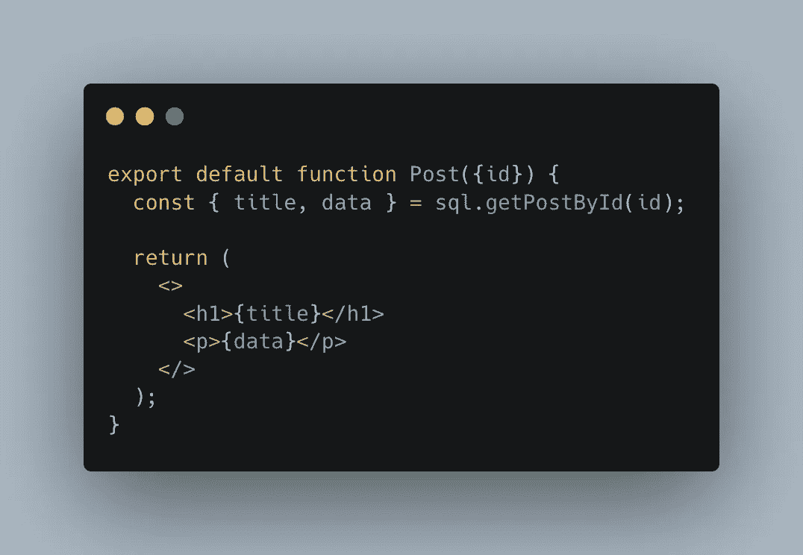
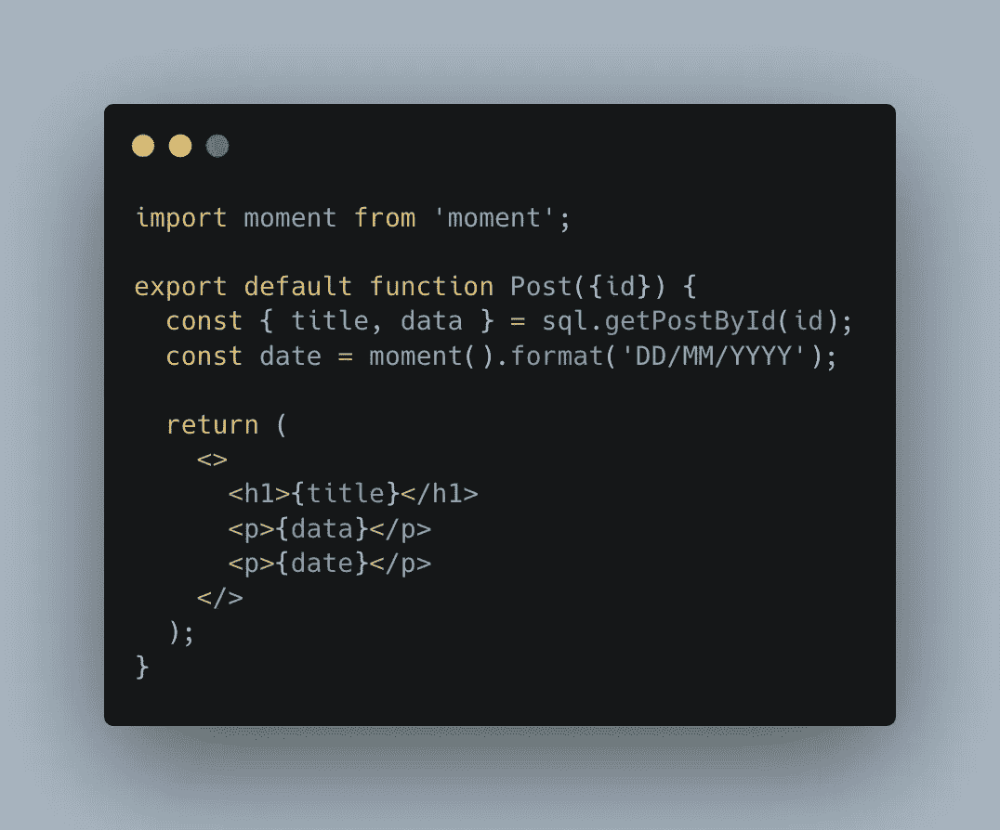
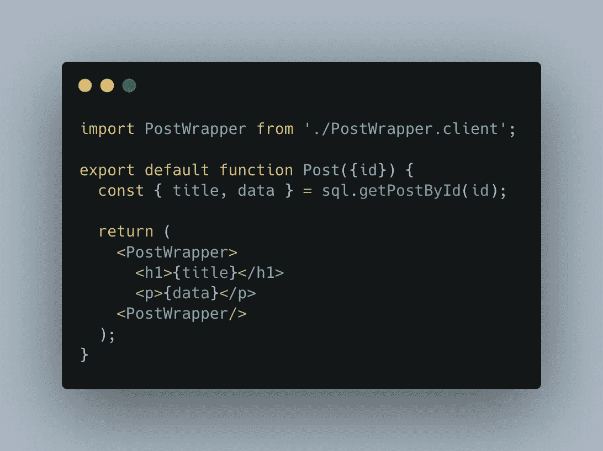
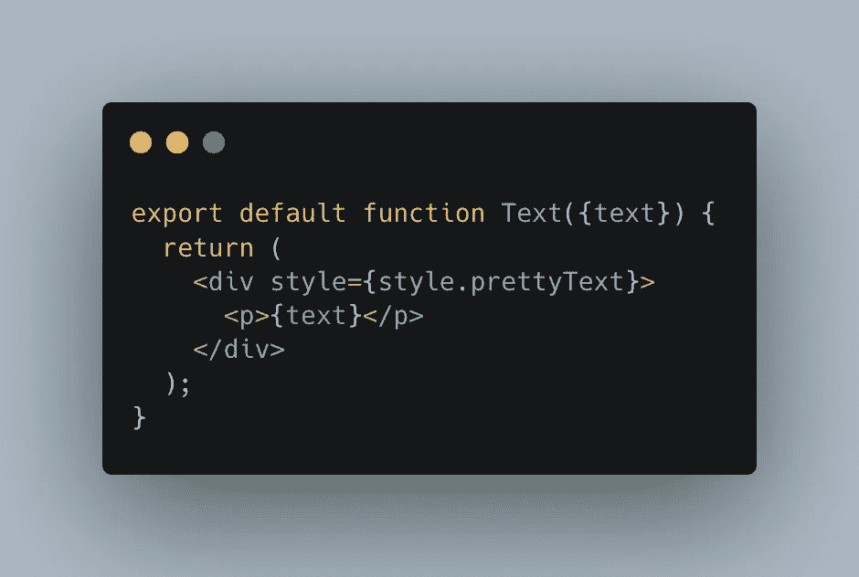

# React 服务器组件的捆绑包大小为零

> 原文：<https://javascript.plainenglish.io/react-server-components-comes-with-zero-bundle-size-bc23c8052813?source=collection_archive---------8----------------------->

## React 服务器组件仍在研发中，但对 React 开发者来说将是一个巨大的变化。

Photo by [Kevin Ku](https://unsplash.com/@ikukevk?utm_source=unsplash&utm_medium=referral&utm_content=creditCopyText) on [Unsplash](https://unsplash.com/s/photos/code?utm_source=unsplash&utm_medium=referral&utm_content=creditCopyText)

2020 年 12 月，react 宣布他们正在研究 React 服务器组件。服务器端的 React 组件？它引起了我很大的兴趣，在发现之后，我爱上了它。让我们一起来了解一下这些组件是什么。

# 什么是 React 服务器组件？

React 服务器组件是一个带有 ***.server.js*** 扩展名的基本组件。

这个组件的强大之处在于它将在服务器端呈现。这意味着它将能够非常容易和快速地恢复数据进行渲染。然后，服务器会将完全呈现的组件发送到客户端进行显示。

React 服务器组件的一个简单示例可能是:

Post.server.js

这看起来很神奇，但这是可能的。因为组件是在服务器端呈现的，所以我们可以直接访问组件需要的数据。

# 零束尺寸

我们已经看到，React 服务器组件在服务器端呈现，然后发送到客户端。这意味着该组件不包含在客户机捆绑包中，并且根本不会增加它的大小。

更好的是:当一个外部库只被服务器组件使用而不被客户机组件使用时，这个库也不会被添加到客户机包中，因为这是不必要的。

一个带有 Post 组件的 moment 库的快速示例:

Server component using external library

moment 库将不包含在捆绑包客户端中，因为它由服务器组件使用。服务器只会向客户端发送 Post 组件的呈现形式，仅此而已。这是减少客户端捆绑和提高性能的好方法。

# 混合 React 服务器组件和 React 客户端组件

由于组件是在服务器端呈现的，所以它只能用于显示数据，而不能进行交互，因此不能使用状态或事件侦听器。

但是可以同时使用客户机和服务器组件。这允许将所有交互逻辑放在客户机组件中，并将显示放在服务器组件中。

让我们回到我们的 Post 组件。我们将使用一个客户端组件 PostWrapper，当我们单击一个按钮时，它将显示或隐藏其子组件:

处理所有交互性的代码在我的 PostWrapper 客户端组件中。我给它一个已经在服务器端生成的 props，它可以显示或隐藏，这取决于在 PostWrapper 组件中生成的逻辑。太神奇了！

当您将 props 从服务器组件传递到客户端组件时，您只能通过网络传递可序列化的数据。因此不可能将函数作为 props 给出，因为函数是不可序列化的。

# **重新渲染服务器组件**

在他们的演示应用程序中，React 团队使用上下文实现了一个系统，路由基础设施正在监视该上下文。一旦服务器组件的给定属性发生变化，就会调用服务器，以便组件被重新呈现并返回给客户机。

因此，可以重新渲染服务器组件，但这不应该定期进行，因为每次重新渲染都会调用服务器，这可能需要几毫秒的时间，并会降低用户体验。

# 共享组件

扩展名为 ***.server.js*** 的组件是服务器组件。扩展名为 ***.client.js*** 的组件是静默组件(日常使用的普通组件)。也有可能同时拥有两者的组件:它是一个共享组件。

共享组件是扩展名为 ***的组件。js*** 如果导入到服务器组件中则成为服务器组件，如果导入到静默组件中则成为静默组件。

想象一个允许我以特定样式显示文本的基本组件:

Example of Text Component

我可以使用这个组件作为服务器组件来显示静态文本，比如一篇中型文章的文本。由于服务器组件的优势，结果会很快出来。

但是我也可以将这个组件作为客户端组件使用。当我写一篇中型文章时，我的组件的道具文本会经常改变，我想很快看到结果。服务器组件需要调用服务器，以便为每个更改重新呈现。在这种情况下，使用客户端组件更合适，我的组件响应速度会更快。

因此，可以根据需要在服务器端或客户端使用共享组件。不幸的是，它不具备真正客户端组件的所有功能，比如使用状态或事件监听器。

总而言之，服务器组件的要点是:

*   对束尺寸没有影响
*   直接访问后端
*   自动客户代码分割
*   你喜欢用多少就用多少
*   服务器心智模型，现代 UX

本文是 React 团队制作的演示视频的摘要。如果你喜欢这篇文章，我强烈建议你在他们的博客上观看。

请注意，服务器组件仍在研发中，几个月后才会上市。我等不及要用它们了！