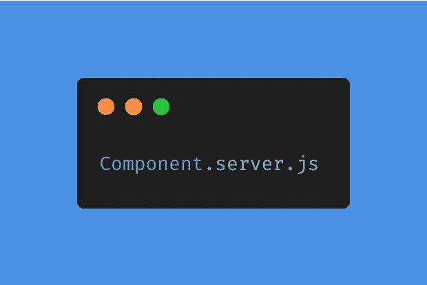
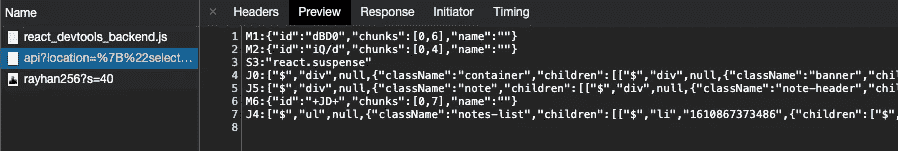

# 检查 React 服务器组件

> 原文：<https://javascript.plainenglish.io/react-server-components-examined-5678a966f4af?source=collection_archive---------14----------------------->

## 为什么有人想在他们的应用程序中使用 SSR 或 React 服务器组件而不是 CSR？

大家好，今天我将尝试理解并解释什么是 React 服务器组件，以及为什么我们要使用它们而不是其他现有的解决方案。

现在，我必须承认，React 团队发布服务器组件已经有一段时间了，从那以后，大肆宣传已经渐渐淡去了。然而，我无法深入了解它，因为由于它是实验性的(实际上仍然是实验性的)，它对我来说只是半成品，我决定把它留到另一个时间，最好是在它更加稳定和广泛使用之后。

但最近我想看一看它，我看到了许多积极的命令围绕着这个主题，在我做了我的研究之后，我可以说这是一个总的进步，完全值得一看。

# 为什么选择服务器组件？

实际上，这里的关键问题是，为什么？为什么有人想在他们的应用程序中使用 SSR(服务器端渲染)或 React 服务器组件，而不是 CSR(客户端渲染)？

所有的答案基本上都可以融化在 2 个话题下；SEO 和性能。在我们检查这两个领域之前，我应该简单提一下什么是 SSR 和 CSR。

## 企业社会责任

使用这种方法，您的浏览器基本上会加载大量的 JS(取决于应用程序的大小)并呈现它，然后将网页显示在您的面前。

## 苏维埃社会主义共和国

然而，使用 SSR，您的浏览器只是从服务器端接收一个预先呈现的 HTML，自然，在这种情况下，所有繁重的工作都由服务器来完成。

现在我们可以谈谈 SEO 和 SSR 的性能优势了。对于 SEO 部分，我将简单地提及一些基石，我将留下一个[链接](https://rubygarage.org/blog/seo-for-react-websites)供您对该主题进行更深入的研究。一般来说，当你的应用程序只是 CSR 时，你就开始在 SEO 方面遇到许多问题，目前还没有快速解决这种情况的方法，这些问题可以从许多方面进行评估，比如谷歌机器人如何扫描你的网站等等，所以如果你对这个话题感兴趣，我鼓励你去看看上面的链接。但是，基本上，通过 SSR，我们将拥有一个更加一致的 SEO 基础设施，因此，为我们希望通过 SSR 展示给谷歌的页面提供服务是非常有意义的，并且通过 Next.js 等框架的混合解决方案也是可能的，我将在一分钟内解释 React 服务器组件在这方面的新功能。

就性能而言，从它们的定义来看是显而易见的，对于 JS 应用程序，我们通常要处理大量的库，从性能的角度来看，在浏览器上呈现所有 JS 没有任何意义，所以当应用程序变得越来越大时，使用 SSR 将工作负载放在服务器上可能是一个好主意，也是一种常用的做法。

# React 服务器组件有什么问题？

现在你可能想知道我提到的 Next 和 Next 基本上解决了他们的混合方法的许多问题，你可以在这里了解更多信息。

React 服务器组件的两个主要特点是，第一，不同类型的数据，除了来自服务器的 HTML 之外的某种描述。

你可以从[这里](https://github.com/vercel/next-server-components)查看相同的下一个服务器组件演示，并亲自尝试。

另一件事是能够在组件级别上在 SSR 和 CSR 之间切换。以前使用 Next.js 时，你只能在页面级别上这样做，这基本上意味着你只能创建 SSR、CSR OS SSR(Next 支持的另一个东西)页面。这将使 React 的应用方式在未来变得更加灵活，特别是在并发模式也最终确定之后(React 的另一个实验性功能已经炒作了很久，你可以从链接[这里](https://reactjs.org/docs/concurrent-mode-intro.html)查看什么是并发模式)。)

当然，这并不意味着你应该离开 Next 或者永远不要开始学习它，因为在 React 服务器组件稳定之后，Next 的首选 SSR 解决方案可能也是如此。

在这篇文章中，我没有深入探讨技术上的差异，但我可能会在未来发表类似的文章。

# 结论

*   React Server Components 以一种独特的方式帮助开发人员显著减少 JS 包的大小，从而帮助解决性能问题。
*   提供比以前类似解决方案更大的灵活性。
*   现在有了 React 服务器组件，我们可以从组件树中的任何地方访问我们的后端，这与旧的解决方案相比是一个很大的改进

总的来说，我认为 React 服务器组件是 React 的一大进步，我真的很喜欢它。

今天就到这里，希望能在新的版本中见到你，保重:)

*原载于*[*https://blog.akbuluteren.com*](https://blog.akbuluteren.com/blog/react-server-components-examined)*。*

*在*[*https://margin.io/blogs*](https://margin.io/blogs)结账加密相关物品