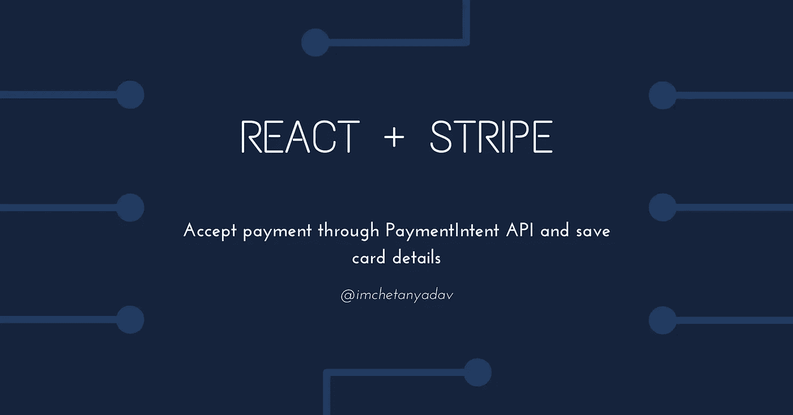

# React + Stripe —通过 PaymentIntent API 接受付款并保存卡的详细信息

> 原文：<https://javascript.plainenglish.io/react-stripe-accept-payment-through-paymentintent-api-and-save-card-details-aa90c55fcdb2?source=collection_archive---------7----------------------->



在本系列的第一部分中，我们将使用 Stripe PaymentIntent API 来接受支付，创建 Stripe 客户，并保存卡的详细信息以备将来支付。

我们将使用 React 作为前端，使用 Node 作为服务器。

# **接受付款**

1.**设置服务器**

*   安装条带节点库

```
npm install --save stripe
```

*   创建付款意向

```
// Specify Stripe secret api key here
const stripe = require("stripe")("stripe_secret_api_key");// Create a PaymentIntent with the order amount and currency
const paymentIntent = await stripe.paymentIntents.create({
  amount: 1200, // Specify amount here
  currency: "usd" // Specify currency here
});// Return client secret
res.send({
  clientSecret: paymentIntent.client_secret
}); 
```

**2。在客户端建立一个结帐页面**

*   向您的 React 应用程序添加条纹

```
npm install --save [@stripe/react-stripe-js](http://twitter.com/stripe/react-stripe-js) [@stripe/stripe-js](http://twitter.com/stripe/stripe-js)
```

*   加载条带及其元素

```
import React from "react";
import { loadStripe } from "@stripe/stripe-js";
import { Elements } from "@stripe/react-stripe-js";import CheckoutForm from "./CheckoutForm";// Make sure to call loadStripe outside of a component’s render to avoid recreating the Stripe object on every render.// Specicy Stripe Publishable API key here
const promise = loadStripe("stripe_publish_api_key");// Initialize Stripe Elements
export default function App() {
  return (
    <div *className*="App">
      <Elements *stripe*={promise}>
      <CheckoutForm />
      </Elements>
    </div>
  );
}
```

*   构建签出表单

```
*import* React, { useState, useEffect } *from* "react";
*import* { CardElement, useStripe, useElements } *from* "@stripe/react-stripe-js";*export* *default* function CheckoutForm() {
  // 1️⃣ Setup state to track client secret, errors and checkout status
  const [succeeded, setSucceeded] = useState(false);
  const [error, setError] = useState(null);
  const [processing, setProcessing] = useState("");
  const [disabled, setDisabled] = useState(true);
  const [clientSecret, setClientSecret] = useState(""); // 2️⃣ Store reference to Stripe
  const stripe = useStripe();
  const elements = useElements(); useEffect(() => {
    *// 3️⃣ Create PaymentIntent and fetch client secret as soon as the page loads* window.fetch("/create-payment-intent", {
      method: "POST",
      headers: {
        "Content-Type": "application/json",
      },
      body: JSON.stringify({ items: [{ id: "xl-tshirt" }] }),
    }).then((res) => { 
      *return* res.json();
    }).then((data) => {
      setClientSecret(data.clientSecret);
    });
  }, []); const handleChange = async (event) => {
    *// 4️⃣ Listen for changes in the CardElement and display any errors as the customer types their card details* setDisabled(event.empty);
    setError(event.error ? event.error.message : "");
  }; const handleSubmit = async (ev) => {
    ev.preventDefault();
    setProcessing(true); // 5️⃣ Confirm Card Payment.
    const payload = *await* stripe.confirmCardPayment(clientSecret, {
      payment_method: {
        card: elements.getElement(CardElement),
      },
    }); *if* (payload.error) {
      setError(`Payment failed ${payload.error.message}`);
      setProcessing(false);
    } *else* {
      setError(null);
      setProcessing(false);
      setSucceeded(true);
    }
  };// 6️⃣ Construct UI.
*return* (
    <form id="payment-form" onSubmit={handleSubmit}>
      <CardElement 
        id="card-element"
        {*/** Specify styles here **/*}
        options={{}} 
        onChange={handleChange}
      />
      <button disabled={processing || disabled || succeeded} id="submit">
        <span id="button-text">
          {processing ? <div className="spinner" id="spinner"></div> : "Pay"}
        </span>
      </button>
      {*/* Show any error that happens when processing the payment */*}
      {error && (
        <div className="card-error" role="alert">{error}</div>
      )} {*/* Show a success message upon completion */*}
      <p className={succeeded ? "result-message" : "result-message hidden"}>Payment succeeded!</p>
    </form>
  );
}
```

*   **可选:**显示卡片详细信息的单独输入

```
*import* {
  Elements,
  useStripe,
  useElements,
  CardNumberElement,
  CardExpiryElement,
  CardCvcElement,
} *from* "@stripe/react-stripe-js";// 5️⃣ Confirm Card Payment.
    const payload = *await* stripe.confirmCardPayment(clientSecret, {
      payment_method: {
        card: elements.getElement(CardNumberElement),
      },
    });// 6️⃣ Construct UI.
*return* (
    <form id="payment-form" onSubmit={handleSubmit}>
      <CardNumberElement
        {*/** Specify styles here **/*}
        options={{}}
        onChange={handleChange}
      />
      <CardCvcElement
        {*/** Specify styles here **/*}
        options={{}}
        onChange={handleChange}
      />
      <CardExpiryElement
        {*/** Specify styles here **/*}
        options={{}}
        onChange={handleChange}
      /> {*/* ...other ui elements */*} </form>
  );
}
```

*   **可选但推荐:**包括账单邮政编码，以允许发卡方验证支付。

```
// 5️⃣ Confirm Card Payment.
    const payload = *await* stripe.confirmCardPayment(clientSecret, {
      payment_method: {
        card: elements.getElement(CardNumberElement),
        billing_details: {
          // include other billing details like customer name
          address: {
            postal_code: data.postalCode, // pass customer postal code
          },
        },
      },
    });
```

# 保存卡详细信息

为了存储用户卡的详细信息，我们需要在 Stripe 上创建一个客户，这为我们提供了其他好处，如从 Stripe 仪表板跟踪客户付款、将他们注册为定期订阅等。

*   当有人在您的服务器上注册时，创建一个新的 Stripe 客户并传递必要的数据

```
const customer = *await* stripe.customers.create({
  email: data.email, // Pass email (Optional)
  name: data.name, // Pass name (Optional)
});// Store customer.id to your database for future reference
```

*   更新付款意向以包括客户详细信息

```
const paymentIntent = await stripe.paymentIntents.create({
  amount: 1200, // Specify amount here
  currency: "usd" // Specify currency here customer: customer.id, // Specify customer id setup_future_usage: 'off_session', // Include this if you plan to charge card off session (where user is not involved like recurring payments)
});
```

查看该系列的下一部分: [React + Stripe —为储值卡充值，并探索产品、发票、订阅、时间表](https://imchetanyadav.medium.com/react-stripe-charge-saved-cards-and-explore-products-invoice-subscriptions-schedules-27b2445b3f9e)。

本教程到此为止。希望对你有帮助。在 [Instagram](https://www.instagram.com/imchetanyadav/) 和 [Twitter](https://twitter.com/im_chetanyadav/) 上关注我，获取更多信息。