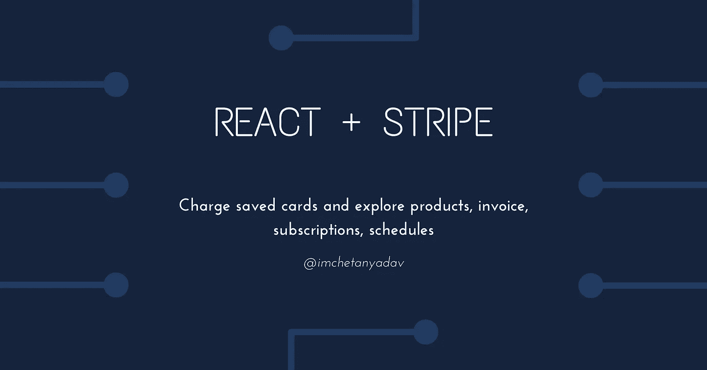

# React + Stripe —为保存的卡充值，并浏览产品、发票、订阅和时间表

> 原文：<https://javascript.plainenglish.io/react-stripe-charge-saved-cards-and-explore-products-invoice-subscriptions-schedules-27b2445b3f9e?source=collection_archive---------10----------------------->



在本系列的第二部分中，我们将使用 Stripe 为储值卡充值，深入了解 Stripe 产品、发票、订阅和时间表。

如果你不知道如何创建一个条纹客户和保存他们的卡的细节，请检查我的[以前的职位](https://imchetanyadav.medium.com/react-stripe-accept-payment-through-paymentintent-api-and-save-card-details-aa90c55fcdb2)。

# 检索保存的卡详细信息

在您的服务器上，您可以调用 stripe `paymentMethods` list 方法来检索保存的客户卡的详细信息。

```
stripe.paymentMethods.list({
  customer: data.customerId,
  type: "card",
});
```

它将返回一个具有数据属性的对象，该属性包含用户存储的卡的详细信息列表。将它传递给前端，并允许用户选择一张卡片。查看[响应结构](https://stripe.com/docs/api/payment_methods/list?lang=node)以在 UI 上显示必要的细节。

# 为保存的卡充值

允许用户选择一张保存的卡片并记下它的 id。之后，当您创建 PaymentIntent 时，将该 id 作为 payment_method 传递。你可以跟随我的[上一篇文章](https://imchetanyadav.medium.com/react-stripe-accept-payment-through-paymentintent-api-and-save-card-details-aa90c55fcdb2)学习如何通过 PaymentIntent API 向用户收费。

您还可以将该卡设定为客户的默认支付方式，以便 Stripe 在需要支付发票或订阅时使用该卡。

*   **设置客户默认付款方式**

```
stripe.customers.update(data.customerId, {
  invoice_settings: {
    default_payment_method: data.paymentMethodId,
  },
});
```

# 产品和价格

Stripe 允许您为您销售的项目或服务创建产品。创建产品后，您可以将多个价格附加到它，这允许您拥有产品的不同层级或变体，并根据用户的需求向他们收费。您可以从[仪表板](https://dashboard.stripe.com/products)或 [API](https://stripe.com/docs/api/products/create?lang=node) 创建产品。确保指定正确的定价和间隔(一次性或选择重复以获得更多选项)。一旦创建了产品和价格，请务必记下价格 id。我们需要他们向顾客收费。

# **一次性产品使用发票收费**

```
*//* Create invoice item with product price id and attach to a customer *await* stripe.invoiceItems.create({
  customer: data.customerId,
  price: data.priceId,
});// Create invoice
const invoice = *await* stripe.invoices.create({
  customer: data.customerId,
});// Finalize invoice
const finalizeInvoice = *await* stripe.invoices.finalizeInvoice(invoice.id);// Charge customer
*await* stripe.invoices.pay(invoice.id);
```

# **定期认购产品费用**

您可以通过提供客户 id 和价格 id 为用户注册订阅

```
stripe.subscriptions.create({
  customer: data.customerId,
  items: [{ price: data.priceId }],
});
```

*   **在对订阅收费之前向客户提供试用**

例如，您想在 10 天试用期后或下月初向客户收费，请相应地指定`billing_cycle_anchor`和`trial_end`。

```
stripe.subscriptions.create({
  customer: data.customerId,
  items: [{ price: data.priceId }],
  billing_cycle_anchor: data.billingStart, // specify date when billing start
  trial_end: data.trialEnd, // specify date when trial should end
});
```

*   **取消订阅**

```
stripe.subscriptions.del(data.subscriptionId);
```

您也可以指定`cancel_at`在以后取消计划

```
stripe.subscriptions.update(data.subscriptionId, {
  cancel_at: data.cancellationDate,
});
```

或者指定`cancel_at_period_end`在当前计费周期后自动取消订阅。

```
stripe.subscriptions.update(data.subscriptionId, {
  cancel_at_period_end: true
});
```

*   **升级或降级客户订阅**

有时，您的客户可能想要升级或降级他们的计划，因此您可以遵循以下方法来实现这一点。

```
// Retrieve subscription details
const subscription = await stripe.subscriptions.retrieve(data.subscriptionId);// Update subscription
stripe.subscriptions.update(data.subscriptionId, {
  cancel_at_period_end: false,
  proration_behavior: 'create_prorations',
  items: [{
    id: subscription.items.data[0].id,
    price: 'price_CBb6IXqvTLXp3f',
  }]
});
```

更改订阅通常会导致[按比例分配](https://stripe.com/docs/billing/subscriptions/prorations)。确保正确理解，并在必要时通过将`proration_behavior`设置为`none`将其禁用。

# **安排订阅变更**

有时，您希望为某个特定日期安排订阅更改，如下个月初或下一个计费周期。

在下面的示例中，订阅计划包含两个阶段:第一个阶段在特定日期结束当前订阅，第二个阶段在同一天开始新的订阅，不进行按比例分配。

```
// Retrieve subscription details
const subscription = await stripe.subscriptions.retrieve(data.subscriptionId);// Check whether subscription already has a schedule attached
let scheduleId = subscription.schedule;*//* Create a schedule if it does not exists *if* (!scheduleId) {
  const schedule = *await* stripe.subscriptionSchedules.create({
    from_subscription: data.subscriptionId,
  });
  scheduleId = schedule.id;
} *//* Update schedule *await* stripe.subscriptionSchedules.update(scheduleId, {
  phases: [
    {
      items: [{ price: data.currentProductPriceId }],
      start_date: subscription.current_period_start,
      end_date: data.nextBillingStartDate,
      proration_behavior: "none",
    },
    {
      items: [{ price: data.newProductPriceId }],
      start_date: date.nextBillingStartDate,
      proration_behavior: "none",
    },
  ],
  proration_behavior: "none",
});
```

为了正常运行，您还应该设置 [webhooks](https://stripe.com/docs/webhooks) ,以便您可以监听各种 stripe 事件并在您的门户上采取必要的措施。您可以收听的一些事件示例

*   `invoice.payment_failed`通知用户支付失败的事件，并限制用户访问，直到他们结清支付
*   `invoice.paid`付款后允许他们访问受限资源的事件
*   `customer.subscription.deleted`取消订阅后限制内容访问的事件
*   `customer.subscription.updated`验证客户是否改变了他们的计划并为他们提供正确的资源访问权的事件。

本教程到此为止。希望对你有帮助。在 insta gram[和 Twitter](https://www.instagram.com/imchetanyadav/)[上关注我，获取更多信息。](https://twitter.com/im_chetanyadav/)