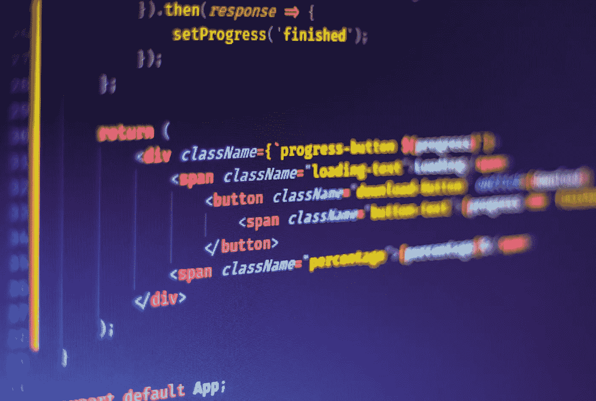

# 反应风格:CSS 与 JSS

> 原文：<https://javascript.plainenglish.io/react-styling-css-vs-jss-920ff1de98d3?source=collection_archive---------3----------------------->

Photo by [Ferenc Almasi](https://unsplash.com/@flowforfrank?utm_source=unsplash&utm_medium=referral&utm_content=creditCopyText) on [Unsplash](https://unsplash.com/s/photos/react-classes.?utm_source=unsplash&utm_medium=referral&utm_content=creditCopyText)

即使没有数百种不同的设计基础设施，也有数十种。随着 React [在前端开发领域稳步领先](https://2020.stateofjs.com/en-US/technologies/front-end-frameworks/)，人们很容易迷失在大量的支持技术和框架中。

虽然对于这些框架中哪一个更好还没有明确的共识，但我得出的结论是，在选择工具和技术时，实用性是我最重要的考虑因素。这就是我在这里的原因——分享一种实用、有效、清晰的方法，使用 Material-UI 来设计和主题化 react 组件。

准备好了吗？我们开始吧。

首先，如果你还没有，安装 Material-UI 并熟悉它们的组件和特性。

一旦你准备好了，我们将创建我们的主题对象。

Material-UI 提供了一个默认的主题对象，但是我们通常想用我们自己的颜色和样式覆盖它。我推荐在选择调色板时使用 MUI 的牛逼[调色板配置工具](https://material.io/resources/color/#!/?view.left=0&view.right=0&primary.color=ffffff&secondary.color=9C27B0)。

在您的`assets`文件夹中创建一个名为`themes.ts`的文件，并写入:

themes.ts

我们现在将在应用程序中使用主题对象。

转到你的`App.tsx`文件，用`MuiThemeProvider`包装你的应用程序:

Themed App.tsx

嘣。我们刚刚为我们的应用程序创建了一个明暗主题。

现在让我们进入正题——设计我们的组件。

Photo by [Harpal Singh](https://unsplash.com/@aquatium?utm_source=unsplash&utm_medium=referral&utm_content=creditCopyText) on [Unsplash](https://unsplash.com/s/photos/ui?utm_source=unsplash&utm_medium=referral&utm_content=creditCopyText)

MUI 允许多种方法来设计组件的样式，但是我发现使用`makeStyles`是最简单、最直接的方式。

## **下面是方法**

*   创建一个新的 react 组件(如果您使用的是 JetBrains IDE，您可以使用[这个很棒的片段](/react-functional-component-styling-made-easy-9f9e5f703a89)在一瞬间完成)
*   我们将从这个简单的组件开始，它包含一个标题和一个按钮，但是还没有样式:

Our component, before using jss to style it

我将再讨论一个主题，然后我们将在眨眼之间设计这个组件的样式。

## **语法**

`makeStyles`使用 [J](https://cssinjs.org/?v=v10.7.1) SS，一种类似 JavaScript 对象的语法，其中键是类名，值是 camel case 中的 css 规则。

它最大的优点是能够在样式化时方便地使用 JavaScript，这与我们的主题对象非常匹配。

JSS 的一个主要缺点是它与 css 语法不兼容，但是谢天谢地有一个简单的方法可以解决这个问题。

## **咱们的风格。**

最简单的样式方法是使用浏览器的元素检查器并应用 css，直到我们喜欢我们所看到的。然后我们可以将结果复制到我们的代码中。

Styling in the speed of light

然而，还有一个问题。因为我们正在使用 **JSS** 我们不能直接复制生成的 css 到我们的应用程序。这将大大降低我们的速度，并迫使我们手动解析我们的 JSS 样式。

但是如果它是手动的并且很慢——它可能是自动的并且很快。

所以我让它自动快速。

介绍[css-parser](https://nitzanmo.github.io/css-parser/)——一个帮助你轻松地把新做的 CSS 转换成 JSS 语法的工具。

使用这个工具，我们可以像闪电一样快地设计风格:

`makeStyles`返回一个`classes`对象——每个键都是一个 jss 类，我们可以在组件中使用它。
我已经将解析后的 jss 复制到了`root`类中，并在我的组件中将其用作`className`。

Our component, now styled with jss and useStyles

## **条件造型:游戏改变者**

假设我们想将标题的颜色改为随机颜色。
使用纯 CSS，这是一个几乎不可能完成的壮举。有了 JSS，我们对 javascript 了如指掌。

`makeStyles`可以带两个参数。第一个是主题对象，可以由 MUI 自动传递，第二个可以是包含状态值或组件属性等参数的`props`对象。然后，我们可以使用这些参数来设计组件的样式。

看一下这个例子:

The power of javascript when styling

我是这样做的:

我创建了一个名为`color`的新状态，并使用一个名为 [randomcolor](https://www.npmjs.com/package/randomcolor) 的简单库，在每次点击按钮时改变它。

然后，我将`color`作为道具对象传递给`useStyles`，并将`heading`类转换为一个函数，该函数使用道具对象中的随机颜色作为其颜色属性。注意，我们不必再用`theme`调用`useStyles`，因为它会自动传递。

# **结论**

JSS 非常强大。它允许样式类存在于组件中，在保持封装的同时提供上下文和区别。它还支持主题化、条件样式化和覆盖。

当然，这是以 DRY 为代价的，因为你将为你拥有的每个组件编写类，但是你总是可以在你的主题对象中抽象样式。与好的 css 相比，它也是用不同的语法编写的，但是 [css-parser](https://nitzanmo.github.io/css-parser/) 帮你搞定了。

确保使用 [rfc](/react-functional-component-styling-made-easy-9f9e5f703a89) 让你的生活轻松 10 倍，速度快 10 倍。

快乐造型！

# 更新

我创建的将 css 声明转换为 jss 声明的工具现在是多余的，因为 Google Chrome 的 devtools 现在内部支持该功能！看看这个:

Copy all declarations as JSS

*更多内容请看*[***plain English . io***](http://plainenglish.io)