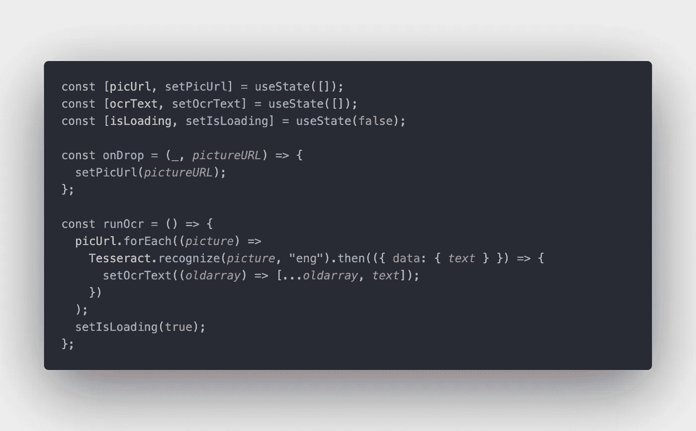

# React 宇宙魔方 OCR 教程

> 原文：<https://javascript.plainenglish.io/react-tesseract-ocr-tutorial-d72bb04b5094?source=collection_archive---------6----------------------->

鉴于 web 技术的当前状态和 web 应用程序的整体能力，许多以前具有挑战性和计算密集型的任务现在可以比以往任何时候都更容易地在浏览器上运行。OCR(光学字符识别)是我们可以考虑的任务之一。当涉及到计算能力时，这是非常苛刻的，需要花费大量的时间才能得到好的结果，并且现有的解决方案大多提供超过 1 个人的终身工作。幸运的是，提到的解决方案的一些非常强大的例子现在非常容易获得，并且非常容易使用。

但是我们为什么要在浏览器上使用 OCR 呢？这种需求的产生可能有很多原因，例如，当您想要使用浏览器从扫描的文档中提取文本时，OCR 是一个完美的选择，这非常有益；或者当我们想要自动检测隐藏在文本中的不需要的行为时，OCR 又是一个 goto 选择，或者可能是因为更简单的原因，我们在看到 IBAN 号码的截图时感到沮丧，这可能是出于多种原因发送的，以帮助我们自己。在这种情况下，OCR 可以是一个非常实用的助手。正如你所看到的，用例可能会有所不同，可以一次添加一页又一页的想法。

在今天的教程中，我将带您浏览一个 React 应用程序，您可以上传各种格式的图像，并可以应用 OCR 轻松提取文本内容。所以，如果你准备好了，让我们马上进入应用程序。

我们期望的结果将如下，该应用程序应该有功能，使图像上传和 OCR 启动可用。

该项目有两个选项，您可以继续创建自己的“create-react-app”项目，或者您可以直接从[这里](https://github.com/eren23/react-tesseract-ocr-starter)下载项目的最终版本，然后使用它一步一步地跟随教程。还提供了如何使用“创建-反应-应用程序”的指南。

如果你选择第二个选项，你可以删除不必要的文件，最终得到一个这样的文件夹结构，它仍然可以被简化，但它似乎没有默认版本那么麻烦。

如果你下载了我提供的版本，你需要做的就是在根文件夹中打开你的终端，运行下面的命令“yarn && yarn start”。“yarn”命令它会自动下载依赖项，并为您创建一个 node_modules 文件夹，因为您的应用程序现在已准备就绪，您可以简单地使用下面的“yarn start”命令来启动项目。

然而，如果你正在使用“创建-反应-应用程序”,你将需要做一些我们将在教程中使用的部分。我们将使用 3 个第三方库用于不同的目的。第一个是“tesseract.js”，它让我们只需几行代码就能轻松运行 OCR。第二个是“反应-图片-上传”，它将允许我们上传图片到浏览器，并轻松访问它们的位置。第三个是“react-spinners”，它允许我们用很少的代码创建看起来很酷的 spinners，这显然不是实现教程目的所必需的，但是在加载东西时使用这样的技术通常被认为是一个好的实践。因此，如果你使用“创建-反应-应用程序”，你可以简单地通过运行命令“纱线添加反应-图像-上传反应-spinners tesseract.js”获得这 3 个，下载完成后，你应该可以开始了。

我们要做的第一件事是清理我们的 App.js 文件，并将我们的代码分离到其他地方。

现在我们有了 App.js 集，我们可以看看我们在这里带来了什么。我们正在添加一个带有 h1 标签的分隔线和另一个分隔线。因此，由于默认样式不包含这样的 CSS 类，我们也在这里改变了我们的 CSS。让我们一步一步来看看它们。

我们添加了两个 CSS 类来创建一个平衡的外观。在第一个类中，我们创建了一个 flex 布局，我们将它的方向设置为一列，我们将项目居中，然后我们在顶部添加了一点边距，我们使用第二个类将我们的标题转换为一个 block 元素，这样它就不会与 div 的相同元素并排。

为了不从 App.js 文件中获得任何错误，我们应该创建我们的 ImageLoader 组件，现在继续创建一个 scripts 文件夹，并在 scripts 文件夹中创建一个名为 imageLoader 的文件夹，其中包含 imageLoader.js 和 imageLoader.css 文件。

在这一步之后，将代码片段放入 imageLoader.js 文件中，组件就准备好了。

由于只有两个文件需要进一步编码，分别是 imageLoadar.js 和 imageLoader.css，我将在这里复制并粘贴代码片段的图片，然后一步一步地向您解释。

这里我们导入前面提到的所需库，我们还需要导入 useState，因为我们将使用 State 钩子和 CSS 文件。

在这里，我们做了一些新的事情，你可能想仔细遵循它们。我们应该把代码片段放在返回上面，我们在这里创建 3 个状态来实现不同的目标。这里的第一个状态是从我们的 ImageUploader 组件获取图像 URL，并保存它以供进一步处理，第二个状态是我们保存 OCR 应用文本的状态，第三个状态是用于加载逻辑的状态。

每当我们的 ImageUploader 组件发生变化时，就会调用 onDrop 函数，您很快就会在下面看到该组件。所以每当发生变化，比如在我们的组件中添加或删除照片，这个功能就会被激活。onChange 事件触发后，它会将我们需要的参数放在第二个位置，所以我们可以通过放“_”来绕过第一个参数，并获取第二个参数。它有链接/链接我们的图像在它，它会带来完整的最新的链接列表，所以每当我们从我们的函数得到一个列表，我们可以安全地把它放在我们的数组。

runOcr 功能看起来很棘手，但实际上，它非常简单，我们获取 URL 状态，并为每个元素运行下面的识别脚本。函数至少接受 2 个参数，第一个是 URL，第二个是目标语言，支持 100 多种语言。在请求解决后，我们获取输出文本并将其添加到当前数组中。在我们启动 runOcr 命令后，我们可以将 Loading 设置为 true，以便显示微调器。

现在我们可以把我们的 JSX 还给这里了。因为我们想保持一切都在控制之下，并得到一个体面的外观，我们应用一些 CSS 到我们的父母 div 像这样。

现在我们可以开始将子元素添加到 div 中。在我们的 ImageUploader 组件上，我们有许多选项，比如设置最大图像大小或限制文件类型。也可以选择显示或不显示预览。

在我们调用我们的 ImageUploader 之后，我们可以创建另一个按钮来启动 OCR 过程，因为我想创建一个普通的 div 元素并对其进行样式化，而不是直接使用按钮。

我们用一个特殊的伪类设置了一些样式，以使它在悬停时有不同的行为。我们从 ImageUploader 中复制了相同的颜色和设计方法，以与设计保持一致。

在我们的按钮之后，我们有了我们的主要逻辑，它也非常直接。我们首先检查我们的 ocrText 状态中是否有任何项目，如果有，我们可以简单地创建一个无序列表，每当一个新的项目被添加到 ocrText 状态时就显示出来。我们使用项目的索引为每个项目提供一个键，并枚举每个输出。

那个部分的造型不包含任何东西，只包含一些边缘的着色和雕刻。

你看，当我们的 ocrText 状态没有任何东西时，我们会自动检查微调器，因为微调器也依赖于 runOcr 函数的触发，它不会在停留时显示任何副作用。

好了，各位，今天就到这里，希望你们喜欢。将来我会做更多像那样的教育内容。在此之前，请注意安全，保重身体。

*原为发表于***。**