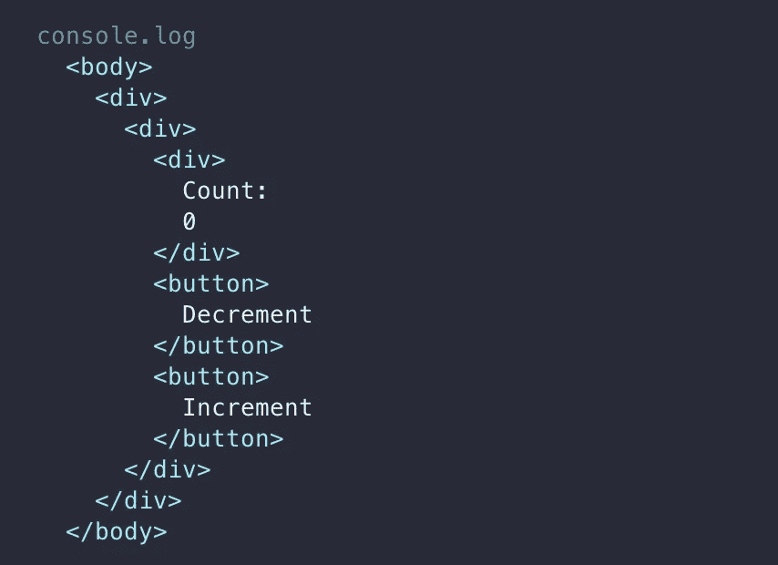

# 为什么 React 测试库不仅仅是一个测试库

> 原文：<https://javascript.plainenglish.io/react-testing-library-is-much-more-than-a-testing-library-22edd6bd45d4?source=collection_archive---------3----------------------->

## 让您的测试再次变得可靠


Photo by [Beth Macdonald](https://unsplash.com/@elsbethcat?utm_source=medium&utm_medium=referral) on [Unsplash](https://unsplash.com?utm_source=medium&utm_medium=referral)

软件开发感觉就像用有裂纹的玻璃工作一样不稳定——在这种情况下，你的应用程序中拥有的特性越多，就会产生更多的 bug(也就是裂纹)来填充测试(也就是大量的碎玻璃)。测试是把关者，在代码发布到产品之前先发制人地捕捉 bug。那么，为什么我一次又一次地发现自己在每次更新代码时都在修正旧的测试呢？以下是我的回答。

# 测试实施细节

您是否曾经因为更新了 React 应用程序中的状态键名而不得不修改测试？当您删除测试正在寻找的带有`id`的`<div>`时会怎么样呢？你是否觉得你的测试是如此的脆弱，以至于对代码的任何更新都会导致它们失败？

别担心，你不是唯一一个。无数开发者(包括我自己)陷入 [**测试实现细节**](https://kentcdodds.com/blog/testing-implementation-details) 而不是实际用户体验的陷阱。然而，我们并不是唯一应该受到谴责的当事方。像 [Enzyme](https://enzymejs.github.io/enzyme/) 这样的可用测试库公开了 API，允许我们直接修改应用程序状态，这诱使我们测试实现细节。例如，使用来自 [setState API](https://enzymejs.github.io/enzyme/docs/api/ShallowWrapper/setState.html) 的示例:

```
// Foo.js
class Foo extends React.Component {
  constructor(props) {
    super(props);
    this.state = { name: 'foo' };
  }render() {
    const { name } = this.state;
    return (
      <div className={name} />
    );
  }
}// Foo.test.js
const wrapper = shallow(<Foo />);
expect(wrapper.find('.foo')).to.have.lengthOf(1);
expect(wrapper.find('.bar')).to.have.lengthOf(0);
wrapper.setState({ name: 'bar' });
expect(wrapper.find('.foo')).to.have.lengthOf(0);
expect(wrapper.find('.bar')).to.have.lengthOf(1);
```

这个例子看起来非常简单，但是想象一下，如果您将州名更新为`firstName`而不是`name`，您的测试会立即中断，因为您的新应用程序状态对象中缺少了州名`name`。这是测试实现细节的隐藏结果。

# 为什么要测试 React 库？

[React 测试库](https://testing-library.com/docs/react-testing-library/intro/)是由 React 向导 [Kent C. Dodds](https://kentcdodds.com/) 和来自世界各地的众多知名开发人员开发的测试库。在我看来，RTL 优于其他测试库，因为它

*   阻止测试实现细节
*   模仿真实用户与组件的交互
*   自我文档
*   提供了简化编写测试的优秀工具

现在，请允许我更深入地探讨一下这些好处，并希望说服您搭乘 RTL 列车。

# 使用 React 测试库

正如我在上面提到的，测试实现细节使测试变得不可靠，并且会导致大量的管理开销。让我们看看 RTL 是如何解决这个问题的。

我们这里有一个简单的计数器，可以增加或减少显示的计数。

```
import React, { useState } from 'react';const Counter = () => {
  const [count, setCount] = useState(0);
  const increment = () => setCount(count => count + 1);
  const decrement = () => setCount(count => count - 1);
  return (
    <div>
      <div>Count: {count}</div>
      <button onClick={decrement}>Decrement</button>
      <button onClick={increment}>Increment</button>
    </div>
  );
};export default Counter;
```

对于 RTL，您的测试可能如下所示

```
import * as React from 'react';
import { render, screen } from '@testing-library/react';
import userEvent from '@testing-library/user-event';
import Counter from './counter';test('should update count when button clicked', () => {
  const { container } = render(<Counter />);
  const increment = screen.getByRole('button', {name: /increment/i});
  const decrement = screen.getByRole('button', {name: /decrement/i});
  const message = screen.getByText(/count/i);

  expect(message).toHaveTextContent('Count: 0');

  userEvent.click(increment);
  expect(message).toHaveTextContent('Count: 1');

  userEvent.click(decrement);
  expect(message).toHaveTextContent('Count: 0');
});
```

从这个例子可以看出，我们并没有直接操纵任何 app 状态；相反，我们在模仿用户如何与应用程序交互。通过这样做，我们可以自由地更新`<Counter />`组件，甚至添加新特性，而不用担心测试中断。只要我们不改变正在测试的特性的行为，这些测试将保持有效。最重要的是，像上面这样的测试是如此清晰易懂，以至于它们可以很容易地作为你的组件的文档。

**💡当我审查代码时，我总是在实际代码之前检查测试，以理解预期的行为。类似上面的测试定义了组件应该做什么的清晰规范。**

# 用户事件

你可能会注意到我们正在使用来自`@testing-library/user-event`的`userEvent` API。这不是你平时的`MouseEvent('click')`功能。我们创建 MouseEvents 与元素交互的老方法也是测试实现细节的一种形式。手动调度 click 事件不会验证元素是否是可点击的或可交互的，这将在您的产品代码中隐藏一个致命的错误。`[userEvent](https://github.com/testing-library/user-event/blob/master/src/click.ts#L116-L139)`精确模拟真实的用户交互，如果元素不可点击，它会警告你。如果这还不够，RTL 生态系统中还有一个完整的图书馆列表。

# 开发工具

开始看到它的价值了吗？

## `screen.debug() & screen.logTestingPlaygroundURL()`

有时可能很难找到您想要测试的正确元素，当我非常有信心的查询返回`null`或`undefined`时，这肯定会让我感到困惑。来自`@testing-library/dom`的`screen` API 有两个功能可以消除这方面的歧义。通过将`screen.debug()`添加到您的测试中，当测试运行时，您将能够看到呈现组件的 DOM 树，如下所示:



这将允许您在测试中准确地确定要断言的正确查询。如果这还不够明显，您可以使用`screen.logTestingPlaygroundURL()`来帮您弄清楚。该命令将返回一个生成的链接，您可以在浏览器中导航到该链接:


这就把我们带到了 React 测试库的下一个也是最后一个卖点。

## 测试操场

尽管我们开发人员喜欢编码，但有时从单调乏味的工作中休息一下，让其他工具为我们做一些繁重的工作也是不错的。这正是测试操场的用武之地。 [testing playground](https://testing-playground.com/) 是一个交互式网站，在这里你可以粘贴 DOM 树并找到你想要的元素的精确查询。您既可以粘贴来自`screen.debug()`的结果，也可以从`screen.logTestingPlaygroundURL()`的输出链接开始，选择您想要查询的元素，并将结果直接复制粘贴到您的测试中。用户界面感觉就像开发者工具中的 inspect 元素，所以开始使用该网站的全部潜力是零学习曲线。为了更加方便，还有一个[浏览器扩展](https://chrome.google.com/webstore/detail/testing-playground/hejbmebodbijjdhflfknehhcgaklhano?hl=en)可以让你与任何网站互动！

# 结论

编写测试可能没有开发新功能有趣，而且每当我们更新代码时都必须重写测试，这更让人不愉快。我们需要停止测试实现细节，开始镜像用户交互。

React 测试库使测试实现细节变得困难，并为如何正确编写测试带来了光明。我真的很喜欢使用它，我希望你也一样。😄

*更多内容请看*[*plain English . io*](http://plainenglish.io/)