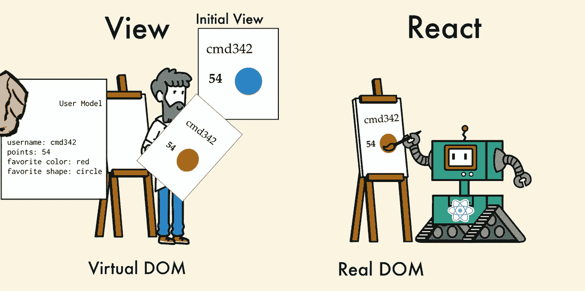
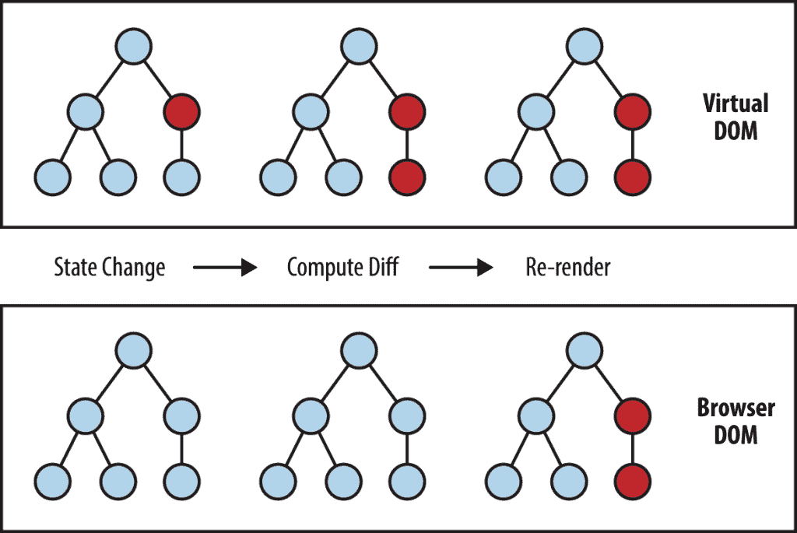
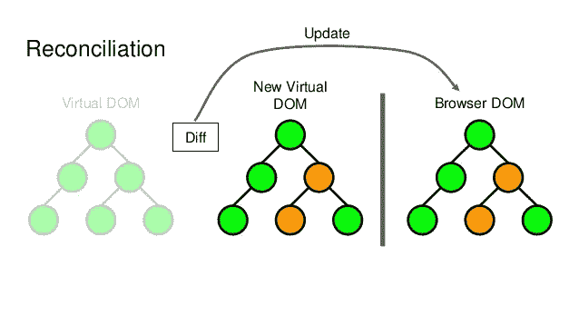
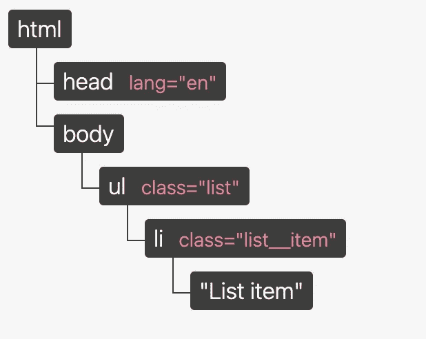
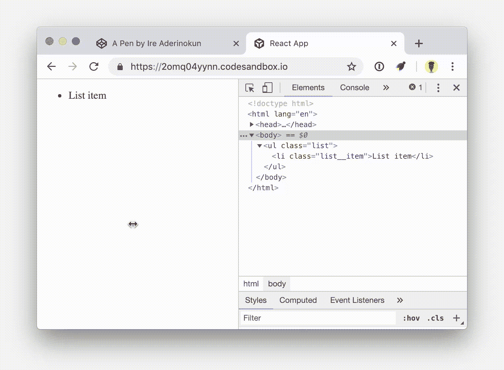

# React 虚拟 DOM 综合指南

> 原文：<https://javascript.plainenglish.io/react-the-virtual-dom-comprehensive-guide-acd19c5e327a?source=collection_archive---------4----------------------->

## 对抗浪费的 DOM 操作、协调和差分算法



# 真正的 DOM

首先，DOM 代表“**文档对象模型**”。用简单的话来说，DOM 代表了应用程序的 UI。每当应用程序 UI 的状态发生变化时，DOM 就会更新以反映这种变化。现在的问题是频繁地操纵 DOM 会影响性能，使它变慢。

# 是什么让 DOM 操作变得缓慢？

DOM 被表示为一个树形数据结构。因此，对 DOM 的更改和更新非常快。但是在更改之后，更新的元素及其子元素必须重新呈现以更新应用程序 UI。UI 的重新渲染或重新绘制是它变慢的原因。因此，UI 组件越多，DOM 更新就越昂贵，因为每次 DOM 更新都需要重新渲染。

DOM 操作是现代交互式网络的核心。不幸的是，它也比大多数 JavaScript 操作慢很多。大多数 JavaScript 框架更新 DOM 的次数比它们必须更新的次数多得多，这一事实使得这种缓慢变得更糟糕。

举个例子，假设你有一个包含十个条目的列表。你核对第一项。大多数 JavaScript 框架会重建*整个列表*。这比必要的工作量多了十倍！只有一个项目发生了变化，但其余九个项目完全按照之前的方式重建。

重建列表对 web 浏览器来说没什么大不了的，但是现代网站可以使用大量的 DOM 操作。低效更新已经成为一个严重的问题。为了解决这个问题，React 的人们推广了一种叫做虚拟 DOM 的东西。

# 虚拟世界

在 React 中，对于每个 DOM 对象，都有一个对应的“虚拟 DOM 对象”。虚拟 DOM 对象是 DOM 对象的一个*表示*，就像一个轻量级副本。虚拟 DOM 对象具有与真实 DOM 对象相同的属性，但是它缺乏真实对象直接改变屏幕内容的能力。

> 虚拟 DOM (VDOM)是一个编程概念，其中 UI 的理想或“虚拟”表示保存在内存中，并通过 ReactDOM 等库与“真实”DOM 同步。这个过程叫做[对账](https://reactjs.org/docs/reconciliation.html)。

操作 DOM 很慢。操纵虚拟 DOM 要快得多，因为屏幕上不会绘制任何东西。把操纵虚拟 DOM 想象成编辑蓝图，而不是在实际的房子里移动房间。

## 虚拟 DOM 如何更快？

当新元素被添加到 UI 时，一个虚拟 DOM 被创建，它被表示为一棵树。每个元素都是这个树上的一个节点。如果这些元素的状态发生变化，就会创建一个新的虚拟 DOM 树。然后将该树与先前的虚拟 DOM 树进行比较或“区别”。

一旦完成，虚拟 DOM 就会计算出对真实 DOM 进行这些更改的最佳方法。这确保了对真实 DOM 的操作最少。因此，降低了更新真实 DOM 的性能成本。

下图显示了虚拟 DOM 树和区分过程。



红色圆圈代表发生变化的节点。这些节点表示状态已经改变的 UI 元素。然后计算虚拟 DOM 树的先前版本和当前虚拟 DOM 树之间的差异。然后重新呈现整个父子树，以给出更新后的 UI。然后，这个更新的树被批量更新到真正的 DOM。



# React 如何使用虚拟 DOM？

现在，您已经对什么是虚拟 DOM，以及它如何帮助您的应用程序的性能有了相当的了解，让我们来看看 React 如何利用虚拟 DOM。

## **1。React 遵循可观察的模式并监听状态变化。**

在 React 中，每个 UI 都是一个组件，每个组件都有一个状态。当组件的状态改变时，React 更新虚拟 DOM 树。一旦更新了虚拟 DOM，React 就会将虚拟 DOM 的当前版本与虚拟 DOM 的先前版本进行比较。这个过程叫做**区分**。

一旦 React 知道哪些虚拟 DOM 对象已经改变，那么 React 只更新真实 DOM 中的那些对象。与直接操作真正的 DOM 相比，这使得性能大大提高。这使得 React 作为一个高性能的 JavaScript 库脱颖而出。

## **2。React 遵循批量更新机制来更新真实的 DOM** 。

因此，导致性能提高。这意味着对真实 DOM 的更新是成批发送的，而不是每次状态改变都发送更新。

UI 的重绘是最昂贵的部分，React 高效地确保了真正的 DOM 只接收批量更新来重绘 UI。

## 3.React 遵循 e **效率**差分算法

React 基于两个假设实现启发式 O(n)算法:

1.  两种不同类型的元素会产生不同的树。
2.  开发者可以用一个`key`道具提示哪些子元素在不同的渲染中是稳定的。

在实践中，这些假设对于几乎所有实际用例都是有效的。

当区分两棵树时，React 首先比较两个根元素。根据根元素的类型，行为会有所不同。

**不同类型的元素**

*   每当根元素具有不同的类型时，React 将拆除旧树并从头开始构建新树。
*   当拆除一棵树时，旧的 DOM 节点被破坏。组件实例接收`componentWillUnmount()`。当构建新的树时，新的 DOM 节点被插入到 DOM 中。组件实例接收`UNSAFE_componentWillMount()`，然后接收`componentDidMount()`。与旧树相关联的任何状态都将丢失。
*   根目录下的任何组件也将被卸载，其状态将被销毁。例如，在区分时:

```
<div>
  <Counter />
</div>

<span>
  <Counter />
</span>
```

这将摧毁旧的`Counter`并重新安装一个新的。

**相同类型的元素**

当比较两个相同类型的 React DOM 元素时，React 会查看两者的属性，保持相同的底层 DOM 节点，并且只更新已更改的属性。例如:

```
<div className="before" title="stuff" /><div className="after" title="stuff" />
```

通过比较这两个元素，React 知道只修改底层 DOM 节点上的`className`。

当更新`style`时，React 也知道只更新改变的属性。例如:

```
<div style={{color: 'red', fontWeight: 'bold'}} /><div style={{color: 'green', fontWeight: 'bold'}} />
```

在这两个元素之间转换时，React 知道只修改`color`样式，而不修改`fontWeight`。

处理完 DOM 节点后，React 然后在子节点上递归。

**递归在子节点上** 默认情况下，当递归在一个 DOM 节点的子节点上时，React 只是同时迭代两个子节点列表，并在有差异时生成一个变异。

例如，当在子元素的末尾添加元素时，在这两棵树之间进行转换效果很好:

```
<ul>
  <li>first</li>
  <li>second</li>
</ul><ul>
  <li>first</li>
  <li>second</li>
  <li>third</li>
</ul>
```

React 会匹配两个`<li>first</li>`树，匹配两个`<li>second</li>`树，然后插入`<li>third</li>`树。

如果你天真地实现它，在开头插入一个元素会有更差的性能。例如，这两棵树之间的转换效果很差:

```
<ul>
  <li>Duke</li>
  <li>Villanova</li>
</ul><ul>
  <li>Connecticut</li>
  <li>Duke</li>
  <li>Villanova</li>
</ul>
```

React 将变异每个子树，而不是意识到它可以保持`<li>Duke</li>`和`<li>Villanova</li>`子树完整。这种低效率可能是一个问题。

**使用
键**为了解决这个问题，React 支持一个`key`属性。当子树有键时，React 使用键来匹配原始树中的子树和后续树中的子树。例如，在上面低效的例子中添加一个`key`可以提高树转换的效率:

```
<ul>
  <li key="2015">Duke</li>
  <li key="2016">Villanova</li>
</ul><ul>
  <li key="2014">Connecticut</li>
  <li key="2015">Duke</li>
  <li key="2016">Villanova</li>
</ul>
```

现在 React 知道带有键`'2014'`的元素是新的元素，带有键`'2015'`和`'2016'`的元素刚刚移动了。

实际上，找到一把钥匙通常并不难。您将要显示的元素可能已经有了一个惟一的 ID，所以键可能只是来自您的数据:

```
<li key={item.id}>{item.name}</li>
```

如果不是这样，您可以向您的模型添加一个新的 ID 属性，或者散列内容的某些部分来生成一个键。该键只需在其同级中是唯一的，而不是全局唯一的。

最后，您可以将数组中某项的索引作为键传递。如果商品从来没有重新订购过，这种方法可以很好地工作，但是重新订购会很慢。

当索引用作键时，重新排序还会导致组件状态出现问题。组件实例基于它们的键被更新和重用。如果键是一个索引，移动一个项会改变它。因此，像不受控制的输入这样的东西的组件状态可能会以意想不到的方式混淆和更新。

简单来说:*“你告诉 React 你希望 UI 处于什么状态，它确保 DOM 匹配那个状态。最大的好处是，作为开发人员，您不需要知道如何在幕后进行属性操作、事件处理或手动 DOM 更新。”*

所有这些细节都是从 React 开发者那里抽象出来的。您所需要做的就是在需要时更新组件的状态，其余的由 React 负责。这确保了使用 React 时卓越的开发人员体验。

由于“虚拟 DOM”更多的是一种模式，而不是一种特定的技术，人们有时会说它有不同的含义。在 React world 中，术语“虚拟 DOM”通常与 React 元素相关联，因为它们是表示用户界面的对象。然而，React 也使用称为“纤程”的内部对象来保存关于组件树的附加信息。它们也可以被认为是 React 中“虚拟 DOM”实现的一部分。纤程是 React 16 中新的协调引擎。它的主要目标是支持虚拟 DOM 的增量呈现。

# 虚拟 DOM 看起来像什么？

“虚拟 DOM”这个名字倾向于增加这个概念实际上是什么的神秘性。事实上，虚拟 DOM 只是一个普通的 Javascript 对象。

让我们重温一下我们之前创建的 DOM 树:



这个树也可以表示为一个 Javascript 对象。

```
const vdom = {
    tagName: "html",
    children: [
        { tagName: "head" },
        {
            tagName: "body",
            children: [
                {
                    tagName: "ul",
                    attributes: { "class": "list" },
                    children: [
                        {
                            tagName: "li",
                            attributes: { "class": "list__item" },
                            textContent: "List item"
                        } // end li
                    ]
                } // end ul
            ]
        } // end body
    ]
} // end html
```

我们可以把这个对象想象成我们的虚拟 DOM。像最初的 DOM 一样，它是我们的 HTML 文档的基于对象的表示。但是因为它是一个普通的 Javascript 对象，所以我们可以自由地、频繁地操作它，而不需要接触实际的 DOM，直到我们需要的时候。

更常见的是使用虚拟 DOM 的小部分，而不是对整个对象使用一个对象。例如，我们可以处理一个`list`组件，它对应于我们的无序列表元素。

```
const list = {
    tagName: "ul",
    attributes: { "class": "list" },
    children: [
        {
            tagName: "li",
            attributes: { "class": "list__item" },
            textContent: "List item"
        }
    ]
};
```

## 在虚拟世界的掩护下

既然我们已经看到了虚拟 DOM 的样子，那么它是如何解决 DOM 的性能和可用性问题的呢？

正如我提到的，我们可以使用虚拟 DOM 挑选出需要对 DOM 进行的特定更改，并单独进行这些特定的更新。让我们回到无序列表的例子，进行和使用 DOM API 一样的修改。

我们要做的第一件事是复制虚拟 DOM，包含我们想要做的更改。因为我们不需要使用 DOM APIs，所以我们实际上可以创建一个新的对象。

```
const copy = {
    tagName: "ul",
    attributes: { "class": "list" },
    children: [
        {
            tagName: "li",
            attributes: { "class": "list__item" },
            textContent: "List item one"
        },
        {
            tagName: "li",
            attributes: { "class": "list__item" },
            textContent: "List item two"
        }
    ]
};const copy = {
    tagName: "ul",
    attributes: { "class": "list" },
    children: [
        {
            tagName: "li",
            attributes: { "class": "list__item" },
            textContent: "List item one"
        },
        {
            tagName: "li",
            attributes: { "class": "list__item" },
            textContent: "List item two"
        }
    ]
};
```

这个`copy`用于创建原始虚拟 DOM(在本例中为`list`)和更新后的虚拟 DOM 之间的“差异”。差异可能如下所示:

```
const diffs = [
    {
        newNode: { /* new version of list item one */ },
        oldNode: { /* original version of list item one */ },
        index:/* index of element in parent's list of child nodes */
    },
    {
        newNode: { /* list item two */ },
        index: { /* */ }
    }
]
```

这个 diff 提供了如何更新实际 DOM 的说明。一旦收集了所有的差异，我们就可以批量修改 DOM，只做需要的更新。

例如，我们可以遍历每个 diff，并根据 diff 指定的内容添加一个新子元素或更新一个旧元素。

```
const domElement = document.getElementsByClassName("list")[0];diffs.forEach((diff) => { const newElement = document.createElement(diff.newNode.tagName);
    /* Add attributes ... */

    if (diff.oldNode) {
        // If there is an old version, replace it with the new version
        domElement.replaceChild(diff.newNode, diff.index);
    } else {
        // If no old version exists, create a new node
        domElement.appendChild(diff.newNode);
    }
})
```

请注意，这是虚拟 DOM 如何工作的一个真正简化和精简的版本，有很多情况我没有在这里介绍。

## 虚拟 DOM 和框架

更常见的是通过框架使用虚拟 DOM，而不是像我在上面的例子中展示的那样直接与它交互。

React 和 Vue 等框架使用虚拟 DOM 概念对 DOM 进行更高性能的更新。例如，我们的`list`组件可以用下面的方式在 React 中编写。

```
import React from 'react';
import ReactDOM from 'react-dom';const list = React.createElement("ul", { className: "list" },
    React.createElement("li", { className: "list__item" }, "List item")
);ReactDOM.render(list, document.body);
```

如果我们想更新我们的列表，我们可以重写整个列表模板，并再次调用`ReactDOM.render()`，传入新的列表。

```
const newList = React.createElement("ul", { className: "list" },
    React.createElement("li", { className: "list__item" }, "List item one"),
    React.createElement("li", { className: "list__item" }, "List item two");
);setTimeout(() => ReactDOM.render(newList, document.body), 5000);
```

因为 React 使用虚拟 DOM，所以即使我们重新呈现整个模板，也只更新实际发生变化的部分。如果我们在变更发生时查看我们的开发人员工具，我们将看到变更的特定元素和元素的特定部分。



# 结论

虚拟 DOM 肯定会存在一段时间。它提供了一种很好的方法来将应用程序的逻辑从 DOM 元素中分离出来，从而减少了在 DOM 操作中产生意外瓶颈的可能性。其他库也在用同样的方法前进，进一步巩固了作为 web 应用程序首选策略之一的概念。

被称为`Dirty Model Checking`的`Angular`所使用的方法，可以说是普及了 SPAs(单页应用)概念的框架。值得一提的是，`dirty model checking`和`virtual DOM`是*而不是*互斥。它们都是针对同一个问题的解决方案，但处理方式不同。一个`MVC`框架可以很好地实现这两种技术。在 React 的例子中，它只是没有多大意义——React 毕竟主要是一个`View`库。

希望这能让你对“虚拟 DOM”感觉舒服一点。

感谢您的阅读。

*更多内容请看*[***plain English . io***](http://plainenglish.io)