# React 初学者教程

> 原文：<https://javascript.plainenglish.io/react-tutorial-for-beginners-5e91ef902c70?source=collection_archive---------9----------------------->

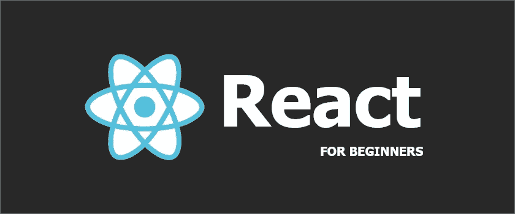

# **什么是 React？**

React 是一个由脸书维护的开源前端 JavaScript 库。

**React 是怎么用的？**

React 允许开发人员为移动或单页应用程序快速创建可重用的用户界面(UI)组件。

**你能用 React 造什么？**

社交媒体、电子商务和生产力应用程序都可以在 React 中制作，还有许多其他 UI 组件。

对于本 React 教程，我们将介绍安装过程、基本文件结构和 DOM 呈现。

**使用 React 需要什么？**

与任何其他 web 框架类似，React 需要某些本地安装的包才能正常工作。

要遵循本 React 教程，您需要:

*   安装 Node.js
*   安装 npm
*   安装和配置 create-react-app

*遵循下面的 React 教程，您不需要任何 React 经验。*

# **Node.js**

**node . js 是什么？**

Node.js 是一个后端框架，它使 JavaScript 成为一种服务器端语言，可以在 web 浏览器之外执行。

**node . js 为什么和 React 一起用？**

开发者使用 Node.js 和 React 一起创建应用的前端和后端。Node.js 处理数据存储，而 React 加载到前端的 UI 组件中。

使用 React 并不需要 Node.js，但是一起使用 Node.js 和 React 会很有帮助。

# **国家预防机制**

**什么是 npm？**

npm 是 JavaScript 的包管理器，类似于 pip 是 Python 的包管理器。

为什么 npm 与 React 一起使用？

软件包管理器 npm 允许开发人员运行 React 脚本，在浏览器中打开应用程序，编译代码，并进行部署。

它还有助于通过命令提示符安装节点程序，并管理依赖性冲突。

# **安装 Node.js 和 npm**

Node.js 和 npm 与[节点安装程序](https://nodejs.org/en/download/)一起安装。

**在 Windows 上安装节点**

*nodejs.org/en/download/—窗户安装*

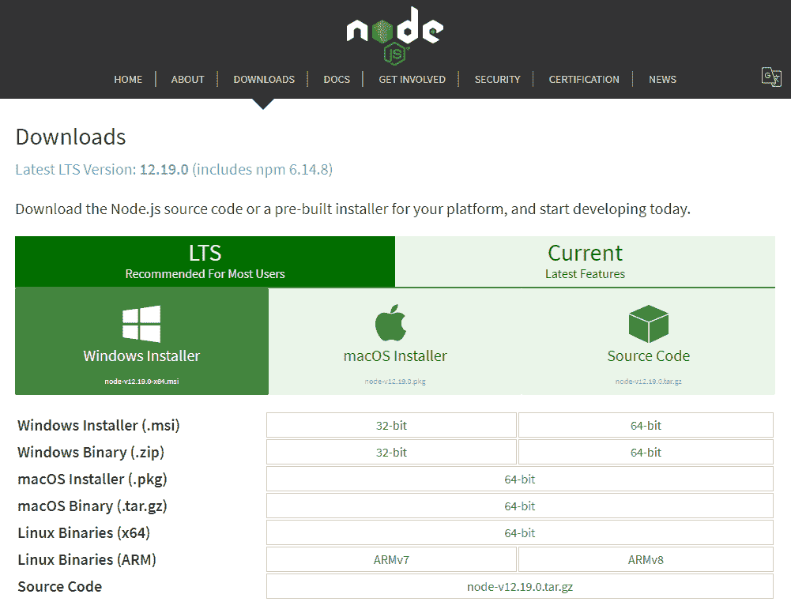

选择“窗口安装程序”并将文件下载到您的电脑。

等待文件下载完成，然后点击文件打开“Node.js 安装向导”。

完成整个“Node.js 安装向导”安装过程。

**在 macOS 上安装节点**

*nodejs.org/en/download/—MAC OS 安装*

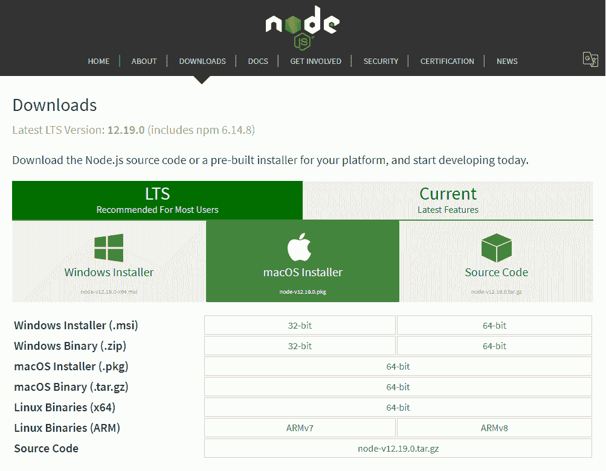

选择“macOS 安装程序”并等待文件下载。

下载完成后，在 Finder 中打开文件。

完成整个“Install Node.js”安装过程。

**检查 Node.js 和 npm 是否已安装:**

*检查版本号— Windows 命令提示符*

```
C:\Users\Owner>node -v
v12.13.1C:\Users\Owner>npm -v
6.12.1
```

*检查版本号— macOS 终端*

```
User-Macbook:~ user$ node -v
v12.13.1User-Macbook:~ user$ npm -v
6.12.1
```

安装完成后，确认安装的最简单方法是检查版本号。

在命令提示符或终端中键入`node -v`,应该会出现一个版本号。

此外，运行`npm -v`以确保 npm 安装正确。

# **创建一个 React 应用**

脸书提供了一个开源的 [create-react-app](https://github.com/facebook/create-react-app) ，附带预配置的文件和软件包。

这包括一个实时开发服务器，CSS、JSX 和 React 文件的自动编译，以及提醒开发人员代码错误的 ESLint。

我们将使用 CLI 安装 create-react-app 目录。

**为您的 React 项目创建一个文件夹:**

但首先，让我们创建一个目录来保存 React 聊天机器人项目和任何未来的 React 应用程序。

*创建一个 react 目录— Windows 命令提示符*

```
C:\Users\Owner>cd desktopC:\Users\Owner\desktop>mkdir reactC:\Users\Owner\desktop>cd reactC:\Users\Owner\desktop\react>
```

*创建一个 react 目录— macOS 终端*

```
User-Macbook:~ user$ cd desktopUser-Macbook:desktop user$ mkdir reactUser-Macbook:desktop user$ cd reactUser-Macbook:react user$
```

进入你选择的目录。

然后使用命令`mkdir.`为 React 项目创建一个新目录

在这种情况下，该目录称为`react`，位于*桌面*目录中。

在继续之前，请务必将`cd`放入新目录`react`。

**使用脸书的 create-react-app 创建应用**

*create-react-app — Windows 命令行提示*

```
C:\Users\Owner\desktop\react> npx create-react-app react-example
```

*创建-反应-应用 macOS 终端*

```
User-Macbook:react user$ npx create-react-app react-example
```

现在是时候创建你真正的 React 应用了。

运行命令`npx create-react-app`,后跟项目名称。

上面运行的命令是`npx create-react-app react-example`。

将安装一个名为 react-example 的 react 应用程序和包 react、react-dom 和带有 cra-template 的 react-scripts。

这需要几分钟时间。与此同时，起来伸伸腿。

**成功消息**

【React app 创建成功后的命令提示符/终端

```
...Created git commit.Success! Created react-example
Inside that directory, you can run several commands: npm start
    Starts the development server. npm run build
    Bundles the app into static files for production. npm test
    Starts the test runner. npm run eject
    Removes this tool and copies build dependencies, configuration files
    and scripts into the app directory. If you do this, you can’t go back!We suggest that you begin by typing: cd react-example
  npm startHappy hacking!
```

当您的应用程序创建完成时，您将会看到上面列出的成功消息。这意味着是时候在浏览器窗口中打开 React 应用程序了。

# **在浏览器中打开 React 应用**

*运行 app — Windows 命令提示符*

```
C:\Users\Owner\desktop\react> cd react-exampleC:\Users\Owner\desktop\react\react-example> npm start
```

*运行 app — macOS 终端*

```
User-Macbook:react user$ cd react-exampleUser-Macbook:react-example user$ npm start
```

用命令`cd react-example`将 cd 放入项目。

然后运行命令 npm start 在浏览器中打开 React 应用程序。

*浏览器中的 React app*

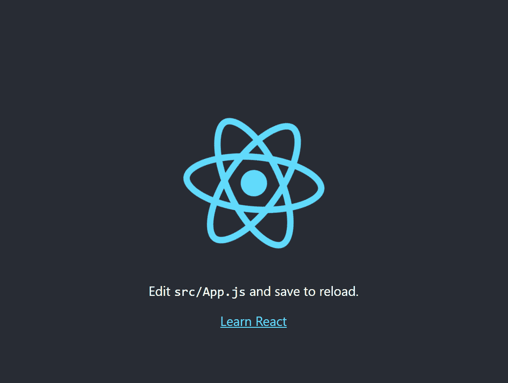

开发服务器将启动，并打开一个新的浏览器窗口，显示消息“编辑 src/App.js 并保存以重新加载”。

# **在文本编辑器中打开 React 应用**

要编辑 React 文件，您需要一个文本编辑器，如 Sublime、Notepad++或 Visual Studio 代码。

对于本教程，我们将使用[升华文本](https://www.sublimetext.com/)。

*react-Sublime 中的示例项目*

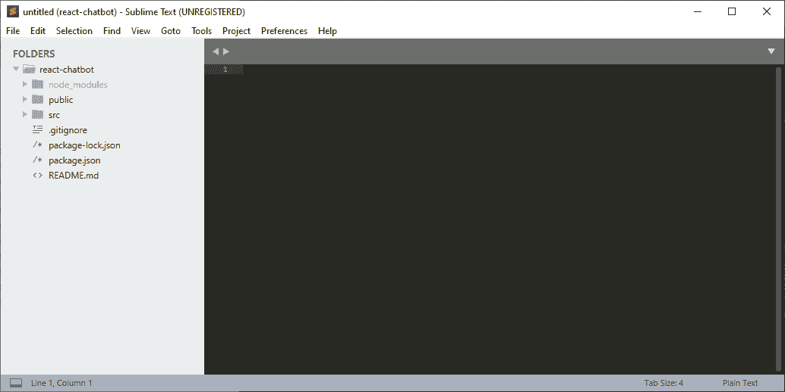

在 Sublime 文本中打开您的项目。

您应该打开项目目录 *react-example* 来查看刚刚使用命令`create-react-app`创建的文件夹和文件。

该项目包含一个 *node_modules* 、 *public、*和 *src* 文件夹以及*。gitignore* 、 *package-lock.json* 、 *package.json* 和 *READ.md* 文件。

# **了解 React 应用程序中的文件**

我们将使用的主要文件在 *src* 目录中。

但是首先，让我们转到 *package.json* 文件，看看使用`npm`运行的 React 脚本。

**packages.json**

*react-example>package . JSON*

```
...
  "scripts": {
    "start": "react-scripts start",
    "build": "react-scripts build",
    "test": "react-scripts test",
    "eject": "react-scripts eject"
  },
...
```

命令`npm start`运行脚本`react-scrips start`，脚本运行开发服务器。

**公开>index.html**

*反应过来——举例>公开>index.html*

```
<!DOCTYPE html>
<html lang="en">
  <head>
    <meta charset="utf-8" />
    <link rel="icon" href="%PUBLIC_URL%/favicon.ico" />
    <meta name="viewport" content="width=device-width, initial-scale=1" />
    <meta name="theme-color" content="#000000" />
    <meta
      name="description"
      content="Web site created using create-react-app"
    />
    <link rel="apple-touch-icon" href="%PUBLIC_URL%/logo192.png" />
    <!--
      manifest.json provides metadata used when your web app is installed on a
      user's mobile device or desktop. See https://developers.google.com/web/fundamentals/web-app-manifest/
    -->
    <link rel="manifest" href="%PUBLIC_URL%/manifest.json" />
    <!--
      Notice the use of %PUBLIC_URL% in the tags above.
      It will be replaced with the URL of the `public` folder during the build.
      Only files inside the `public` folder can be referenced from the HTML. Unlike "/favicon.ico" or "favicon.ico", "%PUBLIC_URL%/favicon.ico" will
      work correctly both with client-side routing and a non-root public URL.
      Learn how to configure a non-root public URL by running `npm run build`.
    -->
    <title>React App</title>
  </head>
  <body>
    <noscript>You need to enable JavaScript to run this app.</noscript>
    <div id="root"></div>
    <!--
      This HTML file is a template.
      If you open it directly in the browser, you will see an empty page. You can add webfonts, meta tags, or analytics to this file.
      The build step will place the bundled scripts into the <body> tag. To begin the development, run `npm start` or `yarn start`.
      To create a production bundle, use `npm run build` or `yarn build`.
    -->
  </body>
</html>
```

文件*index.html*只包含元标签和一个`<div id="root"></div>`。这个 id 就是我们的 React 应用在 index.html 的*中的位置。*

**src > index.js**

*react-example>src>index . js*

```
import React from 'react';
import ReactDOM from 'react-dom';
import './index.css';
import App from './App';
import * as serviceWorker from './serviceWorker';ReactDOM.render(
  <React.StrictMode>
    <App />
  </React.StrictMode>,
  document.getElementById('root')
);// If you want your app to work offline and load faster, you can change
// unregister() to register() below. Note this comes with some pitfalls.
// Learn more about service workers: https://bit.ly/CRA-PWA
serviceWorker.unregister();
```

打开文件 *index.js* 。您应该会看到上面列出的信息。可以把这个文件看作是应用程序的核心 JavaScript 文件。

*index.js* 渲染 HTML 文档*index.html*中 *App.js* 的 React 组件。

**src > App.js**

*react-example>src>app . js*

```
import React from 'react';
import logo from './logo.svg';
import './App.css';function App() {
  return (
    <div className="App">
      <header className="App-header">
        
        <p>
          Edit <code>src/App.js</code> and save to reload.
        </p>
        <a
          className="App-link"
          href="https://reactjs.org"
          target="_blank"
          rel="noopener noreferrer"
        >
          Learn React
        </a>
      </header>
    </div>
  );
}export default App;
```

打开文件 *App.js* 。您应该会看到上面列出的代码。

这些信息是我们运行`npm start`时在浏览器中呈现的代码。

剩余的文件将不会在本教程中使用。

# **创建一个类组件**

**src**

*react-chatbot > src*

**删除 *src* 文件夹**中除**以外的**所有文件 *index.js 和 App.js* 文件。 *index.js* 和 *Apps.js* 是我们将用来呈现 React 类组件的主要文件。

我们将从 *index.js* 和 *App.js* 开始，从那里慢慢扩展我们项目的文件结构。

**index.js(更新)**

*react-example>src>index . js(更新)*

```
import React from 'react';
import ReactDOM from 'react-dom';
import App from './App'; ReactDOM.render(<App />, document.getElementById('root'))
```

如前所述， *index.js* 是你的 React App 文件、 *App.js* 和*index.html*文件之间的连接文件。

`React`、 `ReactDOM`和 *src > App.js* 中的组件`App`被导入到文件的顶部。

React 创建存储在 *App.js 文件*中的 UI 组件，这些组件又通过`ReactDOM.render()`函数呈现在浏览器中。

该函数接受两个参数——来自 *App.js* 组件的 HTML/JSX 代码和来自*index.html*的 HTML 元素。

**App.js(已更新)**

*react-example>src>app . js(已更新)*

```
import React, { Component } from 'react';class App extends Component { }
```

React 应用程序使用*组件—* JavaScript 类或函数作为构建块来接受属性并返回 React 元素的代码。

*App.js* 导入文件顶部的`React`和`{Component}`。

那么 React 组件可以写在下面。

让我们添加使用`extend Component`语句的名为`App`的类组件。请注意，React 组件的名称总是大写的，并且必须包含 extends Component 语句。

`{ Component }`作为 React 的属性加载到文件的顶部，这样我们就可以调用`extends Component`而不是`extends React.Component`。

extends Component 语句使您的组件可以访问 React 组件的方法。使组分反应方法包括:

*   `render()`
*   `constructor()`
*   `componentDidMount()`
*   `componentDidUpdate()`
*   `componentWillUnmount()`

*react-example>src>app . js*

```
import React, { Component } from 'react';class App extends Component {
  render() {
    return (
      <div className="App">

        <h1>Hello World!</h1>
        <p>This is my first React App.</p>

      </div>
    );
  }

}
```

然后在返回中呈现一个除法元素。每个 React 组件都需要一个`render()`方法。

你应该注意到这不是一个 HTML 代码。它实际上是 JavaScript XML，通常被称为 JSX，一种组织和存储数据的标记语言。

编写类似于 HTML，大多数 JSX 元素的格式类似于 HTML 元素。然而，有几个关键的区别:

1.  JSX 使用`className`代替 HTML 属性类(即`ClassName="App"`)
2.  驼峰式值调用方法和属性(即`onClick()`)
3.  斜线位于自结束标签的末尾(即``)
4.  内联样式属性值放在曲线括号中(即`style={{color: "red"}}`)
5.  具有两个名称的样式属性是大小写混合的(即`style={{backgroundColor: "blue"}}`)
6.  包括函数、变量和属性的 JavaScript 表达式使用花括号(即`{ name }`)嵌入在 JSX 内部。

`return()`方法中的其他内容都是用普通的 HTML 编写的。

*react-example>src>app . js*

```
import React, { Component } from 'react';class App extends Component {
  render() {
    return (
      <div className="App">

        <h1>Hello World!</h1>
        <p>This is my first React App.</p>

      </div>
    );
  }

}export default App;
```

最后一段代码导出组件`App`，这样它就可以导入到 *index.js* 文件中。

**在浏览器中查看应用组件**

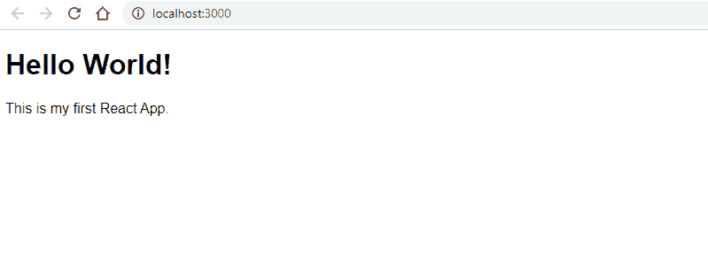

脸书的创建-反应-应用程序环境具有自动重新加载功能。

您无需刷新页面即可查看对文件所做的更新。

使用本地开发服务器转到 browser 选项卡， [http://localhost:3000/，](http://localhost:3000/,)您应该会看到上面显示的页面。

# **React 文件结构—分离 React 组件**

您可以选择向 React 应用程序添加任意数量的 React 组件。但是，将组件分开总是一个好主意，这样可以更容易地添加和编辑它们。

**创建新文件**

*react-example > src >(新文件夹)组件>(新文件)Welome.js*

```
import React, { Component } from 'react';class Welcome extends Component {
  render() {
    return (
      <div className="Welcome">

        <h1>Hello World!</h1>
        <p>This is my first React App.</p>

      </div>
    );
  }

}export default Welcome;
```

在 *src* 文件中创建一个名为 components 的新文件夹。

在这个新文件夹中，创建一个名为 *Welcome.js* 的文件。

这个文件将保存我们刚刚添加的欢迎文本。只要确保将组件`App`更改为`Welcome`即可。

**App.js(已更新)**

*react-example>src>app . js(已更新)*

```
import React, { Component } from 'react';
import Welcome from "./components/Welcome"; class App extends Component {
  render() {
    return (
      <div>

        <Welcome />

      </div>
    );
  }

}export default App;
```

现在我们可以返回到 *App.js* 文件，从文件顶部的 *Welcome.js* 导入我们的新组件 Welcome。

然后我们可以进入类`App`并使用 JSX 格式`<Welcome />`返回`Welcome`组件。这是用于引用其他组件中的组件的格式。

如果您在浏览器中回头看您的开发服务器，应用程序看起来应该还是一样的。

# **React 开发者工具**

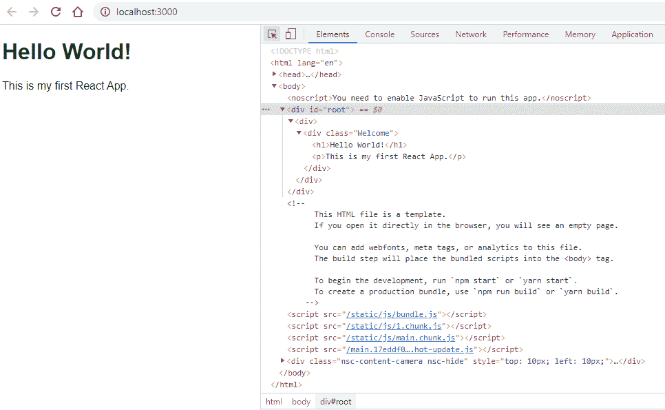

不能在浏览器开发工具中检查 React 组件。组件以 HTML 格式呈现。

要查看 React 组件，可以安装 [React DevTools for Chrome](https://chrome.google.com/webstore/detail/react-developer-tools/fmkadmapgofadopljbjfkapdkoienihi) 。这是脸书提供的一个扩展，将 React 调试工具添加到 Chrome 开发者工具中，并允许检查 React 组件层次结构。

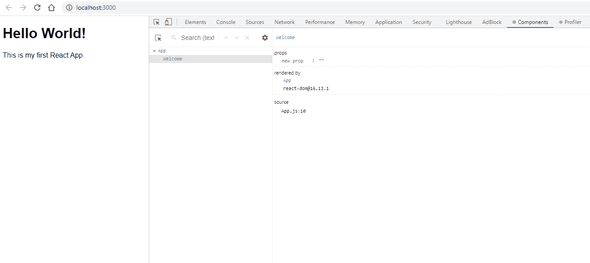

Chrome DevTools 中将添加两个标签——组件和概要分析器。

# **解决 React 中的错误**

脸书在 create-react-app 环境中添加了预建的工具 ESLinit，以帮助识别和报告 JavaScript 代码中的任何 bug 或错误。

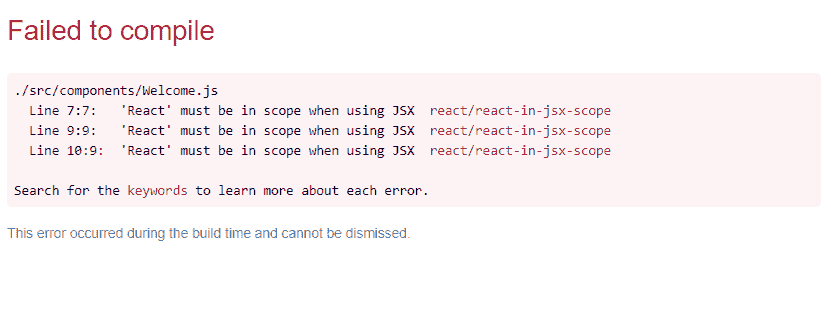

错误页提供文件名、错误的确切行号，后面是解释原因的错误消息。

*命令提示符/终端*

```
Failed to compile../src/App.js
  Line 8:7:   'React' must be in scope when using JSX  react/react-in-jsx-scope
  Line 10:9:  'React' must be in scope when using JSX  react/react-in-jsx-scopeSearch for the keywords to learn more about each error.
```

在终端或命令提示符下也会发现同样的错误。

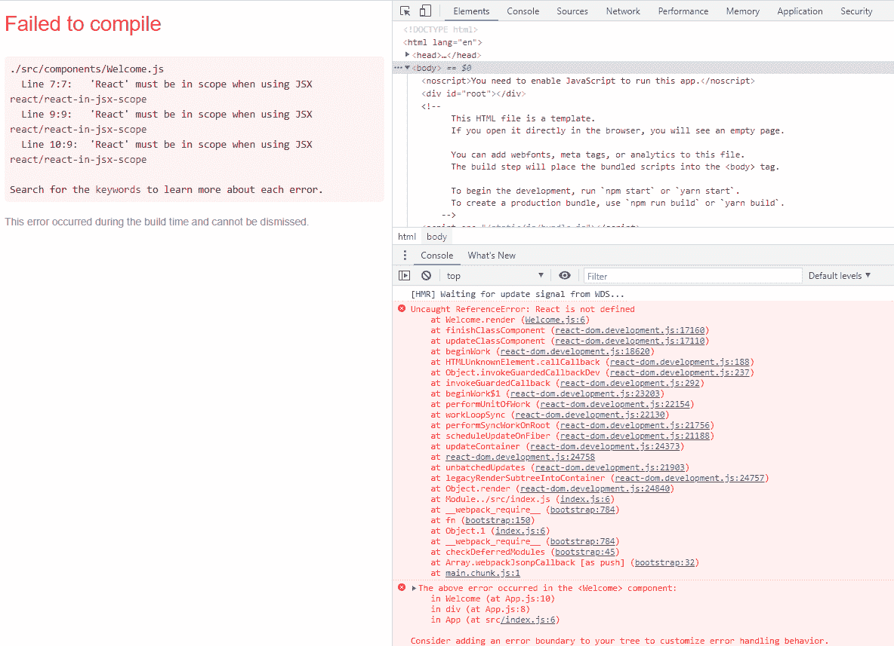

也可以在开发人员工具控制台中找到类似的错误报告。

**错误:** `**Failed to Compile. 'React' must be in scope when using JSX**`

*如果您忘记导入 React:*

```
./src/index.js
  Line 6:17:  'React' must be in scope when using JSX  react/react-in-jsx-scopeSearch for the keywords to learn more about each error.
```

*解决方案:*

```
import React from 'react';
import ReactDOM from 'react-dom';
import App from './App'; ReactDOM.render(<App />, document.getElementById('root'))
```

确保在文件的顶部导入 React。

***错误:*** `***Failed to Compile. 'Component' is not defined***`

*如果您忘记导入组件:*

```
./src/components/Welcome.js
  Line 3:23:  'Component' is not defined  no-undefSearch for the keywords to learn more about each error.
```

*解决方案:*

```
import React, { Component } from 'react';class Welcome extends Component {
  ...

}export default Welcome;
```

在页面顶部导入`{ Component }`。

***错误:***`***Failed to Compile.***`*`***Parsing error***`*

**如果你忘记给组件添加曲线括号:**

```
*./src/components/Welcome.js
  Line 1:15:  Parsing error: Unexpected token, expected "{"> 1 | import React, Component from 'react';
    |               ^*
```

**解决方案:**

```
*import React, { Component } from 'react';class Welcome extends Component {
  ...

}export default Welcome;*
```

*确保`{ Component }`在页面顶部导入。*

****错误:*** `***Failed to Compile. Attempted import error***`*

**如果忘记导出 App:**

```
*./src/index.js
Attempted import error: './App' does not contain a default export (imported as 'App').*
```

**解决方案:**

```
*import React, { Component } from 'react';
import Welcome from "./components/Welcome"; class App extends Component {
  render() {
    return (
      <div>

        <Welcome />

      </div>
    );
  }

}export default App;*
```

*确保在文件底部导出创建的组件。*

***空白页—控制台错误:** `**'Welcome' is defined but never used**`*

**如果您没有收到 ESLinit 错误，但页面仍然是空白的:**

```
*react_devtools_backend.js:2273 ./src/App.js
  Line 2:8:  'Welcome' is defined but never used  no-unused-vars*
```

*如果您得到一个空白页，请确保检查开发工具控制台。通常会列出警告。在上面的例子中，出现警告是因为在组件应用程序中没有定义欢迎组件。*

**解决方案:**

```
*import React, { Component } from 'react';
import Welcome from "./components/Welcome"; class App extends Component {
  render() {
    return (
      <div>

        <Welcome />

      </div>
    );
  }

}export default App;*
```

*确保组件被添加到`return`功能中。*

***错误:***

*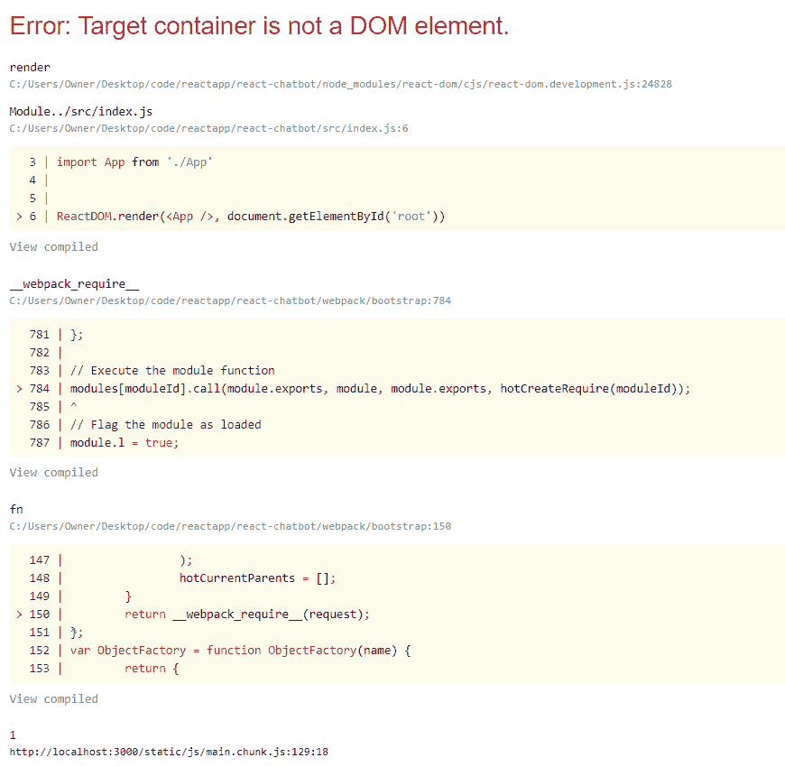*

```
*Uncaught Error: Target container is not a DOM element.*
```

*如果在*index.html*中删除 HTML `id`或者在 *index.js* 文件中重命名，就会出现上面的错误。*

**解决方案 1:**

```
*...<body>
    <noscript>You need to enable JavaScript to run this app.</noscript>
    <div id="root"></div>
</body>*
```

*看到`<div id="root"></div>`仍然在*公共>index.html*文件中。*

**解决方案 2:**

```
*import React from 'react'
import ReactDOM from 'react-dom'
import App from './App' ReactDOM.render(<App />, document.getElementById('root'))*
```

*检查 ReactDOM 呈现函数是否调用了 HTML 模板中列出的同一个`id`。*

# ***停止 React 开发服务器***

**命令提示符/终端**

```
*(Ctrl + C or Command + C)Terminate batch job (Y/N)? y*
```

*在命令提示符下使用命令 CTRL + C 或命令+ C 停止运行开发服务器。*

*然后提示会问:`Terminate batch job(Y/N)?`*

*键入`y`表示是，终止批处理作业并退出服务器。您的提示将会出现。*

**原载于*[*https://www.ordinarycoders.com*](https://www.ordinarycoders.com/blog/article/reactjs-beginners-tutorial)*。**