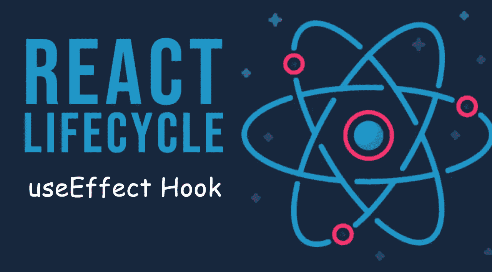

# React useEffect Hook 初学者教程

> 原文：<https://javascript.plainenglish.io/react-useeffect-hook-tutorial-for-beginners-30626402b739?source=collection_archive---------13----------------------->

## React useEffect 初学者教程，提供真实示例和日常使用模式。



useEffect hook in react

在本文中，您将学习如何在编码项目中轻松使用 useEffect 挂钩。您将了解 useEffect 参数，如何用 useEffect 钩子替换 componentDidMount()生命周期，以及更多内容。我还添加了 useEffect 钩子的不同使用模式。

假设您需要从数据库中获取一组数据，并使用它们来填充 React 应用程序。或者您需要更改页面标题或在页面加载时进行一些 DOM 操作。您可以使用 useEffect 挂钩来轻松实现这一点。

或者想象一下，一旦有人点击导航栏中的“items”选项卡，就会显示一组项目。可以使用 useEffect 钩子调用要加载的初始项目集。

[](https://levelup.gitconnected.com/learn-react-usestate-hook-a09ccf955537) [## 学习反应使用状态挂钩

### 有例子和练习

levelup.gitconnected.com](https://levelup.gitconnected.com/learn-react-usestate-hook-a09ccf955537) 

React hooks 引入了`useEffect()`方法来替换类组件的生命周期。

# 使用效果参数

useEffect 挂钩将一个**函数**作为第一个参数，将一组**依赖关系**作为第二个参数。

```
React.useEffect(function, [dependencies])
```

你可能已经读到过效果钩子让你在功能组件中执行副作用。这是真的，所以…

# 有什么副作用？

副作用基本上是组件当前执行范围之外的任何东西。它可能类似于调用 API 来填充页面。用户单击 display products 页面，后台发送一个 API 调用，将产品从数据库提取到组件中。

API 调用、身份验证调用、错误跟踪调用或任何不直接在当前执行范围内的调用都可能是副作用。

如果你熟悉类组件内部使用的 react 生命周期，那么`useEffect`钩子可以用作`componentDidMount`、`componentDidUpdate`和`componentWillUnmount`生命周期。

让我们从导入 useEffect 钩子开始

[](https://medium.com/geekculture/why-senior-developers-do-not-watch-facebook-clone-videos-and-crash-courses-like-us-9f50095e5d2b) [## 为什么高级开发者不像我们一样看脸书克隆视频和速成班

### 你看得越多，学到的越少——这是一个严酷的事实

medium.com](https://medium.com/geekculture/why-senior-developers-do-not-watch-facebook-clone-videos-and-crash-courses-like-us-9f50095e5d2b) 

# 导入效果挂钩

首先你需要导入如下效果挂钩。

```
import React, { useState, useEffect } from 'react';
```

## 代码示例

```
import React, { useState, useEffect } from 'react';
function Example() {
  const [count, setCount] = useState(0);

**useEffect(() => {    
document.title = `You clicked ${count} times`;  
});**
  return (
    <div>
      <p>You clicked {count} times</p>
      <button onClick={() => setCount(count + 1)}>
        Click me
      </button>
    </div>
  );
}
```

上面是一个非常基本的例子，只是为了理解 useEffect 功能。

这里发生的是 react 在初始呈现后更改文档标题。所以每次渲染后，`useEffect`钩子都会运行并改变标题。

# React useEffect 钩子什么时候被调用？

假设一个人点击了 react 网页。

*   首先，React 读取状态值并准备 UI
*   将 JSX 结果呈现为 HTML 格式。
*   将结果传递并提交给 DOM
*   浏览器在屏幕上创建视图
*   React 调用 **useEffect** 来运行

# useEffect 在每个渲染上都运行吗？

是的，默认行为是 useEffect 钩子在每次渲染时运行。但是我们可以改变。

我们可以修改 useEffect，使其只在特定的更改上运行。例如，我们只能在更改特定值时调用 useEffect。它将提高我们应用程序的性能(因为它减少了不必要的 useEffect 调用)。为此，我们可以将一个数组作为第二个参数传递给`useEffect`

在下面的代码中，我们将`count`作为第二个值发送给了 useEffect 钩子。所以只有在 count 变量有更新时才会调用 useEffect。

```
useEffect(() => {
  document.title = `You clicked ${count} times`;
}, [count]); // Only re-run the effect if count changes
```

如果计数从 1 变到 2，useEffect 将在渲染后再次运行，否则 useEffect 将不会执行。

让我们看看`useEffect`钩子的更多用法。

# 使用效果挂钩的不同模式/用例

*   在每个组件挂载上使用一次效果。
*   在每个组件渲染上使用效果。
*   用一个条件在每个组件上渲染 useEffect。
*   组件卸载时使用 Effect。

# 什么是安装、渲染、重新渲染

react 第一次渲染组件时会发生挂载。挂载构建初始 DOM

渲染是每次调用函数组件时都会发生的事情。它创建一组指令来创建 DOM。

重新呈现是指 React 调用一个已经挂载的组件来获取一组新的指令来构建 DOM。

# 当安装组件时

现在你知道组件安装是什么意思了。元件安装只发生一次。所以我们也可以让 useEffect 只运行一次。通过简单地将一个空数组作为第二个参数传递给 useEffect 钩子，我们可以让 useEffect 在安装组件时只运行一次。

# 在每个组件渲染上

如果你想在每一次渲染时触发 useEffect，你可以不传递任何东西作为钩子的第二个参数。

# 基于条件的组件渲染研究

您可以将依赖项集作为第二个参数传递给 useEffect 挂钩，以便有条件地运行它。如果我们传递一个变量名，useEffect 只有在变量发生变化时才会触发。该变量可以是状态值或任何变量。

# 当组件卸载时

react 中有两种 useEffect 实现。需要清理的效果和不需要清理的效果。

# 清理？？

是的，清理就像用后关上水龙头一样。如果不是这样，那就是漏水了，没有用。在 React 中，这被称为内存泄漏。

我想我们订阅了一个 API 来获取一些数据。使用完 API 后，我们应该取消订阅它。

我认为我们连接到了一个数据库，在访问和使用数据库之后，我们应该关闭数据库连接。这叫做清理。

所以我们也可以在使用效果钩子时做同样的清理。

只需在 useEffect 钩子上添加一个 return 语句，我们就可以完成清理工作。这个返回函数在一个组件被卸载后被触发。

# 最后

我已经讨论了如何使用效果钩子的流行用例。如果你理解了基本概念，使用效果挂钩就没有问题了。大多数情况下，您将来可能面临的问题只是因为在效果挂钩内部实现了复杂的逻辑和功能。

[](/beginners-guide-to-javascript-callbacks-d8195be73dc5) [## JavaScript 回调初学者指南

### 通过真实的项目代码样本学习回调的 A-Z。

javascript.plainenglish.io](/beginners-guide-to-javascript-callbacks-d8195be73dc5) 

*更多内容看*[***plain English . io***](http://plainenglish.io/)