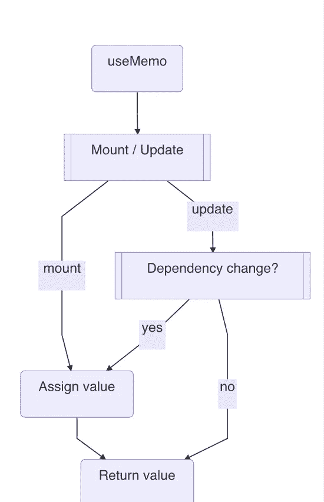

# 反应使用备忘录不是一个经典的记忆

> 原文：<https://javascript.plainenglish.io/react-usememo-is-not-a-classical-memorization-432a21d28431?source=collection_archive---------4----------------------->

为什么你不应该混淆记忆和背诵

也许这只是我，但很长一段时间，我把自己绑在一个`useMemo`和一个经典记忆之间。但实际上从对`useMemo`源代码的研究中，我讲和地发现它们非常不同，至少它们没有太多的重叠。也许他们唯一分享的就是一个偏旁的单词“memo”。

## 设计和实施

`useMemo`与`useEffect`非常接近，信不信由你，就语法、用法以及实现而言。也许我们甚至可以用一个`useEffect`来模拟一个`useMemo`的行为。

```
const Title = ({ text1, text2 }) => {
  const [textB, setTextB] = **useState**("Hello")
  **useEffect**(() => {
    setTextB(text1 + "s")
  }, [text1]) return (
    <>
      <ChildA />
      <ChildB textB={textB} />
    </>
  ) 
}
```

在前面的代码中，当`text1`改变时，它更新通过 prop `textB`发送给 ChildB 组件的`textB`。

如果你问我什么是`useMemo`，我会说就是这个想法。它希望跳过任何不相关的状态或属性更改的渲染，这样 ChildB 就不会得到不必要的渲染。如果 ChildB 是一个很重的组件或者`text1 + "s"`是一个很重的操作，这就是你为了更好的性能而改进的地方。

你可以争辩说`textB`不值得一个被动效果，它是在所有组件以异步方式渲染和刷新后收集的。当然，让我们用一个`useMemo`来替换它，它在组件标题的相同呈现下被调用。不错！

```
const Title = ({ text1, text2 }) => {
  const textB = **useMemo**(() => {
    return text1 + "s"
  }, [text1]) return (
    <>
      <ChildA />
      <ChildB textB={textB} />
    </>
  )
}
```

这个简单的接口和执行并没有改变它只是跳过渲染和有条件赋值的事实。

## 记住

现在来说说什么是识记，或者说关于缓存的一些东西。

> 记忆化是计算机程序中的一种优化技术，主要设计用于通过存储昂贵运算的结果并返回缓存的结果(如果它以前已经在相同条件下计算过)来加速过程。

以一个经典的斐波那契问题为例。递归写入成本很高，因此我们使用缓存来存储过去计算的值，以减少未来的计算。

```
const fibs = { 0: 1, 1: 1 }function fib(n) {
  if (!fibs[n]) {
    fibs[n] = fibs[n - 1] + fibs[n - 2]
  } return fibs[n]
}
```

比如在 React 应用中，我们从`n=0`开始，除非`n=1`我们不想计算新的值。我们可以添加一个`useMemo`。

```
const Title = ({ n, text }) => {
  const f = useMemo(() => fib(n), [n])

  return <div>{text} - {f}</div>
}
```

我们很快发现的第一件事是，它实际上重用了`fib`函数，这意味着它们的功能根本没有重叠。另一方面,`useMemo`不做`fib`做的事情。惊艳？

另一个发现是，标题所做的是确保当另一个道具`text`改变时，它不会再次计算`f`。但是如果我们把`n`从`3`改成`2`，它仍然从`useMemo`开始赋值。这意味着代码可以简化为以下内容。

```
const Title = ({ n, text }) => {
  const f = fib(n)

  return <div>{text} - {f}</div>
}
```

哈哈，这现在有点搞笑了。我们真的去掉了`useMemo`。为什么？因为保存的计算已经被`fib`实现了，经典的背诵。我们不能简单地利用`useMemo`，因为将`n`更改为任何其他值都会保证一个新的渲染。

问题是这里的`useMemo`是干什么用的。是的，没什么。

## 什么是使用备忘录

`useMemo`有一个仅为**先前值**构建的记忆存储器。如果你能利用它来避免一些额外的渲染，那就太好了。否则你只会让事情变得过于复杂。

不要指望`useMemo`会给你比以前更多的值。React 本身就是一个大的状态机，给定一个变化，它就移动到一个新的状态。它关心的只是未来和现在的场景。从`t-1`切换到`t`是它所关心的。但是记住所有的`t`并从`t`切换到`t-2`并不适合 React 上下文。因此`useMemo`甚至不能开始适应记忆环境。如果你真的想争辩，我们可以说 React 使用了一种非常专门的对先前状态的记忆，或者就叫它状态机。

`useMemo`的源代码不能再紧凑了，附在这里供参考。第一次渲染，它调用`mountMemo`。

```
function mountMemo(nextCreate, deps) {
  const hook = mountWorkInProgressHook()
  const nextDeps = deps === undefined ? null : deps
  const nextValue = nextCreate()
  hook.memoizedState = [nextValue, nextDeps]
  return nextValue
}
```

为了将来的更新，它调用`updateMemo`。

```
function updateMemo(nextCreate, deps) {
  const hook = updateWorkInProgressHook()
  const nextDeps = deps === undefined ? null : deps
  const prevState = hook.memoizedState
  if (prevState !== null) {
    if (nextDeps !== null) {
      const prevDeps = prevState[1]
      if (areHookInputsEqual(nextDeps, prevDeps)) {
        return prevState[0]
      }
    }
  }
  const nextValue = nextCreate()
  hook.memoizedState = [nextValue, nextDeps]
  return nextValue
}
```

从某种意义上说，`useMemo`是一个高级赋值语句，它赋予我们有条件赋值的能力。

```
const a = 1
const a = useMemo(() => 1, [])  // conditionally
```

听起来很有趣，但这就是它的全部功能。



*更多内容请看*[***plain English . io***](http://plainenglish.io)