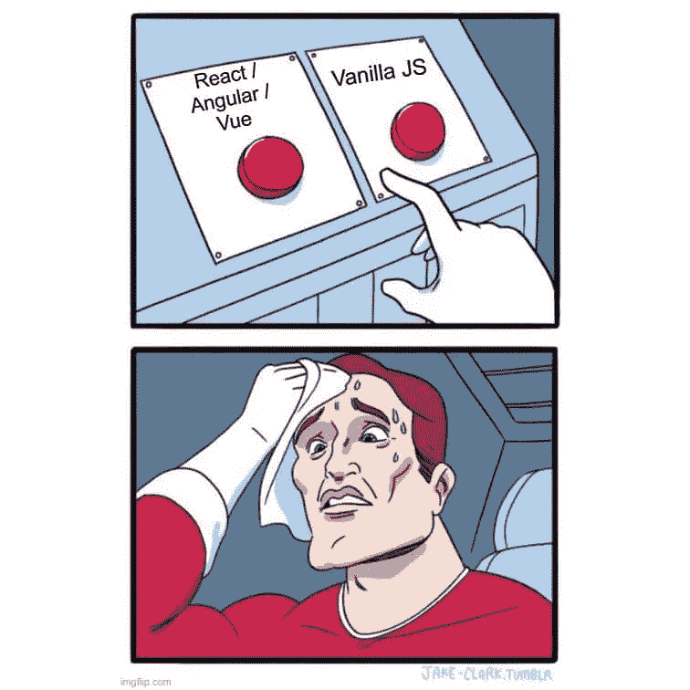

# React 与普通 JavaScript——何时使用什么？

> 原文：<https://javascript.plainenglish.io/react-v-s-vanilla-js-when-to-use-what-22a29979997c?source=collection_archive---------9----------------------->

Web 应用程序可能很复杂，可能需要很多动态功能。人们可以选择普通的 JavaScript 来构建他们的应用程序，但是如果你以前使用过普通的 JavaScript，你就会知道它会变得多么混乱。这时，像 React、Angular 和 Vue 这样的 JavaScript 框架就出现了。

在本文中，我将带您了解 React 这样的 JS 库和普通 JavaScript 之间的主要区别——何时选择哪一个，为什么？

让我们先回答两个简单的问题。

# 香草 JS 是什么？

香草 JS 只不过是没有任何外部库或框架的普通 JS。利用这一点，我们可以构建强大的跨平台应用程序。

# 什么是反应？

React 是一个用于构建用户界面的 Javascript 库。它允许我们从称为“组件”的孤立代码片段中制作复杂的 ui。

React 已经迅速成为最受欢迎的 Javascript 库之一。这完全是因为它的灵活性及其带来的性能改进。React 将 UI 分解成更小的可重用组件，这些组件可以在彼此之间移动数据。UI 的这种分解是 React 优于普通 JS 的地方。

在 Vanilla JS 中，如果应用程序很大，代码会变得很难维护，因为在这种情况下，UI 需要定期更新。这里，要改变一个 UI 元素，首先需要在 DOM 中找到该元素，然后更新它。当您只需要更新单个元素时，这很好，但是想象一下在用户需要填写的长表单上这样做。这可能非常占用内存和浏览器资源。

这就是 React 的一大特色，即它自己的虚拟 DOM。虚拟 DOM 是绕过人工工作的捷径。它是实际 DOM 的轻量级副本。它和真正的 DOM 有相同的属性，但是缺乏在屏幕上进行修改的能力。

使用现代框架的最重要也是最基本的原因是，对于普通的 JS 来说，保持 UI 与状态同步是很困难的。

# 让我们举个例子来理解这一点

*以脸书为例。比方说，在某个特定的时间，你的朋友对你的一张照片发表了评论，而你想立即看到它。你会想从喜欢帖子转移到评论或分享，而不会被拖慢。*

现在，这也可以在普通的 JS 中完成，但是您必须在代码中做的大量更改将是非常乏味的。所有这些烦人的工作都可以通过使用 React 之类的东西来避免。

基本上，有了 React，我们可以设法保持**UI 和状态彼此同步**。在 Vanilla JS 中，如果必须改变状态，就需要更新 UI。一个小错误，你的用户界面就可能与你的数据不同步。

代码组织和重用是 React 的另一个重要方面。只创建一次的组件可以多次用于不同的数据。

# 结论

您应该使用 Vanilla JS 还是 React 在很大程度上取决于您的用例。

Vanilla JS 很棒，但是在构建具有复杂动态功能的大型应用程序时，它并不是一个很好的选择。此外，它不能创建复杂和有效的用户界面。因此，如果你有一个经常变化的应用程序，有几千个页面，最好使用现代的 Javascript 框架。

另一方面，React 允许我们使用可重用的组件，并且能够保持 UI 与状态同步，这无疑可以解决这个问题。

> ***如果你喜欢这篇文章，你可能会喜欢我的其他相关文章***

*   [**使用 Pyinstaller**](https://python.plainenglish.io/create-executable-from-python-script-using-pyinstaller-40f1bb2d5e31) 从 Python 脚本创建可执行文件
*   [**软件工程师的 11 大生产力技巧**](https://medium.com/geekculture/the-top-11-productivity-tips-for-software-engineers-5e58ddb5aaa)
*   [**这些 NPM 的小把戏会让你成为一名职业选手**](/these-npm-tricks-will-make-you-a-pro-1373e7fd34f7)

*更多内容请看*[*plain English . io*](http://plainenglish.io/)