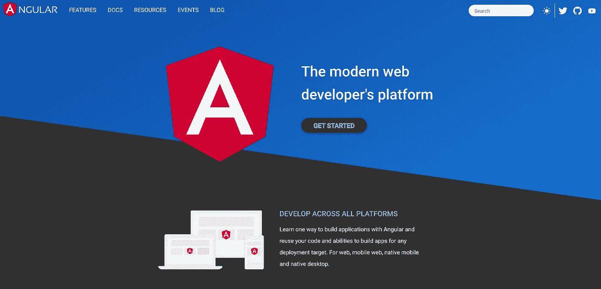
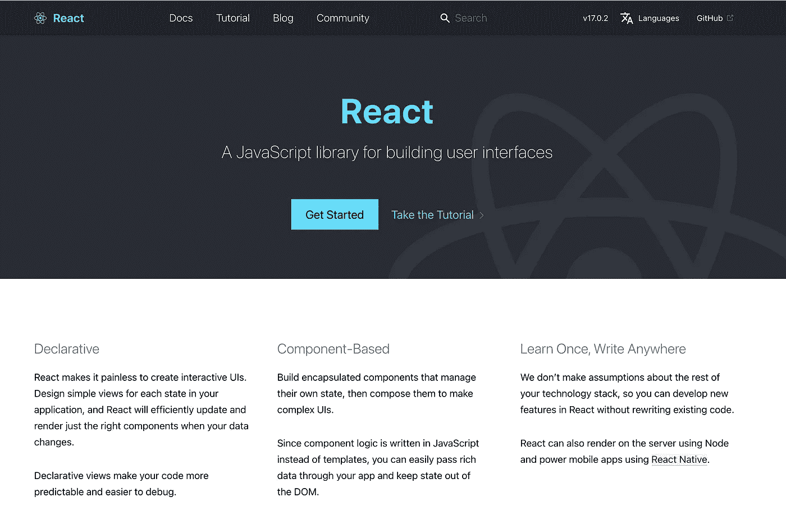
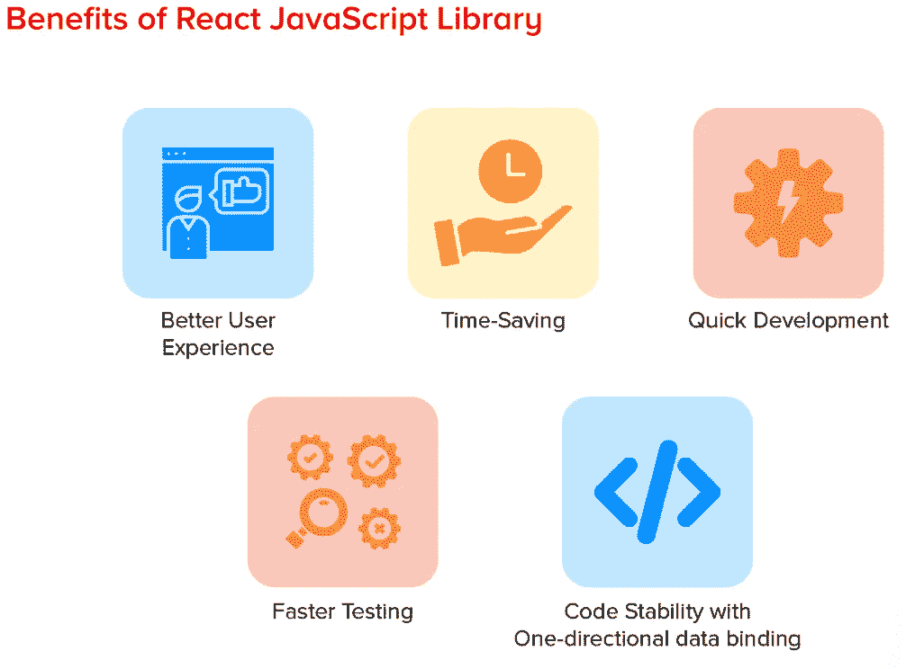
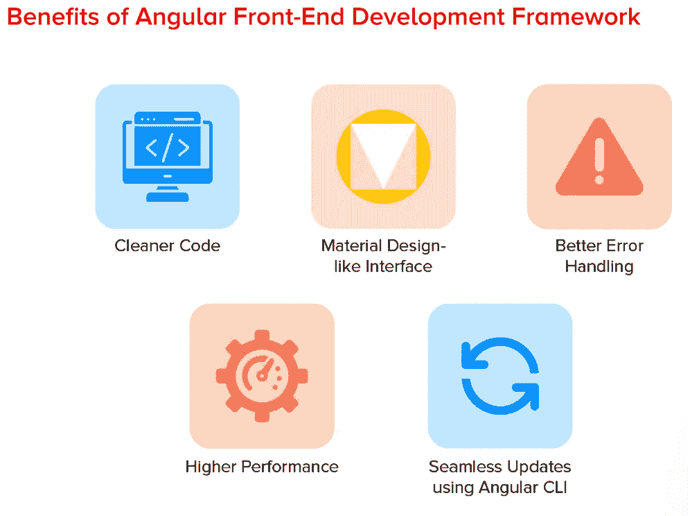
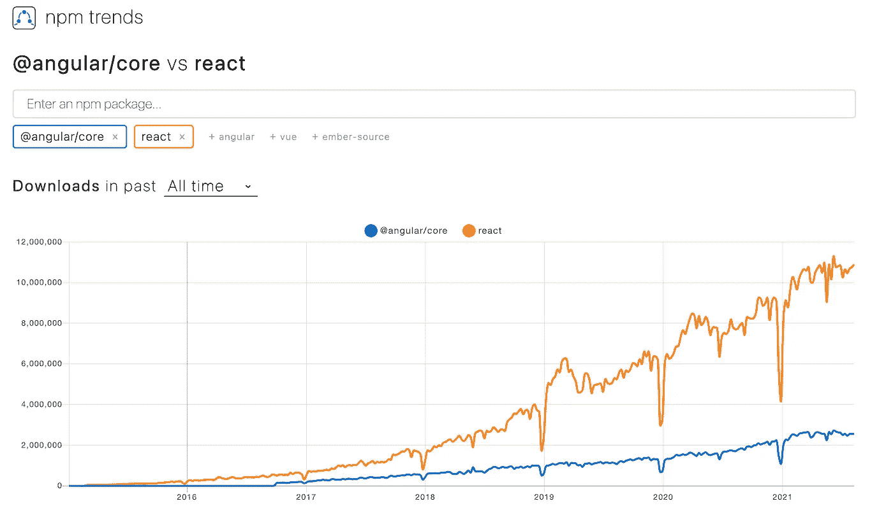
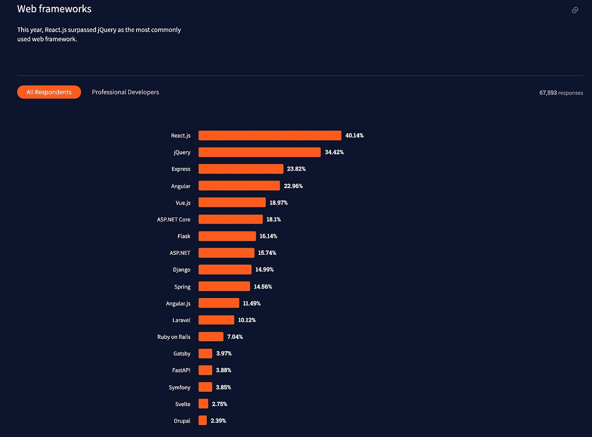
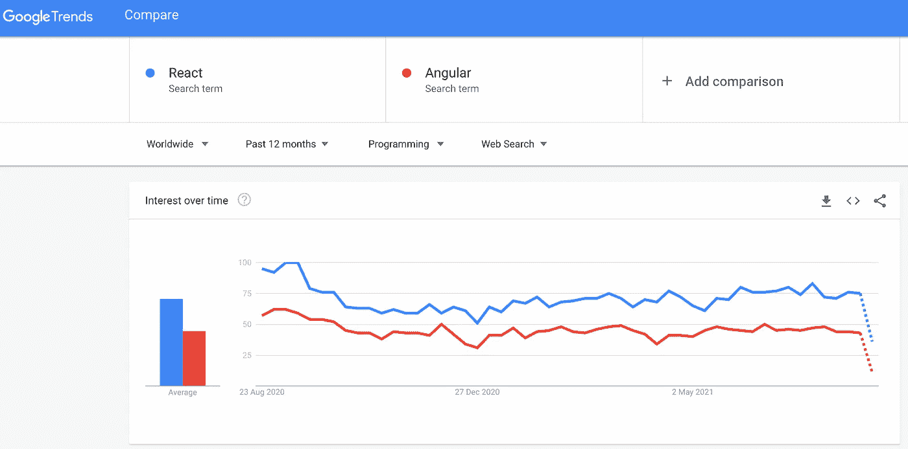
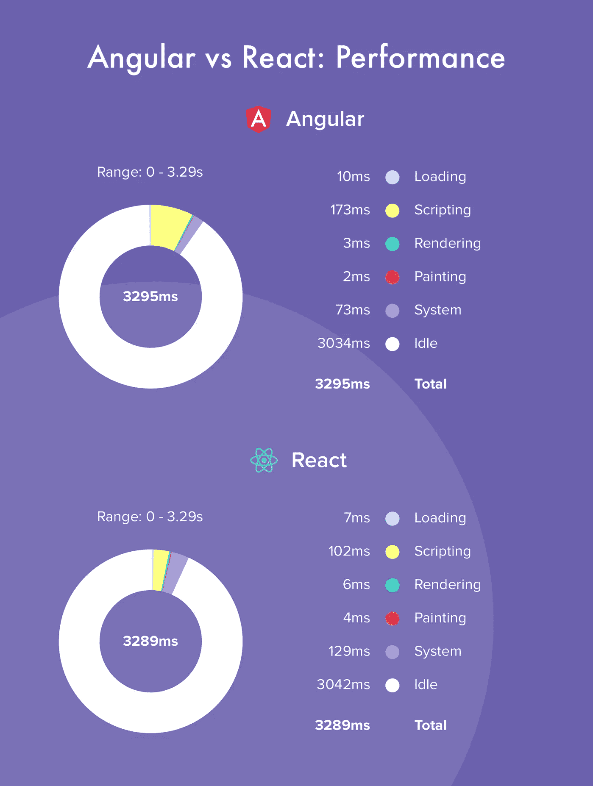
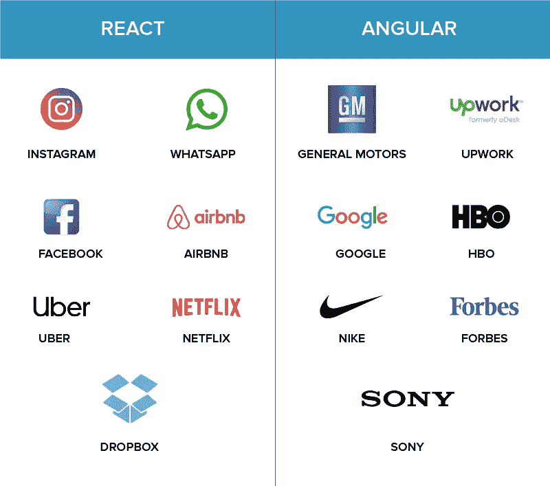

# React 与 Angular:两种前端开发方案的比较

> 原文：<https://javascript.plainenglish.io/react-vs-angular-a-comparison-between-the-two-front-end-development-options-8719025971b3?source=collection_archive---------3----------------------->

## 差异、相似性和选择技巧


从初创企业到成熟企业，每个企业都喜欢构建健壮、可靠的基于 web 的应用程序，同时尽可能快地使用一个完全加载的、功能丰富的框架。

而且，如果你正在使用 Javascript 构建一个应用程序，Angular 和 React 仍然是有史以来最流行的框架。从用户体验和性能到成本和兼容性；React 和 Angular 有几个参数成为您前端开发项目的更明智的选择。这两个框架来自两个强大的竞争对手——谷歌和脸书。

让我们仔细看看，了解它们的异同:

# 简要概述

***什么是棱角分明？*** Angular 是一个用于 web 和移动开发的开源 JavaScript 框架。它基于 TypeScript，由 Google 的 Angular 团队和 Angular 开发者社区管理。

Angular(也称为 Angular 2.0)于 2016 年 9 月推出，是对 2010 年推出的 AngularJS (Angular 1.0)的完全重写。

当时，它成为最流行的 web 框架之一。这主要是由于它的特性，如**双向数据绑定**和**依赖注入**，当然还有一个科技巨头的支持。



***什么是反应？*** 2013 年，脸书支持的 JavaScript 库 React 开源。这个框架普及了 web 开发中的一个概念，称为**基于组件的架构**，它有很多优点，比如:

*   **模块化和内聚组件**，这使得它们高度可重用，并有助于加快开发时间。
*   **用于移动开发**，允许开发者在移动应用中重用逻辑部分，只需要调整视图。
*   **易于维护和改进**，因为组件是独立的。



React 迅速席卷市场，盖过了当时的大多数框架，包括 AngularJS。因此，2016 年，由于社区对基于组件的架构的热情，谷歌升级了它的 JavaScript 框架:**他们称之为 Angular2。**



Benefits of React & Angular

# 流行

一个社区越大越活跃，它就能越快地为你遇到的任何意想不到的问题找到解决方案。

在 [Github](https://github.com/) 上，React 的库有 173k 颗恒星，Angular 的有将近 135k 颗恒星，如果我们把 AngularJS 和 Angular2 的库加起来。这表明两者背后都有一个非常大的社区，因为它们位于最受欢迎的存储库的顶端。

另一个有趣的话题是 npm ( **节点包管理器**)下载的数量。



*Number of npm downloads of Angular compared to React*

从上图中我们可以看到，自 2015 年以来，**的 npm 下载量超过了 Angular** 。数量持续增长，与 Angular 相反，Angular 趋于停滞。让我们看看 StackOverflow survey 对 Angular 和 React 是怎么说的。



*Web Frameworks Popularity (*Stack overflow survey 2021 — [https://insights.stackoverflow.com/survey/2021](https://insights.stackoverflow.com/survey/2021))

如果我们看一下 [StackOverflow 2021 调查](https://insights.stackoverflow.com/survey/2021)，我们可以观察到，关于 web 框架，40.14%的受访者更喜欢 React，而 22.96%的受访者使用 Angular。现在我们来看看 Google Trends 是怎么说 Angular 和 React 的。



从上面两张图片中，很明显 ReactJS 比 Angular 有更高的优先级，Google Trends 也说 ReactJS 是最受欢迎的库。

# 自给自足

*   React 是一个用于 UI 开发的库，所以用 React 编写的应用需要额外的库来使用。例如，Redux、React Router 或 Helmet 优化了状态管理、路由以及与 API 的交互过程。数据绑定、基于组件的路由、项目生成、表单验证或依赖注入等功能需要安装额外的模块或库。
*   Angular 是一个成熟的软件开发框架，通常不需要额外的库。上述所有功能——数据绑定、基于组件的路由、项目生成、表单验证和依赖注入——都可以通过角度包的方式实现。

# **学习曲线**

*   Angular 是一个完整的成熟框架，因此如果有人想在 Angular 上开发应用程序或项目，他们需要深入学习很多东西，如 Typescript、MVC。还有很多其他概念需要学习，如指令、模块、装饰器、组件、服务、依赖注入、管道和模板。在高级主题中，它需要学习变化检测、区域、AOT(提前)编译和 rx . js。Angular 提供了许多“开箱即用”的东西。它有严格的编码，给出了一个清晰的结构，但如果有人想进入 Angular，还有很多东西要学。
*   另一方面，ReactJs 只是一个库，因此与 Angular 相比，它需要学习的概念较少。React 使用 JSX (Javascript XML)，这是一种将 HTML 编写成 Javascript 的方法。所以我们需要知道 JSX 的语法，如何使用 Redux 编写组件、管理内部状态、配置道具、路由、状态管理。React 不会提供任何“开箱即用”的功能。React 提供了灵活性，它为开发人员提供了太多的选择，让他们无法以不同的方式完成相同的任务。在棱角分明的对比中，很容易快速学会。

# 表演

*   随着虚拟 DOM 的引入，React 的性能得到了极大的提高。因为所有的虚拟 DOM 树都是轻量级的，并且建立在服务器上，所以减少了浏览器的负载。此外，由于数据绑定过程是单向的，所以绑定不会像 Angular 那样被分配给观察者。不会产生额外的工作负载。
*   Angular 的表现更差，尤其是在复杂和动态的 web 应用程序中。Angular 应用的性能受到双向数据绑定的负面影响。每个绑定都被分配了一个观察器来跟踪变化，并且每个循环继续进行，直到所有的观察器和相关的值都被检查完。正因为如此，绑定越多，创建的观察器就越多，这个过程就变得越麻烦。不过 Angular 最近的更新在性能上有了很大的提升，再也不输于 React 了。



# 语言

*   React 基于 JavaScript ES6+结合 JSX 脚本。JSX 是语法的扩展，它使得 JavaScript 代码类似于用 HTML 编写的代码。这使得代码更容易理解，错别字也更容易发现。为了在浏览器中编译 JSX 代码，React 增加了 Babel——一个代码翻译工具。
*   Angular 可以使用 JavaScript 或 TypeScript，这是专门为大型项目开发的 JS 的超集。TypeScript 比 JavaScript 更紧凑，代码更容易导航，并且容易发现输入错误。代码重构过程也变得更加简单和快速。

# **移民和社区支持**

*   Angular 每六个月发布一次新版本或进行更新。因此，在一年中，有两个主要的版本或更新进行必要的更改。自从它发布以来，开发人员经历了如此多的突破性变化。Angular 得到了 Google 庞大而活跃的社区的支持，目前的版本是 12.1。
*   React 由脸书维护，其当前版本是 17.0。React 的升级也比 Angular 容易，因为脸书在发布新版本时，稳定性是一个主要问题，因为 Twitter 和 Airbnb 等大公司都使用 React。它也有很好的社区支持。

# 应用程序结构

*   React 的结构为开发者提供了选择的自由。React 应用程序没有“唯一正确的结构”。然而，在每个项目开始时设计应用程序结构的必要性使得开始变得更困难和更长。此外，React 仅提供视图层，而模型和控制器是通过使用其他库添加的。
*   React 应用的架构是基于组件的。代码由 React 组件组成，这些组件使用 React DOM 库呈现，并以两种方式定向:函数式(使用返回 JSX 的函数)…

```
function Hello(props){
 return <div>Hello {props.name}</div>
}
```

…和基于类的(使用 ES6 类)。

```
class Hello extends React.Component {
render() {
  return <h1>Hello, {this.props.name}</h1>;
}
```

*   Angular 的结构固定而复杂，适合有经验的开发者。角度基于三层——模型、控制器和视图。负责模型的对象由控制器初始化，并与视图一起显示。
*   应用程序代码由不同的 Angular 组件组成，每个组件编写在四个独立的文件中:实现组件的 TypeScript、定义视图的 HTML 文件、定义风格特征的 CSS 文件以及用于测试目的的特殊文件。这些文件的链接写在 app 指令中，它显示了应用程序的结构逻辑。角度组件也可以重复使用。

```
import { Component } from '@angular/core';
@Component({
  selector: 'my-app',
  templateUrl: './app.component.html',
  styleUrls: ['./app.component.css']
})
export class AppComponent { }
```

# UI 组件

*   React 的 UI 工具是由社区开发的。React 门户上有很多免费和付费的 UI 组件。要在 React 中使用材质设计组件，您必须安装一个额外的库——Material-UI 库和依赖项。
*   Angular 有一个内置的材质工具集，它提供了各种预构建的材质设计组件。有各种按钮、布局、指示器、弹出窗口和表单控件。正因为如此，UI 配置变得更加简单快捷。

# 组件和捆绑尺寸

为什么尺寸很重要？文件越小，加载速度越快。它加载得越快，排名就越高——最终，转化率(和利润)也越高。

*   **Angular** 通过在用户的 app 中不包含 Angular 框架的整个捆绑包来解决这个问题。作为构建过程的一部分，它去除了:开发工具&未使用的模块。然后，进行缩小和压缩，允许框架执行额外的优化。
*   Angular 在真实的 DOM 上工作，它遵循 MVC 模式。Angular 遵循双向数据流，与 React 相比，它的大小也很大(大约 92KB，可能会改变)。
*   作为 ReactJS 的，使用 webpack(把你的代码分割成更小的部分)、树抖动和动态导入来减少包的大小。树抖动(或死代码消除)意味着在构建过程中不使用的模块不会包含在包中。
*   通过动态导入，应用程序加载最初需要的代码，然后按需加载其余的代码。React 在虚拟 DOM 上工作，虚拟 DOM 是真实 DOM 的轻量级副本，或者我们可以说是真实 DOM 的 JS 表示。React 遵循单向数据流，其大小(大约 46KB，可能会改变)小于 Angular。

# 数据绑定

*   数据绑定代表模型和视图之间的数据同步过程。React 应该增加 Redux，它允许您处理不可变的数据，并使数据流单向。单向绑定是可预测的，这有助于调试过程。
*   Angular 处理双向数据绑定和可变数据。虽然可变和不可变数据的优势是一个热烈讨论的问题，但使用双向数据绑定肯定比使用单向方法更容易。同时，双向数据绑定会对性能产生负面影响，因为 Angular 会自动为每个绑定开发一个观察器。

Angular 中的数据绑定方式:

```
{{expression}}              Interpolation
[target]="expression"       Property
bind-target="expression"    Attribute(target)="statement"        Event
on-target="statement"       Event[(target)]="expression"     Two-way
bindon-target="expression"  Two-way
```

# **应用**

*   Angular 最广泛用于大型应用程序，如视频流应用程序或音乐乐器应用程序，因为它具有成熟的框架性质。另一方面，ReactJS 只是一个库，所以它适用于 SPA(单页应用程序)或不需要太多格式的地方。
*   Angular 被谷歌、福布斯、Youtube、Wix、telegram 等公司使用，React 被脸书、Instagram、Twitter、Airbnb、网飞、Paypal、优步等公司使用。框架和库都得到了一些世界顶级公司的支持。以下是对它的一点看法:



React vs Angular: The Brand Names Backing Them

# 成套工具

*   React 由多个代码编辑器支持。例如，React 中的代码可以用[崇高文本](https://www.sublimetext.com/)、 [Visual Studio](https://visualstudio.microsoft.com/) 和 [Atom](https://atom.io/) 进行编辑。要引导项目，可以使用 Create React App (CLI)工具。进而使用 Next.js 框架完成服务器端渲染。
*   要测试用 React 编写的整个应用程序，您需要多种工具。例如， [Enzyme](https://github.com/airbnb/enzyme) 用于组件测试， [Jest](https://jestjs.io/) 用于测试 JS 代码，React-unit 用于单元测试等等。要在开发模式下调试应用程序，可以使用浏览器扩展 React Dev 工具。另一个有趣的工具是 [React 360](https://github.com/facebook/react-360) ，这是一个用于创建 AR 和 VR 应用的库。
*   与 React 类似，Angular 也受到各种代码编辑工具的支持。例如，你可能会使用诸如 [Aptana](http://www.aptana.com/) 、 [Sublime Text](https://www.sublimetext.com/) 和 [Visual Studio](https://visualstudio.microsoft.com/) 这样的代码编辑器。使用 [Angular CLI](https://cli.angular.io/) 可以快速设置项目。在 [Angular Universal](https://github.com/angular/universal) 的帮助下完成服务器端渲染。
*   与 React 不同，Angular 可以用一个工具进行全面测试。角度端到端测试的平台有[茉莉](https://jasmine.github.io/2.0/introduction.html)、[量角器](http://www.protractortest.org/#/)和[卡玛](https://karma-runner.github.io/latest/index.html)。在开发模式下调试应用程序的另一个工具是浏览器扩展[占卜](https://augury.rangle.io/)。

# 向后兼容性

*   更新架构以添加新模块和库的可能性对每个开发人员来说都很重要。角度和反应之间的区别在于，不可能从角度 2.0 跳到 7.0。首先，您需要逐个安装版本之间的更新。
*   为什么 React 比 Angular 好？React 是一个库，它具有完全的向后兼容性。您可以将不同版本的库添加到应用程序中，并更新旧版本。
*   如果您计划通过添加新特性来逐步增强项目，React 可能是最佳选择，因为它具有绝对的向后兼容性。

# 生态系统

开源框架的伟大之处在于它们经常提供许多额外的工具或库。感谢活跃的社区和开发者，Angular 和 React 都有大量的扩展，可以用于各种各样的情况。

*   为了更容易地引导项目——Angular CLI 和 Create React App
*   对于 app 的开发 Angular 的 Ionic 和 React Native
*   对于设计事项—材料设计和材料 UI；
*   对于状态管理，Angular 使用@ngrx/store，React 使用 Redux。

# 移动解决方案

*   本世纪初，智能手机蓬勃发展。与此相关的是，出现了通过响应 UI 使 web 应用程序适应小屏幕的需求。这对这些技术提出了挑战，因为它们需要促进移动集成，同时允许开发人员继续使用他们已经熟悉的技术堆栈。
*   这些框架简化了 web 和移动应用程序之间的代码可重用性，并且它们可以提供几乎与原生应用程序一样好的运行时性能。
*   Angular 和 React 都提供跨平台的移动应用框架，尽管 Angular 没有官方对移动应用开发的支持。
*   在 Angular 中，构建移动应用程序最流行的平台是 **Ionic** 和 **NativeScript** ，而在 React 中，有一个由脸书支持的官方框架 **React Native** 。不得不提的是 **React Native 在这次**中抢尽了风头。除了最常用于移动之外，它的性能也最接近原生应用。

# 反应与角度:它们有什么共同点？

*   两者都为 web 开发提供了一个基本框架。
*   它们是基于组件的，并提供了将应用程序分解成更小组件的可能性。
*   组件的最大优点是它们可以被重用、重新组装和单独测试。
*   两个框架都为 Javascript 开发提供了成熟的经典架构。有了这个架构，*可以开发 Windows、Mac 和 Linux 的跨平台应用*。然而，与本机应用程序相比，这种架构也导致更大的应用程序和更高的资源消耗。
*   这两个框架都受麻省理工许可证的约束，因此每个人都可以免费使用。
*   他们还有一个共同点，那就是他们背后都有一个维护框架的大型社区。

# 反应与角度:选择技巧

首先，试着回答这些关于你的项目的问题，当你这样做时，将答案与你对这两个框架的了解相匹配。这个列表可能不完整，但应该足以让你开始:

*   项目有多大？
*   要维持多久？
*   所有的功能都是预先明确定义的吗？还是希望你灵活一些？
*   如果已经定义了所有的特性，那么还需要什么功能呢？
*   领域模型和业务逻辑复杂吗？
*   你的目标平台是什么？网络、移动、桌面？
*   需要服务器端渲染吗？SEO 重要吗？
*   您将处理大量实时事件流吗？
*   你的团队有多大？
*   你的开发人员经验如何，他们的背景如何？
*   有没有你想用的现成的组件库？

## 如果需要，请选择角度:

*   开发大型多功能应用程序。
*   可靠且可扩展的框架。
*   实时应用，如聊天或消息应用。
*   本地应用、mashups 或 web 应用是长期的、实质性的投资项目。
*   在 CLI 选项中包含捆绑包预算，当应用捆绑包大小超过预先确定的值时，该选项会通知开发人员。换句话说，当你想要调整应用程序的大小时，选择 Angular 是正确的决定。
*   应用程序的复杂性应该从低到中。
*   用 TypeScript 编程，面向对象编程，你的团队有 Java，C#和 Angular 以前版本的经验。

## 如果需要，选择“反应”:

*   轻量级现代企业级应用程序，并且您的开发团队拥有 CSS、HTML 和 JavaScript 方面的经验。
*   网站开发的灵活工作和安全解决方案。
*   开发跨平台或单页面应用程序。
*   扩展现有应用程序的功能。
*   强大的社区支持和解决方案。

最终，React vs Angular 完全是个人喜好的问题，是技巧和习惯的问题。作为一名编程初学者，从 React 开始可能会受益更多。作为一名有经验的开发人员，您只需继续使用您更了解的东西。

希望你今天学到了新东西。感谢阅读！:)

*更多内容看*[***plain English . io***](http://plainenglish.io/)