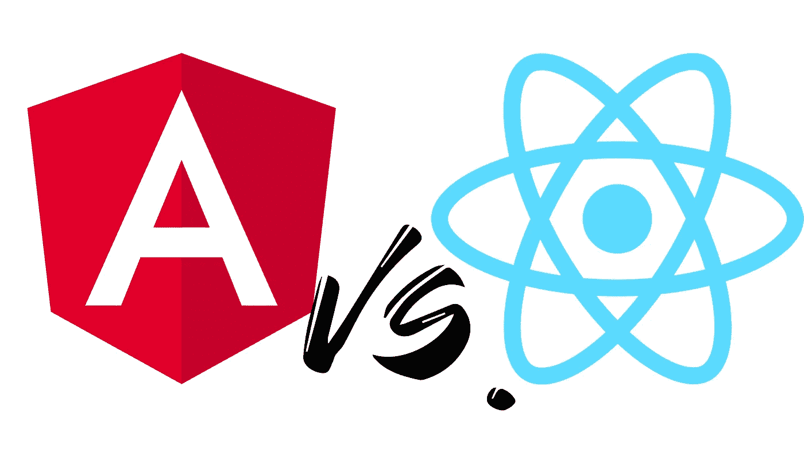

# 反应与角度:完全相反的心态，用视觉表达

> 原文：<https://javascript.plainenglish.io/react-vs-angular-a-radical-opposition-in-mindsets-621524d6fefa?source=collection_archive---------7----------------------->

Two logos tell a visual story

Angular 还是 React.js:学哪个最好？哪一个最适合用于一个项目？最重要的是，这两种解决方案之间的结构和根本区别是什么？
我从 2016 年开始与 Angular 合作，从 2019 年开始与 React 合作(我说的 Angular 是指 Angular 2 和更高版本，不是 AngularJs)。对我来说，虽然这两者服务于相似的目的，但是用它们来编码感觉完全不同。
需要强调的第一点是，Angular 通常用于 Gmail 和谷歌产品、微软 Office Online、UpWork、索尼和福布斯。而 React 则在脸书、Instagram、网飞、Dropbox 和优步使用。所以 Angular 和 React 都是有很强参考性的成熟解决方案。然而，这些名称讲述了两个非常不同的世界的故事，并提供了两种解决方案之间潜在差异的第一个线索。

## 体现在视觉上的哲学差异

徽标讲述了一个类似的故事。Angular 的标志是一面盾牌，象征着坚固和安全。另一方面，React 的标志是一个原子。如果你把 React 和原子的语义结合起来，你会得到一个爆炸，一个原子反应。安全的对立面。

这两家公司的内部使命声明显示了同样的对立。Angular 创立的谷歌，宗旨是“不作恶”。React 的诞生地脸书希望“快速行动，打破常规”。在谷歌听起来非常守法的地方，脸书的内部座右铭散发出叛逆的坏男孩气息。他们的两个解决方案(Angular 和 React)体现了这两种心态。使用这两种解决方案的公司反映了这种心态:可靠和明智的公司被吹捧为有棱角的，而 React 冠军则具有破坏性。如果你把这翻译成角色扮演的术语，Angular 会有一个合法的良好排列，并做出混乱的中性反应。

## 什么结构？

就内部结构而言，同样的对立也适用:在反应侧没有预先强加的结构。在 Angular 中，有一个源自 MVC(模型视图控制器)模型的编码和命名约定。文件系统结构反映了这一点，每个模块都有一个文件夹，在模块文件夹中，我们为每个组件都有文件夹。并且必须遵循所有这些来编译应用程序。

React 没有 MVC 结构，只有直接渲染代码的函数(至少如果我们使用的是功能组件的话)。*如何*构建代码和文件系统完全由开发人员决定。

## 实际影响

在实践中，角度和反应有什么不同？根据我的经验，结构上的差异导致更大的组件和更大的角度范围，而 React 有助于更集中的组件。重用组件在 Angular 中也更复杂，而在 React 中这样做只需要很少的努力。

因为 Angular 是一个成熟的框架，具有更大的范围(它提供了更多现成的功能，如路由或国际化或双向状态管理)和预定义的结构，所以它有一个更陡峭的学习曲线。

另一方面，React 是一个集中的库，结构更少，范围更小，更容易学习，因为需要学习的内容更少，至少最初是这样。你可以在一个下午内涵盖主要概念。这种一心一意的专注也给了它更大的灵活性。

Angular 提供安全性和结构，React 提供敏捷性和速度。

## 我推荐哪一个？

首先，我建议先学习 JavaScript 和 TypeScript，然后再学习这两种语言。一旦这样做了，如果你*能*，两者都学。如果你不能，我的建议将取决于你的性格特征，你的风险厌恶程度，以及你需要多少结构。

如果你需要标准化和安全的东西，我会建议 Angular。如果你需要行动和灵活性，我会推荐 React。如果你想在银行部门发展事业，或者想要一个稳定的工作环境，那就选择 Angular 吧。

如果你更愿意在一家一切都朝四面八方发展的初创公司工作，我推荐 React。

两个都是不错的选择，但只有你自己能回答哪一个最适合你想去的地方。

*更多内容尽在*[***plain English . io***](http://plainenglish.io)