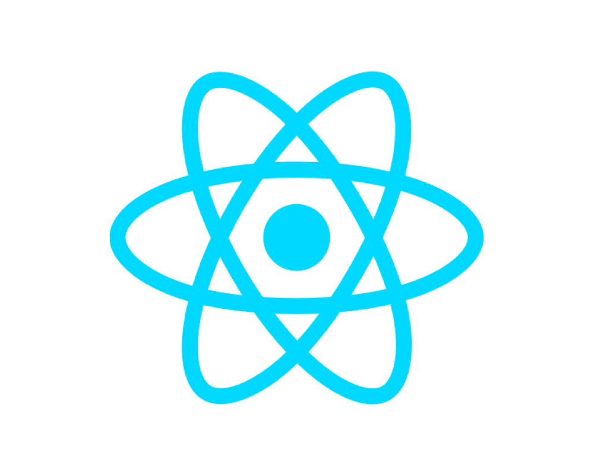

# React 与 Angular:哪一个为你的应用程序提供了最好的 UI 组件？

> 原文：<https://javascript.plainenglish.io/react-vs-angular-which-one-offers-the-best-ui-component-for-your-app-232ff31d34f?source=collection_archive---------5----------------------->

选择合适的 JavaScript UI 框架来构建您的应用程序可能是一个挑战，如果您使用不符合 web 标准的东西，您可能无法获得尽可能多的受众。

有很多选择，其中两个最受欢迎的突出的框架是 Angular 和 React。两者都提供了创建优秀应用程序的基本功能，但也有其局限性。

在本文中，我们将讨论 Angular 和 React 之间的主要区别，以便您可以找到符合您的项目需求的正确解决方案。

# **什么是棱角分明？**

Angular 是 2010 年发布的开源 web 应用框架，此后成为市场上最受欢迎的基于 JavaScript 的前端框架。

**其知名度包括:**

*   依赖注入
*   双向数据绑定
*   HTML 作为模板语言
*   它有一个简单易学的语法，可以编译成 JavaScript 代码

如果你正在考虑在你的项目中使用 AngularJS，在做出决定之前权衡利弊并联系顶尖的 [**Angular 开发公司**](https://www.pixelcrayons.com/javascript-development/angularjs-development) 是很重要的。

> **使用角形的利弊**

*   将 Angular 与标准 JavaScript 开发进行比较，为开发人员快速开发应用程序提供了一个优秀的平台。此外，编码效率要高得多，用户体验也得到了增强。
*   凭借数据绑定功能，Angular 管理控制器和视图之间的数据交互。因此，它提供了更高程度的可测试性，并支持与其他库或框架的交叉兼容性。
*   它的模型-视图-控制器架构使得构建在 Chrome 或 Firefox 浏览器支持的所有平台上流畅运行的 web 应用变得容易。
*   在线文档提供了使用其基本功能和相关应用程序示例的清晰说明，以便开发人员可以更快地编写复杂的应用程序。

> **使用角度的缺点**

*   如果同时修改多个组件，很难将旧代码移植到 Angular 中。
*   学习曲线也可能很陡，这取决于你以前的 web 开发经验——当出现问题时，它并不总是直观的。

# **什么是 React？**

React 是 ReactJS 的缩写，是脸书在 2013 年开发并发布的开源 JavaScript 库。该公司为支持脸书的移动客户端应用而创建，并使用它来构建 Instagram 和 WhatsApp 等其他应用，用户总数超过 10 亿。自发布以来，React 已经成为当今在 web 上创建用户界面最流行的框架之一。

> **使用 React 的优点**

*   这个开源框架为开发复杂的应用程序提供了解决方案，其简洁的用户界面可以跨多个平台移植。
*   使用 Javascript 和 HTML 以及 CSS，开发人员可以轻松地创建单页应用程序，无需重新加载页面或在查看应用程序的一部分时刷新另一部分。
*   它还具有内置功能，允许开发人员根据服务器上实时存储的数据设计用户界面。
*   开发人员不必重新加载页面来查看他们所做的更改。
*   它有一个单向的数据流，这意味着在应用程序的一个部分所做的任何改变都会自动反映到其他地方。
*   许多开发人员发现编写 React 代码比在传统的 HTML 文件中编码更容易，甚至比使用 Handlebars 或 Twig 等模板语言更容易。
*   需要的代码越少，错误就越少，主要是如果您使用结构良好的组件。

> **使用 React 的缺点**

*   React 的学习曲线并不平缓。
*   它是一个库，所以与框架相比，特性的数量是有限的。

这是 Angular & React 的一个简洁的演示。我希望到现在为止，您已经清楚地知道它们是什么，以及它们如何证明对开发 JavaScript 项目有益。

**现在让我们详细比较一下这两个 Javascript UI 组件:**

# **什么时候应该选择 Angular 而不是 React？**

Angular 是一个很棒的 web 框架，有很多令人兴奋的特性。举几个例子，它帮助你创建可重用的组件，这些组件可以跨应用程序访问。Angular 还为其模块提供了模块化和可重用性。它维护一个应用程序状态，这使得它是可预测的，并提供一个定义良好的架构。

还有呢？它还支持双向数据绑定，这意味着无论何时应用程序中的数据发生变化，应用程序的每个组件都会自动更新，而无需您做出任何努力。

它节省了大量的时间和精力，因为每当有变化时，您不必手动更新每个组件。使用 Angular 框架的唯一缺点是它们附带了大量的文档，使得学习变得困难。

最终，它非常适合开发大规模、功能丰富的功能应用程序。所以，当你想接触到 web 开发的以下方面时，你可以选择 Angular。

*   多重特征
*   更低的内存占用
*   平稳测试
*   双向数据绑定

# **什么时候应该选择 React 而不是 Angular？**

React 提供了一种逻辑方法，将复杂的 ui 分解成更小的、可重用的组件。而且它是一个轻量级的库，所以在内存方面并不占太多空间。这也意味着它可以与许多其他库和框架集成。

社交媒体巨头脸书在其网站上使用 React，所以你可以肯定它的开发者知道他们在做什么。他们利用自己的专业知识和创造力，创建了一个任何人都可以使用的易于使用且记录良好的框架。

React 非常适合开发现代 web 应用程序。总的来说，你可以借助 React 开发公司**访问 React，了解 web 开发的以下方面。**

*   **数量有限的功能**
*   **使用方便**
*   **高渲染性能**
*   **单向数据绑定**

****遗言****

**React 和 Angular 都有许多重叠的特征和一些显著的差异。虽然 React 非常适合与少数开发人员或设计人员一起开发小型应用程序，但 Angular 将帮助大型团队更好地协作，并更快地交付结果。**

**然而，由于两个框架都在不断发展，很难预测它们的未来。我希望这个博客能帮助你为你的项目选择一个最兼容的。**

# ****常见问题解答****

****问题:什么是 UI 框架？****

****答:**UI 框架，也称为前端框架，是一种编程语言的扩展或补充，帮助开发人员为其应用程序实现和组装用户界面。**

**使用 JavaScript 前端框架，您可以构建一个功能性界面，而不需要 HTML 或 CSS 方面的特殊培训。许多框架都提供了构建移动应用和桌面网站的工具。**

**大多数都是开源的，这意味着你可以免费使用它们。由于专门的专家和爱好者维护他们，他们通常会定期收到新功能和错误修复的更新。**

****问题:我的项目还可以考虑哪些 UI 框架？****

****回答:**尽管 React 和 Angular 仍然高居榜首，但其他突出的车型包括:**

****Vue.js:** 它是一个著名的渐进式框架，用于构建可以在任何现代浏览器中运行并与 Node.js 无缝协作的用户界面。它具有基于组件的架构、双向数据绑定、计算属性以及更多开箱即用的功能。**

**由于良好的文档和 Github 或 Vue School 上提供的大量初学者工具包，学习曲线非常平缓。对于习惯于 Angular 或 React 等框架的开发人员来说，Vue.js 会感觉类似，但更容易掌握，而且不会牺牲性能。如果你正在寻找一个能让你快速简单地构建原型的框架，Vue.js 可能正是你所需要的！**

**Ember.js: 它是一个开源的客户端 JavaScript 框架，用于创建雄心勃勃的 web 应用程序，轻松处理大流量。它提供了一些高级功能和强大的工具，比如命令行构建系统和自动化依赖注入，这使它有别于其他流行的框架，比如 Backbone.js 或 AngularJS。**

**由于其强大的功能和专家的强大支持，对于希望创建具有丰富用户体验的大容量应用程序的开发人员来说，它是一个极好的选择。**

****Aurelia:** 这是一个免费的开源 JavaScript 框架，适用于移动、桌面和网络平台。Aurelia 具有现成的功能，并有可扩展的 HTML 模板，易于定制。它还支持 Web 组件标准。**

**Aurelia 提供了许多流行的库，如 TypeScript、RxJS 等。，开箱即用的图表，以及通过扩展现有类或创建新类来创建自定义插件的简单方法。**

**许多现成的模式可以通过 aurelia-pal 获得，这是一个 aurelia 的可插拔库，它可以添加包，而不需要核心文件。使用 aurelia 可以减少高达 90%的开发时间，它得到了 SAP、Pivotal Software 或 Scania 等公司的支持。**

## **进一步阅读**

** [## 可扩展的 UI 组件

### 我最近受命为 bit.cloud 平台构建一个用户卡组件。我还负责建造…

比特云](https://bit.cloud/blog/extendable-uis-how-to-build-better-uis-for-developers-l1jkl1pc) 

*更多内容请看*[***plain English . io***](https://plainenglish.io/)*。报名参加我们的* [***免费周报***](http://newsletter.plainenglish.io/) *。关注我们关于*[***Twitter***](https://twitter.com/inPlainEngHQ)[***LinkedIn***](https://www.linkedin.com/company/inplainenglish/)*[***YouTube***](https://www.youtube.com/channel/UCtipWUghju290NWcn8jhyAw)***，以及****[***不和***](https://discord.gg/GtDtUAvyhW) *对成长黑客感兴趣？检查* [***电路***](https://circuit.ooo/) ***。*******