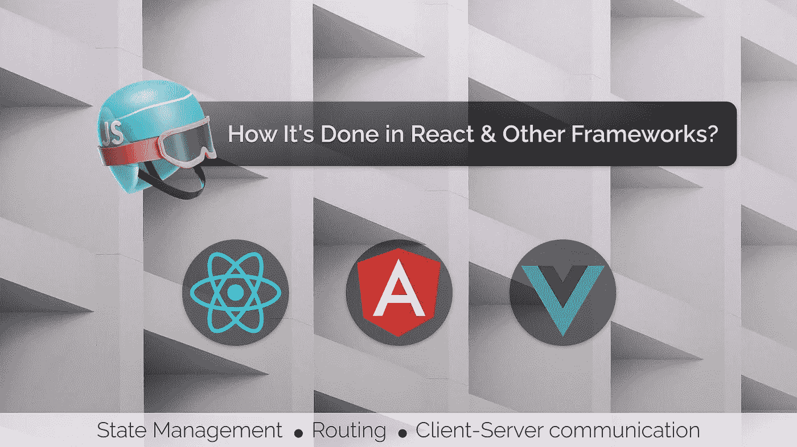
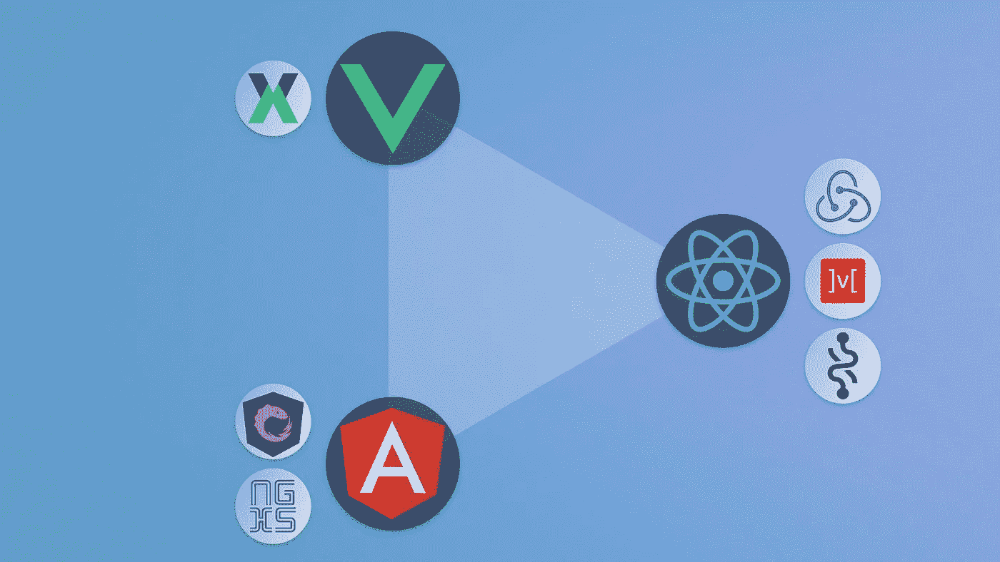
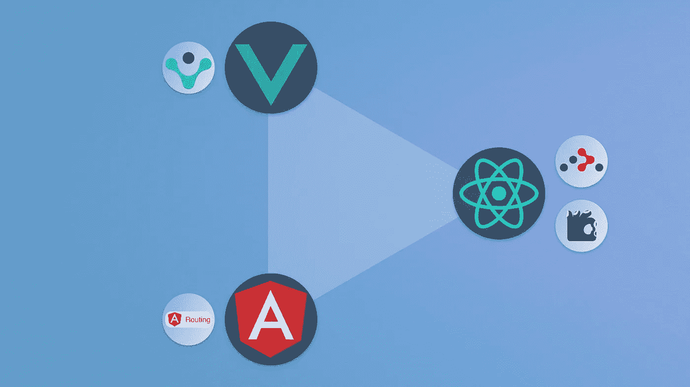
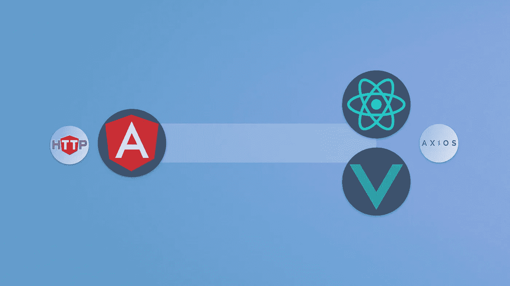

# React 与其他框架:三个方面的比较

> 原文：<https://javascript.plainenglish.io/react-vs-other-frameworks-a-comparison-in-3-aspects-756ab84b8d95?source=collection_archive---------3----------------------->

## 状态管理、路由和客户端-服务器通信

React 是一个很棒的库，可以创建迷人的网站和令人兴奋的 web 应用程序。但与 Angular 和 Vue 相比，它是最没有主见的开发库。因此，应用程序的构建和结构的选择是由开发人员决定的。对于一个成熟的开发团队来说，这是一种有利的方法，但对于初露头角的开发人员、学习者和 React 世界的新手来说却不是。有些选择很容易做出，有些则不容易。它可能因项目的类型和规模而异。

我们将通过与其他真实框架进行比较，分析 React 在状态管理、路由和客户端-服务器通信方面必须提供什么。

# 状态管理

State Management Libraries

简单地说，**状态管理是一种跨组件/文件共享数据的方式，以在它们之间创建清晰的通信。**有 5 种不同类型的状态可用。

1.  **数据状态——由状态管理库处理的业务和逻辑数据**
2.  通信状态-通过 API 端点来自服务器的通信数据，由`[React Query](https://react-query.tanstack.com/)`和`[SWR](https://swr.vercel.app/)`处理
3.  控制由状态挂钩和其他表单库处理的状态表单数据
4.  会话状态——由 React 上下文、本地存储、会话存储和 cookies 处理的应用程序范围的数据
5.  位置状态-由 URL 处理的当前页面的位置数据

在这里我们将看到 React、Angular 和 Vue 如何处理**数据状态**来管理 app 的业务逻辑。

Angular 是 JavaScript MVC 框架的先驱，它使用内置的解决方案来管理状态，而不依赖于第三方包。它有两个解决方案。那些是`[NGXS](https://www.ngxs.io/)`和`[NGRX](https://ngrx.io/)`。NGXS 是一种对开发人员更友好的方式，因为它是 Angular 的状态管理模式+ **库。另一方面，NGRX 对于 Angular 来说是一个 Redux 执行，但是对于企业应用程序来说更重要。**

Vue 有自己的状态管理库，名为`[Vuex](https://vuex.vuejs.org/)`。它是 Vue 的状态管理模式+ **库。它有助于在整个应用程序中被动地存储和共享数据，而不会牺牲其性能。**

React 有无数的状态管理库。它还有一个名为 React Context 的内置解决方案来管理小规模应用程序的状态。

## 反应上下文

React 上下文提供了一种通过组件树传递状态的方法，而不必在每一层手动向下传递属性。您可以在组件的任何级别使用任何状态，而无需通过组件属性进行深入研究。主要用于管理主题、语言和其他有状态数据。

## 第三方库

React 第三方状态管理库可以分为三类。这些都是通过遵循不同的架构模式来执行不同的状态管理方式而开发的。这些库主要用于开发中型到企业级的应用程序。

*   通量(`[Redux](https://redux.js.org/)`，`[Zustand](https://zustand.surge.sh/)`)
*   代理(`[Mobx](https://mobx.js.org/)`，`[Valtio](https://valtio-demo.pmnd.rs/)`)
*   原子(`[Recoil](https://recoiljs.org/)`、`[Jotai](https://jotai.pmnd.rs/)`)

此外，还有像`[Akita](https://datorama.github.io/akita/)`、`[Baobab](https://github.com/Yomguithereal/baobab)`和`[XState](https://xstate.js.org/docs/)`这样的框架不可知的库，它们是为了迎合 React、Angular、Vue、Svelte 和 Vanilla JS 而开发的。

对于 React 开发人员来说，选择最佳且有效的选项来管理状态是最耗时的决策。这也可能会影响开发者的体验和整个应用的可扩展性。

# 按指定路线发送

Routing Libraries

路由是单页面应用程序(SPA)中的另一个重要元素，**有助于在不刷新页面的情况下从一个视图动态导航到另一个视图**。因为所有这些框架都是客户端的，所以它们不会去服务器获取新页面。但是它们通过显示和隐藏对应于在相应路线中定义的特定组件的显示部分来执行路线选择。

Angular 和 Vue 内置了路由器来处理普通路由、嵌套路由、重定向、参数传递等。这是非常方便的，当谈到在这两个路由。另一方面，React 没有任何内置的路由解决方案。他们有维护良好的第三方包，如`[React Router](https://reactrouter.com/)`和`[Wouter](https://github.com/molefrog/wouter)`。React 路由器主要用于执行所有路由和与路由相关的功能。

# 客户端-服务器通信

Client-Server Communication

客户端-服务器通信是通过**从浏览器向 REST 端点发送异步 HTTP 请求以从服务器获得响应来完成的**。它是最重要的工具，可以使用户界面充满数据，从而使应用程序更有意义。

Angular 提供了一个名为`[HTTP Client](https://angular.io/api/common/http/HttpClient)`的模块，允许应用程序执行典型的 API 调用。令人惊讶的是，React 和 Vue 都使用`[Axios](https://github.com/axios/axios)`，一个基于 promise 的库来消费和显示来自 API 的数据。`[Fetch](https://github.com/andris9/fetch)`在这里也可以使用，但是 Axios 由于其声明性的方法而被开发者更多地使用。

# 结论

之所以将 React 称为一个库而不是一个框架，是因为与其他内置工具捆绑在一起的框架相比，React 在开发应用程序时可以独立做出上述选择。因此，我们有各种不同的工具来开发任何类型的应用程序，从小规模到大规模使用 React。这些工具根据功能性和非功能性需求制定了开发应用程序的多种方法。因此，我们可以同意 React 对于初学者来说是一部苦乐参半的交响乐，对于有经验的开发人员来说是一部快乐的过山车。

感谢您阅读文章。

**看看这个**👇

 [## 如何在 2021 年为你的下一个 React 原生项目选择最好的库

### 最佳 React 原生库搜索指南。

javascript.plainenglish.io](/how-to-choose-the-best-library-for-your-next-react-native-project-in-2021-44a12ef4ca17)  [## 5 个对 React 本地开发人员有用的用户界面库

### 利用用户体验的独特用户界面库

javascript.plainenglish.io](/5-useful-user-interface-libraries-for-react-native-developers-d74e99f67da1)  [## React 本机应用的趋势存储选项

### React 本地生态系统中存储数据的不同方式的详细视图

javascript.plainenglish.io](/trending-storage-options-for-react-native-developers-8671fbffb686) 

*更多内容看* [*说白了. io*](http://plainenglish.io/) *。报名参加我们的* [*免费每周简讯*](http://newsletter.plainenglish.io/) *。在我们的* [*社区*](https://discord.gg/GtDtUAvyhW) *获得独家写作机会和建议。*