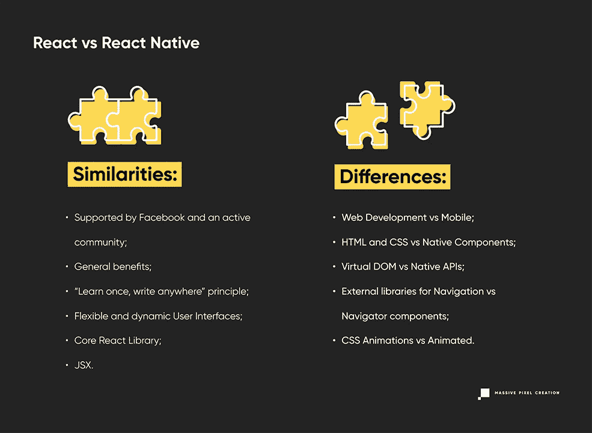

# React vs React Native:终极比较

> 原文：<https://javascript.plainenglish.io/react-vs-react-native-the-ultimate-comparison-97735240e30b?source=collection_archive---------16----------------------->

尽管它们拥有相同的名字，并且都是由脸书发明的，但它们是不同的技术，最适合不同的使用案例。继续读下去，看看哪些情况最有利于你，如果不是必要的话。

# 反应

## 这是什么？

React 是一个开源的 JavaScript 库，通常用于 web 开发，尤其是构建用户界面。它是由**脸书在 2011 年开发的**用于增强复杂的单页面应用程序的性能。这是通过引入**虚拟 DOM、**一个文档对象模型的虚拟表示来实现的，它充当更新和呈现的临时树。一旦完成了所有的更改，虚拟 DOM 就会计算出更新和呈现真实树的最有效方式。由于在真实 DOM 上完成的更新数量更少，web 应用程序的性能变得更高。

React 的另一个不可否认的优势在于**声明性的、可重用的组件**管理它们自己的状态，这显著地**加快了开发过程**。这一过程往往也被描述为相当无痛、平稳和毫不费力。结果，React 成为最受欢迎的技术之一。如今，它被网飞、优步、亚马逊、推特、Pinterest 和许多其他科技巨头使用。

## 利益

React JS 在 web 开发中如此受欢迎的原因还有几个，也是 React 开发服务不断增长的原因，但是让我们把重点放在最重要的几个上:

*   **交互式用户界面**由于可重复使用的用户界面组件，
*   **由于 React 的虚拟 DOM，可以实现高性能**，
*   干净的抽象层另外**方便了**的**开发过程**，
*   **单向数据流保证了代码的稳定和调试的容易**，
*   许多有用的开发工具使开发人员的生活变得更加容易，
*   脸书和一个活跃的大型社区的支持使 React 经得起未来的考验，
*   React 是 SEO 友好的，这转化为巨大的商业利益。

## 不足之处

没有什么是完美的，即使 React 真的尽力了。让我们看看它的不足之处:

*   快速的开发步伐会让一些开发者望尘莫及，
*   React，作为一项不断扩展的技术，**缺少本应伴随每次更新的适当文档**，
*   由于 React 只负责 UI，**可能需要涉及其他技术，**
*   JSX，一种允许 HTML 和 JavaScript 混合的语法扩展，**由于其复杂性对一些开发人员来说可能是麻烦的**。

# 反应自然

## 这是什么？

**React Native 是一个用于** **跨平台移动开发**的 JavaScript 框架。这意味着你只需要一个代码库就可以为 Android 和 iOS 设备构建移动应用，减少了所需的人力，节省了金钱和时间。

**由脸书开发，于 2015 年发布，**其主要目标是通过跨多个平台重用代码，让移动开发变得更简单、更快速、更高效。结果，维护和支持也受到了影响，为开发人员提供了更流畅的体验。

不过，重要的是要记住，使用 React Native **你不能制作完全原生的移动应用程序，尽管有这个名字。但除非需要一个真正的原生移动应用，否则 React Native 应该会做得很好，特别是因为最重要的部分可以用 Java、Kotlin、Swift 或 Objective-C 编写。**

## 利益

要了解 React Native 为什么被微软、Discord、Shopify、[以及其他许多公司](https://stackshare.io/react-native)热切使用，让我们仔细看看 React Native 的最大优势。

*   它可以用来**改进现有应用程序的代码**或者从头到尾创建一个全新的移动应用程序，
*   **两个平台的维护更容易**因为共享的代码库，
*   React Native 使用流行的 JavaScript，因此更容易介绍给新团队或新团队成员，
*   在 React Native 中，在渲染过程中使用了原生组件，这给了移动应用一种真正的原生感觉
*   快速刷新确保**实时反馈，**立即显示对代码所做的更改，
*   由于使用了图形处理单元(GPU ), react 原生应用程序具有更快的性能。

## 不足之处

如果事情好得不像真的，那它就不是真的。谢天谢地，React Native 有一些缺点。

*   **React Native 仍处于测试阶段，**因此可能会出现兼容性和调试问题，
*   由于缺少组件，您的**可能需要使用** **外部库、**
*   可能需要额外的**原生平台知识**。

# 反应 vs 反应本地

正如上面所证明的，React 原生框架完全是另一个怪物,“React，but for mobile”的标题不仅仅是误导。要真正理解这两种技术的区别，让我们更深入地比较一下。

# 类似

## 1.压倒性的支持

这两项技术都是由脸书开发出来供自己使用的，后来被开源了。这使得 React 和 React Native 在很大程度上**经得起未来考验，**因为只要脸书要使用它，这两种技术都将得到维护、更新和支持。不用担心这家公司会突然转向 Angular，React 最大的竞争对手谷歌。

此外，Reactjs 和 React Native 深受大量开发者的喜爱，他们为**构建了一个活跃、丰富的社区。**因此**很容易找到任何问题的解决方案，**通过免费教程学习新事物，或者获得将丰富项目的最新资源。

## 2.一般利益

**极快的性能、现代化的动态 web 界面、使每个人的生活更轻松的基于组件的架构**，以及所有其他使 React 如此令人愉快的因素都与 React Native 共享。你可以期待找到相同或至少相似的好处。

## 3.一次学习，随处写作

React 的主要原则—“一次学习，随处编写”—也与 React Native 相同。这种提议的方法是对“写一次，在任何地方运行”原则的回答，众所周知，这是完全不现实的，因为它会导致不断的调试。

“一次学习，随处编写”确保熟悉 React 的 web 开发人员更容易理解 React Native，即使可能也需要一些本地知识。这无疑给了一个良好的开端，在困难的情况下可能会有所不同。

此外，**React 和 React Native 都不会对所使用的技术栈做出假设**——这意味着您可以将这两种技术与其他技术联系起来。你可以利用你的反应技能直接进入另一个正在进行的项目，或者你可以从头开始一个项目。不需要重写现有的代码。

## 4.灵活动态的用户界面

尽管两者都是为不同的平台设计的——React for web 和 React Native for mobile 平台——但它们都有着相同的目标:在不影响质量的情况下将用户界面提升到一个新的水平。这就是为什么 web 和移动应用都严重依赖于**可组合的声明性组件**而不是模板，并且它们[都使用渲染 UI 的内部表示](https://reactjs.org/docs/optimizing-performance.html#avoid-reconciliation)来进行快速更新。

如果你想严格控制哪怕是最小的组件的行为，**生命周期方法**可以帮你。尽管建议少用它们，但它们在特定情况下仍然很有用。一旦你掌握了它们的窍门——安装、更新、卸载和出错的窍门——当你从网络切换到移动设备，或者从移动设备切换到网络时，你不必担心学习新的生命周期方法。唯一的问题是渲染，对于这两个版本来说可能会有点不同。

## 5.核心反应库

随着 v0.14 版本的发布，React 分成了两个包: **React 和 React DOM。**前者由**通用组件** **和支持它们的同构助手**组成，而后者拥有**浏览器和渲染所需的一切。这种划分的目标是促进构建更多的环境，并在 React 和 React Native 之间共享组件和部分代码。这就是为什么您可能会在不同的平台上偶然发现相同的代码组件，以及业务逻辑，并且作为开发人员，您可以按照自己的意愿自由使用它们，以快速获得结果。**

换句话说，【React Native 使用与 React 完全相同的库，只是增加了本地 UI 组件。

## 6.JSX

在 React 或 React Native 中使用 [JSX](https://reactjs.org/docs/introducing-jsx.html) 是不必要的，但它肯定[让生活更容易](https://www.freecodecamp.org/news/what-the-heck-is-jsx-and-why-you-should-use-it-to-build-your-react-apps-1195cbd9dbc6/)。但它到底是什么呢？

JSX 是 JavaScript 的**扩展，它[方便了在 React](https://www.w3schools.com/react/react_jsx.asp) 中编写和添加类似 HTML 的文本。类似 HTML，因为它可能看起来像 HTML，但它实际上是一组 React 组件。但是如果你已经知道 HTML，掌握 JSX 应该是小菜一碟。**

JSX 通常用于**用属性定义树结构来描述 JavaScript 中的 UI。它为开发人员提供了可视化的帮助，使代码更加优雅和简单，这在编写复杂的应用程序时特别有用。它也比普通的 JavaScript 快，它让 React 显示更准确的错误信息。**

# 差异

## 1.Web 开发与移动

React 和 React Native 之间最重要的区别是**它们适用于完全不同的平台:**前者是为 web 开发人员创建的，后者是为移动开发人员创建的。尽管看起来是这样，但 React Native 根本不是“React，而是针对移动设备的”——平台的差异带来了一系列新的挑战。正因为如此，在学习一项技术之后再学习另一项技术不会是轻而易举的事，但肯定会更顺利。

例如，想转向移动的 React 开发人员必须学习 React Native 的内置 UI 组件(ScrollView、ListView、Text 等)、Flexbox 的布局和样式、导航和路由等等。

当然，你必须学习**特定于平台的代码**，以防你想要[将 Android 的 UI 与 iOS 的区别开来](https://medium.com/wesionary-team/platform-specific-code-in-react-native-aaf31f2e9dee)，或者被那些平台的指导方针所强迫。

## 2.用户界面

虽然 UI 的一般原则保持不变，但需要注意的是 **React 使用 HTML 和 CSS** 进行样式化，这是不可能用 React Native 再现的——这里，有必要使用**原生组件**来代替。

[原生组件](https://reactnative.dev/docs/intro-react-native-components)是 React 组件，由 Android 或 iOS 视图支持，从外观、感觉和性能上为应用程序提供几乎真实的原生体验。[视图](https://developer.android.com/reference/android/view/View)反过来也是用于构建用户界面的最基本和最常见的元素。在 Android 开发中，它们是用 Kotlin 或 Java 编写的，而在 iOS 开发中，使用的是 Swift 或 Objective-C。

React Native 有自己的一套可以立即使用的原生组件——这些是[核心组件](https://reactnative.dev/docs/intro-react-native-components)。任何人都可以创建自己的本地组件，或者使用由[社区](https://reactnative.directory/)制作的组件。

## 3.虚拟 DOM 与本地 API

React 最著名的功能是[虚拟 DOM](https://reactjs.org/docs/faq-internals.html) ，简而言之，由于部分刷新，它负责**提高产品的整体性能。React Native 虽然不渲染浏览器的 DOM，但是使用**原生 API**。这是可能的，因为 React Native 充当了 JavaScript 端和本机端(也称为线程)之间的桥梁。**

还应该注意的是，React Native **并不呈现 web-views，但是** [**native UI 组件**](https://medium.com/enappd/how-to-make-api-calls-in-react-native-apps-eab083186611)**给了它显著的优势。**

## **4.航行**

**为了在页面之间建立适当的导航和转换，特别是在复杂的项目中，**使用外部库可能是必要的**。最广为人知的是由迈克尔·杰克逊和瑞安·弗洛伦斯创建的 [**React 路由器**](https://reactrouter.com/) ，这是一个导航、声明组件的集合。有了它，您可以通过[动态客户端路由](https://medium.com/@marcellamaki/a-brief-overview-of-react-router-and-client-side-routing-70eb420e8cde)创建快速流畅的用户体验。它帮助你保持用户界面与浏览器 URL 同步，并且不会在用户每次操作时都重新加载。**

**此外，React Router 遵循“学习一次，路由到任何地方”的规则，这意味着无论渲染过程如何，它都可以使用。这也是 React 路由器可以和 React Native 携手使用的原因。**

**但是 React Native 自带了自己的**导航组件**，这有助于构建具有本机感觉的过渡和动画。如果这还不够，还有 Wix 开发的本地导航实现 [React 本地导航](https://reactnavigation.org/)可以帮你。**

## **5.动画片**

**在 React 中有[几种制作动画的方法。最简单的方法是使用 **CSS** 来实现这个目的，这对于简单的动画来说已经足够了。此外，它保持了应用程序的轻量级。](https://medium.com/hackernoon/5-ways-to-animate-a-reactjs-app-in-2019-56eb9af6e3bf)**

**如果这还不够，你可以安装一个附加组件 [ReactTransitionGroup](https://reactcommunity.org/react-transition-group/) 来有效地转换组件——但它仍然可以处理非常基本的 CSS 动画和转换。另一方面， [React-animations](https://github.com/FormidableLabs/react-animations) 库是内联样式库的一个大的动画集合。还有 [Remotion](https://www.remotion.dev/) ，也可以让你做视频， [React Spring](https://react-spring.io/) 或者[React Move](https://react-move.js.org/#/)——还有更多。**

**然而，在 React Native 中，您可以利用内置的动画库，因此不需要外部库。[动画](https://reactnative.dev/docs/animated)确保您的动态元素平滑流畅，不会影响性能，反而会增强性能。它最大的优势是动画运行在 UI 线程上——而不是 JavaScript 线程上——因此保证了 React 原生应用的无缝过渡。**

# **关键要点**

**React 和 React Native 非常相似，足以让开发人员在学习这两者时有所领先，但也有足够的不同，足以保证在教育上花费额外的时间——尤其是 React Native 需要掌握它的原生方面，无论是 Android 开发还是 iOS。作为提醒，让我们最后看一下两者之间的所有异同。**

****

***最初发布于*[*https://massie pixel . io*](https://massivepixel.io/blog/react-vs-react-native/)*。***