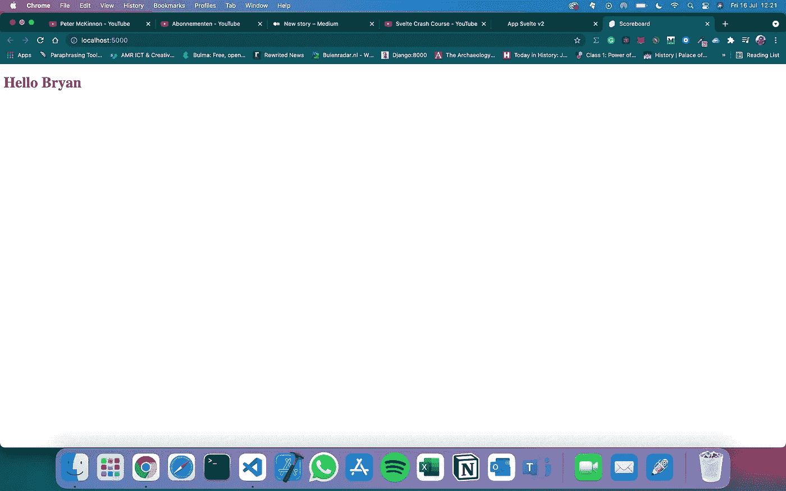

# React、Vue.js 和 Angular 都太费事了——用 Svelte 代替

> 原文：<https://javascript.plainenglish.io/react-vue-js-and-angular-are-too-much-work-use-svelte-fceee7753a49?source=collection_archive---------15----------------------->

## 编程|网络开发

## 使用苗条疗法可以提高你的工作效率，因为它非常简单


[By Sigmund on Unsplash](https://unsplash.com/photos/oFKyMk4_5gA)

使用 React 多年，我知道它是如何工作的，我知道它工作得非常好，但是如果我告诉你 Svelte 用更少的代码工作得一样好甚至更好呢？

让我们来看看这个相对较新的 web 开发框架。

# 要求

首先，苗条入门需要什么？

*   代码编辑器[(即 VS 代码)](https://code.visualstudio.com/)
*   [Node.js 已安装(带 NPM)](https://nodejs.org/en/)

基本上就是这样，你可以走了。

# 入门指南

你可以使用一个`npx`命令来生成一个苗条的项目，让我们这样做。打开您想要使用的文件夹，启动终端或命令提示符。

```
$ npx degit sveltejs/template tutorial
```

为您喜欢的项目输入任何名称。我将坚持使用“教程”。该命令将生成一个包含各种文件夹和文件的文件夹。

# 目录结构

如你所知，有很多不同的文件你可能还不知道，比如`rollup.config.js`。这基本上是你的苗条项目的配置文件。您可以找到主文件和所有的导入，这使得创建基于组件的应用程序和 ES6 风格的导入成为可能。

`package.json`它和其他 Node.js 项目没有什么太大的不同，它包含了所有的脚本和模块。

在`src`文件夹中，你会发现`main.js`这是你的应用程序的容器。如你所见，它导入了`App.Svelte`，所有的魔法都在这里发生。这个`main.js`文件也让我们看到了传入道具是可能的。

当我们打开时，`App.Svelte`我们看到一个简单明了的结构化文件。

要用 React 实现这一点，我们需要做更多的工作。它现在用紫色打印出与`main.js`中的道具一起传递的名字

我们也可以通过从`main.js`文件中移除道具并使其成为静态来更改名称。

为了能够运行这个应用程序，我们首先需要安装所有缺少的依赖项。我们使用`$ npm i`命令。

# 运行我们的应用

要运行该应用程序，您可以输入命令`$ npm run dev`，它将在`localhost:5000`上设置一个服务器。



IMAGE BY AUTHOR: BRYAN DIJKHUIZEN

这就是它的样子。因为我们将名称设为静态，所以它会像这样显示在浏览器中。

# 细长的条件语句

在 Svelte 中，可以直接在 HTML 中使用类似于`if, else for, foreach`的条件语句。让我告诉你我的意思。我们将添加一个名为 points 的新变量，如果用户的积分超过 500，用户名就会显示出来。

# 生产建筑

苗条真的很容易建立生产。要做到这一点，运行`$ npm run build`，当所有的东西都被编译和构建后，你可以使用你的 VS 代码插件:`Live Server`来运行`public`文件夹中的`index.html`文件。

如您所见，您的整个项目被编译成普通的 javascript，并与您的 HTML 文件一起运行。

# 包扎

当然，这是对苗条身材的简明扼要的介绍。这是为了让你看到建立一个苗条的项目和使用它是多么容易。它很快，而且很有效，与 React 和其他框架相比，它的编码更容易、更快。

我认为苗条是未来将把反应、Vue 和棱角从他们的宝座上推下来的东西。

如果你喜欢阅读这样的故事，你想支持我，考虑注册一个中等会员。每月只需花费你 5 美元**——这将让你可以访问媒体上的所有故事！[如果你打算使用这个链接](https://bryanwriting.medium.com/membership)，我将从中赚取一小部分，此外，如果你想在我发布新故事时保持更新，你可以[在这里注册我的**免费**时事通讯！](https://bryanwriting.medium.com/subscribe)**

***更多内容请看*[***plain English . io***](http://plainenglish.io/)**