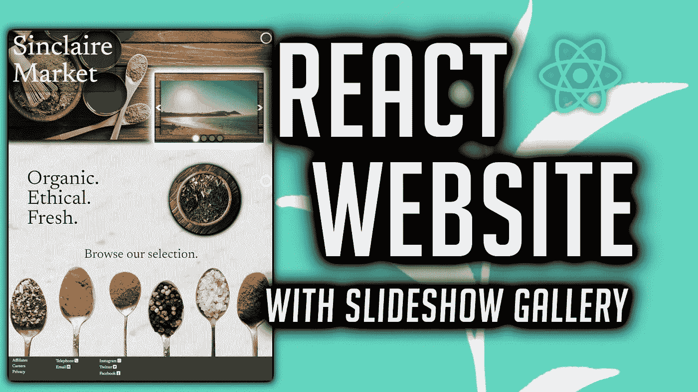
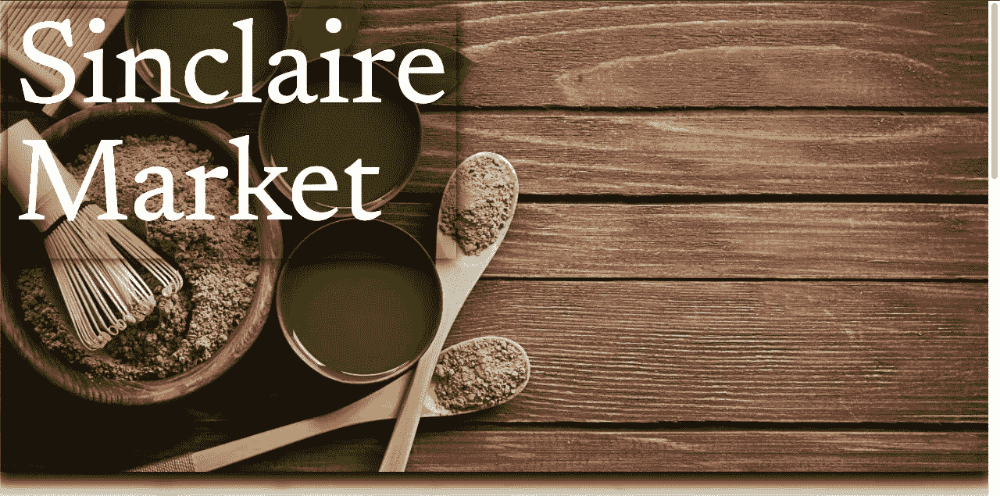
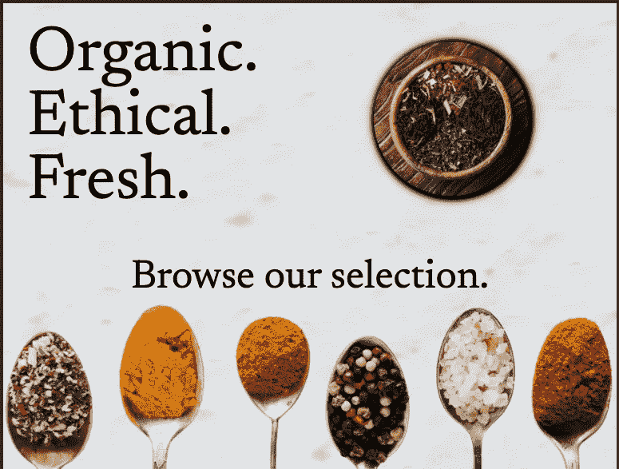
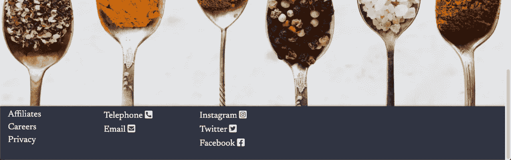
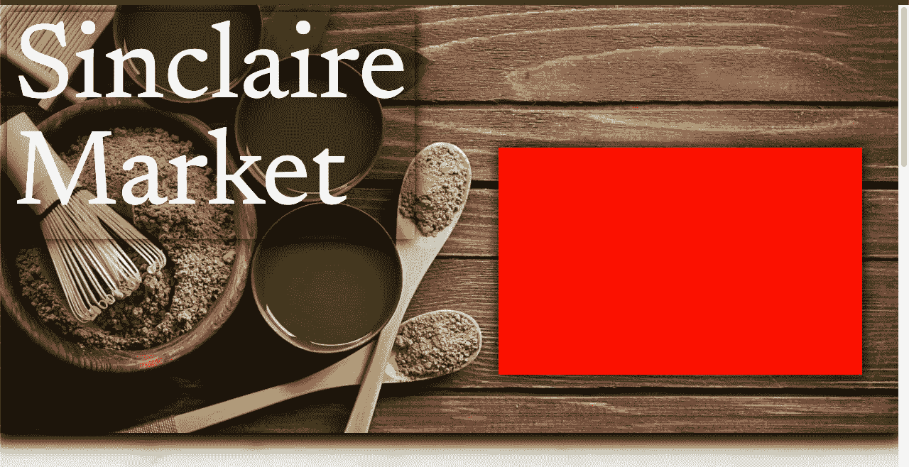
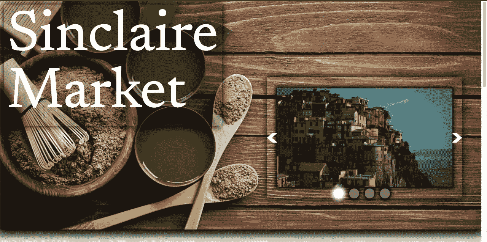
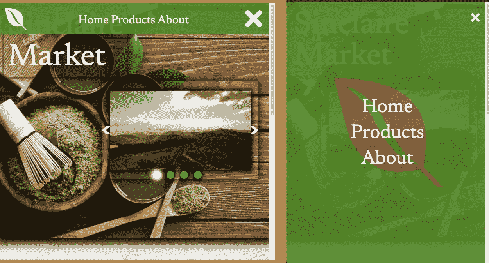

# 用图像幻灯片反应网站

> 原文：<https://javascript.plainenglish.io/react-website-with-image-slideshow-e7107be3b6dc?source=collection_archive---------13----------------------->

## 一个初学者网站，用幻灯片和导航栏做得更好



## **我们将把这个网页分为三个主要部分:**

1.**置顶**——对客户的问候

2.**中间**——介绍我们业务使命的地方

3.**底部** —关于我们业务信息的页脚

我们将为主页创建一个 Home.js 组件。

# **顶端**

我们在这里要做的就是为我们的公司设置一个背景图片和标题。

图像库随后出现；它是一个独立的元素，我们根据尺寸在页面上浮动。

```
<div className=”section1">  <div className=”title”>Sinclaire<br />Market</div></div>
```

这是我们的结果:



# **中间的**

对于这一部分，我们将有一个图像作为背景；给我们用户的消息；一个形象；和行动的号召。

```
<div className=”section2" style={{ backgroundImage: 
   “url(‘images/marble.jpg’)” }}>  <div className=”left_side”> Organic.<br/>Ethical.<br/>Fresh. </div> <div className=”right_side”>  </div> <div className=”call_to_action”> Browse our selection. </div></div>
```

这是我们的结果:



# **底部**

可以充当链接的简单无序的项目列表。

```
<div className=”section3"> <div className=”contacts” > <section className=”contact_section” > <ul> <li>Affiliates</li> <li>Careers</li> <li>Privacy</li> </ul> </section> <section className=”contact_section” > <ul> <li>Telephone <i className=”fas fa-phone-square-alt”></i> </li> <li>Email <i className=”fas fa-envelope-square”></i> </li> </ul> </section> <section className=”contact_section” > <ul> <li>Instagram <i className=”fab fa-instagram-square”></i> </li> <li>Twitter <i className=”fab fa-twitter-square”></i> </li> <li>Facebook <i className=”fab fa-facebook-square”></i> </li> </ul> </section> </div></div>
```

这是我们的结果:



**让我们的图库开始运行吧。**

我们在单独的教程中创建了这个组件。

这里可以找到[。](https://anobjectisa.medium.com/create-a-react-js-slideshow-1b2f5bfb0ee6)

我们将简单地导入并修改它以适应我们的项目。

我们真正需要做的是在我们的项目中为它创建一个父元素，我们称它为 gallery，并将它放在我们的页面上。

```
<div className=”gallery”> <Deck gallery={gallery} /></div>
```



我们将更改' **Deck.js** '组件(*)中的一些代码，并将其放入父元素中。*

**

*最后，让我们实现一个导航栏。*

*我们在单独的教程中创建了这个组件。*

*我们将简单地导入并修改它以适应我们的项目。*

*我们真正需要做的是改变所使用的配色方案和图标。*

*这是我们的结果:*

**

*这个项目有更多的细微差别。你可以在下面观看我们的视频教程。你可以在这里得到源文件[。我们从](https://github.com/an-object-is-a/react-webpage-02)[像素](https://www.pexels.com/)收集的所有图像。我们从[字体牛逼](https://fontawesome.com/)收集的所有联系人图像图标。*

*如果你想要更深入的指导，请查看我在 YouTube 上的完整视频教程， [**一个对象是一个**](https://www.youtube.com/c/anobjectisa) 。*

*一定要在 [**Instagram**](https://www.instagram.com/an_object_is_a/) 和 [**Twitter**](https://twitter.com/anobjectisa1) 上关注我们，及时了解我们最新的 **Web 开发教程**。*