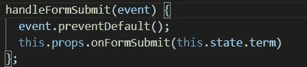
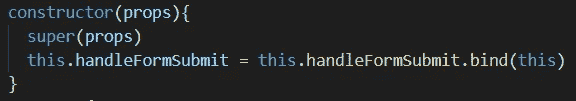
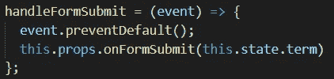

# 反应:什么是“这”,为什么我会得到这个错误？

> 原文：<https://javascript.plainenglish.io/react-what-is-this-and-why-am-i-getting-this-error-89e6a5a2f24?source=collection_archive---------7----------------------->

如果你不熟悉基于*类的*组件，你肯定会遇到这个错误:

(this error can also say ‘state’ of undefined)

你会花几分钟时间回顾你的代码，发现没有任何错误。你会一直问自己为什么‘道具’(或‘状态’)是未定义的！？我显然是在向它传递信息！！！

这源于关键字“This”的操作方式。首先，“this”是对类本身的引用。当你在写`this.functionName`的时候，它本质上和`className.functionName`是一样的。或者如果你用 state，那就是`this.state.stateKey`。

问题在于您在何处调用关键字“this”。上方的**图片是一个提交表单的类函数。这正是导致顶部错误的函数。对这个错误的简单解释是，当在函数中调用`this.props`时，它只在函数中调用‘this ’,而不引用类，实质上是从类中剥离了函数。**

这个问题有两种解决方案:

1.  如果您愿意，可以使用构造函数并添加下面的代码。这将把函数绑定到类，这样“道具”将从类而不是函数中被识别。但是我只建议在已经在使用 constructor + super 的情况下使用这个方法。

2.另一种方法很简单。把你的函数转换成箭头函数就行了。箭头函数是 ES6 编写函数的新方式，它们自动绑定到 JavaScript 类。

*更多内容请看*[***plain English . io***](http://plainenglish.io)