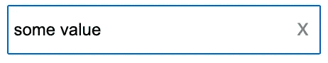

# ReactBits:自动对焦的清晰输入

> 原文：<https://javascript.plainenglish.io/reactbits-clearable-input-with-autofocus-bad64462ab4?source=collection_archive---------20----------------------->

## 小型可重复使用的组件

今天，我开始了一系列的短文，我将称之为 ReactBits，在这些短文中，我将张贴一些具有一些特定要求的小组件，您可以适应在您的项目中使用，但更重要的是，知道如何实现它们以及这样做可能面临的挑战，第一个如标题所示，具有自动对焦的清晰输入。

## 要求

*   一个**输入**，里面有一个**清除**按钮
*   只有当**输入**不为空并且被聚焦时，才会显示**清除**按钮。
*   使用**清除**按钮清除**输入**后，它应保持焦点，以便用户可以继续书写。

## 模拟的



Very simple mock

## 计划

对于这个组件，我们将使用一个内部状态，这样我们可以控制**清除**按钮的可见性，我们还将使用焦点的引用。为了清楚起见，我将包括控制输入值的状态和`onChange`处理程序，在生产项目中，这应该在父项目中完成。

## 初始代码


在前面的代码中，我们创建了**输入**和**清除**按钮，我们还有自己的处理函数`handleChange`和`handleClear`来设置和移除**输入**的值。

## 显示清除按钮

作为对等需求，这应该只在输入有一个值并且它被聚焦时才显示。


我们引入了一个新的状态变量`showClear`，我们添加了一个新的处理程序`handleFocus`，当**输入**获得焦点时，我们将状态变量设置为`true`，然后我们使用状态变量`value`和`showClear`来决定我们是否应该显示**清除**按钮。

## 参考

我们遗漏了两件事，当**输入**失去焦点时隐藏**清除**按钮，当点击**清除**按钮时保持**输入**焦点。为此，我们将使用引用。


创建了两个引用，一个用于**输入**本身，另一个用于容器，用于在点击**清除**按钮时保持焦点，我们只需添加:

```
inputRef.current.focus()
```

在`handleClear`处理程序中再次设置焦点，因为当我们单击**清除**按钮时，焦点现在就在按钮上。

最后一点，也可能是本文最复杂的一点，就是检测组件何时失去焦点(看我怎么没说**输入**而是整个组件，这就是我在容器中设置引用的原因)， 为此，我们将使用`useEffect`钩子来检测容器( **div** )何时已经被呈现(参见我们如何在钩子的依赖数组中传递`containerRef`变量)以向其添加事件监听器，这将把`showClear`状态变量改为 false，以隐藏**清除**按钮。

在`useEffect`钩子中，当组件被卸载时，我们有一个移除事件监听器的返回。

## 结论

这是一个小组件，我们必须使用 3 个最常用的钩子`useEffect`、`useRef`和`useSate`来实现它，我们还使用 Typescript 来查看如何对事件进行类型化，这是许多文档所缺乏的。

就这样，这是原始代码，以防你想更深入地检查它。

感谢阅读。

*更多内容请看*[***plain English . io***](https://plainenglish.io/)