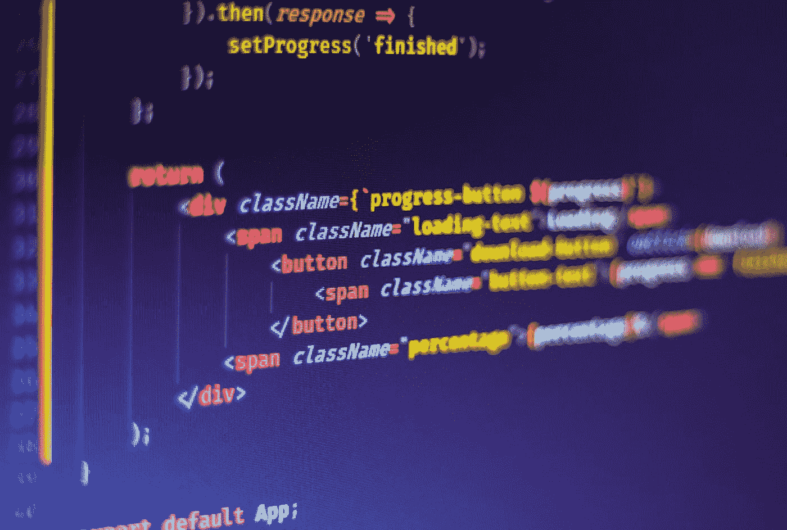
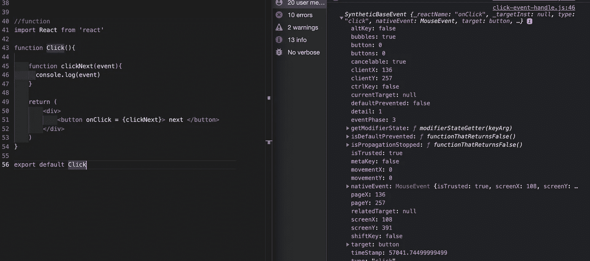

# 反应中的事件处理

> 原文：<https://javascript.plainenglish.io/reactjs-event-handling-811c698de63c?source=collection_archive---------9----------------------->



Photo by [Ferenc Almasi](https://unsplash.com/@flowforfrank?utm_source=medium&utm_medium=referral) on [Unsplash](https://unsplash.com?utm_source=medium&utm_medium=referral)

# **1 .功能组件事件处理**

```
<button onClick = {clickNext}> next </button>
```

在 JSX 第 11 行，当**按钮被点击时，点击*处理程序回调函数*** `***clickNext***` 将运行。将触发第 5 行的助手功能`***clickNext***`，控制台将打印“`next button clicked`”。

# **2 .类组件事件处理**

对于 React 类组件，事件处理的唯一区别是在 click handler 函数之前添加了 `***this***`。

您可以参考下面这篇文档中的多个 SyntheticEvent 包装示例。

[](https://reactjs.org/docs/events.html#mouse-events) [## 合成事件-反应

### 本参考指南记录了构成 React 事件系统一部分的 composite Event 包装。请参阅处理…

reactjs.org](https://reactjs.org/docs/events.html#mouse-events) 

# 事件



eventHandling event

为了查看处理程序中发生的所有事件，您可以将事件作为参数添加到回调函数中，并在控制台中记录事件，如上面的代码和图像所示。

# 与普通的 JavaScript 事件处理相比

这个反应事件处理不同于普通 JavaScript 中的事件处理。步骤如下所示。对于 reactor 中的事件处理，您可以跳过这个普通的 JavaScript 步骤 1，直接在 JSX 添加事件侦听器。

1.  选择 DOM 的元素

```
const swimming = document.getElementById("swimming")
```

2.将事件侦听器添加到作品中

```
swimming.addEventListner
```

3.对事件侦听器进行回调(删除、添加等)

```
swimming.addEventListener("click", () => {console.log("swimming clicked")})
```

就这样。希望您对《立即反应》中的事件处理有一个大致的了解。谢谢你的阅读。

*更内容于* [*浅显易懂的英语中*](http://plainenglish.io/)