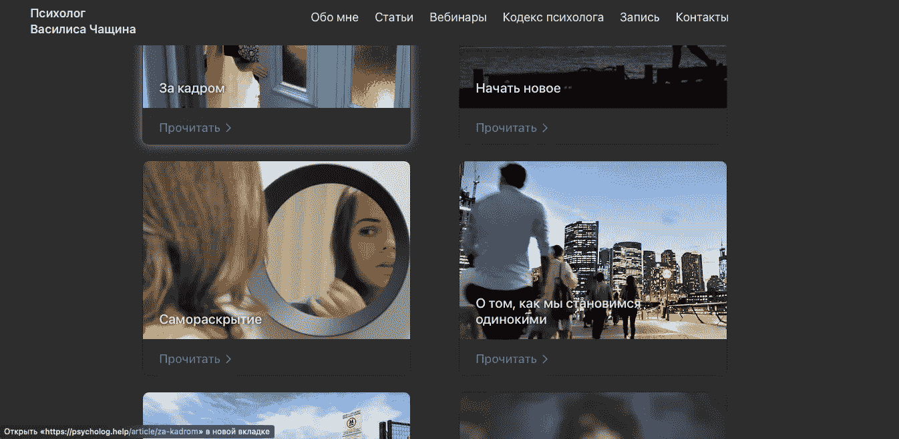
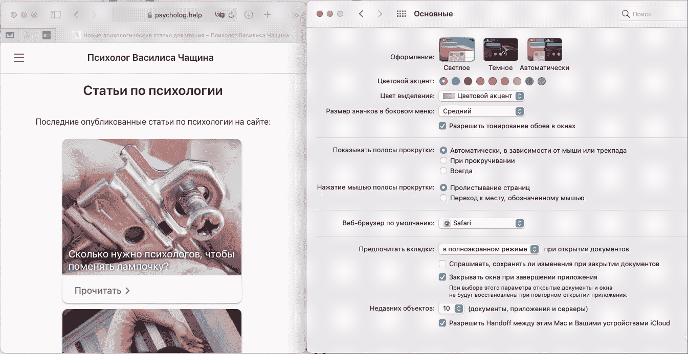

# 向 React 网站添加黑暗模式支持

> 原文：<https://javascript.plainenglish.io/reactjs-grommet-dark-mode-90cf5aafc5cb?source=collection_archive---------15----------------------->

这是一个现代世界，在网络浏览器中支持黑暗模式应该很容易。有了这个想法，我决定在我的网站上添加黑暗模式支持。

A screenshot of a website [psycholog.help](http://psycholog.help) with Dark Mode enabled

# 反应>索环>黑暗模式

几年前，我用[打字稿](https://www.typescriptlang.org) + [反应](https://reactjs.org) + [索环](https://v2.grommet.io)组合创建了这个网站。这个 Grommet React 框架对我来说非常好:它提供了一个易于使用的布局系统，并且足够可定制(除了模态视图，这是一个不同的故事)。

> [Grommet](https://v2.grommet.io) 是 React 网站的设计和布局框架。

在本文中，我们将展示如何为 React 网站或应用程序实现黑暗模式支持。我用的是 Typescript，但是如果你也懂 JS 的话，你就能理解代码了。如果使用另一个框架，可以跳过关于 Grommet 集成的第一部分——本文的其余部分给出了足够的细节来实现这种支持。

是时候添加黑暗模式(或者称为夜间模式)支持了。所有最新版本的常用浏览器都支持它，对于一个网站来说，尊重用户的选择是一个好的基调，或者有人会说是必要的。

# 索环支持黑暗模式

当然，在理想世界中，我们会在自己选择的设计框架中使用这一功能。不幸的是，我们还没有做到这一点，索环决定默认不支持系统黑暗模式。相反，它支持颜色主题。这已经是很大的胜利了。对于 **theme.json** 文件中的每一种颜色，我们可以设置亮版本和暗版本的值。比方说，我想有一个亮模式的白色背景和暗模式的深灰色背景。为此，我用下面的代码更新了主题文件:

Setting different colors for dark and light modes in Grommet

如果我们在那之后更改应用程序声明中的`themeMode`——整个站点外观将变为黑色。

Using themeMode parameter in Grommet to pick dark theme

# JS 和 CSS 中的黑暗模式支持

你可能已经找到了很多关于如何检测系统中是否启用了黑暗模式的文章，这些文章确实非常有用。其实我也用过，下面是总结。

您可以在 CSS 中添加**媒体查询，并为网站的亮暗模式指定不同的外观。然后，浏览器会使用系统设置来确定模式并更改您的网站外观。看，这是默认背景:**

Setting website color for light mode

这是黑暗模式的调整版本:

Using black color as a website background in dark mode

**在 JavaScript** 中，我们使用相同的媒体查询，但只是使用 JS API。首先，我们为黑暗模式创建一个匹配:

Using media query match to retrieve dark mode system setting in JS

然后在需要时检索该值:

Checking dark mode value using media query match

此外，JavaScript 允许我们使用 listener 观察值的变化:

Receiving dark mode changes using event listener

# React 中的黑暗模式支持

你可能已经知道我们要去哪里了。让我们应用 React 中有史以来最强大的技术——钩子。这将是一个简单的 **React 钩子**，返回我们当前得到的是暗模式还是亮模式。当模式更改时，属性应反映更改，相关组件将重新呈现。

> 未知模式被视为一个轻模式，因为为什么不

React Hook returning if the dark mode is enabled in the system settings or not

嗯，这是一个很短的方法，不是吗，但是看看里面有多少复杂的东西。我在代码中添加了一些注释，这样每个人都可以安全地进行到这一步。

# 将这种 Ract 钩与索环结合在一起

因此，这可能是有史以来最短的代码更改。可以使用新创建的 react 钩子，而不是手动指定索环中的`themeMode`。在 3，2，1 …中用`useDarkMode`替换`“dark”`

Using Dark Mode React Hook from Grommet to change the website appearance

瞧，我们的网站现在支持黑暗模式🥳党的时间。

Changing the system appearance between Light and Dark

# 警告

当你在那里享受新鲜知识的时候。我试了一下代码，iOS 13 safari 需要特殊处理。

> 这是很重要的一部分

`addEventListener`和`removeEventListener`在一些较老的浏览器中不受支持(比如 iOS 13 的 Safari)。我们需要在那里使用`addListener`和`removeListener`来代替。

为了完成我的网站，我使用了一些额外的 CSS 样式来:

1.  消除阴影——夜晚没有阴影(除非你的设计中有一个月亮，但不是我的情况)
2.  更新突出显示状态的工作方式

一些网站为用户提供了一种特殊的设置，可以在不改变系统外观的情况下在暗模式和亮模式之间切换。你可能也想这么做，这不是火箭科学，有很多关于这方面的文章。但是首先要看一些指南，或者检查一下移动应用程序是如何工作的。一个应用程序提供单独的主题调整方式是非常罕见的。从设计的角度考虑一下。你希望你的用户专注于网站内容还是用一些设置分散他们的注意力？有时候开发者需要控制提供大量设置的冲动，因为他们可以设计最好的用户体验。

无论如何，享受你的时间玩反应🖖