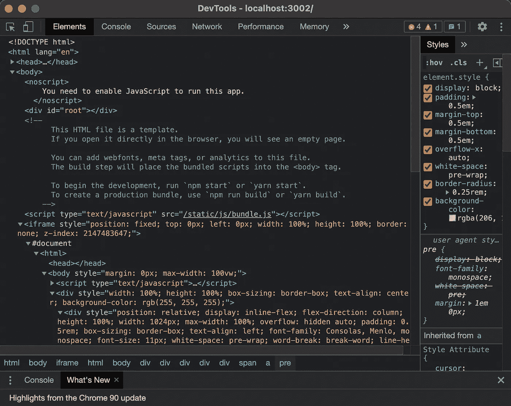
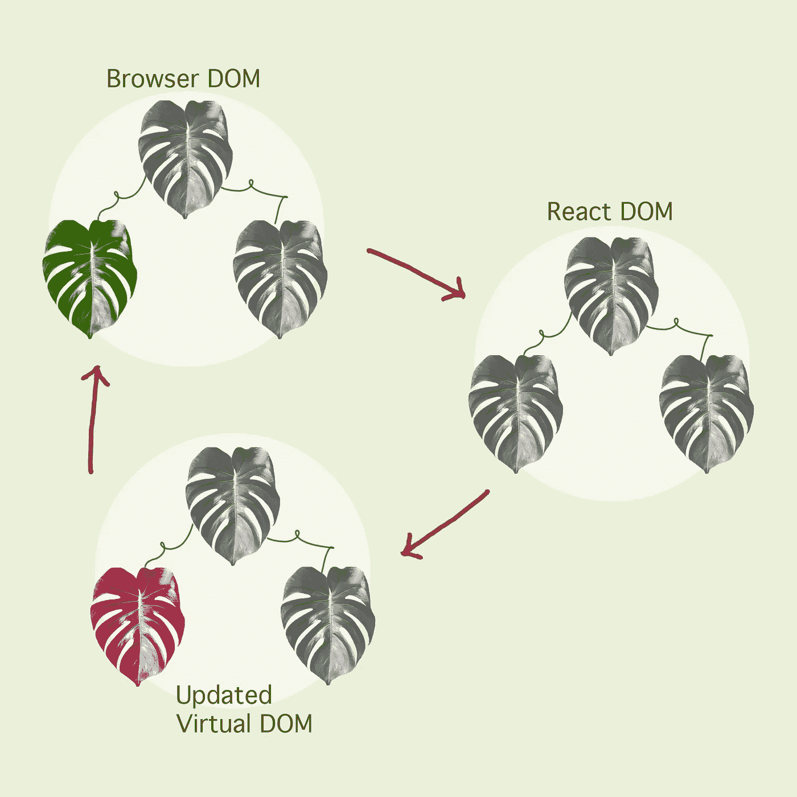
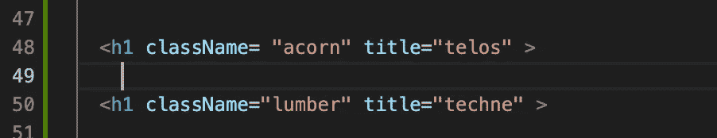
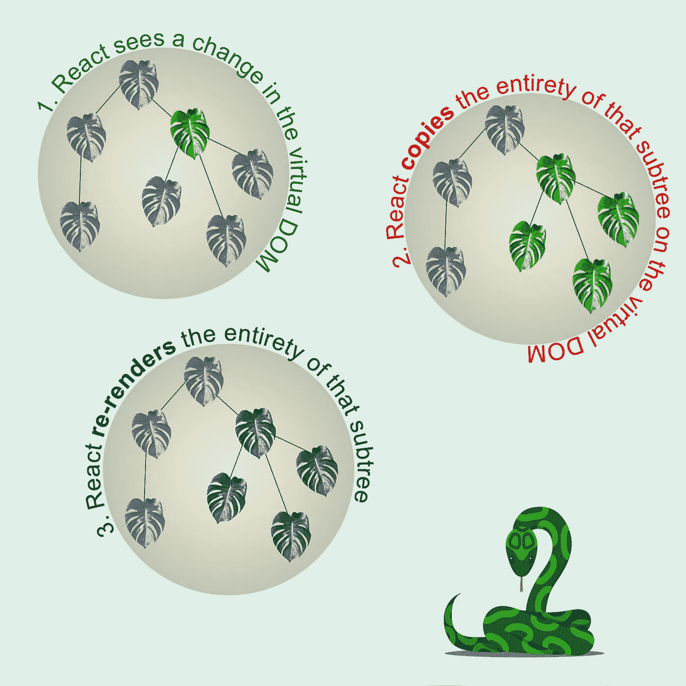
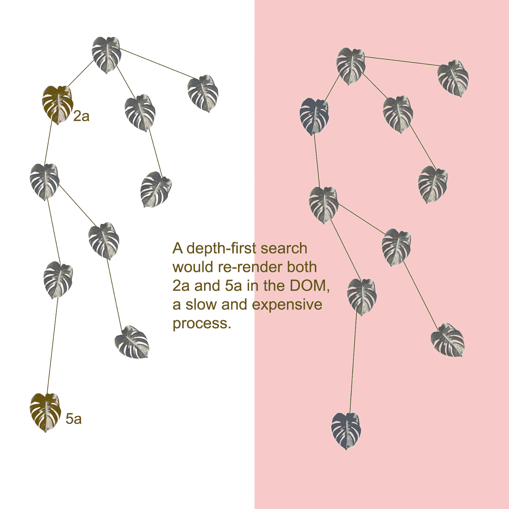
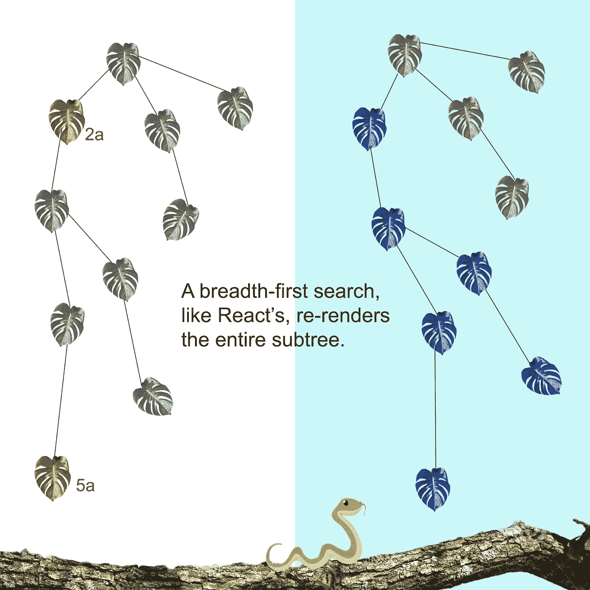

# React 差分算法

> 原文：<https://javascript.plainenglish.io/reacts-diffing-algorithm-1a64cfefa4e0?source=collection_archive---------2----------------------->

Photo by [Ferenc Almasi](https://unsplash.com/@flowforfrank?utm_source=medium&utm_medium=referral) on [Unsplash](https://unsplash.com?utm_source=medium&utm_medium=referral)

抛弃香草 JavaScript 和它对 React 的颓废的沉重认真就像把自己从流沙般的关系中释放出来。生活不必再如此艰难。但是当你在与令人窒息的垃圾抗争时，约会的场景发生了变化。现在 DOM 更新速度更快，您的健身机构有机会使用新的应用程序。

目前，在 2021 年夏天，React 是用于创建交互式 ui 的最广泛使用的 JavaScript 库之一。它的组件模型为开发者提供了一个直观、干净的脚手架，从中可以弹出大胆、诱人的应用程序，吸引潜在的新客户走出他们在互联网地下墓穴中的藏身之处。这些新的应用程序对用户的欲望如此敏感，对他们的特性如此顺从，对潜意识的欲望如此接受，以至于它们创造了一种比普通的旧感觉更温暖的幻觉:注意力。

怎么反应这么快？如此顺从？这么容易接受？答案就在 diffing 算法中，这是一个斯芬克斯，它的迷惑性谜语迷惑了许多卑微的开发者。

React 的速度是其虚拟 DOM 的结果。在后台，每次对 React 应用程序进行更改时(比如调用 setState()，触发事件处理程序，或者发送 API 请求)，React 都会从头开始呈现一个全新的虚拟 DOM。与 JavaScript 的本体论保持一致，虚拟 DOM 本身——就像 JavaScript 世界中的其他事物一样——是一个 JavaScript 对象！

Chrome’s developer tools offer us a peek at the virtual DOM

每当您修改 DOM 树上的一个节点时，React 都会扫描实际 DOM 上的树和它自己的相应副本——虚拟 DOM——直到找到一个不同的节点。当 React“看到”所讨论的更新节点与实际节点不匹配时，React 会转到实际 DOM 并更新在虚拟 DOM 中更新的节点。

illustrations by Annie Bishai @AnnieBishai

根据其公开的[文档](https://reactjs.org/docs/reconciliation.html)，React 使用一种叫做 diffing 算法的方法来比较新旧 DOM。区分是一种基于两个假设的启发式算法:

1.  两种不同类型的元素会产生不同的树。
2.  开发人员可以使用关键道具提示哪些元素在渲染中保持稳定。(这就是为什么 React 总是警告我们在道具中包含关键点)。

普通 JavaScript 要慢得多，因为对实际 DOM 进行每次更新都需要很多计算。浏览器将需要重新渲染 CSS、布局和边距，这可能很麻烦，尤其是在应用程序很大的情况下。虚拟 DOM 只更新需要更新的节点。

在比较 DOM 树的过程中，React 尽可能地保留相同类型的元素，只更新它们的属性。

如果发现一个更新的节点与实际 DOM 上的类型不同，React 将停止搜索，忽略下面较低分支上可能发生的任何事情，并重新呈现整个子树。这个过程比检查每个子树分支的差异要快得多。

React 使用广度优先而不是深度优先的逻辑在节点树中前进。在回溯之前，深度优先搜索从根节点沿着每个分支尽可能向下推进:

Depth-First Search

如果没有 React，节点树中的差异可以通过 O(n)来计算，这意味着 1，000 次操作将需要 1，000，000 次计算。由于 diffing 算法，React 可以以 O(n)的速度计算差异。

Breadth-First Search

React 的名字很贴切，因为这个库拥有对用户做出反应的不可思议的能力。这种令人着迷的迅捷给人的感觉是敏感。想象一下，一个响应如此迅速的应用程序感觉就像爱一样。

*更多内容尽在*[*plain English . io*](http://plainenglish.io/)