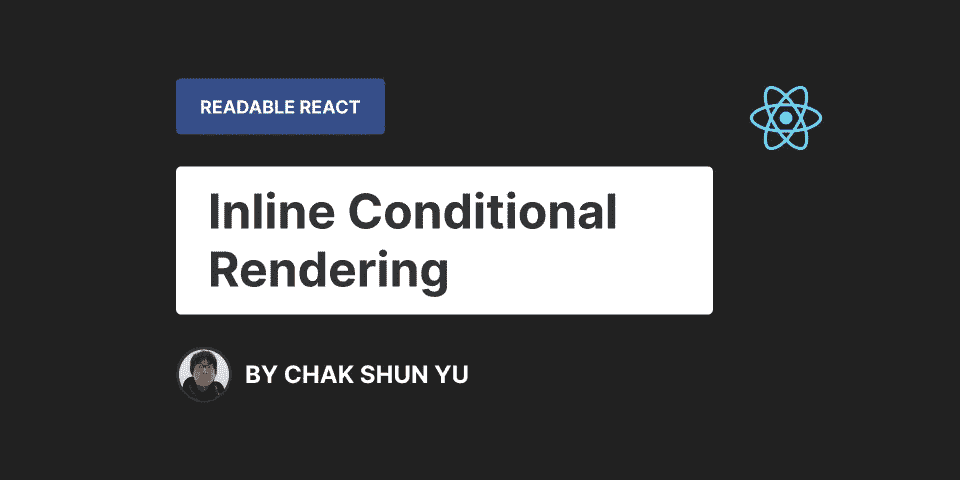

# 可读 React:内联条件呈现

> 原文：<https://javascript.plainenglish.io/readable-react-inline-conditional-rendering-8dcdd86ca753?source=collection_archive---------21----------------------->



能够有条件地向用户显示 UI 元素是使任何 React 应用程序具有交互性的重要部分，而不仅仅是一个静态网站。基于不同的用户交互、内容流和应用程序状态，React 应用程序必须向用户呈现不同的元素。

实现这一点的方法之一是通过[内联条件呈现](https://reactjs.org/docs/conditional-rendering.html#inline-if-with-logical--operator)，这是 React 开发中的常见做法。但是，鉴于这种类型的代码是如此重要，您是否考虑过您的内联条件呈现代码实际上可读性如何？

确保你的代码是高度可读的，这在很多方面都很重要。当其他开发人员将来不得不阅读、审查或维护您的代码时，这让他们的生活变得更加轻松。能够直接交付高质量的可读代码节省了工程团队在不同时刻的时间和精力，因此拥有巨大的隐含价值。

一个开发人员会让困难的代码工作，但是一个好的开发人员会让困难的代码看起来容易。

可读代码的重要性尤其适用于代码库中频繁出现的代码模式，因为其影响是十倍的，比如 React 项目的内联条件呈现。在本文中，我将介绍实现内联条件呈现的两种最常见的方法:使用 AND 运算符和三元运算符。

我们将讨论可读性方面的优点和缺点，以及每种方法的用例。这些信息将为您提供如何以可读的方式在 React 组件中实现内联条件呈现的坚实基础。阅读完本文后，您将能够应用这些方法，确定代码可读性下降的时间，并通过在这些知识的基础上进行构建来保持更复杂的结构的可读性。

# 使用 AND 运算符

实现内联条件呈现最流行、最常用的方法是通过 and 运算符。为此，AND 运算符用于验证条件。然后，我们为`if`分支指定行为。然后，如果条件评估为`true`，则触发分支并呈现一个元素。一般来说，它看起来如下:

```
const Card = ({ imageUrl }) => {
	return (
		<div className="card-container">
			{imageUrl && <Thumbnail url={imageUrl} />}
			<CardBodySection />
		</div>
	);
}
```

使用 AND 运算符进行内联条件呈现的最大优点是它不需要大量代码。它非常简短和简洁。仅仅这个原因就已经有助于提高代码的可读性。在重构和未来维护期间，开发人员必须通读的代码越少，他们被代码弄糊涂的机会就越少。

本着简洁明了的原则，and 操作符还可以保持代码非常紧凑。由于其非冗长性，使用它将节省水平和垂直方向的空间。这将极大地帮助其他开发人员在合并请求中审查您的代码。审查通常在 Github 和 Gitlab 等平台上进行，这意味着它们发生在浏览器中。在浏览器中，几乎没有任何 IDE 支持，空间有限。保持代码的紧凑性可以让其他人更容易在这些平台上浏览您的代码，从而提高可读性。

从逻辑上讲，最大的优点是 AND 运算符只描述一种情况。不多不少。在他们的思维模式中，开发人员在阅读代码时只需要考虑条件和`if`分支。使用 AND 运算符给出了一个隐含的信号，即没有`else`分支。

使用 AND 运算符进行内联条件呈现的一个主要缺点是它依赖于短路，这是一种隐式的 JavaScript 行为。当 JavaScript 对 AND 表达式求值并且第一个操作数对`false`求值时，则返回第一个操作数的结果，并且完全跳过对第二个操作数的求值。这个概念被称为短路，这是理解如何使用 and 运算符进行内联条件呈现的重要知识。

这个需求严重影响了这种方法的可维护性和可读性，因为总是有一个隐含的假设，即读者已经理解了这个概念。尽管这在 React 开发环境中很有可能发生，但这并不是必然的。在有人没有意识到短路的情况下，在阅读代码时引起的混乱可能是很严重的。

使用这种方法的最大缺点在于 AND 操作符如何通信来反应它应该呈现什么。如果条件成立，那么第二个操作数被视为`if`分支，并用作 and 表达式的返回值。然后 React 使用并渲染该值。在内联条件呈现的上下文中，第二个操作数将是一个元素，这正是 React 所期望的。

但是会有条件不成立的情况。在这些情况下，由于短路的工作方式，条件的结果值(第一个操作数)被返回以作出反应。这很好，因为 React 知道某些值实际上不应该呈现给 DOM。这些是虚假的价值观，如`undefined`、`null`、`false`。React 将忽略这些值，并完全跳过渲染它们。

问题是 React 不会忽略所有的 falsy 值，这可能会在用户不知道的情况下导致意外的渲染行为。一个例子是整数值`0`，它是一个 falsy 值，将由 React 作为实际值呈现。一个常见的陷阱是检查数组的长度。

```
// The AND operator below will return `0` if the tags array is empty,
// which will result into "0" being rendered on the screen.
const Card = ({ tags }) => {
	return (
		<div className="card-container">
			<CardBodySection />
			{ tags.length && <CardTagsSection tags={tags} /> }
		</div>
	);
}
```

如果开发人员不知道短路的概念以及 React 如何处理假值，这种意外的行为会造成很多混乱。当遇到通过 AND 操作符的内联条件呈现时，这个意外的问题是您必须时刻注意的，它极大地降低了这种方法的可读性。

最后，使用 AND 操作符的一个经常被忽略的缺点是，读取条件表达式需要付出的努力。处理条件表达式不是一项简单的任务，以任何方式扩展它们只会使它变得更加困难。从可读性的角度来看，这也适用。

使用 AND 运算符处理内联条件呈现使得实现非常容易。如果你需要条件的反例，那么你可以用 NOT 操作符翻转它。这也是经常发生的事情，但这正是我们刚刚讨论过的。也就是说，在现有条件之上添加另一层，从而降低可读性。虽然这可以被认为是一个小缺点，但对可读性的影响会越积越大。

# 摘要

*   ✅简短而简洁。
*   ✅保持事情紧凑。
*   ✅很好的描述了一个案例。
*   ⛔依赖于被称为短路的隐式 JavaSript 行为。
*   在 React 中渲染某些虚假值时，⛔会导致意外问题。
*   ⛔处理相反的情况需要翻转条件句。

# 使用三元运算符

通常用于内联条件呈现的另一种方法是利用三元运算符。在这种方法中，三元运算符用于验证条件。在三元组中，你定义了`if`和`else`分支的行为。然后，根据条件的结果，触发适当的分支以返回要呈现的元素。一般来说，它看起来如下:

```
const Card = ({ imageUrl }) => {
	return (
		<div className="card-container">
			{imageUrl ? <Thumbnail url={imageUrl} /> : null}
			<CardBodySection />
		</div>
	);
}
```

就可读性而言，使用三元运算符进行内联条件呈现的最大优势是它的显式性。当使用三元运算符时，你必须同时指定`if`和`else`分支。这意味着对于代码的读者来说，条件呈现代码的预期总是显而易见的。

虽然人们通常会想到两个分支都返回要呈现的内容的场景，但它同样适用于只有一个分支相关的场景。就像上面使用`else`分支的例子一样，使用三元运算符可以让读者清楚地看到，两个分支中的任何一个都不需要。这两种情况下的明确程度减少了歧义和混乱，从而有利于可读性。

三元运算符的另一个好处是，您可以始终使用相同的逻辑结构。三元表达式总是以条件开始，然后是`if`分支，最后是`else`分支。因为它总是指定两种情况，所以从来没有必要翻转条件。这意味着三元表达式的顺序和结构总是相同的，并且在现有条件之上没有添加额外的逻辑层。当其他开发人员检查您的 React 代码并遇到条件呈现时，他们知道它总是以相同的、最自然的方式阅读。这使得他们更容易理解你的代码。

最后一个好处与在不同地方处理相同条件的不同分支有关。有时，内联条件呈现的不同分支不在同一个 DOM 位置。以下面的场景为例:

```
const ComponentWithIconPlacement = ({ renderIconLeft }) => {
	return (
		<div className="container">
			{ renderIconLeft ? <Icon /> : null }
			{ someContent }
			{ renderIconLeft ? null : <Icon /> }
		</div>
	);
}
```

这里我们有一个组件，它接受一个 boolean `renderIconLeft`属性，呈现一些内容，并基于提到的属性从内容的左边或右边呈现一个图标。基于`renderIconLeft`的值，图标必须呈现在 DOM 中的不同位置。

使用三元运算符可以更容易地发现彼此相关的相反情况。由于逻辑结构可以始终保持不变，并且条件不必翻转，因此条件渲染表达式非常相似，从而易于与其对应部分匹配。

基于上面的例子:在最初阅读第一个三元运算符后，您可能会想知道当`renderIconLeft`不适用时预期的行为是什么。无需翻转条件或寻找相关语句，您只需寻找具有相同条件但处理相反情况的三元运算符。在这种情况下，它在内容之后立即被处理。因为使用了相同的逻辑表达式，所以很容易找到并匹配它们，并确定相反情况下的行为。

使用三元运算符进行内联条件呈现的主要缺点是冗长。默认情况下，它需要更多的代码，这意味着开发人员必须阅读并试图理解更多的代码。这带来了更多可能导致混乱的机会，使得开发人员更难通读代码。当三元表达式变得更加复杂时，比如需要更大的条件、分支需要更多的代码或者三元运算符被嵌套时，情况会变得更糟。结合这些因素将对代码的可读性产生显著的复合效应。

使用三元运算符的另一个缺点也与它的冗长有关。正因为如此，三元运算符在水平方向和垂直方向都会占用大量空间。三元表达式占用多少垂直和水平空间直接影响代码的可读性。这意味着三元表达式的可读性会随着阅读器的屏幕宽度、文本换行配置和格式化程序打印宽度的不同而有很大的波动。虽然这不是一个无法解决的问题，但是拥有这种依赖性并不是最佳的，并且需要花费时间和精力来解决。

```
// The following two components are exactly the same, but have a totally
// different level of readability due to formatting.// 1\. One-liner with larger print width.
const Card = ({ imageUrl }) => {
	return (
		<div className="card-container">
			{imageUrl ? <Thumbnail url={imageUrl} rounded placeholder={false} {...someMoreProps} /> : null}
			<CardBodySection />
		</div>
	);
}// 2\. Multi-liner with smaller print width like a lot of default settings.
const Card = ({ imageUrl }) => {
  return (
    <div className="card-container">
      {imageUrl ? (
        <Thumbnail
          url={imageUrl}
          rounded
          placeholder={false}
          {...someMoreProps}
        />
      ) : null}
      <CardBodySection />
    </div>
  );
};
```

# 摘要

*   ✅对 if 和 else 两种情况都是显式的。
*   ✅总是可以使用相同的逻辑结构(condition-if-else)而不用翻转条件。
*   ✅更容易发现相反的情况，如果它位于其他地方。
*   ⛔非常啰嗦，尤其是在比较复杂的情况下。
*   ⛔可读性受屏幕宽度和格式化程序打印宽度的影响。

# 最后的想法

在本文中，我们讨论了在 React 组件中处理内联条件呈现的两种方法，要么使用 AND 运算符，要么使用三元运算符。就可读性而言，两者各有优缺点和使用案例。这些信息为您提供了如何以可读的方式在 React 组件中实现内联条件呈现的坚实基础。您将能够应用这些结构，识别您的代码何时可读性下降，并通过在这些知识的基础上构建来保持更复杂的结构的可读性。

如果你喜欢这篇文章，可以考虑看看其他的可读的 React 系列文章，我的 T2 Twitter，或者我的其他 React 编程相关的文章:

[](https://levelup.gitconnected.com/readable-react-content-states-eb9ab72b786c) [## 可读反应:内容状态

### 如何编写可读的反应内容状态

levelup.gitconnected.com](https://levelup.gitconnected.com/readable-react-content-states-eb9ab72b786c) [](https://betterprogramming.pub/a-comprehensive-guide-to-proper-behaviour-testing-in-react-with-enzyme-and-jest-ae866188f29a) [## 与酶和 Jest 反应中正确行为测试的综合指南

### 基于三年实践经验的七点建议

better 编程. pub](https://betterprogramming.pub/a-comprehensive-guide-to-proper-behaviour-testing-in-react-with-enzyme-and-jest-ae866188f29a) [](https://levelup.gitconnected.com/3-levels-of-mocking-a-react-hook-control-and-effort-against-representability-2c6be067dba7) [## 模仿反应钩子的三个层次:对可表现性的控制和努力

### 向您展示了在模仿 React 钩子时如何平衡控制和努力与可表示性，以及为什么它很重要。

levelup.gitconnected.com](https://levelup.gitconnected.com/3-levels-of-mocking-a-react-hook-control-and-effort-against-representability-2c6be067dba7) 

*更多内容看*[***plain English . io***](http://plainenglish.io/)