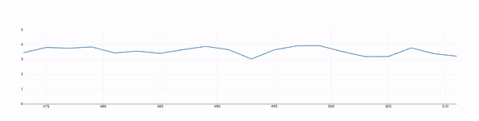

# 使用 Plotly.js 以角度显示的实时图表

> 原文：<https://javascript.plainenglish.io/real-time-charts-with-plotly-js-in-angular-4a46c4c56eb5?source=collection_archive---------3----------------------->

仪表板应用程序是很棒的工具，根据流数据更新的图表是其效用的一大部分。这篇文章演示了如何使用 Plotly.js 和 Angular 创建流数据图表。


Angular + Plotly.js (image by author)

如果你从直接跳到回购协议中学到了更好的东西，给你。

任何实时仪表板的基本架构都是:

1.  实时数据源，最好是 WebSocket。
2.  一种显示实时数据的方式。

如果你在找 1，我会给你介绍[这个极好的资源](https://javascript-conference.com/blog/real-time-in-angular-a-journey-into-websocket-and-rxjs/)。在这里，我将重点放在 Angular 项目的 2 上。如果你正在寻找设置 Plotly 和 Angular 的基础知识，[我有一个关于这个的教程](https://medium.com/analytics-vidhya/dynamic-data-visualization-in-angular-with-plotly-js-events-22b524e2e097)。

为了创建一个动态图表，我们想要创建一个 Plotly traces 的`[Observable](https://rxjs.dev/guide/observable)`,它响应我们的数据更新而发出。首先，我们将创建一个`DataService`，在本例中，它模拟 WebSocket 功能。

我们的服务:

```
export class DataService {

  _x: number[] = [];
  _y: number[] = [];
  _iter = 0;
  data$: Observable<{x: number[], y:number[]} | null> = of(null);

  constructor() {}

  connect() {
    // Connect to a websocket that regularly pushes data. 
    // Reformat to x/y data to plot. this.data$ = interval(100)
      .pipe(
        map(() => {
          // We will show the 20 most recent values
          this._x.push(this._iter); 
          this._iter = this._iter + 1;

          this._y.push(***Math***.random()+3); // Random data
          if (this._y.length > 20) {
            this._x = this._x.slice(1, -1);
            this._y = this._y.slice(1, -1);
          }
          return {
            x: this._x,
            y: this._y
          };
        })
      );

    return this.data$;
  }
}
```

`AppComponent`从`DataService`获得可观测的数据，然后将`x`和`y`数据转换成绘图轨迹。

```
export class AppComponent implements OnInit{
  title = 'streaming-data';

  trace$: Observable<any> = of(null);
  layout = {
    yaxis: {
      range: [0, 5],
    }
  }

  constructor(private dataService: DataService) {
  }

  ngOnInit() {
    this.trace$ = this.dataService.connect()
      .pipe(
        map( (data) => {
          return {
            ...data,
            type: 'scatter'
          };
        }
      )
    )
  }
}
```

重要的是，如果没有定义跟踪，就不要呈现`plotly-plot`。

```
<div **ngIf*="trace$ | async as ***trace***">
  <plotly-plot
    [data]="[***trace***]"
    [layout]="layout">
  </plotly-plot>
</div>
```

仅这一点，我们就获得了以下功能:



Real Time Chart in Angular with Plotly (image by author)

关注更多 JavaScript、绘图和数据分析。

*更多内容请看*[***plain English . io***](http://plainenglish.io/)