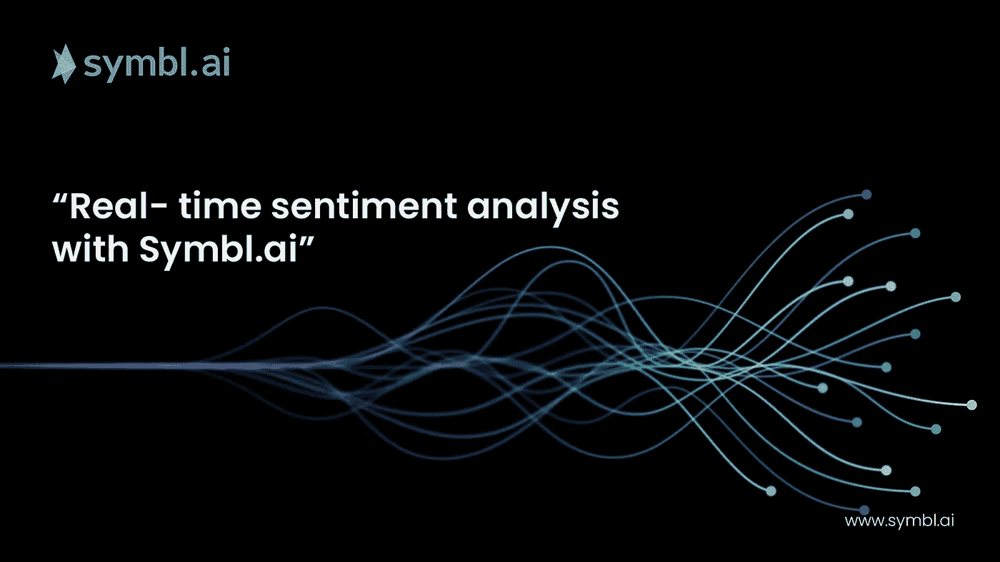
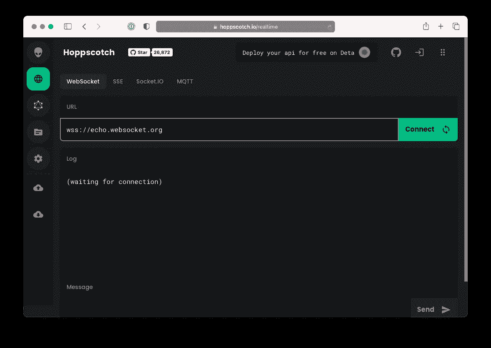
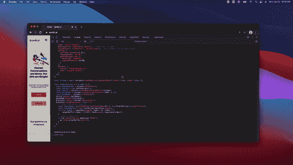

# 使用 JavaScript 和 Symbl.ai 进行实时情感分析

> 原文：<https://javascript.plainenglish.io/real-time-sentiment-analysis-api-in-javascript-with-symbl-ai-9e39d50f0654?source=collection_archive---------16----------------------->



Symbl.ai 是非假设的、非侵入性的、完全可扩展的，并且有一个用户友好的用于情绪分析的[API](https://docs.symbl.ai/docs/conversation-api/concepts/sentiment)，它提供了对消息极性的实时洞察。让我们看看这一切意味着什么。

## 1.非假设的

API 是非假设性的，因为极性的结果不是作为一种特定的情绪来传递，而是作为一个相对于消极或积极的值来传递。它没有假设一种情绪。

## 2.非侵入性

该 API 是非侵入性的，因为分析的结果来自完整的消息，而不是声音，该完整的消息构成了对话，是人类身份的高度个性化、不可撤销的生物特征方面。

## 3.完全可扩展

API 是可扩展的，因为对对话本身、其说话者或他们自己的单独或集合消息的分析是完全可编程的。作为一名开发人员，您可以决定如何随时随地围绕从情感中获得的价值创建统计数据或数据。

## 4.用户友好的 API

用户的 aver 量化不会放弃他们独特的、个人的“凭证”，他们可能不会害怕 Symbl.ai 的情感分析的任何方面，这使得 API 在用户端非常友好。例如，它不是一个音调分析器。

# Symbl.ai 的 WebSockets

WebSockets 是一种用于通信的计算机协议，是对 HTTP 的请求/响应模型的巨大改进。它们通过单一传输控制协议(TCP)连接提供全双工通道。WebSockets 有助于客户端之间的实时通信或服务，而不会受到 HTTP 下的活跃、高延迟和带宽密集型交换的影响。指定为`ws`或`wss`，未加密或加密，WebSocket 端点是一个持久的双向通信通道，没有任何来自 HTTP 残留的开销，如头、cookies 或工件。下面是 Symbl.ai 针对 WebSockets 的 API:

```
wss://api.symbl.ai/v1/realtime/
```

# Symbl.ai 的 JavaScript WebSocket 的 API

在下面的博客中，你将启用 Symbl.ai 的 JavaScript WebSocket 的 API 在你的浏览器中实时转录。要在浏览器中使用 Symbl.ai 的 JavaScript WebSocket 的 API 启用实时转录，您需要:1)设置您的帐户，2)配置 WebSocket 的端点，3)在浏览器中运行代码，4)实时转录。在设置了实时转录之后，你实现了 Symbl.ai 的非假设的、非侵入性的、完全可扩展的、用户友好的用于情感分析的[API](https://docs.symbl.ai/docs/conversation-api/concepts/sentiment)。

# 建立

在 [Symbl](https://platform.symbl.ai/) (即[https://platform.symbl.ai/](https://platform.symbl.ai/))注册账户。抓住你的`appId`和`appSecret`。有了这两者，你应该或者用`cURL` [命令](https://www.mit.edu/afs.new/sipb/user/ssen/src/curl-7.11.1/docs/curl.html)或者用邮递员认证，这样你就能收到你的`x-api-key`。这里有一个`cURL`的例子:

```
curl -k -X POST "[https://api.symbl.ai/oauth2/token:generate](https://api.symbl.ai/oauth2/token:generate)" \
     -H "accept: application/json" \
     -H "Content-Type: application/json" \
     -d "{ \"type\": \"application\", \"appId\": \"<appId>\", \"appSecret\": \"<appSecret>\"}"
```

理想情况下，令牌服务器会处理身份验证(使用让 RESTful API 调用生成令牌的代码),这样就不会暴露出`appSecret`或`appId`。然而，`cURL`无论如何都会让你立刻上手。准备好`x-api-key`之后，您就可以为执行实时转录建立一个 WebSocket 端点了。

# WebSocket 的端点

要启用 WebSocket，您需要将两个值配置为查询参数，直接提供给 WebSocket API 的端点。反过来，你直接将 WebSocket API 的端点*输入到 JavaScript 自己的软件中，以实现实时对话。*

以下是前两个值:

```
const uniqueMeetingId = btoa('EMAIL@ADDRESS.COM');
const accessToken = '';
```

有了 WebSocket 的 API 端点集的这两个值，就可以将它们直接输入 WebSocket API 的端点:

```
const symblEndpoint = `wss://api.symbl.ai/v1/realtime/insights/${uniqueMeetingId}?access_token=${accessToken}
```

如果您想在任何进一步集成之前测试您的 WebSocket，您可以将带有`uniqueMeetingId`数据的端点和`accessToken`一起加载到 [Hoppscotch.io](https://hoppscotch.io/realtime/) 中，这是一个免费、快速、流畅的 API 请求构建器。



# 创建 JavaScript 本地 WebSocket API 的实例

下一步是创建 JavaScript 的本地 WebSocket API 的实例:

```
const ws = new WebSocket(symblEndpoint);
```

在这种情况下，您可以调用特定于处理实时转录的方法。

```
// Fired when a message is received from the WebSocket server
ws.onmessage = (event) => {
  console.log(event);
};// Fired when the WebSocket closes unexpectedly due to an error or lost connetion
ws.onerror  = (err) => {
  console.error(err);
};// Fired when the WebSocket connection has been closed
ws.onclose = (event) => {
  console.info('Connection to websocket closed');
};// Fired when the connection succeeds.
ws.onopen = (event) => {
  ws.send(JSON.stringify({
    type: 'start_request',
    meetingTitle: 'Websockets How-to', // Conversation name
    insightTypes: ['question', 'action_item'], // Will enable insight generation
    config: {
      confidenceThreshold: 0.5,
      languageCode: 'en-US',
      speechRecognition: {
        encoding: 'LINEAR16',
        sampleRateHertz: 44100,
      }
    },
    speaker: {
      userId: 'example@symbl.ai',
      name: 'Example Sample',
    }
  }));
};
```

要设置用于访问用户媒体设备(如笔记本电脑的麦克风)的流，请对浏览器的导航器进行相应的编程:

```
const stream = await navigator.mediaDevices.getUserMedia({ audio: true, video: false });
```

上面的代码通过弹出窗口请求用户允许访问他或她的设备。在移动应用中，对设备的访问权限被硬编码到应用二进制文件的控制目录中，例如在 Android 的清单中或 iOS 的属性列表中。JavaScript 不会编译，所以不需要请求许可，这样你就可以请求许可了！

要设置处理事件的流，请编写以下程序:

```
const handleSuccess = (stream) => {
  const AudioContext = window.AudioContext;
  const context = new AudioContext();
  const source = context.createMediaStreamSource(stream);
  const processor = context.createScriptProcessor(1024, 1, 1);
  const gainNode = context.createGain();
  source.connect(gainNode);
  gainNode.connect(processor);
  processor.connect(context.destination);
  processor.onaudioprocess = (e) => {
    // convert to 16-bit payload
    const inputData = e.inputBuffer.getChannelData(0) || new Float32Array(this.bufferSize);
    const targetBuffer = new Int16Array(inputData.length);
    for (let index = inputData.length; index > 0; index--) {
        targetBuffer[index] = 32767 * Math.min(1, inputData[index]);
    }
    // Send to websocket
    if (ws.readyState === WebSocket.OPEN) {
      ws.send(targetBuffer.buffer);
    }
  };
};
```

## 尝试代码

现在尝试一下你的 WebSocket 连接可能是个好主意。在浏览器中直接运行代码后，您会看到控制台实时记录事件。



## 停止对话

要停止现场转录，您可以关闭浏览器，或者从浏览器控制台直接向服务器发送一个`stop_request`。

```
ws.send(JSON.stringify({
  "type": "stop_request"
}));
```

## 实时情感分析

在用于`onmessage`的`ws`方法中，编程 API 端点来捕获 Symbl.ai 的对话消息的极性，通过控制台将该值记录到。

第一步是捕获`conversationId`作为一个常量。您通过解析来自 WebSocket 的 API 的`onmessage`方法的数据来捕获`conversationId`。

```
const conversationId = data.message.data.conversationId;
```

第二步是创建请求。有多个用于处理 HTTP 请求的库，所以可以在这里随意重构`XMLHttpRequest`。

```
const request = new XMLHttpRequest();
```

第三步是配置请求，将响应的类型设置为`text`。

```
request.responseType = "text";
```

第四步是配置端点:

```
const sentimentEndpoint = `[https://api.symbl.ai/v1/conversations/${conversationId}/messages?sentiment=true](https://api.symbl.ai/v1/conversations/$%7BconversationId%7D/messages?sentiment=true)`;
```

第五步，设置请求。

```
request.open("GET", sentimentEndpoint)
```

第六步是设置请求的头。

```
request.setRequestHeader('Authorization', `Bearer ${accessToken}`);
request.setRequestHeader('Content-Type', 'application/json');
```

第七步是创建一个函数，将情绪记录到控制台中。

```
request.onreadystatechange=(e)=> {
      console.log(request.responseText)
    }
```

最后一步是发送请求。

```
request.send()
```

以下是在 WebSocket 中为`onmessage`在`ws`方法中实现的完全可编程的情感分析 API:

```
// Fired when a message is received from the WebSocket server
ws.onmessage = (event) => {
  // You can find the conversationId in event.message.data.conversationId;
  const data = JSON.parse(event.data);
  if (data.type === 'message' && data.message.hasOwnProperty('data')) {
    console.log('conversationId', data.message.data.conversationId);
    const conversationId = data.message.data.conversationId;
    console.log('onmessage event', event);
    // You can log sentiments on messages from data.message.data.conversationId 
    const request = new XMLHttpRequest();
    request.responseType = "text";
    const sentimentEndpoint = `[https://api.symbl.ai/v1/conversations/${conversationId}/messages?sentiment=true](https://api.symbl.ai/v1/conversations/$%7BconversationId%7D/messages?sentiment=true)`;
    request.open("GET", sentimentEndpoint)
    request.setRequestHeader('Authorization', `Bearer ${accessToken}`);
    request.setRequestHeader('Content-Type', 'application/json');
    request.onreadystatechange=(e)=> {
      console.log(request.responseText)
    }
    request.send()
  }
};
```

如果您的控制台在事件状态发生变化时记录了情绪，那么您的代码在 API 中提供了实时情绪分析！

# 下一步是什么？

Symbl.ai 对话配置为通过实时 websocket 及其情绪分析 API 中继消息，它既不是对话数据的开始，也不是结束。

如果你仔细观察来自你的实时 WebSocket 连接的数据，`conversationId`可能被应用于新的 API 调用，以访问更多关于行动项目、主题或分析的 AI 见解。在完全可编程的 Symbl.ai 对话中，您不仅可以获得情感分析，还可以访问分析 API，该 API 提供对以下对话数据的访问:

1.  发言者比率—发言者的说和听的比率和时间。
2.  通话时间—对话的总持续时间。
3.  沉默——沉默的总持续时间。
4.  语速——对话中每分钟说的话。
5.  重叠——当一个以上的说话者同时说话时，对话就会重叠。

通过扬声器比率、通话时间、静音、语速或重叠，您能够创建应用程序逻辑或通知，从而将对话体验提升到一个新的高度，而不仅仅是在实时语音到文本应用程序中转录一个或多个扬声器，或者仅通过一个 API 端点实现语音识别自动化。

由于实时情绪分析是基于消息而不是音调，Symbl.ai 的主题 API 将对话中最突出的主题聚集在一组名为“主题”的词组中，与扬声器事件的消息数据不同，它完全可以编程为消息数据。

对情绪或演讲者事件的数据分析只是 Symbl.ai 可扩展、完全可编程的开发人员对话平台的一部分。Symbl.ai 的实时情绪分析或分析 API 可以跨协议、渠道和公司自由运行，以便开发人员创建自由增强的对话体验。

# 社区

卡住了？欢迎在我们的 [Slack 频道](https://join.slack.com/t/symbldotai/shared_invite/zt-4sic2s11-D3x496pll8UHSJ89cm78CA)上向我们提出任何问题，或者发送电子邮件至 [devrelations@symbl.ai](mailto:devrelations@symbl.ai) 。