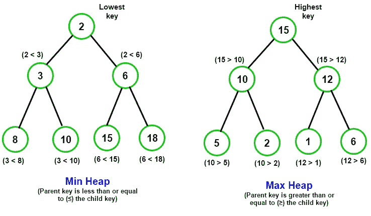
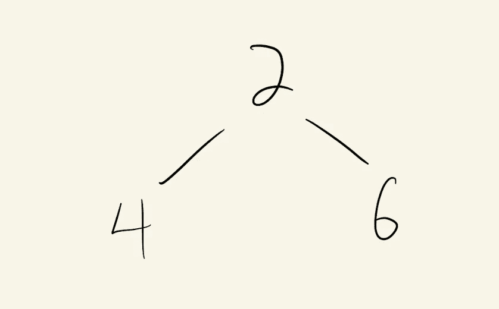
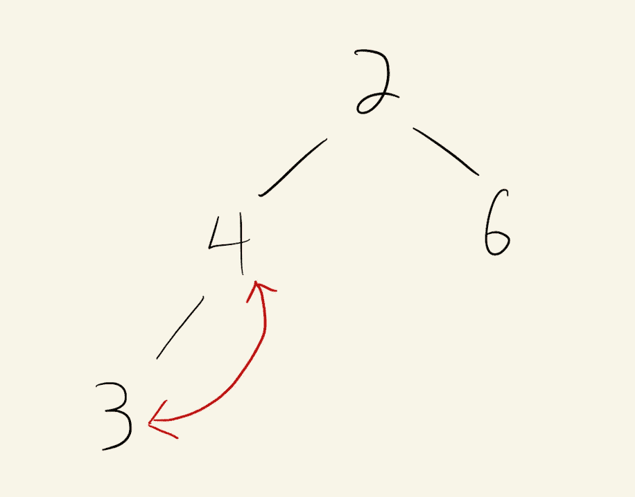
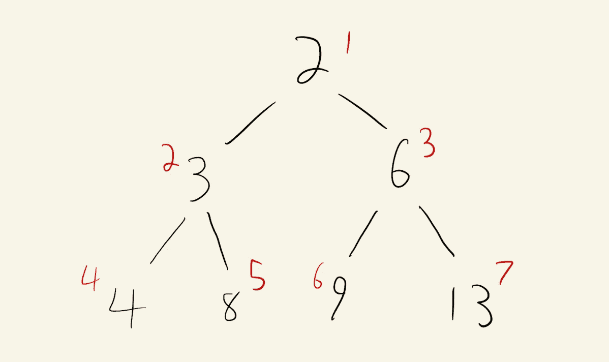

# 堆的真实用例

> 原文：<https://javascript.plainenglish.io/real-world-uses-cases-for-heaps-e57edbeb7da3?source=collection_archive---------12----------------------->

## 以及如何用 JavaScript 实现它们



A heap is a specialized version of a Binary Tree

# 介绍

那么什么是堆呢？堆只是二叉树数据结构的一个非常特殊的版本。记住，二叉树的主要特征是每个节点最多有两个子节点。因此，每向下移动一级，节点数就会翻倍。

堆将这个定义向前推进了一步，除了每个节点只有两个子节点之外，每个父节点还必须大于(最大堆)或小于(最小堆)它的两个子节点。最大或最小堆的目的是，当数据添加到结构中时，它允许我们实时跟踪一组数据中的最大值或最小值。

# 我会在哪里使用堆呢？

堆在“现实世界”中最常用于一种叫做优先级队列的东西中。如果你熟悉标准的队列数据结构(如果不熟悉，我在这里写了通过链表实现一个)你会发现添加到队列中的数据遵循先进先出(FIFO)模式，即按照添加的顺序移除数据。

在优先级队列中，情况并非总是如此，因为队列中的一些项目比其他项目具有更高的优先级。这实际上是现实世界中比简单的 FIFO 列表更常见的做法。假设你在工作中有一堆任务要完成。你有一个待办事项列表，当任务分配给你时，你可以在上面添加任务。如果你能一次只做一件事，随着任务的增加把每一件都划掉，直到你完成清单，那会很好，然而这很少发生。

你经常在工作中开始做一件事情，突然你的老板把你叫进来，说“放下你正在做的事情，我们有紧急情况需要你所有的注意力。”

这实际上就是优先级队列。即使你的待办事项清单上还有 7 件其他的事情，你的老板给你的新任务会突然优先于所有其他的事情，并且直接跳到清单的最前面。

# 用 JavaScript 构建优先级队列

让我们继续这个待办事项列表的例子，我们可以给列表中的每一项分配一个优先级，这样它就可以在我们的队列中正确排序。为此，我们将利用一个将在 JavasScript 中构建的 MinHeap 类。我选择了一个 MinHeap，因为我们将为项目分配最高优先级 a 1，最低优先级 a 5。你可以很容易地使用一个最大堆，只需翻转优先级，使数字越大，优先级越高。

## 创建 MinHeap 类

我们将从在一个文件中定义一个 MinHeap 类开始，我将这个文件恰当地命名为 MinHeap.js。

我们需要创建一个构造函数，它将在每次调用“new MinHeap()”时初始化我们的类。构造函数不接受任何参数，但需要创建堆和大小属性，我们将把它们初始化为一个数组，数组的第一项分别为 null 和 0。它看起来会像这样:

```
class MinHeap {
  constructor() {
    this.heap = [null];
    this.size = 0;
  }
}
```

我们可以把我们的堆想象成一棵二叉树，这就是它的样子，但是在这个场景中，我们将只使用一个 JavaScript 数组来存储实际的数据。我将在本文后面解释这是如何工作的。

我们将数组中的第一项初始化为 null 的原因是为了利用数组索引的工作方式。这样，我们数组中的最小项将始终是 this.heap[1]而不是 0，最后一项将始终是 this.heap[this.size]而不是 this.size-1。这样工作起来更容易。

## 添加到堆中

接下来，我们需要一种向堆中添加数据的方法。我们将通过创建一个。像这样添加函数:

```
class MinHeap {
  constructor() {
    this.heap = [null];
    this.size = 0;
  } add(value) {
    this.heap.push(value);
    this.size++;
  }}
```

该函数将接受一个“值”参数，并利用内置的。JavaScript 数组对象上的 push 方法将该值添加到堆的末尾。我们还会将堆的大小增加 1。

## 变胖

现在，我们敏锐的读者可能会说“等一下，如果您总是将数据添加到数组的末尾，您将如何保持顺序？”这是一个很好的观点。

每次向堆中添加数据(或从堆中移除数据)时，我们都需要检查以确保仍然满足堆条件(每个父级最多有 2 个子级，并且每个父级的值小于每个子级的值)。

让我们用一个例子来思考这个问题。我们将创建以下堆:

```
let heap = [null, 2, 4, 6]
```

画出一棵树，看起来像这样:



现在，假设我们使用 add 方法将 3 添加到堆中。

```
heap.add(3)
```

当我们添加到堆中时，我们将推到堆数组的末尾，它看起来像这样:

```
heap = [null, 2, 4, 6, **3**]
```

或者像这样的树:



Our child node of 3 is smaller than our parent node of 4\. This violates our heap condition

为了解决这个问题，我们需要交换父节点 4 和子节点 3 的位置。这个恢复堆状态的过程叫做堆化，当你在树中向上移动一个节点直到它在正确的位置时，这个过程叫做堆化。

让我们添加一个对名为。heapifyUp 到我们的 add 函数

```
class MinHeap {
  constructor() {
    this.heap = [null];
    this.size = 0;
  }add(value) {
    this.heap.push(value);
    this.size++;
    **this.heapifyUp();**
  }}
```

不，我们需要定义肥胖。记住，这个函数的目标是检查新添加的节点是否小于其父节点的值。如果是，请执行交换。然后我们重复这个过程，直到节点不再比它的父节点小。

我们可以使用以下函数重现这种行为:

```
heapifyUp() { let current = this.size; while (current > 1 && this.heap[getParent(current)] >      this.heap[current]) { this.swap(current, getParent(current));
    current = getParent(current); }}
```

现在，这是一个很大的摘要，并使用了更多的帮助函数，我们将一个一个地分解。

## 二叉树的左右子模式

我们将利用二叉树中存在的一个很好的模式，以便总是能够获取一个节点的左子节点、右子节点或父节点。

起初这可能并不直观，但是由于二叉树的性质，每个子节点的索引位置很容易根据父节点的引入位置来计算。让我们来看看:



这里，值为 3 的节点位于 2 的索引位置(红色)。你会注意到它的左右两个子节点的索引分别是 4 和 5。

另一种纠正方法是，它的子节点位于左侧的(parent_index * 2)位置和右侧的(parent_index * 2 + 1)位置。也为 6 节点进行检查。这种模式是正确的。

现在反过来，如果你想找到一个节点的父节点的索引，它总是节点的索引除以 2，然后四舍五入。例如，值为 9 的节点的索引为 6。因此，它的父代将位于向下舍入为 3 的 6 /2 的索引中。对于 13 节点，它将是 7/2，即 3.5 向下舍入到 3。因此，我们可以编写以下函数来查找任何节点的子节点或父节点:

```
const getParent = current => Math.floor((current / 2));const getLeft = current => current * 2;const getRight = current => current * 2 + 1;
```

## 互换

我们需要的另一个辅助函数是实际执行我们前面提到的交换的函数。

我们称之为。交换，并可以如下实现它:

```
swap(a, b) { [this.heap[a], this.heap[b]] = [this.heap[b], this.heap[a]];}
```

## 重温 Heapify Up

现在，如果我们重温一下前面的 heapify 函数，并加入我们对新函数的定义，就会更清楚地看到发生了什么。

```
class MinHeap {constructor() {
  this.heap = [null];
  this.size = 0;
}add(value) {
  this.heap.push(value);
  this.size++;
  this.bubbleUp();
}heapifyUp() { let current = this.size; while (current > 1 && this.heap[getParent(current)] >  this.heap[current]) { this.**swap**(current, **getParent**(current));
    current = **getParent**(current);
  }
}**swap(a, b) {** **[this.heap[a], this.heap[b]] = [this.heap[b], this.heap[a]];****}****const getParent = current => Math.floor((current / 2));****const getLeft = current => current * 2;****const getRight = current => current * 2 + 1;**
```

我们使用 getParent 在堆中向上移动，然后在子节点小于父节点时交换节点。

## 删除最小值

到目前为止，这一切都很好，但是 min 堆的要点是能够在它的顶部返回根值，有效地返回最小值。

让我们创建另一个函数来完成这项工作:

```
popMin() { if (this.size === 0) {
    return null
  } const min = this.heap[1];
  this.heap[1] = this.heap[this.size];
  this.size--;
  this.heap.pop();
  return min;
}
```

如果你看看这个函数，你会注意到它在移除最小值之前交换了堆数组的第一项和最后一项，最小值现在是我们的最后一个值。这是因为如果您直接删除根节点，您将得到一个包含两个无父节点的破碎树。因为最后一个节点总是没有子节点，所以通过在移除之前交换这两个节点，可以避免这个问题。

然而，现在你有一个不同的问题。根节点不再是最小节点。我们需要编写另一个类似于 HeapifyUp 的函数，将这个根节点在树中向下移动，直到它位于正确的位置。

## HeapifyDown

```
heapifyDown() {let current = 1;
  let leftChild = getLeft(current);
  let rightChild = getRight(current);// Check that there is something to swap (only need to check the left if both exist)while (this.canSwap(current, leftChild, rightChild)){// Only compare left & right if they both existif (this.exists(leftChild) && this.exists(rightChild)) {// Make sure to swap with the smaller of the two childrenif (this.heap[leftChild] < this.heap[rightChild]) {
    this.swap(current, leftChild);
    current = leftChild;
  } else {
    this.swap(current, rightChild);
    current = rightChild;
    }
  } else {// If only one child exist, always swap with the leftthis.swap(current, leftChild);
    current = leftChild;
  }leftChild = getLeft(current);
    rightChild = getRight(current);
  }
}
```

这个函数依赖于另一个辅助函数来检查交换是否发生，方法是确保左右子代都存在，然后选择子代中较小的值并执行交换。

通过总是选择两个值中较小的一个，可以保证最小值是二叉树的父树。

以下是您需要的两个助手功能:

```
exists(index) {
  return index <= this.size;
}canSwap(current, leftChild, rightChild) {// Check that one of the possible swap conditions exists return (
    this.exists(leftChild) && this.heap[current] >  this.heap[leftChild]
    || this.exists(rightChild) && this.heap[current] > this.heap[rightChild]
  );
}
```

现在让我们将 heapifyDown 添加到 popMin 函数中:

```
popMin() {if (this.size === 0) {
    return null
  }const min = this.heap[1];
  this.heap[1] = this.heap[this.size];
  this.size--;
  this.heap.pop();
  **this.heapifyDown();**
  return min;
}
```

就是这样！我们最后的 MinHeap 类如下:

```
class MinHeap { constructor() {
    this.heap = [null];
    this.size = 0;
  } add(value) {
    this.heap.push(value);
    this.size++;
    this.bubbleUp(); 
  } popMin() {
   if (this.size === 0) {
    return null
   }
   const min = this.heap[1];
   this.heap[1] = this.heap[this.size];
   this.size--;
   this.heap.pop();
   this.heapify();
   return min;
  }heapifyUp() {
   let current = this.size;
   while (current > 1 && this.heap[getParent(current)] >     this.heap[current]) {
   this.swap(current, getParent(current));
   current = getParent(current);
  }
}heapifyDown() {
  let current = 1;
  let leftChild = getLeft(current);
  let rightChild = getRight(current);while (this.canSwap(current, leftChild, rightChild)){
  if (this.exists(leftChild) && this.exists(rightChild)) {
    if (this.heap[leftChild] < this.heap[rightChild]) {
      this.swap(current, leftChild);
      current = leftChild;
    } else {
      this.swap(current, rightChild);
      current = rightChild;
    }
  } else {
    this.swap(current, leftChild);
    current = leftChild;
  } leftChild = getLeft(current);
  rightChild = getRight(current);
  }
}swap(a, b) {[this.heap[a], this.heap[b]] = [this.heap[b], this.heap[a]];}exists(index) {
  return index <= this.size;
} canSwap(current, leftChild, rightChild) {
    return (
      this.exists(leftChild) && this.heap[current] >  this.heap[leftChild] || this.exists(rightChild) && this.heap[current] > this.heap[rightChild]
    );
  }
}const getParent = current => Math.floor((current / 2));const getLeft = current => current * 2;const getRight = current => current * 2 + 1;
```