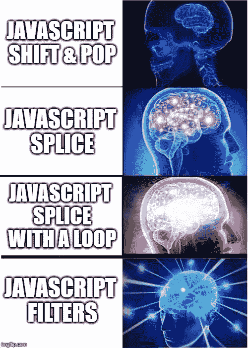
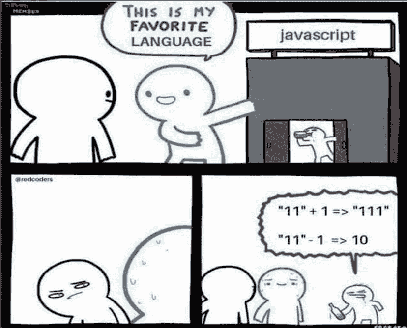

# JavaScript 中 12 个非常有用的数组方法

> 原文：<https://javascript.plainenglish.io/really-useful-array-methods-in-javascript-127f8a3b0d25?source=collection_archive---------3----------------------->

虽然 JavaScript 中有很多数组方法，但这里列出了一些我认为非常有用的方法，还有一些不太为人所知但确实非常有用的方法。通过使用这些方便的方法之一，我不能过分强调已经减少了多少行代码。


# **最常见的**

## **forEach()**

```
const array1 = ['a', 'b', 'c'];
array1.forEach(element => console.log(element));// *Syntax*
forEach((element) => { ... } )
forEach((element, index) => { ... } )
forEach((element, index, array) => { ... } )
```

`**forEach()**`方法是最常用的数组方法。它对每个元素执行一次。

***注* :** `forEach`期望有一个**同步**功能。`forEach`不等待承诺。确保在使用 promises(或异步函数)作为`forEach`回调时，您意识到了其中的含义。

## **找到()**

```
const array1 = [1, 12, 3, 13, 40];
const found = array1.find(element => element > 10);
console.log(found); // 12// *Syntax* find((element) => { ... } )
find((element, index) => { ... } )
find((element, index, array) => { ... } )
```

`**find()**`方法返回满足测试函数的数组中第一个元素的值。如果没有满足测试函数的值，则返回`undefined`。

## **过滤器()**

```
const words = ['spray', 'limit', 'elite', 'exuberant', 'destruction', 'present'];
const result = words.filter(word => word.length > 6);console.log(result); // ["exuberant", "destruction", "present"]*//* *Syntax*
filter((element) => { ... } )
filter((element, index) => { ... } )
filter((element, index, array) => { ... } )
```

`**filter()**`方法**创建一个新数组**，其中所有通过测试的元素都由提供的函数实现。



***注意*** *—* 你也可以通过上述任何一种方法为**找到**和**滤镜**，如下图所示

```
function isPrime(num) {
  for (let i = 2; num > i; i++) {
    if (num % i == 0) {
      return false;
    }
  }
  return num > 1;
}
const array = [-1, 0, 1, 2, 3, 4, 5, 6, 7, 8, 9, 10, 11];console.log(array.filter(isPrime)); // [2, 3, 5, 7, 11]console.log([4, 5, 8, 12].find(isPrime)); // 5
```

# **不太常见但非常方便**

## **平()**

```
const arr1 = [0, 1, 2, [3, 4]];
console.log(arr1.flat()); // [0, 1, 2, 3, 4]const arr2 = [0, 1, 2, [[[3, 4]]]];
console.log(arr2.flat(2)); // [0, 1, 2, [3, 4]]
console.log(arr2.flat(3)); // [0, 1, 2, 3, 4]
```

`**flat()**`方法创建一个新的数组，所有的子数组元素递归地连接在一起，直到指定的深度。深度级别指定嵌套数组结构应展平的深度。默认为 1。

## **fill()**

```
const array1 = [1, 2, 3, 4];// fill with 0 from position 2 until position 4
console.log(array1.fill(0, 2, 4));// [1, 2, 0, 0]// fill with 5 from position 1
console.log(array1.fill(5, 1)); // [1, 5, 5, 5]console.log(array1.fill(6));// [6, 6, 6, 6]
```

`**fill()**`方法将数组中的所有元素更改为静态值，从起始索引(默认为`0`)到结束索引(默认为`array.length`)。它返回修改后的数组。

## **来自()**

```
console.log(Array.from('foo'));// ["f", "o", "o"]
console.log(Array.from([1, 2, 3]); // [1, 2, 3]
console.log(Array.from([1, 2, 3], x => x + x));// [2, 4, 6]const set = new Set(['foo', 'bar', 'baz', 'foo']);
Array.from(set); // [ "foo", "bar", "baz" ]const map = new Map([[1, 2], [2, 4], [4, 8]]);
Array.from(map); // [[1, 2], [2, 4], [4, 8]]

const mapper = new Map([['1', 'a'], ['2', 'b']]);
Array.from(mapper.values()); // ['a', 'b'];

Array.from(mapper.keys()); // ['1', '2'];
```

`**Array.from()**`静态方法从类似数组或可迭代对象创建一个新的**浅拷贝** `Array`实例。

`Array.from()`允许您从以下位置创建`Array`:

*   类似数组的对象(具有`length`属性和索引元素的对象)；或者
*   [可迭代对象](https://developer.mozilla.org/en-US/docs/Web/JavaScript/Reference/Iteration_protocols)(对象如`[Map](https://developer.mozilla.org/en-US/docs/Web/JavaScript/Reference/Global_Objects/Map)`、`[Set](https://developer.mozilla.org/en-US/docs/Web/JavaScript/Reference/Global_Objects/Set)`)。

`Array.from()`有一个可选参数`mapFn`，它允许您对正在创建的数组的每个元素执行一个`[map()](https://developer.mozilla.org/en-US/docs/Web/JavaScript/Reference/Global_Objects/Array/map)`函数。

## **加入()**

```
const elements = ['Fire', 'Air', 'Water'];
console.log(elements.join()); // "Fire,Air,Water"
console.log(elements.join(''));// "FireAirWater"
console.log(elements.join('-'));// "Fire-Air-Water"
```

方法通过连接一个数组中的所有元素来创建并返回一个新的字符串，用逗号或指定的分隔符分隔。

*注意—* 如果数组只有一项，那么该项将在不使用分隔符的情况下返回。

## **之()**

```
Array.of(7); // [7]
Array(7); // array of 7 empty slotsArray.of(1, 2, 3); // [1, 2, 3]
Array(1, 2, 3);    // [1, 2, 3]
```

`**Array.of()**`方法从可变数量的参数创建一个新的`Array`实例，而不管参数的数量或类型。

*注—*`**Array.of()**`和`**Array**`构造函数的区别在于对整数参数的处理:`**Array.of(7)**`创建一个具有单个元素`7`的数组，而`**Array(7)**`创建一个具有`7`的`length`属性的空数组(**注:**这意味着一个由`7`空槽组成的数组，而不是具有实际`undefined`值的槽)。

## **减少()**

```
const array1 = [1, 2, 3];
const reducer = (previousValue, currentValue) => previousValue * currentValue;// 1 * 2 * 3
console.log(array1.reduce(reducer));
// expected output: 6// 4 * 1 * 2 * 3
console.log(array1.reduce(reducer, 5));
// expected output: 24
```

`**reduce()**`方法对数组的每个元素执行用户提供的“reducer”回调函数，按顺序传递前一个元素计算的返回值。对数组的所有元素运行缩减器的最终结果是一个值。

## **shift()**

```
const array1 = [1, 2, 3];
const firstElement = array1.shift();console.log(array1);
// expected output: Array [2, 3]console.log(firstElement);
// expected output: 1
```

此方法更改数组的长度。`shift`方法移除第 0 个索引处的元素，并将连续索引处的值下移，然后返回移除的值。如果`length`属性为 0，则返回`undefined`。

`*Note —* pop()`的行为与`shift`相似，但应用于数组中的最后一个元素。

## **unshift()**

```
const array1 = [1, 2, 3];
console.log(array1.unshift(4, 5));// 5
console.log(array1);// [4, 5, 1, 2, 3]
```

`**unshift()**`方法将一个或多个元素添加到数组的开头，并返回数组的新长度。

## **at()**

```
const array1 = [5, 12, 8, 130, 44];
console.log(array1.at(0)); // 5
console.log(array1.at(-1)); // 44
```

`**at()**`方法接受一个整数值并返回该索引处的项目，允许正整数和负整数。负整数从数组的最后一项开始倒数。

你也可以使用方括号符号，比如 array[0],但是它与 at 的不同之处在于，你可以从末尾开始遍历，也可以使用 at 而不使用 length。例如，`array[0]`将返回第一项。然而，代替使用`array.length`用于后面的项目；例如`array[array.length-1]`最后一项，可以调用`array.at(-1)`。



希望这些方法能帮助您减少每天必须编写的代码量。他们确实帮助了我。

## **好的读数**

[](https://developer.mozilla.org/en-US/docs/Web/JavaScript/Reference/Global_Objects/Array) [## 数组- JavaScript | MDN

### JavaScript 数组类是一个全局对象，用于构造数组；哪些是高层次的…

developer.mozilla.org](https://developer.mozilla.org/en-US/docs/Web/JavaScript/Reference/Global_Objects/Array) 

*更多内容看* [***说白了就是***](http://plainenglish.io/) *。报名参加我们的* [***免费每周简讯这里***](http://newsletter.plainenglish.io/) *。*