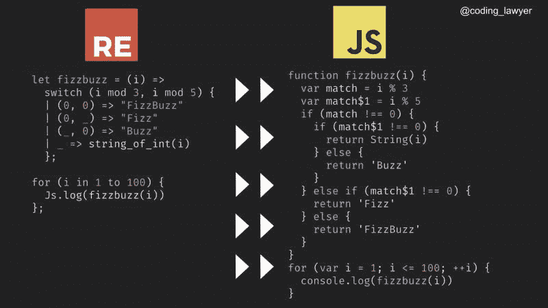
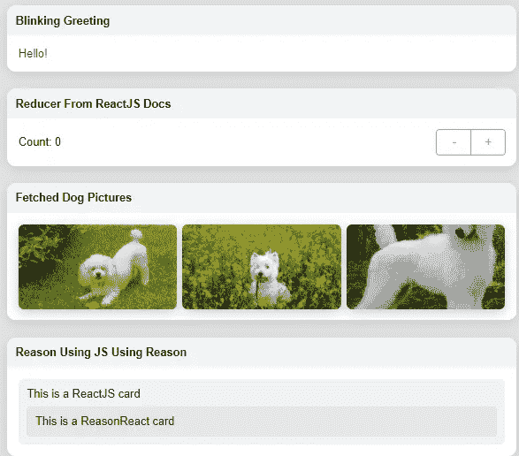

# 原因反应:介绍和第一印象

> 原文：<https://javascript.plainenglish.io/reasonreact-introduction-and-first-impressions-fb329d394119?source=collection_archive---------28----------------------->

## 用 ReasonML(一种强类型函数式语言)构建 React 应用程序

最近我一直在试验 [ReasonML](http://reasonml.github.io) (也称为 BuckleScript 或 [ReScript](http://rescript-lang.org) )，这是一种基于 [OCaml](http://ocaml.org) 的功能性强类型语言。ReasonML 吸引人的一点是，它是一种强类型语言，像 JavaScript 一样容易学习，但没有 JavaScript 的许多古怪之处。用 ReasonML 编写的代码很容易被转换成 JavaScript，所以 React 是一个框架，让你用 React 构建 React 应用。

# 构建示例应用程序

ReasonReact 中的 ReasonML 代码使用作为 BuckleScript/ReScript 平台一部分的工具转换为 JavaScript，您可以使用 npm 轻松安装:

然后，您只需使用简单的 **bsb** 命令创建一个 ReasonReact 应用程序，就像您如何使用 **create-react-app** 命令创建一个基本的 JavaScript React 应用程序一样:

然后，您可以像这样构建并运行编译器:

这将启动一个开发编译器，它将不断地把你的 ReasonML 代码编译成 JavaScript。这意味着，如果您更改了任何代码，它将自动被编译器选中并进行转换。您使用一个单独的命令来运行实际上为 web 浏览器提供应用程序的服务器:

这将导致如下所示的结果:

# index.re 文件

像大多数 React 应用一样，有一个**index.html**文件，它是提供给客户端的实际基本 HTML。该文件指向 **Index.bs.js** 文件，是 **index.re** 文件的编译版本。index.re 文件定义了这个示例应用程序的整体结构。在顶部，它首先在 DOM 中构建一个样式元素:

在**示例中写出的样式样式**是一个文字字符串，所以这里没有真正复杂的魔法。接下来，该文件定义了一个名为 **makeContainer** 的函数，该函数同样构建了包含示例中定义的原因组件的 **div** 元素:

该函数创建 DOM 元素并返回**内容**元素，这是 ReasonML 组件将被附加的位置。每次调用这个函数时，都会将另一个组件装入 DOM。最后，我们调用这个函数来挂载一些 ReasonML 组件:

对**react DOM . render**的调用与您可能习惯的 **ReactDOM.render** 调用非常相似。通常我们只使用 ReactDOMRe.render 方法一次，挂载一个包含所有其他组件的主组件，但这只是一个包含非常简单组件的示例应用程序。

# 合理的组件

示例应用程序中有几个示例组件，但它们通常都以相同的方式工作。我将浏览一下 **BlinkingGreeting.re** 文件，因为它是所有文件中最简单的。原因反应组件从一个简单的函数定义开始:

第一行是对该函数的注释，表明该函数是一个 React 组件。第二行类似于我们在 JavaScript React 中定义功能组件的方式。 **~children** 参数就是您所期望的——这个组件的子组件。文件中的下一行是对 React 的 **useState** 钩子的调用:

对于在 JavaScript 中使用过 useState 钩子的人来说，这应该很熟悉。唯一的区别是，它不仅仅是传递给调用的一个值，而是被赋予一个匿名函数调用来返回值。接下来是对 **useEffect** 的调用，它允许开发人员在组件挂载后运行一些代码:

注意，我们实际上调用了一个名为 **useEffect0** 的函数。我们这样做有一个技术上的奇怪之处，但基本上是关于 useEffect 的第二个可选参数，它通常是一个数组。然而，ReasonML 中的数组必须包含所有相同类型的元素，所以我们调用一个带有元组的函数，它允许不同类型的项。然而，由于类型安全，函数参数中的元组是固定长度的，因此每个长度都有一个函数，最长为 7 (useEffect0 不接受元组 arg，useEffect1 接受长度为 1 的元组，useEffect2 接受长度为 2 的元组，等等。).这里的 useEffect 设置了一个区间，基本上是调用 **setShow** 来翻转显示状态变量。像普通的 React 一样，useEffect 的返回是一个清理函数，它在组件卸载时清除间隔。

接下来，该文件根据闪烁文本是否可见来设置样式:

在 ReasonML 中，if/else 的结果值可以返回给一个变量，所以这里创建了一个样式，当文本应该显示时不透明度为 1，当文本应该隐藏时不透明度为 0。

整个组件函数的返回值是应该呈现的 HTML:

ReasonML 中没有 return 语句，所以函数中最后的表达式就是返回值。这类似于 JavaScript React 应用程序中返回的 JSX。

# 显著的差异

除了显而易见的原因 ML 与 JavaScript 的语法差异(在很大程度上，这些差异非常接近，任何 JavaScript 开发人员都应该能够很快发现它们)，还有一些关键的差异值得一提:

*   不像在 JavaScript JSX 中，你不能在 JSX 中包含原始文本并期望它会被转换成 HTML 中的文本。相反，原始文本和数字必须换行。

*   属性和子属性不需要花括号，但是如果你愿意，你可以使用它们。
*   不支持 JSX 道具跨页(`<Foo {...bar} />`)，但支持子跨页(`<Foo>...baz</Foo>`)。
*   JSX 属性可以一语双关，所以`<Foo title={title} />`可以简单写成`<Foo title />`。

# 第一印象

一旦你安装了工具并开始用 ReasonML 编码，我想你会发现它令人耳目一新。从 JavaScript 到 ReasonML 的调整相当顺利，类型安全确实有助于确保如果您的代码编译，它可能会正确工作。

开发工具也支持 react istration，但不如 JavaScript 支持得好。我的 WebStorm 应用程序有一个 ReasonML 插件，它确实提供了代码完成和语法突出显示，但错误不一定会显示出来，迫使我依赖编译器输出来查看事情是否正确。错误消息有时有助于快速定位错误，但是如果你还在学习推理，你可能会陷入困境，不知道问题是什么。

对我来说，迁移到 React 的最大好处是 ReasonML 给我带来的优势——一种类型安全的语言，没有 JavaScript 和 TypeScript 的怪癖。我还在学习这种语言，刚刚开始用它来构建项目，所以仍然有一些我在 JavaScript 中已经学得很好的东西，我将不得不在 ReasonML 中解决。一旦我对它有了更多的了解，我会回到这个话题上来。