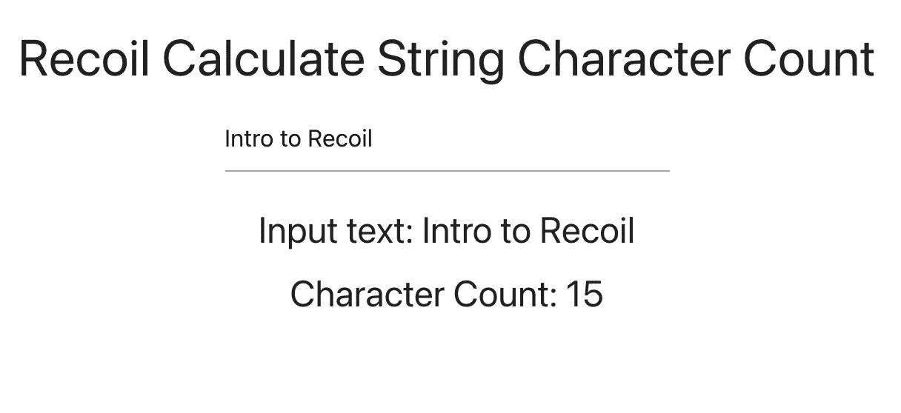

# 反冲介绍:React 的状态管理库

> 原文：<https://javascript.plainenglish.io/recoil-e422476011a?source=collection_archive---------6----------------------->


## *状态管理哪个更像 React*

*状态管理*已经成为任何应用程序开发的核心部分。容器模式帮助我们为所有应用程序的数据创建一个单一的真实来源。 *Redux* 和 *MobX* 是在反应方面的首选状态管理库。他们固执己见(这是一个优点),需要你学习他们特有的新模式，这给整个应用程序构建过程又增加了一步。

为了解决状态管理的外部依赖性，React 提出了它的*上下文 API* 和 *useReducer 钩子*。但是对于更大的应用程序来说，它仍然不是开发者可以依赖的东西。甚至脸书的 React 团队也意识到了局限性，例如:

*   组件状态只能通过将其推至公共祖先来共享，但这可能包括一个巨大的树，然后需要重新呈现。
*   上下文只能存储单个值，而不能存储一组不确定的值，每个值都有其使用者。

为了克服这些限制，并仍然保持一种类似 React 的模式，他们提出了一种新的状态管理库 [**反冲**](https://recoiljs.org/) 。此时是 0.4.0 版本，所以和 4.1.1 的 Redux 还是不在一个级别。

## 核心概念/API:

**原子**:每个原子都是一个状态单位。它们是可更新和可订阅的:当一个 atom 被更新时，每个订阅的组件都用新值重新呈现。最棒的是它们可以在运行时创建。原子在技术上可以取代组件状态，可以直接注入到依赖于状态的组件中，而不是作为道具传递。

原子需要一个惟一的键/标识符(如果存在两个具有相同值的标识符，将会导致错误)，它用于调试、持久性，以及某些高级 API，允许您查看所有原子的映射。像 *useState* 一样，你也需要提供一个默认状态。

```
import { atom } from 'recoil';const **textState** = atom({
key: 'textState', //identifier
default: '', // initial state});
```

**useRecoilState:** 为了从组件中读写原子，我们使用了一个名为 *useRecoilState 的钩子。*

```
import { useRecoilState } from 'recoil';
import { textState } from '../counter/Counter';function TextInput() {
const [counter, setCounter] = **useRecoilState**(*textState*);
const onChange = (event) => {setCounter(event.target.value);};
return (
  <div>
   <input type='text' value={counter} onChange={onChange}  placeholder='Enter text'/>
   <h5>Input text: {counter}</h5>
 </div>
);}
```

**选择器:**一个*选择器*是一个纯函数，接受原子或其他选择器作为输入。当原子或选择器的状态被更新时，选择器函数将被重新评估。像 Redux 一样，组件可以像原子一样订阅选择器，然后在选择器改变时重新呈现。它们主要用于计算基于独立状态值的派生数据。

像原子一样，选择器也需要唯一的标识符。使用 *get* 属性，我们可以访问 *get 函数*，我们可以使用这个函数访问作为参数传递的原子的状态。如果原子(被传递)或选择器的状态更新，那么 *get* 函数将被重新计算。

```
import { selector } from 'recoil';const **charCountState** = selector({
 key: 'charCountState', // identifier
 get: ({ get }) => {
  const text = get(textState);
  return text.length;
 },
});
```

**useRecoilValue** :为了读取选择器的值，我们使用了一个名为 *useRecoilValue 的钩子。*

```
import { useRecoilValue } from 'recoil';const DisplayCount = () => {
 const *count* = useRecoilValue(**charCountState**);
 return <h5>Character Count: {count}</h5>;
};
```



Recoil core features example

我使用反冲文档中的 [*入门示例*](https://recoiljs.org/docs/introduction/getting-started) 创建了上述示例。我对结构做了一些小的改动来测试一些东西，你可以在这里找到回购[的链接](https://github.com/devAbhimanyu/react-x-recoil/tree/counter-app)。

*更多内容请看* [***说白了就是***](http://plainenglish.io/) ***。*** *报名参加我们的**[***免费每周简讯这里***](http://newsletter.plainenglish.io/) ***。****