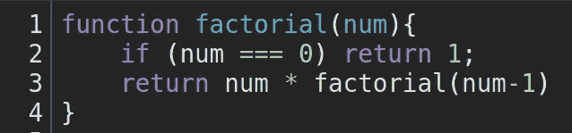

# 递归 101:什么是递归函数？

> 原文：<https://javascript.plainenglish.io/recursion-101-what-is-a-recursive-function-dfeb856488e6?source=collection_archive---------13----------------------->


简单地说，递归函数是一个在自身内部调用自身直到满足某个条件的函数。在大多数情况下，当使用 JavaScript 时，最好使用迭代而不是递归，因为 JavaScript 不是针对递归优化的。也就是说，当你需要用不同的参数重复调用同一个函数时，递归函数是一个有用的工具……这也是技术面试中可能出现的问题。

由于递归对于一些人来说是一个很难理解的概念，我想我们将从一个经典的递归例子开始，并把它分解成容易理解的部分。在每个“块”中，我们将仔细看看正在发生的事情和原因。

在这个例子中，我们将看到一个递归函数，它求解 n！或者 n 阶乘。如果你不熟悉，阶乘的定义是一个整数和它下面所有整数的乘积。比如 4 的阶乘，或者说 4！，就是 4×3×2×1，等于 24。所以 4！= 24.

既然我们了解了问题，让我们来看看解决方案。



如果这只是看起来像胡言乱语，那完全没关系！我们来分解一下。


在第一行我们定义了函数。如您所见，我们将函数命名为“factorial ”,并告诉它接受一个参数“num”。好吧，到目前为止还算简单。让我们暂时跳过第二行，看看这个函数的返回值。哇，这是怎么回事？让我们插上一个数字，仔细看看是怎么回事。

如果我们用 4 替换“num ”,第三行看起来像这样。


所以我们取 4，然后乘以`factorial(4-1)`。什么是`factorial(4-1)`？嗯，是`factorial(4-1)`或者`factorial(3)`的返回值。而`factorial(3)`的返回值是`3 * factorial(3-1)... factorial(2)`是`2 * factorial(2-1)... factorial(1)` 是`1 * factorial(1-1)`还是`factorial(0).`现在让我们看看代码的第二行。


这被称为基本情况。这是阻止函数无限循环的条件。如果没有这一行，我们将一直超过 0，直到浏览器崩溃，或者到达-无穷大。


因为我们有一个基本情况，当调用`factorial(0)` 并且 num 确实等于 0 时，我们返回 1。现在我们有了一个坚实的价值。一个数字而不是另一个函数调用。由于`factorial(0)` 返回 1，那么`factorial(1)` 将返回`1 * 1` 的结果或者仅仅是 1，由于`factorial(1)` 现在有一个值(1)，`factorial(2)` 返回`2 * 1` 或者 2… `factorial(3)` 返回`3 * 2` 或者 6…最后，回到我们开始的地方，`factorial(4)` 返回`4 * 6`或者 24。

看起来这里发生了很多事情，确实如此，但是现在我们已经知道当我们调用`factorial(4)` 时会发生什么，我们可以从不同的角度来看待它，巩固我们的理解。让我们来看看 JavaScript 本身，看看调用栈。

JavaScript 使用调用堆栈来管理执行上下文。调用堆栈基于后进先出(LIFO)原则工作。如果这是没有意义的，不要担心，它会很快。想象一下桌子上的一叠文件。当您添加到堆栈中时，您会添加到堆栈的顶部。当您从纸堆中取出纸张时，也会从纸堆顶部取出纸张。简而言之，这就是 JavaScripts 调用堆栈的工作方式。现在，当我们调用`factorial(4).`时，让我们来看看它的运行情况

啊，所以当我们调用`factorial(4)` 时，它调用`factorial(3), factorial(3)` 调用`factorial(2), factorial(2)` 调用`factorial(1),` 而 `factorial(1)` 调用`factorial(0)`，我们最终得到一个调用堆栈，看起来像这样:

```
factorial(0) //returns 1
factorial(1) //waiting on factorial(0)
factorial(2) //waiting on factorial(1)
factorial(3) //waiting on factorial(2)
factorial(4) //waiting on factorial(3)
```


记得那堆文件吗？我们在调用时将每个函数添加到堆栈的顶部。一旦我们遇到了基本情况(第二行的 if 语句),并且有了返回值，我们就从栈顶移除这个函数，并使用它的返回值来求解下面的函数。冲洗并重复，直到堆叠空了。相当聪明！


## 结论

递归可能是一个难以理解的概念，递归函数可能会变得非常复杂。这个递归函数非常简单，但是如果不是非常清楚，也不用太担心。只要坚持练习，最终会成功的。开心快乐编码！

*更多内容看* [***说白了***](http://plainenglish.io)