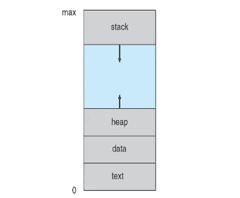

# 递归如何与调用堆栈交互

> 原文：<https://javascript.plainenglish.io/recursion-call-stack-c7f2d332547f?source=collection_archive---------0----------------------->

Photo by Scanrail

许多人努力理解递归——这是完全自然的，我相信这是由于缺乏对一些关键基础知识的理解。

在本文中，我将从一个更广阔的角度来解释递归:展示递归代码如何工作以及如何与内存交互。

## **简介**

首先，让我们看一个关于递归的简单介绍:递归只是一个引用自身的函数。斐波那契数列就是一个例子。注意同一个**斐波那契**函数是如何被调用两次*(第 4 行)*:

code 1 — fibonacci recursive

## **优点**

递归适用于使用分而治之原则的重复性子问题。常见的例子有:遍历树、图、排序、搜索等。

另一个优点是递归代码可以更清晰易读*(对某些人来说有争议)*。看看斐波那契*(代码 2)* 的迭代方法如何比递归的*(代码 1)* 更加冗长:

code 2 — fibonacci iterative

## **缺点**

另一方面，递归代码可能很难理解*(至少最初是这样)*。虽然斐波那契递归*(代码 1)* 显然很短，但理解它可能需要一些时间。

此外，递归会消耗更多的内存，并可能运行溢出的程序:堆栈溢出错误。

理解堆栈溢出是理解递归如何工作的关键，所以让我们更详细地看看它。

注意:有一些方法可以减轻这个问题，比如使用记忆化或者尾部递归，这样你就可以在之后深入研究。

## 堆栈溢出

当程序超出内存中的调用堆栈空间时，就会发生堆栈溢出错误，这主要是由递归代码引起的。

让我们创建一个强制堆栈溢出的简单程序:

code 3 — loop

函数 ***循环*** 只是不停地调用自己*(第 2 行)*，导致无限循环，直到调用堆栈达到其极限，因此得到堆栈溢出“**最大调用堆栈大小超过**”

Image 1— Stack overflow error

这个调用堆栈位于虚拟内存中，为了更好地理解它是什么以及它是如何工作的，我将提供一个关于虚拟内存主要部分的简要说明。

## **虚拟内存**

下图显示了一个程序在虚拟内存中的样子:

Image 2 — Memory segment

*   **文本**:文本也称为代码，是内存中包含程序可执行指令的部分。
*   **数据**:包含全局、静态、环境变量等的段。
*   ***heap****:*heap 存储动态数据、复杂对象以及你的大部分程序需要的数据。这是通过*系统调用*分配的，是内存碎片、泄漏发生的地方，也是垃圾收集器发生的地方。
*   **堆栈**:也称为*调用堆栈*跟踪程序的执行情况。它的大小非常有限，用于存储局部变量和局部函数。*调用栈*使用**栈**数据结构，遵循后进先出原则(后进先出)。

Image 3— Stack data structure

## **程序执行**

是时候看看程序如何使用调用堆栈了。考虑以下代码:

code 3 — simple program

这是程序执行的方式*(图 4)* ，注意函数是如何在调用堆栈中堆积的:

Image 4 — How program gets executed in call stack

程序开始调用**"*my functiona*"***(第 18 行)*，因此在存储局部变量***" frameA】***(*第 2 行*)的调用栈中为该函数创建了一个栈帧。然后，***my functiona***调用***my functionb****(第 3 行)*。

创建了一个新的堆栈帧，它存储了***帧 b***变量*(第 8 行)*。然后，***my functionb***调用***【my functionc】****(第 9 行)*。

再次创建另一个堆栈帧，存储 **" *frameC* "** 局部变量*(第 14 行)*。现在，在**"*my function C*"**"**"*frameC*"**变量中打印出了相应的值***【C】****(第 15 行)*。

最后，***【my functionc】***结束，相应的堆栈帧从调用堆栈中删除。此时，执行返回到***【myFunctionB】***，打印***【B】****(第 10 行)*，然后从堆栈中删除。

最后，执行返回打印***【A】****(第 4 行)*的***【my functiona】***，程序结束。

*注:这只是一个不考虑编程语言的简化解释。使用 C 或 Java，第一个堆栈框架将是“main()”。*

## **递归的基本情况**

回到递归——每个递归代码都需要一个**基础用例**、**和**，这基本上意味着一个“停止”条件。否则，递归函数将一直调用自己，直到抛出堆栈溢出错误。

例如:计算机递归地搜索文件，一个基本情况是:**当没有更多子文件夹时停止搜索，或者文件被找到**。

*   递归情况:函数调用自身的情况。
*   需要时返回:如果需要，组合不同堆栈帧的结果。

## **实施基础案例**

现在，让我们为**循环**函数*(代码 3)* 实现一个基础用例，在这里我们有目的地创建了一个堆栈溢出。

我们可以创建一个名为 **counter** 的变量，如果 **counter** 大于 2，就会返回字符串***“exiting”***(基本情况)。否则，它将递增计数器并再次调用**循环**。

code 4 — loop with base case

基本情况是基本的，但足以让我们理解递归中基本情况的重要性。*注意:为了简单起见，counter 被定义为一个全局变量。通常，在递归中，变量必须作为参数传递。*

通过执行这段代码，我们可以注意到代码显然已经结束，但是我们收到的是 ***【未定义】*** ，而不是 ***【正在退出】*** 。这是为什么呢？

Image 4— Implementing a base case

## **解释**

让我们分析一下代码的执行情况:

程序启动并执行第一条指令 ***console.log(loop())。***

S1:堆栈帧 S1 被创建，**计数器**为 **0** 所以它绕过了基本情况(计数器> 2)，计数器递增，循环被调用。

S2:堆栈帧 S2 被创建，**计数器**为 **1** 所以它绕过了基本情况(计数器> 2)，计数器递增，循环再次被调用。

S3:堆栈帧 S3 被创建，**计数器**为 **2** 所以它绕过了基本情况(计数器> 2)，计数器递增，循环再次被调用。

S4:栈帧 S4 被创建，**计数器**为 **3** 并最终到达基格(计数器> 2)，S4 帧最终返回“退出”到 S3。

s3:在 ***loop()*** 行中执行回到 S3 栈帧，即使 S4 返回“退出”给 S3，S3 也不返回任何东西。S3 只是调用了 ***loop()*** 和**对结果**没有任何作用。*注意:在 JavaScript 中，一个不返回任何东西的函数会返回 undefined。*

s2:执行返回到 ***loop()*** 行的 S2 堆栈帧，再次不返回任何内容。

S1:现在执行在 S1 堆栈框架，没有任何东西被返回。

所以最后一条指令是一条***console . log()***带有 S1 的响应，其中 ***未定义*** 。

另一种形象化问题的方法是:

## **解决方案**

因此，一旦我们到达基本情况，我们希望将*字符串向下传播到最末端，就像这样:*

**

*这是我们在递归中必须记住的事情，我们通常有基本情况，我们需要确保递归情况**返回**，所以我们想要的值会一直冒泡下去。*

*在我们的例子中，我们需要做的就是 ***返回循环()。*** 这样循环将结果 ***【退出】*** ，一直传播到第一个调用。*

**

*   *基本情况:退出递归代码的条件。*
*   *递归情况:函数调用自身的情况。*
*   *需要时返回:如果需要，组合不同堆栈帧的结果。*

*总而言之，理解调用堆栈对于理解递归的工作原理是必不可少的。*

*仅此而已。希望这篇文章能帮助你更好地理解递归、内存和编程。请随时提供任何反馈。*

*[*更多内容尽在 plain English . io*](http://plainenglish.io/)*