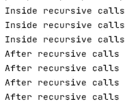

# JavaScript 中的递归:3 分钟指南#03

> 原文：<https://javascript.plainenglish.io/recursion-in-javascript-3-minute-guide-a1794454f917?source=collection_archive---------13----------------------->

## 为了理解递归，你需要理解递归。

## 定义

递归只是调用一个函数中的一个函数，而不仅仅是任何函数，调用同一个函数，其他函数也是这个函数的一部分。这就像在一个包里和这个包里有一个包；你再拿一个包。

# 有史以来最糟糕的例子

包里有包没问题。我们都有或曾经有过这个。回想你的学生时代，背包里有一个铅笔盒(包)。就编码或编码语言而言，您用一个简单的例子打开了潘多拉的盒子。

*Infinite loop created with recursion*

函数`bag()`被函数`bag()`内部的`bag();`函数调用语句调用。这超越了无限，通过这个例子，我们创建了一个无限循环。几秒钟后，您的程序将冻结。

这里真正发生的是运行的程序有一个调用堆栈。每当一个函数被调用，调用堆栈就会在顶部得到一个新的条目(`stack.push(functionName)`)。当一个函数完成并返回给它的调用方时，最上面的条目被移除`stack.pop(functionName)`。因为我们重复调用同一个函数，所以`stack.push(functionName)`永远不会被执行。

堆栈不断增加，直到最后溢出。请注意，如果您的大脑在编码时溢出，您会去哪里？对，[堆栈溢出，](https://stackoverflow.com/)这就是它被称为的原因。您大脑的堆堆栈有一个溢出，因此，递归只是另一种创建循环的方式。无限循环不是很有用，尽管它们在本地固件中作为运行时/主循环。

# 如何阻止无限？

既然我们不编写固件，也不想要无限循环，我们怎么才能阻止无限循环呢？有停止条件。听起来很容易，实际上也很容易:只是一个简单的 if 语句来阻止宇宙！

我们可以把袋子装进袋子里，直到`noMoreBag`我们可以把袋装的袋子装进袋子里。顺便说一下，当把数组放入数组时，我们称它们为锯齿状数组。我们通常使用索引或计数器作为条件检查来结束递归。每当达到一个特定的量时，比较下面的例子，打包在第三次递归调用后停止。

# 但是等等！

有一种情况你可能还没有意识到。我有一个简单的问题:*如果我把一个语句放在 If 语句的大括号后面，这个语句将被执行多少次？*

对，3 次，**嗯！**4 次。第一次调用和 3 次递归调用！我有一个简短的第二个问题:*这个语句什么时候执行？*

对，在递归完成最后一次递归调用后。研究下面的代码。

比较图 1 中的控制台输出。

Figure 1 Console Printout of *X3_Be_Aware_of_that.js*

使用递归时，请考虑这一点。更不用说 O(N ) (O 到 N 的平方时间复杂度)。但这本身就是一个话题。这是一个 3 分钟的指南！

# 外卖食品

*   注意递归，它会产生无限循环
*   总是有一个爆发的条件，并检查它正确
*   仔细检查递归内部和递归调用之后执行语句的频率
*   最后但同样重要的是:要理解递归，您需要理解递归。
*   [***节省自己大量的时间，专注于重要的主题。***](https://arnoldcodeacademy.ck.page/26-web-dev-cheat-sheets)

Arnold Code Academy 26 Web Developer Cheatsheets

# 继续读

 [## 为什么 SQL 不仅仅是 IT 人员的技能！

### 像海盗一样对待这个话题:现在比下次战斗更清楚！

medium.datadriveninvestor.com](https://medium.datadriveninvestor.com/why-sql-is-not-only-an-it-guy-skill-2ae6ac07c1b7)  [## 软件开发应该让谁开心？

### 是平衡，笨蛋！

medium.com](https://medium.com/agileinsider/who-should-software-development-make-happy-9d7105b2730f)  [## 数组。JavaScript 中的 map():3 分钟指南

### 踏入函数式编程和不变性的大门

javascript.plainenglish.io](/array-map-in-javascript-3-minute-guide-5b2ce5123d8a) 

*更多内容请看*[***plain English . io***](https://plainenglish.io/)